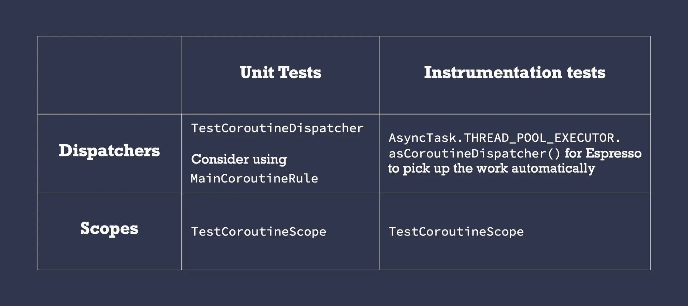

- [キャンセルすべきではないワークのコルーチン実装パターン](#キャンセルすべきではないワークのコルーチン実装パターン)
  - [コルーチンと WorkManager のどちらですか?](#コルーチンと-workmanager-のどちらですか)
  - [コルーチンのベスト プラクティス](#コルーチンのベスト-プラクティス)
    - [1. クラスにディスパッチャーを挿入する](#1-クラスにディスパッチャーを挿入する)
    - [2. ViewModel/Presenter レイヤーでコルーチンを作成する](#2-viewmodelpresenter-レイヤーでコルーチンを作成する)
    - [3. ViewModel/Presenter レイヤーの下のレイヤーは、suspend 関数とフローを公開する必要があります](#3-viewmodelpresenter-レイヤーの下のレイヤーはsuspend-関数とフローを公開する必要があります)
  - [コルーチンでキャンセルしてはいけない操作](#コルーチンでキャンセルしてはいけない操作)
  - [どのコルーチン ビルダーを使用するか?](#どのコルーチン-ビルダーを使用するか)
  - [もっとシンプルなものはどうでしょうか?](#もっとシンプルなものはどうでしょうか)
  - [テスト](#テスト)
  - [代替案](#代替案)
  - [❌ GlobalScope](#-globalscope)
  - [❌ Android の ProcessLifecycleOwner スコープ](#-android-の-processlifecycleowner-スコープ)
  - [⚠️ 免責事項](#️-免責事項)
  - [❌ ✅ NonCancellable の使用](#--noncancellable-の使用)
  - [まとめ](#まとめ)
  - [引用元資料](#引用元資料)


# キャンセルすべきではないワークのコルーチン実装パターン

コルーチンのキャンセルと例外シリーズのパート 2 では、不要になった作業をキャンセルすることの重要性について学びました。Android では、Jetpack が提供する CoroutineScope を使用できます。これらのスコープは、アクティビティ/フラグメント/ライフサイクルが完了したときに実行中の作業をキャンセルします。独自の CoroutineScope を作成する場合は、必ずジョブに関連付け、必要なときに cancel を呼び出してください。

ただし、ユーザーが画面から移動した場合でも操作を完了させたい場合があります。その場合、作業をキャンセルしたくありません (データベースへの書き込みや、サーバーへの特定のネットワーク リクエストの実行など)。

これを実現するためのパターンについては、読み進めてください。


## コルーチンと WorkManager のどちらですか?

コルーチンは、アプリケーション プロセスが存続している限り実行されます。プロセスよりも長く存続する必要がある操作 (リモート サーバーへのログの送信など) を実行する必要がある場合は、Android では代わりに WorkManager を使用します。 WorkManager は、将来のある時点で実行されることが予想される重要な操作に使用するライブラリです。

現在のプロセスで有効で、ユーザーがアプリを強制終了した場合にキャンセルできる操作 (キャッシュするネットワーク リクエストの作成など) には、コルーチンを使用します。これらの操作をトリガーするパターンは何ですか?


## コルーチンのベスト プラクティス

このパターンは他のコルーチンのベスト プラクティスに基づいているため、要約してみましょう。

### 1. クラスにディスパッチャーを挿入する
新しいコルーチンを作成するときや withContext を呼び出すときは、ディスパッチャーをハードコードしないでください。

✅ 利点: ユニット テストとインストルメンテーション テストの両方で簡単に置き換えることができるため、テストが簡単になります。


### 2. ViewModel/Presenter レイヤーでコルーチンを作成する

UI のみの操作の場合は、UI レイヤーで実行できます。プロジェクトでこれが不可能だと思う場合は、ベスト プラクティス #1 に従っていない可能性があります (つまり、Dispatcher を挿入しない VM をテストするのはより困難です。その場合は、suspend 関数を公開することで実行可能になります)。

✅ 利点: UI レイヤーはダムであり、ビジネス ロジックを直接トリガーしない必要があります。代わりに、その責任を ViewModel/Presenter レイヤーに委ねます。UI レイヤーをテストするには、Android でインストルメンテーション テストを実行する必要があり、エミュレーターを実行する必要があります。


### 3. ViewModel/Presenter レイヤーの下のレイヤーは、suspend 関数とフローを公開する必要があります

コルーチンを作成する必要がある場合は、coroutineScope または supervisorScope を使用します。異なるスコープに従う必要がある場合は、この記事でそのことについて説明しています。読み進めてください。

✅ 利点: 呼び出し元 (通常は ViewModel レイヤー) は、それらのレイヤーで行われている作業の実行とライフサイクルを制御し、必要に応じてキャンセルできます。

## コルーチンでキャンセルしてはいけない操作

アプリに次のロジックを持つ ViewModel とリポジトリがあるとします。

```kotlin
class MyViewModel(private val repo: Repository) : ViewModel() {
    fun callRepo() {
        viewModelScope.launch {
            repo.doWork()
        }
    }
}
class Repository(private val ioDispatcher: CoroutineDispatcher) {
    suspend fun doWork() {
        withContext(ioDispatcher) {
            doSomeOtherWork()
            veryImportantOperation() // This shouldn’t be cancelled
        }
    }
}
```

veryImportantOperation() はいつでもキャンセルされる可能性があるため、viewModelScope によって制御されることは望ましくありません。その操作は viewModelScope より長く存続する必要があります。どうすればそれが実現できるでしょうか?

これを行うには、Application クラスに独自のスコープを作成し、それによって開始されたコルーチンでそれらの操作を呼び出します。そのスコープは、それを必要とするクラスに挿入する必要があります。

後で説明する他のソリューション (GlobalScope など) と比較して独自の CoroutineScope を作成する利点は、必要に応じて構成できることです。CoroutineExceptionHandler が必要ですか? Dispatcher として使用する独自のスレッド プールがありますか? 一般的な構成をすべて CoroutineContext に配置します。

これを applicationScope と呼ぶことができますが、コルーチンの失敗が階層に伝播しないように SupervisorJob() を含める必要があります (シリーズのパート 3 を参照)。

```kotlin
class MyApplication : Application() {
    // No need to cancel this scope as it'll be torn down with the process
    val applicationScope = CoroutineScope(SupervisorJob() + otherConfig)
}
```

アプリケーション プロセスが存続する限りこのスコープをアクティブにしておく必要があるため、このスコープをキャンセルする必要はありません。そのため、SupervisorJob への参照は保持しません。このスコープを使用して、呼び出しスコープがアプリで提供するよりも長い存続期間を必要とするコルーチンを実行できます。

**キャンセルすべきでない操作については、アプリケーションの CoroutineScope によって作成されたコルーチンから呼び出します**

新しい Repository インスタンスを作成するときは常に、上で作成した applicationScope を渡します。テストについては、以下のテスト セクションを確認してください。


## どのコルーチン ビルダーを使用するか?

veryImportantOperation の動作に応じて、launch または async を使用して新しいコルーチンを開始する必要があります。

結果を返す必要がある場合は、async を使用して await を呼び出し、完了するまで待機します。
そうでない場合は、launch を使用して join で完了するまで待機します。シリーズのパート 3 で説明したように、launch ブロック内で例外を手動で処理する必要があることに注意してください。

launch を使用してコルーチンをトリガーする方法は次のとおりです。

```kotlin
class Repository(
    private val externalScope: CoroutineScope,
    private val ioDispatcher: CoroutineDispatcher
) {
    suspend fun doWork() {
        withContext(ioDispatcher) {
            doSomeOtherWork()
            externalScope.launch {
                // if this can throw an exception, wrap inside try/catch
                // or rely on a CoroutineExceptionHandler installed
                // in the externalScope's CoroutineScope
                veryImportantOperation()
            }.join()
        }
    }
}
```

もしくは async を使用して : 

```kotlin
class Repository(
    private val externalScope: CoroutineScope,
    private val ioDispatcher: CoroutineDispatcher
) {
    suspend fun doWork(): Any { // Use a specific type in Result
        withContext(ioDispatcher) {
            doSomeOtherWork()
            return externalScope.async {
                // Exceptions are exposed when calling await, they will be
                // propagated in the coroutine that called doWork. Watch
                // out! They will be ignored if the calling context cancels.
                veryImportantOperation()
            }.await()
        }
    }
}
```

いずれにしても、ViewModel コードは変更されず、上記では、viewModelScope が破棄されても、externalScope を使用した作業は実行され続けます。さらに、doWork() は、他の中断呼び出しと同様に、veryImportantOperation() が完了するまで戻りません。


## もっとシンプルなものはどうでしょうか?

いくつかのユースケースに対応できるもう 1 つのパターン (おそらく誰もが最初に思いつく解決策) は、次のように withContext を使用して veryImportantOperation を externalScope のコンテキストにラップすることです。

```kotlin
class Repository(
    private val externalScope: CoroutineScope,
    private val ioDispatcher: CoroutineDispatcher
) {
    suspend fun doWork() {
        withContext(ioDispatcher) {
            doSomeOtherWork()
            withContext(externalScope.coroutineContext) {
                veryImportantOperation()
            }
        }
    }
}
```

ただし、このアプローチには注意すべき注意事項がいくつかあります。

- doWork を呼び出すコルーチンが veryImportantOperation の実行中にキャンセルされた場合、veryImportantOperation の実行が終了した後ではなく、次のキャンセル ポイントまで実行が継続されます。
- CoroutineExceptionHandlers は、例外が再スローされるため、withContext でコンテキストが使用されている場合は期待どおりに動作しません。


## テスト

Dispatchers と CoroutineScopes の両方を挿入する必要があるため、これらの場合は何を挿入する必要がありますか?



🔖 凡例: TestCoroutineDispatcher、MainCoroutineRule、TestCoroutineScope、AsyncTask.THREAD_POOL_EXECUTOR.asCoroutineDispatcher()


## 代替案

この動作をコルーチンで実装する方法は他にもあります。ただし、これらのソリューションは、すべてのユースケースに体系的に適用できるわけではありません。いくつかの代替案と、それらを使用すべき/使用すべきでない理由/タイミングを見てみましょう。


## ❌ GlobalScope

GlobalScope を使用すべきでない理由は複数あります。

- 値のハードコーディングを促進します。GlobalScope をすぐに使用すると、Dispatcher をハードコーディングしたくなるかもしれません。これは悪い習慣です!
- テストが非常に難しくなります。コードは制御されていないスコープで実行されるため、それによって開始された作業の実行を管理できなくなります。
- applicationScope の場合のように、スコープに組み込まれたすべてのコルーチンに共通の CoroutineContext を持つことはできません。代わりに、GlobalScope によって開始されたすべてのコルーチンに共通の CoroutineContext を渡す必要があります。

**推奨事項: 直接使用しないでください。**


## ❌ Android の ProcessLifecycleOwner スコープ

Android では、androidx.lifecycle:lifecycle-process ライブラリで applicationScope が使用可能で、ProcessLifecycleOwner.get().lifecycleScope でアクセスできます。

この場合、以前と同じように CoroutineScope ではなく LifecycleOwner を挿入します。本番環境では ProcessLifecycleOwner.get() を渡し、単体テストでは LifecycleRegistry を使用して偽の LifecycleOwner を作成できます。

このスコープのデフォルトの CoroutineContext は Dispatchers.Main.immediate を使用することに注意してください。これはバックグラウンド作業には適さない可能性があります。GlobalScope と同様に、GlobalScope によって開始されたすべてのコルーチンに共通の CoroutineContext を渡す必要があります。

上記の理由から、この代替案では、Application クラスで CoroutineScope を作成するよりも多くの作業が必要になります。また、ViewModel/Presenter の下のレイヤーに Android ライフサイクルに関連するクラスを配置するのは、プラットフォームに依存しない必要があるため、個人的には好みません。

**推奨事項: 直接使用しないでください。**


## ⚠️ 免責事項

applicationScope の CoroutineContext が GlobalScope または ProcessLifecycleOwner.get().lifecycleScope のものと一致することが判明した場合は、次のように直接割り当てることができます。

```kotlin
class MyApplication : Application() {
    val applicationScope = GlobalScope
}
```

上記のメリットはすべて得られ、将来必要になった場合は簡単に変更できます。

## ❌ ✅ NonCancellable の使用

シリーズのパート 2 で説明したように、withContext(NonCancellable) を使用すると、キャンセルされたコルーチンで中断関数を呼び出すことができます。中断できるクリーンアップ コードを実行するために使用することをお勧めします。ただし、乱用しないでください。

これを行うと、コルーチンの実行を制御できなくなるため、非常に危険です。より簡潔で読みやすいコードが生成されるのは事実ですが、将来的に発生する可能性のある問題は予測できません。

使用例:

```kotlin
class Repository(
    private val ioDispatcher: CoroutineDispatcher
) {
    suspend fun doWork() {
        withContext(ioDispatcher) {
            doSomeOtherWork()
            withContext(NonCancellable) {
                veryImportantOperation()
            }
        }
    }
}
```

非常に魅力的ではありますが、veryImportantOperation() の背後に何があるのか​​常に把握できるとは限りません。外部ライブラリである可能性があり、実装がインターフェースの背後にある可能性もあります。どのような問題が発生する可能性がありますか?

- テストでこれらの操作を停止することはできません。
- 遅延を使用する無限ループはキャンセルできなくなります。
- フローを内部で収集すると、フローは外部からキャンセルできなくなります。
- …

これらの問題は、微妙でデバッグが非常に難しいバグにつながる可能性があります。

**推奨事項: クリーンアップ コードを一時停止する場合のみ使用してください。**


## まとめ

現在のスコープを超えて作業を実行する必要がある場合は、Application クラスにカスタム スコープを作成し、その中でコルーチンを実行することをお勧めします。このタイプの作業では、GlobalScope、ProcessLifecycleOwner スコープ、および NonCancellable を使用しないでください。


## 引用元資料

[Coroutines & Patterns for work that shouldn’t be cancelled](https://medium.com/androiddevelopers/coroutines-patterns-for-work-that-shouldnt-be-cancelled-e26c40f142ad)

