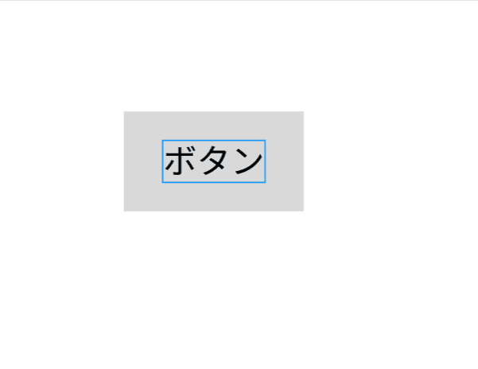
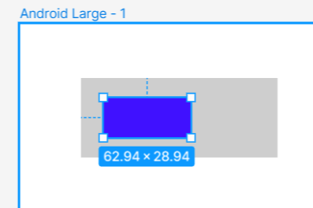
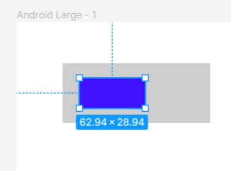
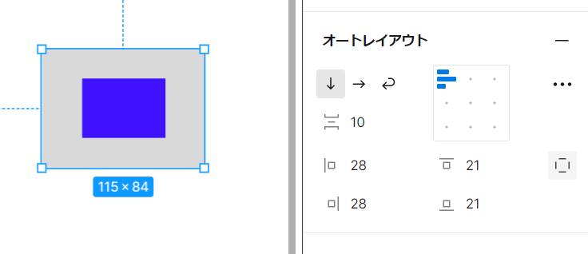
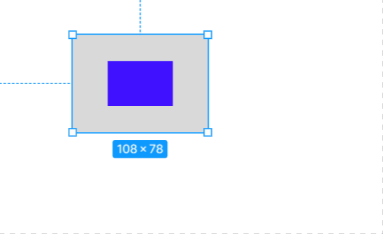
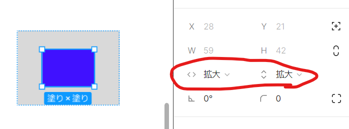
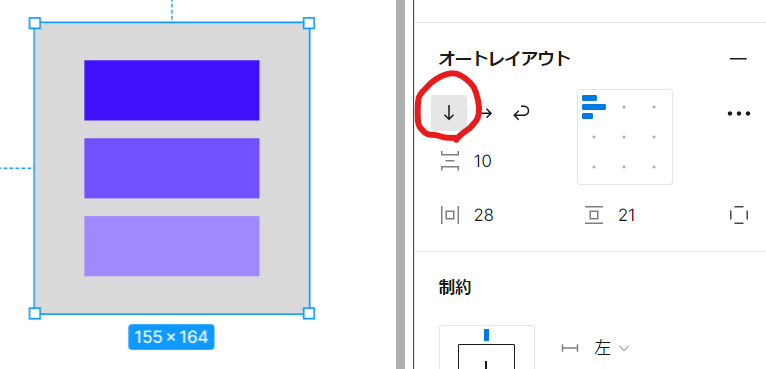
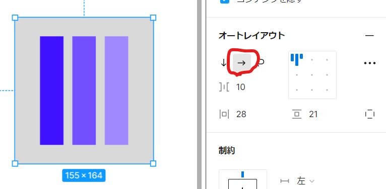
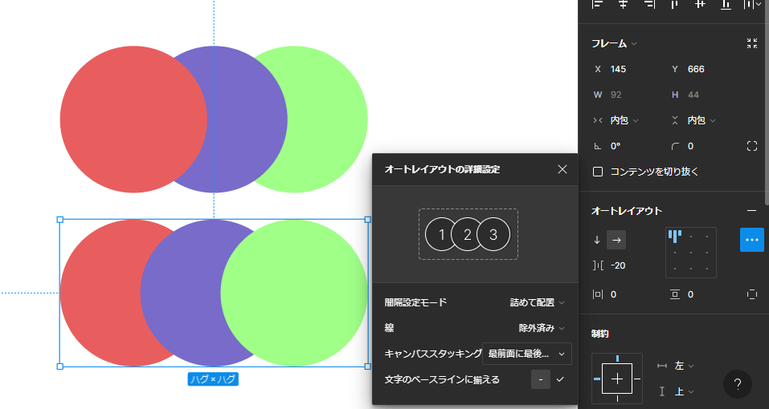
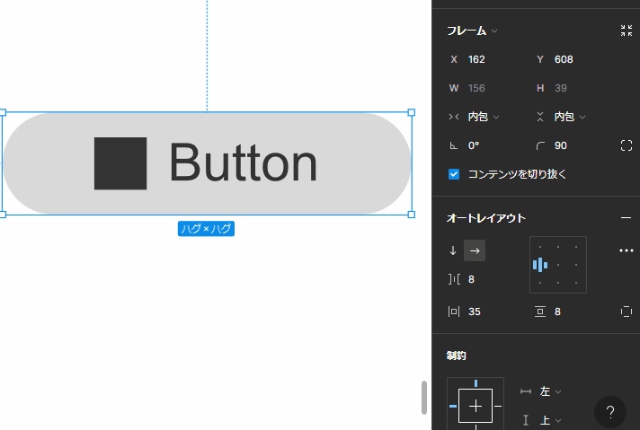

- [オートレイアウト](#オートレイアウト)
  - [概要](#概要)
  - [オートレイアウトの設定方法](#オートレイアウトの設定方法)
  - [オートレイアウトで実現できること](#オートレイアウトで実現できること)
    - [子のサイズに合わせて Frame のサイズを動的に変更](#子のサイズに合わせて-frame-のサイズを動的に変更)
    - [Padding の指定](#padding-の指定)
    - [Frame のサイズに合わせて、子のサイズを動的に変更](#frame-のサイズに合わせて子のサイズを動的に変更)
    - [子 View を並べて配置できる（Android でいう LinearLayout）](#子-view-を並べて配置できるandroid-でいう-linearlayout)
  - [ドラッグ \& ドロップでアイテムを追加・削除・入れ替えが可能](#ドラッグ--ドロップでアイテムを追加削除入れ替えが可能)
  - [オブジェクトを重ねる方法（絶対位置指定）](#オブジェクトを重ねる方法絶対位置指定)
  - [重ね順（キャンバススタッキング）](#重ね順キャンバススタッキング)
  - [ベースライン揃え](#ベースライン揃え)

# オートレイアウト

## 概要

オートレイアウトは、フレームに備わっている機能の一つです。
簡単に言うと、 Android でいう `LinearLayout` や `ConstraitLayout` と同じような機能になります。

## オートレイアウトの設定方法

オートレイアウトを設定したい View を複数選択した状態で、画面の右側にある 「 Auto Layout 」 という文字をクリックすると、選択した View の一番外側の View がフレームになり、残りの View がそのフレーム内に配置され、オートレイアウトが ON になります。  
( View が既にグループ化されている状態でも、 「 Auto Layout 」 という文字をクリックすれば、
オートレイアウトが ON になります。)

オートレイアウトが設定できない場合は、 「 Auto Layout 」 という文字は表示されないようです。

## オートレイアウトで実現できること

### 子のサイズに合わせて Frame のサイズを動的に変更

垂直方向の wrap_content も可能です。

### Padding の指定

Frame 内部に配置する要素の Padding (内側マージン) を設定することが可能です。親が Group の場合は、これができません。

**親がFrameの場合**

**親がGroupの場合**

**設定方法**

Frame から子 View への制約を付与するには、以下のように、 Frame を選択して、オートレイアウトエリアのパラメータを修正します。

### Frame のサイズに合わせて、子のサイズを動的に変更

これは、親 ViewGroup の上下左右位置から、子 View の上下左右への制約をつけています。

**設定方法**

親の Frame には、上記で説明した上下左右からのマージン指定を行います。

子 View には、以下のように 「コンテナにあわせて拡大」 を選択します。

### 子 View を並べて配置できる（Android でいう LinearLayout）

**orientation vertical**

**orientation horizontal**

Android でいう gravity / orientation / padding 属性に加えて、要素間のマージンの指定も可能です。

## ドラッグ & ドロップでアイテムを追加・削除・入れ替えが可能

Android でいう LinearLayout 内のアイテムを 「ドラッグ & ドロップ」 することで  
アイテムを追加したり、削除したり、順番を入れ替えたりできるため、便利です。

## オブジェクトを重ねる方法（絶対位置指定）

オートレイアウトを適用すると、その内部のオブジェクトは、デフォルトでは重ならないように並べられます。しかし、オブジェクト同士を重ねたい場合もあるでしょう。

その場合は、オブジェクトの位置を指定する 「 X 」 や 「 Y 」 のボタンの右側に存在している 「 + を □ で囲んだアイコン」 をクリックします。そうすると、オブジェクトの位置が絶対位置指定になり、オートレイアウト ( LinearLayout ) の要素としての配置制約から抜け出せるようになります。

これで、絶対位置指定したオブジェクトは、他のオブジェクトと重ね合わせることができるようになります。

なお、絶対位置指定したオブジェクトがオートレイアウトオブジェクトからはみ出した部分はトリミングされます。

## 重ね順（キャンバススタッキング）

基本的にオートレイアウトを有効化した場合、それぞれの要素は左側のものが前面に出ます。しかし、詳細設定内の 「キャンバススタッキング」 で 「最前面に最後のアイテム」 を選択することで、右側のものから前面に出すよう変更できます。

## ベースライン揃え

詳細設定内の 「文字のベースラインに揃える」 をチェックにすることで、内部のアイコンやテキストをテキストのベースラインに合わせることができます。

