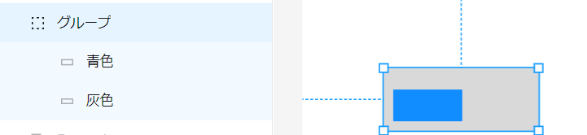
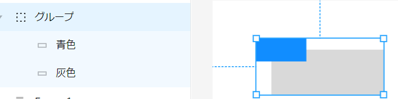

- [Group と Frame の違い](#group-と-frame-の違い)
  - [重要な前提](#重要な前提)
  - [概要](#概要)
  - [Group と Frame の根本的な違い](#group-と-frame-の根本的な違い)
    - [(※ 1 )](#-1-)
    - [(※ 2 )](#-2-)
    - [(※ 3 ) ViewGroup 自体が一つの View とみなされる](#-3--viewgroup-自体が一つの-view-とみなされる)

# Group と Frame の違い

## 重要な前提

たいていの場合、 「どうしても Group を使いたい」 という場面はないと思います。どちらを使うか迷ったら、 Frame を使えば間違いないでしょう。

とはいえ、既に Group が使用されている部分は、変更することにより影響が生じる可能性もあるため、既に作成されている分については、わざわざ Frame に変換する必要もないでしょう。

## 概要

Group と Frame は、どちらもレイヤーをグループ化するものですが、 Group にはグループ化の機能しかありません。

Frame には、プラスアルファで様々な機能が備わっています。

## Group と Frame の根本的な違い

| 機能                                                     | Group     | Frame |
| -------------------------------------------------------- | --------- | ----- |
| オートレイアウトが使用可能か                             | × (※ 1 )  | ○     |
| 子 View が ViewGroup に対して Constraint をつけられる。  | ×         | ○     |
| ViewGroup が拡縮した際に子 View が拡縮できる             | ○         | ○     |
| ViewGroup が拡縮した際に子 View が拡縮しないようにできる | △　(※ 2 ) | ○     |
| ViewGroup 自体が一つの View とみなされる (※ 3 )          | いいえ    | はい  |

### (※ 1 )

ただし、 Group にオートレイアウトを ON にするスイッチは存在しており、 ON にすると、 Group は、自動的に Frame に変換されます。

### (※ 2 )

通常、 Group のサイズを拡縮すると、子 View はそれに合わせて自動的に拡縮されてしまいます。しかし、一定の条件下では、子 View が拡縮されず、 Group のみを拡縮することが可能です。  
一定の条件とは、 Group のサイズと Group 内の一番外側を囲んでいる子 View のサイズが同じ場合です。  
その条件を満たす場合、一番外側を囲んでいる子 View のサイズを変更すると、それにつられて Group のサイズも変更されます。しかし、他の子 View のサイズは拡縮せず、そのままのサイズに留まります。言葉だけではわかりにくいため、以下に図を載せておきます。

**「子 View を拡縮させずに Group だけを拡縮する」ことができる場合**

**「子 View を拡縮させずに Group だけを拡縮する」ことができない場合**

### (※ 3 ) ViewGroup 自体が一つの View とみなされる

Group は View とはみなされませんが、 Frame は View とみなされます。

そのため、 Group 自体に塗りつぶしを設定したり、枠線を引くことはできません。一方で、 Frame 自体に塗りつぶしを設定したり、枠線を引くことはできます。

もし、 Group 自体に塗りつぶしや線を引こうとすると、 Group 内の全ての個々の View に対して、塗りつぶしや線引きが行われます。

