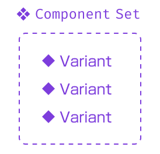
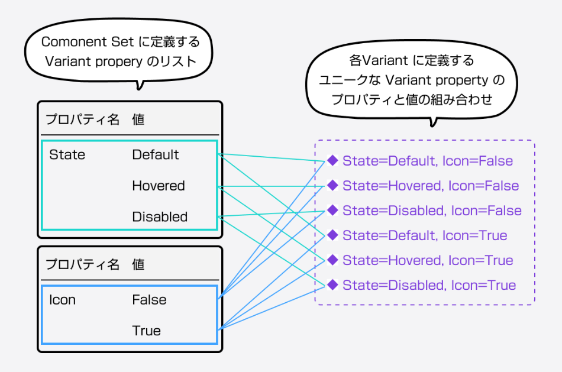

- [バリアント](#バリアント)
  - [言葉の使い分け (Variants, Variant, Component Set)](#言葉の使い分け-variants-variant-component-set)
  - [Variant の作成](#variant-の作成)
  - [Variant の利用](#variant-の利用)
  - [複数の Variant の組み合わせ](#複数の-variant-の組み合わせ)
  - [Variatn Property の追加](#variatn-property-の追加)
  - [定義した Variant プロパティを削除する](#定義した-variant-プロパティを削除する)

# バリアント

## 言葉の使い分け (Variants, Variant, Component Set)

Variants では、そのコンポーネントのグループが表現したい、デザインバリエーション一つ一つの  
コンポーネントのことを 「 Variant 」 と呼びます。

また、この 「 Variant 」 のグループのことを 「 Component Set 」 と呼ぶことがあります。  
Component Set に Variant と呼ばれるコンポーネントを増やしていくことで、  
コンポーネントは複数のデザインバリエーションを表現できるようになります。

## Variant の作成

1. 準備
   1. コンポーネントを作成 ( Variant はコンポーネントに対してのみ作成が可能です)
2. Component Set の作成 ( 新しい Variant Property を作成)
   1. コンポーネントを選択
   2. 右側のメニューから 「プロパティ」 グループの 「 + 」 をクリック
   3. 「 Variant 」 をクリック
3. 新しい Variant のオブジェクトを生成
   1. Component Set を選択
   2. Component Set の下にある 「 + 」 をクリック
   3. もしくは、 Component Set 内にある特定の Variant を選択し、コピペする。
4. 新しく作成した Variant にプロパティ名と値を設定する
   1. 新しく作成した Variant のオブジェクトを選択
   2. 右側のメニューから 「プロパティ」 グループに 「 Property 1 」 という項目があるのでそこを変更
5. 新しい Variant の見た目などを修正する
   1. 新しく作成した Variant のオブジェクトを選択
   2. 何らかの変更を加える

## Variant の利用

作成した Variant のインスタンスを生成するには、以下の手順を実施します。

1. 画面左側のメニューから 「アセット」 タブを選択
2. 「ローカルコンポーネント」 内に作成した Component Set が表示されるため、それをドラッグ & ドロップ等でシートに移動すると、インスタンスが生成される
3. 生成されたインスタンスを選択して、右側のメニューからコンポーネント名のところに、 Variant を選択するエリアがあるため、そこで使用したい Variant に切り替える

## 複数の Variant の組み合わせ

Variant は、プロパティ名ごとに分類されています。  

プロパティ名を複数定義すると、

`[プロパティ 1 の値の数] × [プロパティ 2 の値の数] × ... = [オブジェクトがとりうる状態の数]`

というように、オブジェクトがとりうる状態の数も増えていきます。

## Variatn Property の追加

新しい Variatn Property を追加する方法は、 Variant Property の新規作成時とほぼ同じです。  
新規作成時の手順のコピーですが、以下に手順を記載しておきます。

1. Component Set の作成 ( 新しい Variant Property を作成)
   1. コンポーネントを選択
   2. 右側のメニューから 「プロパティ」 グループの 「 + 」 をクリック
   3. 「 Variant 」 をクリック
2. 新しい Variant のオブジェクトを生成
   1. Component Set を選択
   2. Component Set の下にある 「 + 」 をクリック
   3. もしくは、 Component Set 内にある特定の Variant を選択し、コピペする。

新しくできたオブジェクトが既存のオブジェクトに重なってしまった場合には、  
紫色の枠を広げて中に収まるように移動してあげましょう。  
(ドラッグ & ドロップで枠は広げられます。)

＜注意＞  
プロパティを追加した場合は、プロパティが 2 種類以上存在しています。  
その状態で、いずれかのオブジェクトをコピーして、新しいオブジェクトを作成した時は、  
コピー元のオブジェクトに元々存在していなかったプロパティの状態は、  
新しいオブジェクトには反映されていません。  
そのため、面倒ですが、自分でオブジェクトを繰り返し修正する必要があります。

例えば、以下の動画では、アイコンなしのオブジェクトをコピーして、  
アイコンありのオブジェクトを生成していますが、  
この場合、コピー元のオブジェクトには、アイコンが存在していないため、  
アイコンを追加する操作を 3 回繰り返し実施しなければいけないということになります。

https://github.com/okuda0715tech/Knowledge_Stock/assets/65774152/d0c0c2d1-099a-4eb4-b95f-7d464fd411f0

## 定義した Variant プロパティを削除する

定義した Variant の特定の値を削除したい場合は、そのコンポーネント自体を削除する。

定義した Variant のプロパティ自体を削除したい場合は、  
そのコンポーネントをドラッグ & ドロップして、  
コンポーネントが入っている Component Set の紫色の点線の枠から、外に出します。

