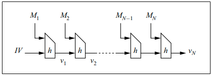

<!-- TOC START min:1 max:3 link:true asterisk:false update:true -->
- [SHA-256のアルゴリズム](#sha-256のアルゴリズム)
  - [全体的アルゴリズム](#全体的アルゴリズム)
  - [メッセージの分割とパディング](#メッセージの分割とパディング)
<!-- TOC END -->

# SHA-256のアルゴリズム

## 全体的アルゴリズム

`SHA-256` のアルゴリズムは以下の通りである。

上記の図は、ハッシュ関数 `H` が、メッセージ `M` をハッシュ化し、ハッシュ値 `v` を生成する  
様子を図式化したものである。

`M1 ～ MN` は、メッセージ `M` (平文) を `N` 個に分割したものを表す。  
`h` は、圧縮関数 `h (vi-1, Mi)` を表す。  
(ハッシュ関数のアルゴリズムは圧縮関数のアルゴリズムによって決まる。)  
`vi` は、圧縮関数によって計算された結果を表し、連鎖値と呼ばれる。  
`IV` は、 initialization vector の略であり、日本語では、初期ベクトルと呼ばれる。  
(IV は、ソルトと同じ役割を果たす。概念だけでは IV とソルトの違いはわからなかった。)

上記の処理構造を **マークル・ダンガード構造** と呼ぶ。  
また、この構造のハッシュ関数を、その構造から **反復形ハッシュ関数** と呼ぶ。

## メッセージの分割とパディング

ハッシュ化の初期処理としてメッセージの分割を行うが、その分割された一つ一つのことを  
**ブロック** と呼ぶ。 `SHA-256` では、 1 ブロックを `512 ビット (64 バイト)` に分割する。

メッセージが決められたブロック長で割り切れない場合には、パディングを行う。  
パディングのアルゴリズムとしては、 **マークル・ガンダード強化法** と呼ばれるものが有名であるが、  
特に調べるほど重要でもないと思ったため、調査はしていない。
