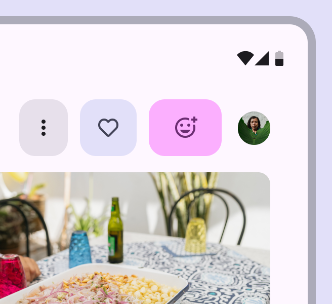
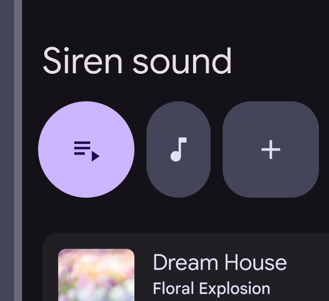
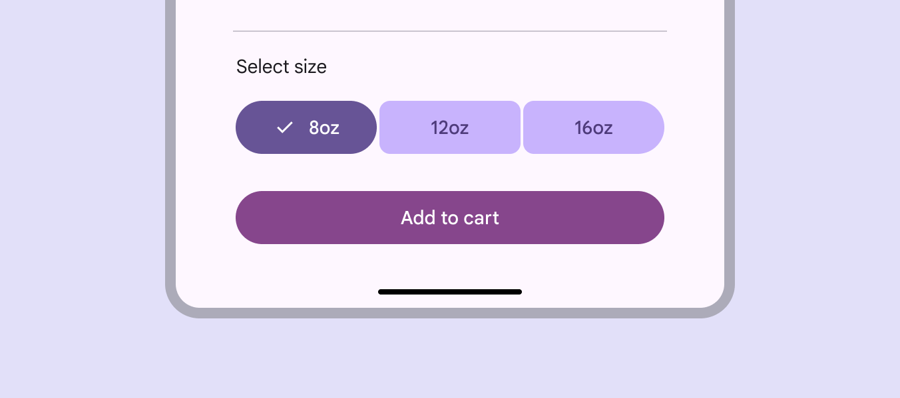

- [Guidelines](#guidelines)

# ガイドライン

## 使用方法

ボタングループには、標準と連結の 2 種類があります。

標準ボタングループは、隣接するボタン間のインタラクションを追加し、互いに反応できるようにします。標準グループ内のボタンが選択されると、以下のようになります。

- 選択されたボタンの形状と幅が変わります。
- 選択されたトグルボタンの色も変わります。
- 隣接するボタンが移動し、一時的に幅が変わります。

ボタングループにより製品の表現力が増します

重要な部分を強調し、関連するボタンを視覚的にグループ化するために、異なる種類、幅、色を自由に組み合わせてください。

デフォルトでは、標準グループ内のすべてのボタンは同じサイズ（XS～XL）と形状（丸型または四角型）にする必要があります。

- グループ内で複数のサイズを使用するのは、ヒーローモーメントの場合のみにしてください。
  - ヒーローモーメントとは、 UI の中で特に強調したい瞬間・場面のことを指すデザイナー用語です。
  - 例えば、キャンペーンなど特別なコンテキストのことを示します。
  - つまり、「普段はボタンサイズは揃えて使ってね。混在させるのは特別に強調したい場面だけ」というガイドラインです。
- 頻繁にサイズを混ぜるのは避けてください。
- グループ内で異なる形状を使用するのは、ボタンが選択されている場合、または意味やコントラストを強調する場合のみにしてください。

以下の例は、グループ内のボタンに同じ形状を使用し、幅や色などの他のプロパティを変更している良い例です。

以下の例は、同じグループ内でボタンの形を変えている例です。正円、楕円、正方形の三種類の形状のボタンが混在しています。基本的には形状を統一してください。特に強調したいボタンだけは、他のボタンと異なる形状を採用しても問題ありません。以下の例は、三つ中、三つとも形状が異なるため、強調効果がなく、あまり良くない使用例です。

**連結ボタングループ** は、オプションの選択、ビューの切り替え、ページ内の要素の並べ替えに役立ちます。

連結ボタングループは標準グループと同様に動作しますが、隣接するボタンには影響しません。

連結グループは、非推奨となった [セグメントボタン](https://m3.material.io/components/segmented-buttons/overview) に代わるものです。

以下は、連結ボタングループの使用例です。

https://firebasestorage.googleapis.com/v0/b/design-spec/o/projects%2Fgoogle-material-3%2Fimages%2Fm34llls1-Button-Group-B-2.mp4?alt=media&token=4142a8d4-8e42-4e97-9c0f-5143086be82d

ボタンの内容が関連しており、ボタンを選択できる場合は、連結ボタングループを使用します。

連結ボタングループは、トグルボタンを使用する単一選択または複数選択パターンに使用してください。

どのボタンもトグルできない場合は、連結グループの使用は避けてください。

接続されたボタングループを単一または複数選択パターンで使用する

## 引用元資料

[Button groups / Guidelines](https://m3.material.io/components/button-groups/guidelines)

