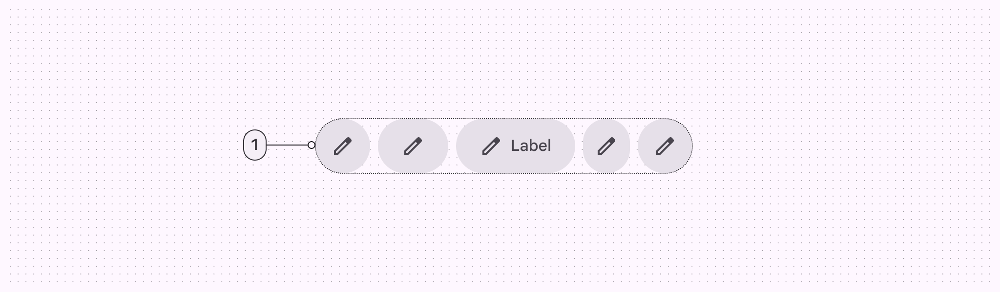
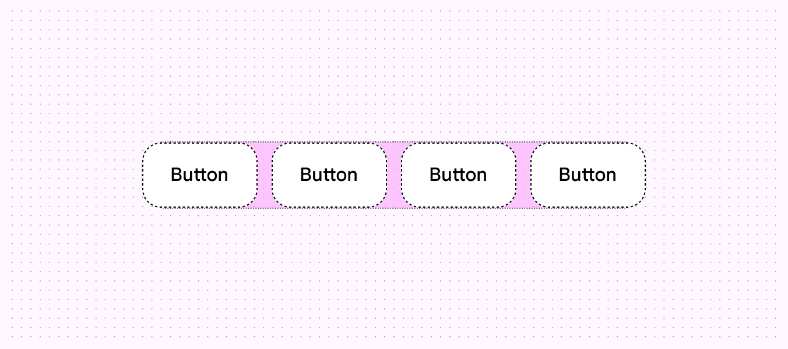
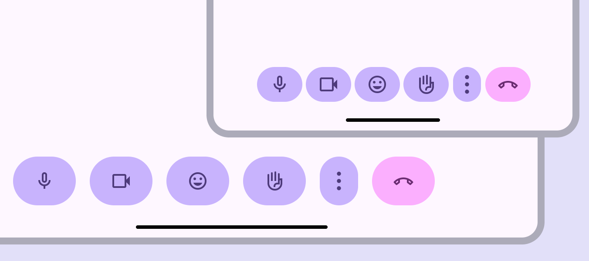

- [Guidelines](#guidelines)

# ガイドライン

## 使用方法

ボタングループには、標準と連結の 2 種類があります。

標準ボタングループは、隣接するボタン間のインタラクションを追加し、互いに反応できるようにします。標準グループ内のボタンが選択されると、以下のようになります。

- 選択されたボタンの形状と幅が変わります。
- 選択されたトグルボタンの色も変わります。
- 隣接するボタンが移動し、一時的に幅が変わります。

ボタングループにより製品の表現力が増します

重要な部分を強調し、関連するボタンを視覚的にグループ化するために、異なる種類、幅、色を自由に組み合わせてください。

デフォルトでは、標準グループ内のすべてのボタンは同じサイズ（XS～XL）と形状（丸型または四角型）にする必要があります。

- グループ内で複数のサイズを使用するのは、ヒーローモーメントの場合のみにしてください。
  - ヒーローモーメントとは、 UI の中で特に強調したい瞬間・場面のことを指すデザイナー用語です。
  - 例えば、キャンペーンなど特別なコンテキストのことを示します。
  - つまり、「普段はボタンサイズは揃えて使ってね。混在させるのは特別に強調したい場面だけ」というガイドラインです。
- 頻繁にサイズを混ぜるのは避けてください。
- グループ内で異なる形状を使用するのは、ボタンが選択されている場合、または意味やコントラストを強調する場合のみにしてください。

以下の例は、グループ内のボタンに同じ形状を使用し、幅や色などの他のプロパティを変更している良い例です。

以下の例は、同じグループ内でボタンの形を変えている例です。正円、楕円、正方形の三種類の形状のボタンが混在しています。基本的には形状を統一してください。特に強調したいボタンだけは、他のボタンと異なる形状を採用しても問題ありません。以下の例は、三つ中、三つとも形状が異なるため、強調効果がなく、あまり良くない使用例です。

**連結ボタングループ** は、オプションの選択、ビューの切り替え、ページ内の要素の並べ替えに役立ちます。

連結ボタングループは標準グループと同様に動作しますが、隣接するボタンには影響しません。

連結ボタングループは、非推奨となった [セグメントボタン](https://m3.material.io/components/segmented-buttons/overview) に代わるものです。

以下は、連結ボタングループの使用例です。

[連結ボタンの使用例（動画）](https://firebasestorage.googleapis.com/v0/b/design-spec/o/projects%2Fgoogle-material-3%2Fimages%2Fm34llls1-Button-Group-B-2.mp4?alt=media&token=4142a8d4-8e42-4e97-9c0f-5143086be82d)

ボタンの内容が関連しており、ボタンを選択できる場合は、連結ボタングループを使用します。

連結ボタングループは、トグルボタンを使用する単一選択または複数選択パターンに使用してください。

どのボタンもトグルできない場合は、連結ボタングループの使用は避けてください。

連結ボタングループを単一または複数選択パターンで使用する

## 構造

1. Container

### Container

標準ボタングループコンテナでは、ボタン間にパディングが設けられており、製品の周囲のレイアウトを崩すことなく、ボタンの幅と形状をアニメーション化できます。

標準ボタングループは、内部のボタンの幅に合わせて配置されます。

連結ボタングループは、配置先のページまたはサーフェスの幅に合わせて配置し、内部のボタンの幅を広げる必要があります。

ウィンドウが大きい場合は、連結ボタングループが広くなりすぎないように、最大​​幅を設定することを検討してください。

連結ボタングループは、内部の各ボタンの幅を広げ、コンテナの幅まで拡張します。

## アダプティブデザイン

アダプティブデザインは、ユーザー、デバイス、使用状況などのコンテキストに応じてインターフェースを変更することを可能にします。（ [アダプティブデザインの詳細はこちら](https://m3.material.io/m3/pages/adaptive-design/) ）

### リサイズ

ボタングループは、レイアウト内を 1 行にまとめて移動する必要があります。 2 行目に折り返してはなりません。

複数のボタングループを重ねて配置し、アイテム同士を近づけることもできます。ただし、ボタングループは垂直方向には連動しません。

ボタングループと個々のボタンは、 **固定** または **柔軟** なサイズ変更に設定できます。

- **固定 ( Fixed )** : ボタンの幅（狭～広）、サイズ（XS～XL）、またはウィンドウサイズごとのパディングを手動で定義します。
- **柔軟 ( Flexible )** : ボタンとボタングループの幅を自動的に増減します。すべてのボタンが最大幅になるまで、ボタングループは拡大します。

ボタン幅を手動で調整する場合は、アイコンボタンの幅が設定した幅以上にならないように注意してください。

以下の図は、ボタンの幅、サイズ、パディングを手動で調整して、さまざまなウィンドウのサイズに合わせた場合の例です。

コンパクトなウィンドウでは、ボタングループ内のすべてのボタンが収まるよう、より小さく幅の狭いボタンの使用を検討してください。大きなウィンドウや特大サイズのウィンドウでは、利用可能なスペースをより有効に活用できるよう、より大きく幅の広いボタンの使用を検討してください。

フレキシブルボタンまたはボタングループは、幅を自動的に調整します。

以下の動画は、手動でサイズ、形状、パディングを設定して、さまざまなウィンドウサイズに合わせてボタングループを調整した例です。

[手動設定により、ボタンのサイズや幅が調整される例(動画)](https://firebasestorage.googleapis.com/v0/b/design-spec/o/projects%2Fgoogle-material-3%2Fimages%2Fma2ph39h-GM3_Expressive_Button-Groups_Guidelines_12_IA_v01.mp4?alt=media&token=790ee31a-f920-49b9-b224-1c035826c00c)

より大きなウィンドウサイズにスケーリングする場合は、色やサイズなどの特性を使用して、各ボタンの視覚的な階層構造が維持されるようにしてください。

例えば、主要なアクションは、どのウィンドウサイズでも、最も大きく、最も幅が広く、視覚的に最も目立つボタンである必要があります。

以下の動画は、レイアウトやデバイス間で視覚的な構造が維持される例です。

[レイアウトやデバイス間で視覚的な構造を維持する例（動画）](https://firebasestorage.googleapis.com/v0/b/design-spec/o/projects%2Fgoogle-material-3%2Fimages%2Fma2pii3g-Gm3_Expressive_Button-groups_Guidelines_13_IA_v01.mp4?alt=media&token=eb65fd9a-f23f-4eb5-88f8-6417b7d7848f)

### プレゼンテーション

ボタングループの後端にあるボタンは、ウィンドウサイズが小さいときにはオーバーフローメニューとして、一つのボタンにまとめられ、ウィンドウサイズが大きくなると再び表示されるようにカスタマイズできます。オーバーフローメニューはグループの後端に配置してください。

次の動画は、ボタンは画面サイズに応じて、オーバーフローメニューに隠れたり、再び表示されたりします。通話終了ボタンは、ボタングループ外のボタンであるため、隠れることはありません。

[折り畳みの使用例（動画）](https://firebasestorage.googleapis.com/v0/b/design-spec/o/projects%2Fgoogle-material-3%2Fimages%2Fma2pjcic-GM3_Expressive_Button-Groups_Guidelines_14_IA_v01.mp4?alt=media&token=d2b496fe-0b66-42cd-8b17-828526a5f6b9)

## 振る舞い

### タップ

ボタンが押されると、幅と形状が変わります。

標準ボタングループでは、ボタンを押すと隣接するボタンの幅も変化します。

連結ボタングループでは、押されたボタンの形状のみが変わります。

以下の動画は、標準ボタングループ内のボタンを押すと、隣接するボタンの幅が変わる例です。

[標準ボタングループをタップしたときの例（動画）](https://firebasestorage.googleapis.com/v0/b/design-spec/o/projects%2Fgoogle-material-3%2Fimages%2Fm0fljnt9-Button-Group-D.mp4?alt=media&token=3906bae1-361f-4340-969e-d9ac7d6b98bf)

### 選択

選択されたボタンの形状は、丸から四角へ、または四角から丸へ変化します。

選択されたボタンの形状は変化する必要があります。

[選択されたボタンの形状が変化する例（動画）](https://firebasestorage.googleapis.com/v0/b/design-spec/o/projects%2Fgoogle-material-3%2Fimages%2Fm34lm16p-Button-Group-Hero-alt-2.mp4?alt=media&token=f56b388e-c7a8-4f79-84e1-e67c8c258b4c)

## 引用元資料

[Button groups / Guidelines](https://m3.material.io/components/button-groups/guidelines)

