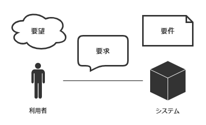

- [要望と要求と要件の違い](#要望と要求と要件の違い)
  - [図解](#図解)
  - [要望](#要望)
  - [要求](#要求)
  - [要件](#要件)

# 要望と要求と要件の違い

## 図解

要望 -> 要求 -> 要件は、この順番でだんだんと具体的なものになっていきます。

## 要望

要望は、発注者が望んでいるもののことです。

これには、システム開発が本当に必要なのかどうかも含めて  
発注者のあらゆる思いが含まれます。

要望は、文章の末尾が 「～したい」 になる。

## 要求

要求は、発注者が開発者、あるいはシステムに求めるものです。

要求にはシステムに関するものしか含まれません。

要求は、文章の末尾が 「～してほしい」 になる。

## 要件

要件は、システムが満たしていなければいけない条件です。

要求された内容には、具体的な数値になっていない要求なども含まれていることがあります。  
そういったものは、システムとして実装するにあたり、具体的な数字に落とし込む必要があります。
具体的な数字に落とし込むことで、システムの完成の定義を明確にする意味もあります。

要件は、文章の末尾が 「～する」 になる。

