- [クエリを記述する](#クエリを記述する)
  - [クエリをプロジェクトに追加する](#クエリをプロジェクトに追加する)
  - [モデルを生成する](#モデルを生成する)
  - [生成されたコードをテストする](#生成されたコードをテストする)


# クエリを記述する

最も一般的な GraphQL 操作はクエリです。クエリは、サーバーのスキーマに準拠した構造でグラフからデータを要求します。サーバーのサンドボックスに戻ると、先ほど開いた [スキーマ参照] タブに使用可能なクエリ フィールドが表示されます。

詳細を確認するには、launches フィールドまでスクロールします。

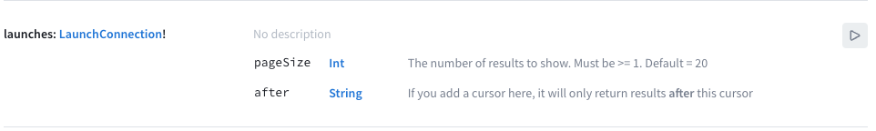

ここでは、フィールド名自体、その戻り値の型、それに渡すことができるパラメータに関する情報の両方が表示されます。この情報を使用して、最終的にアプリに追加するクエリを作成できます。

サンドボックス エクスプローラーでこのフィールドの操作を開始するには、情報の右側にある [再生] ボタンを選択します。

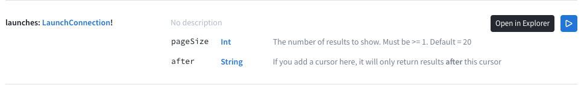

これにより、Sandbox の Explorer タブに戻り、左側のサイドバーに選択したフィールドのドキュメントが表示されます。

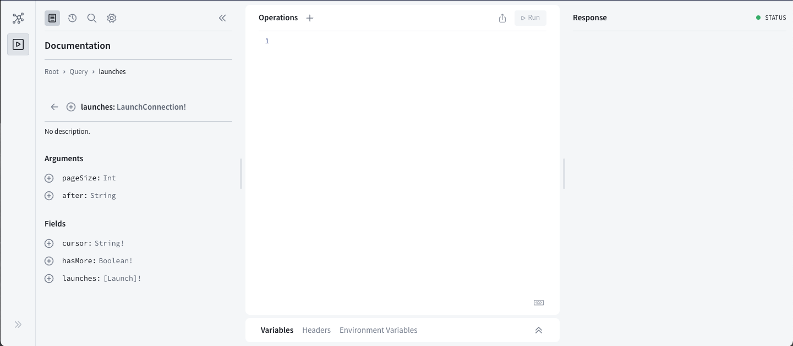

起動フィールドの横にある小さなプラス ボタンに注目してください。このボタンをクリックすると、中央の「操作」パネルにフィールドが追加されます。

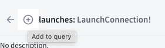

フィールドが追加されると、次のようになります。

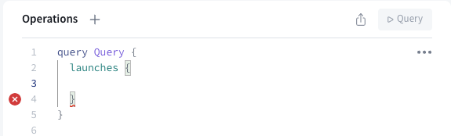

ここで表示されている内容を詳しく見てみましょう:

- 操作のタイプであるクエリと、それに続く操作の名前 (現在は Query (すぐにより具体的にします)) は、最も外側の中括弧のセットです。

- 選択されている実際のフィールドは、次の中括弧のセットです。このフィールドの引数は両方ともデフォルト値を持っているため、自動的に追加されることはありません。

- 中括弧の間の空白スペースにエラーがあります。ここに、各起動から返される情報のリストを入れます。

Apollo Kotlin SDK では、すべてのクエリに名前を付ける必要があります (GraphQL 仕様では必須ではありませんが)。複数のクエリを作成するので、この操作に Query 以外の特定の名前を付けることもお勧めします。操作の名前を LaunchList に変更します。

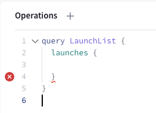

次に、左側で、返されるオブジェクトに戻すフィールドを選択できます。まず、カーソル フィールドの横にあるプラス ボタンをクリックします。そのフィールドが選択済みとしてマークされ、操作に挿入されます。

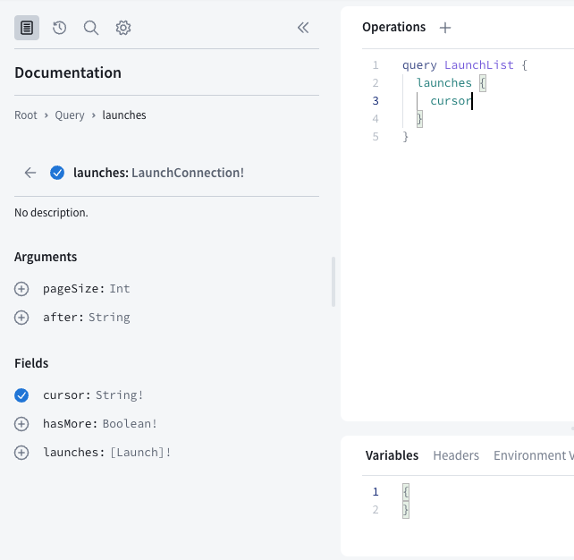

これはおそらく、オブジェクトにフィールドを追加する最も簡単な方法です。すべてのスペルとタイプがわかるからです。

ただし、オートコンプリートを使用してこれを行うこともできます。操作パネルでカーソルの下に改行を追加し、「ha」と入力し始めます。オートコンプリート ボックスがポップアップ表示され、スキーマの内容に基づいてオプションが表示されます。

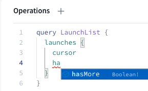

Sandbox Explorer はクエリの構築と検証に最適なツールです。変更を試すために Android Studio でプロジェクトを繰り返し再構築する必要はありません。

スキーマが示すように、launches フィールドは LaunchConnection オブジェクトを返します。このオブジェクトには、ページ区切りに関連するフィールド (cursor と hasMore) とともに、launches のリストが含まれます。これまでに記述したクエリは、この LaunchConnection オブジェクトのどのフィールドを返すかを正確に示しています。

このクエリを実行するには、[操作の送信] ボタンを押します。このボタンには、クエリの名前である LaunchList が表示されているはずです。

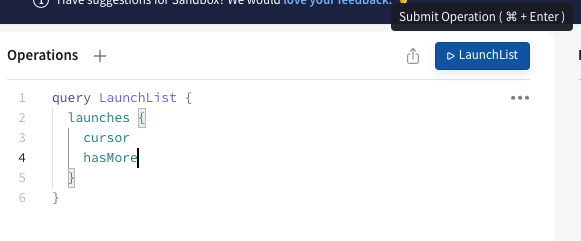

このクエリは正常に実行されますが、起動に関する情報は含まれていません。これは、クエリに必要なフィールドを含めなかったためです。

左の列の下部にある起動フィールドの横にあるボタンをクリックします。これにより、操作セクションに起動用の中括弧が追加され、ドキュメントが移動されて起動タイプの情報が表示されます。

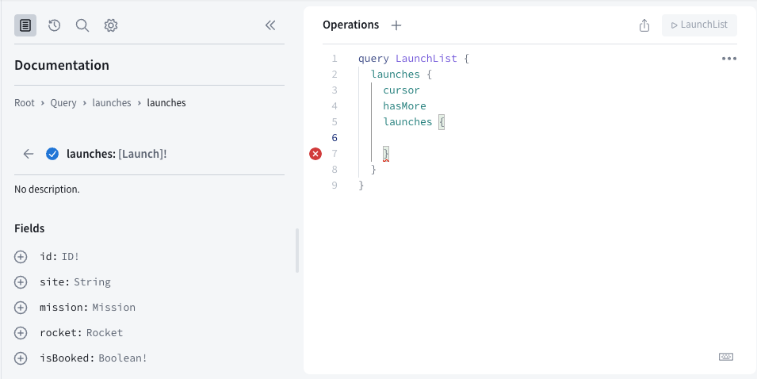

この括弧内に追加するフィールドは、リスト内の起動ごとに取得されます。 id および site プロパティの横にあるボタンをクリックして、これら 2 つのフィールドを追加します。完了すると、操作は次のようになります。

```graphql
query LaunchList {
    launches {
        cursor
        hasMore
        launches {
            id
            site
        }
    }
}
```

操作を再度実行すると、以前に取得した情報に加えて、ID とサイト情報を含む起動のリストも取得されます。

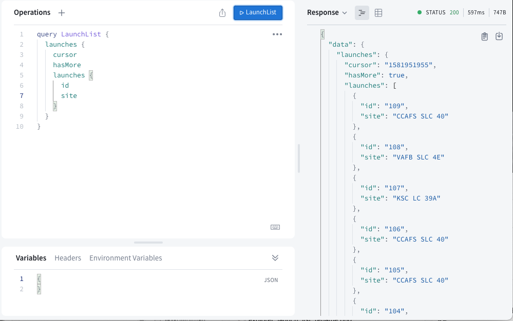


## クエリをプロジェクトに追加する

クエリが適切なデータを取得できるようになったので、Android Studio に戻ります。

1. src/main/graphql/ フォルダーを右クリックします。このフォルダーには schema.graphqls が含まれているはずです。[新規] > [ファイル] を選択します。

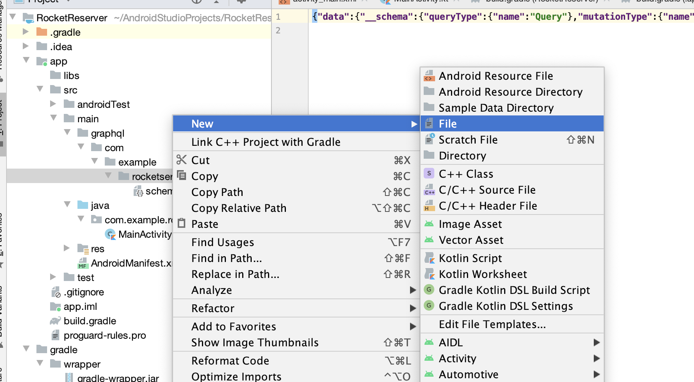

2. ファイルに LaunchList.graphql という名前を付けます。schema.graphqls ファイルと同じレベルに保存されていることを確認します。

3. Sandbox Explorer から最終クエリをコピーし、LaunchList.graphql に貼り付けます。

```graphql
query LaunchList {
    launches {
        launches {
            id
            site
        }
    }
}
```


## モデルを生成する

プロジェクトをビルドして、Apollo Kotlin プラグインで最初のモデルを生成できるようにします。プラグインは、モデルを生成するための generateApolloSources というタスクを定義します。これを実行する必要はありません。プロジェクトのビルド時に自動的に実行されます。

注: オートコンプリートはプロジェクトをビルドするまで機能しません。オートコンプリートが機能するには生成されたコードが必要であるためです。クエリを変更するたびに、Android Studio が変更を反映できるようにプロジェクトを再構築する必要があります。


## 生成されたコードをテストする

メニューから [ナビゲート] > [クラス] を選択し、「LaunchList」と入力し始めると、Android Studio は LaunchListQuery.kt を開くように提案します。ファイルは app/build/generated/source/apollo/service/com/example/rocketreserver/LaunchListQuery.kt にあるはずです。

LaunchListQuery.kt ファイルは、多数のネストされたクラスを持つルート クラス LaunchListQuery を定義します。クラスを Sandbox Explorer で返される JSON データと比較すると、構造が一致していることがわかります。これらのクラスには、クエリが要求するフィールドのプロパティのみが含まれます。

LaunchList.graphql の id プロパティをコメント アウトして保存し、再度ビルドしてみてください。ビルドが完了すると、Launch クラスには要求されたサイト プロパティのみが含まれるようになります。

id のコメントを解除して再構築すると、プロパティが復元されます。

コードを生成して内容を確認できたので、クエリを実行します。


