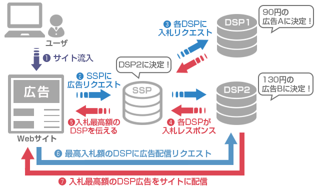

<!-- TOC START min:1 max:3 link:true asterisk:false update:true -->
- [DSP と SSP](#dsp-と-ssp)
  - [DSP とは](#dsp-とは)
  - [SSP とは](#ssp-とは)
  - [DSP と SSP の動き](#dsp-と-ssp-の動き)
<!-- TOC END -->

# DSP と SSP

## DSP とは

DSP とは、 Demand-Side Platform の略称で、広告主 (広告配信を希望している側) の  
プラットフォームです。つまり DSP は、広告出稿の費用対効果を高めたい広告主のためのサービスです。

## SSP とは

SSP とは、 Supply Side Platform の略称で、メディア (広告枠を提供している側) のプラットフォームです。  
広告枠をなるべく高く買ってもらいたい媒体社 (メディア) のためのサービスであるといえます。

## DSP と SSP の動き

