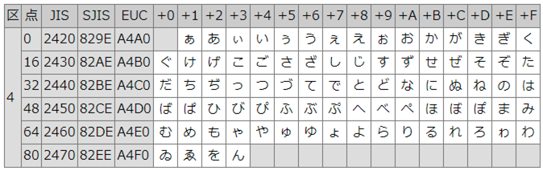

<!-- TOC START min:1 max:3 link:true asterisk:false update:true -->
- [文字コード概論](#文字コード概論)
  - [概説](#概説)
    - [符号化文字集合（CCS:Coded Caracter Set）（別名：キャラクターセット）](#符号化文字集合ccscoded-caracter-set別名キャラクターセット)
    - [文字符号化方式（CES:Character Encoding Scheme）（別名：エンコーディングルール）](#文字符号化方式cescharacter-encoding-scheme別名エンコーディングルール)
    - [符号化文字集合と文字符号化方式](#符号化文字集合と文字符号化方式)
  - [符号化文字集合の一覧](#符号化文字集合の一覧)
  - [文字符号化方式の一覧](#文字符号化方式の一覧)
  - [文字コードの一覧](#文字コードの一覧)
  - [詳細](#詳細)
    - [符号化文字集合（CCS:Coded Character Set）（別名：キャラクターセット）](#符号化文字集合ccscoded-character-set別名キャラクターセット)
    - [例](#例)
    - [文字符号化方式（CES:Character Encoding Scheme）（別名：エンコーディングルール）](#文字符号化方式cescharacter-encoding-scheme別名エンコーディングルール-1)
<!-- TOC END -->


# 文字コード概論

## 概説

### 符号化文字集合（CCS:Coded Caracter Set）（別名：キャラクターセット）

符号化文字集合とは、 「文字」 と 「文字に割り当てた番号」 の対応表のことです。

例えば、以下のようなイメージです。

```
あ：P-1
い：P-2
う：P-3
え：P-4
お：P-5
```

番号一つ一つを **コードポイント** と呼んだりします。


### 文字符号化方式（CES:Character Encoding Scheme）（別名：エンコーディングルール）

文字符号化方式とは、 「文字に割り当てた番号」 と 「実際にコンピュータが扱う数字」 の対応表のことです。

例えば、以下のようなイメージです。

```
P-1：00000001
P-2：00000010
P-3：00000011
P-4：00000100
P-5：00000101
```


### 符号化文字集合と文字符号化方式

符号化文字集合と文字符号化方式を組み合わせることで、以下のような表を作成して使用します。

```
あ：P-1：00000001
い：P-2：00000010
う：P-3：00000011
え：P-4：00000100
お：P-5：00000101
```


## 符号化文字集合の一覧

- Unicode


## 文字符号化方式の一覧

- UTF-8
- UTF-16
- UTF-32


## 文字コードの一覧

| 文字コード   | 符号化文字集合 | 文字符号化方式     |
| ------------ | -------------- | ------------------ |
|              | Unicode        | UTF-8              |
|              | Unicode        | UTF-16             |
|              | Unicode        | UTF-32             |
| ASCII コード |                |                    |
| Shift-JIS    | JIS X 0208     | Shift-jis or MS932 |
|              |                |                    |


## 詳細

### 符号化文字集合（CCS:Coded Character Set）（別名：キャラクターセット）

符号化文字集合では、文字に番号を割り振ります。

主な文字集合として `JIS X 0208` や `Unicode` があります。

これらの規約では、文字に `「群・面・区・点」` の番号を割り振ります。  
群は 0 ～ 127 、面・区・点は 0 ～ 255 の数値をとります。

すべて使用すると 128 × 256 × 256 × 256 ＝ 2,147,483,648 文字を表すことができますが、  
`JIS X 0208` では 1 ～ 94 区 × 1 ～ 94 点のみの 94 × 94 ＝ 8,836 文字、  
`Unicode` では 0 ～ 16 面 × 0 ～ 255 区 × 0 ～ 255 点の 17 × 256 × 256 ＝ 1,114,112 文字の  
範囲で文字を定義しています。

### 例

例えば文字の 「あ」 は、  
`JIS X 0208` では 「 4 区 2 点」 、  
`Unicode` では 「 0 面 48 区 66 点」  
の番号を割り振っています。

`JIS X 0208` のコード表を一部抜粋したものが以下です。  
列 「 +0 」 や列 「 +1 」 は、列 「点」 に加算する値です。  
列 「JIS」 や列 「SJIS」 は、列 「点」 に示した点における文字を、その符号化方式で符号化した時の値です。



<p />

表の元リンクは[こちら](http://www.asahi-net.or.jp/~ax2s-kmtn/ref/jisx0208.html)です。


### 文字符号化方式（CES:Character Encoding Scheme）（別名：エンコーディングルール）
