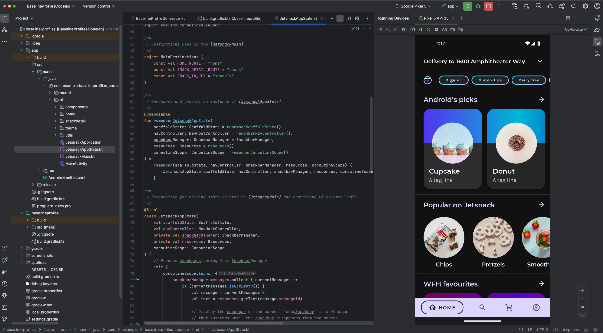

- [ハードウェア デバイス上でアプリを実行する](#ハードウェア-デバイス上でアプリを実行する)
  - [デバイスのミラーリング](#デバイスのミラーリング)

# ハードウェア デバイス上でアプリを実行する

## デバイスのミラーリング

Android の [Running Devices] ウィンドウで実機をミラーリングできます できます。デバイスのディスプレイを Android Studio に直接ストリーミングすることで、アプリの起動や操作、画面の回転、スマートフォンの開閉、音量の変更などの一般的な操作を Android Studio IDE から直接実行できます。

デバイスのミラーリングは、USB デバッグまたはワイヤレス デバッグが有効になっているデバイスがパソコンに接続されている場合に常に利用できます。

ミラーリングの開始と停止は、[Running Devices] ウィンドウまたはデバイス マネージャー（[View] > [Tool Windows] > [Device Manager]）で行えます。

また、設定（[Settings] > [Tools] > [Device Mirroring]）でデバイスのミラーリングを有効にするタイミングをカスタマイズすることもできます。

注: Android 12 で Xiaomi Redmi K40、Poco F3、Mi 11X などの特定のデバイスを使用している場合は、USB デバッグと USB デバッグ（セキュリティ設定）の両方の設定を有効にしてから、デバイスを再起動してデバイスのミラーリングを有効にしてください。

