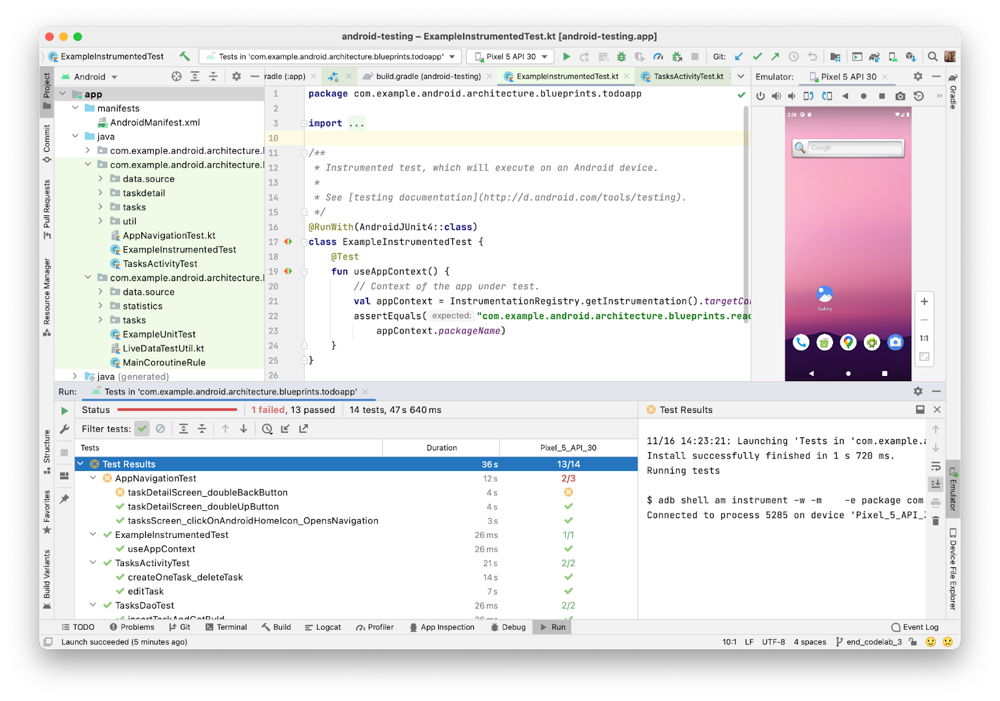
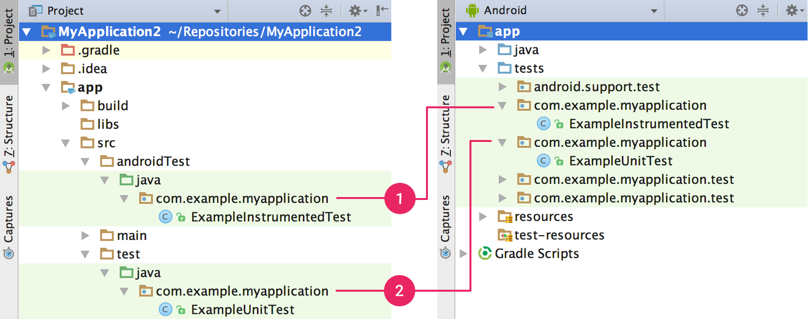
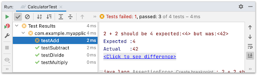

- [Android Studio でテストする](#android-studio-でテストする)
  - [テストの種類と場所](#テストの種類と場所)
  - [新しいテストを作成する](#新しいテストを作成する)
  - [テストを実行する](#テストを実行する)
    - [テスト実行を構成する](#テスト実行を構成する)
    - [統合 Gradle テストランナー](#統合-gradle-テストランナー)
    - [複数のデバイスで並行して実行する](#複数のデバイスで並行して実行する)
    - [Firebase Test Lab で実行する](#firebase-test-lab-で実行する)
      - [テスト結果を分析する](#テスト結果を分析する)
    - [テスト カバレッジを表示する](#テスト-カバレッジを表示する)
  - [テスト結果を表示する](#テスト結果を表示する)
    - [テスト失敗を分析する](#テスト失敗を分析する)
  - [詳細](#詳細)
  - [引用元資料](#引用元資料)

# Android Studio でテストする

Android Studio は、簡単にテストを実施できるように設計されています。テストの作成、実行、分析を簡略化する多くの機能を備えています。ローカルマシンで実行するテストや、デバイスで実行するインストルメンテーションテストの設定が可能です。 1 つ、または、複数のデバイスに対して、単一のテストや特定のテストグループを簡単に実行できます。テスト結果は Android Studio 内に直接表示されます。

ここでは、 Android Studio でテストを管理する方法を説明します。自動の Android テストを作成する方法の詳細については、 [Android でアプリをテストする](https://developer.android.com/training/testing?hl=ja) をご覧ください。

## テストの種類と場所

テストの場所は、作成するテストの種類によって異なります。 Android プロジェクトには、ローカル単体テスト用と、インストルメンテーションテスト用のデフォルトのソースコードディレクトリがあります。

**ローカル単体テスト** は `module-name/src/test/java/` にあります。このテストは、マシンのローカル Java 仮想マシン（JVM）で実行されます。 Android フレームワークの依存関係が、テスト対象に含まれていない場合、または、 Android フレームワークの依存関係をテストダブルの作成で代用できる場合は、このテストを使用して、テストに要する時間を最小限に抑えることができます。ローカル単体テストの作成方法の詳細については、 [ローカル単体テストを作成する](https://developer.android.com/training/testing/local-tests?hl=ja) をご覧ください。

**注** : Android Gradle プラグインは、ローカル単体テストを実行する際、Android フレームワークのすべての API を含むライブラリも対象に含めることにより、テストダブルを使用できるようにします。

**インストルメンテーションテスト** は、 `$module-name/src/androidTest/java/` にあります。このテストは、ハードウェアデバイス、または、エミュレータで実行されます。テストからは [Instrumentation](https://developer.android.com/reference/android/app/Instrumentation?hl=ja) API にアクセスできます。この API を使用することで、テスト対象のアプリの Context クラスなどの情報にアクセスしたり、テストコードから、テスト対象のアプリを制御したりできます。インストルメンテーションテストは、アプリ自体の APK とは、別の APK に組み込まれるため、固有の AndroidManifest.xml ファイルを持ちます。このファイルは、自動的に生成されますが、独自のバージョンを `$module-name/src/androidTest/AndroidManifest.xml` に作成できます。作成したバージョンは、生成されたマニフェストとマージされます。ユーザーインタラクションを自動化する統合テスト、および、機能 UI テストを作成する場合、または、テストダブルの作成で代用できない Android 依存関係が、テスト対象に含まれている場合は、このインストルメンテーションテストを使用します。インストルメンテーションテストを作成する方法の詳細については、 [インストルメンテーションテストを作成する](../../開発/ガイド/8.ベストプラクティス/1.テスト/4.インストルメンテーションテスト/1.インストルメンテーションテストを作成する.md) と [UI テストを自動化する](../../開発/ガイド/8.ベストプラクティス/1.テスト/4.インストルメンテーションテスト/2.UI%20テストを自動化する.md) をご覧ください。

ビルドバリアント固有のディレクトリにテストを配置すると、特定のビルドバリアントのみをテストできます。たとえば、いくつかのローカル単体テストを `$module-name/src/testMyFlavor/java/` に配置すると、このフレーバーのソースコードでビルドされたアプリをテストのターゲットに設定できます。これらのカスタムテストを作成する方法の詳細については、 [ビルドバリアントごとのインストルメンテーションテストを作成する](https://developer.android.com/studio/test/advanced-test-setup?hl=ja#create-instrumented-test-for-build-variant) をご覧ください。

新しいプロジェクトを作成するか、アプリモジュールを追加すると、 Android Studio は前述のテストソースセットを作成し、各ソースセットにサンプルテストファイルを挿入します。図 2 に示すように、これらのテストソースセットは [Project] ウィンドウに表示されます。

上記の左の図は、 [Project] ビューで、右の図は、 [Android] ビューです。

① は、インストルメンテーションテスト、 ② は、ローカル JVM テストです。

## 新しいテストを作成する

次の手順で、特定のクラス、または、メソッド用の新しいテストをそのソースコードから直接追加できます。

1. テストするコードが含まれているソースファイルを開きます。
2. テストするクラス、または、メソッドの名前にカーソルを置き、 `Ctrl + Shift + T`（ macOS では `Command + Shift + T` ）を押します。
3. 表示されたポップアップで、 [Create New Test…] をクリックします。
4. [Create Test] ダイアログで [JUnit4] を選択し、生成するフィールドとメソッドを編集して [OK] をクリックします。
5. [Choose Destination Directory] ダイアログで、作成するテストのタイプに応じたソースセットをクリックします。インストルメンテーションテストの場合は androidTest 、ローカル単体テストの場合は test です。次に、 [OK] をクリックします。

または、次の手順に沿って、適切なテストソースセット内に汎用テストファイルを作成します。

1. 左側の [Project] ウィンドウでプルダウンメニューをクリックし、 [Android] ビューを選択します。
2. [java] ディレクトリを右クリックして、 [New] > [Java Class] 、または、 [New] > [Kotlin Class/File] を選択します。あるいは、 [java] ディレクトリを選択し、 `Ctrl + N`（ macOS では `Command + N` ）ショートカットを使用することもできます。
3. [Choose Destination Directory] ダイアログで、作成するテストのタイプに応じたソースセットをクリックします。インストルメンテーションテストの場合は androidTest 、ローカル単体テストの場合は test です。次に、 [OK] をクリックします。
4. ファイルに名前を付けて、 [OK] をクリックします。

テストの追加後にアプリがコンパイルされない場合は、適切なテストライブラリの依存関係が設定されていることを確認してください。正しい依存関係については、 [ローカルテストを作成する](../../開発/ガイド/8.ベストプラクティス/1.テスト/3.ローカルテスト/ローカルテストを作成する.md/#テスト用の依存関係の追加) と [インストルメンテーションテストを作成する](../../開発/ガイド/8.ベストプラクティス/1.テスト/4.インストルメンテーションテスト/1.インストルメンテーションテストを作成する.md/#テスト環境をセットアップする) をご覧ください。

## テストを実行する

テストを実行する前に、ツールバーのプロジェクトの同期アイコン (※ 1 ) をクリックして、プロジェクトを Gradle と完全に同期させます。テストは、さまざまな粒度で実行できます。

(※ 1 )

- **ディレクトリ、または、ファイル内のすべてのテストを実行する** には、 [Project] ウィンドウを開き、次のいずれかを行います。
  - ディレクトリ、または、ファイルを右クリックして、実行アイコン (※ 2 ) をクリックします。
  - ディレクトリ、または、ファイルを選択して、ショートカット `Ctrl + Shift + R` を使用します。

- **クラス、または、特定のメソッドですべてのテストを実行する** には、コードエディタでテストファイルを開き、次のいずれかを行います。
  - [ガター](https://www.jetbrains.com/help/idea/settings-gutter-icons.html) (ブレークポイントなどのアイコン表示エリア) にあるテスト実行アイコン (※ 3 ) をクリックします。
  - テストクラス、または、テストメソッドを右クリックして、実行アイコン (※ 2 ) をクリックします。
  - テストクラス、または、テストメソッドを選択して、ショートカット `Ctrl + Shift + R` を使用します。

(※ 2 )

(※ 3 )

インストルメンテーションテストが、物理デバイス、または、エミュレータで実行されます。物理デバイスの設定の詳細については、 [ハードウェアデバイス上でのアプリの実行](https://developer.android.com/studio/run/device?hl=ja) をご覧ください。エミュレータの設定の詳細については、 [Android Emulator 上でアプリを実行する](https://developer.android.com/studio/run/emulator?hl=ja) をご覧ください。

### テスト実行を構成する

テストは、デフォルトで Android Studio のデフォルトの実行構成を使用して実行されます。実行構成の一部（インストルメンテーション ランナーやデプロイ オプションなど）を変更する必要がある場合は、[Run/Debug Configurations] ダイアログ（ [Run] > [Edit Configurations] をクリック）で実行構成を編集できます。

### 統合 Gradle テストランナー

Android Gradle プラグイン ( AGP ) 7.1.0 と Android Studio Bumblebee 以降では、 Android インストルメンテーションテストランナーの Gradle 独自の実装を使用して、インストルメンテーションテストを実行します。同じテストランナーを使用することで、継続的インテグレーションサーバーなど、コマンドラインから AGP を使用して実行した場合でも、 Android Studio から AGP を使用して実行した場合でも、同じ結果が得られる可能性が高くなります。

以前のバージョンの Android Studio では、 Gradle の Android インストルメンテーションテストランナーではなく、 IntelliJ Android インストルメンテーションテストランナーを使用します。そのため、最新バージョンの Android Studio を使用しない場合は、テストを Android Studio から実行するか、 Gradle プラグインを使用してコマンドラインから実行するかによって、結果が異なることがあります（あるランナーを使用してテストに合格し、別のランナーを使用して失敗するなど）。

すでにインストルメンテーション テスト構成がプロジェクトに保存されている場合は、Gradle を使用して、接続済みのデバイスでテストを実行できます。次に示すように、テストクラスまたはメソッドの横にあるガター アクションを使用して、新しいインストルメンテーション テスト構成を作成できます。

インストルメンテーション テストを実行するとき、Gradle のタスク出力のテスト マトリックスでテスト出力を調べることで、Android Studio が Gradle テストランナーを使用していることを確認できます。

### 複数のデバイスで並行して実行する

インストルメンテーション テストは、デフォルトでは 1 台の物理デバイス、または、エミュレータで実行されます。 2 台以上のデバイスでテストがどのように動作するかを確認するには、次の手順で追加のデバイスを選択します。

1. テストを実行する前に、対象デバイスのプルダウン メニューを開き、 [Select Multiple Devices…] を選択します。

2. 対象デバイスを選択し、 [OK] をクリックします。

3. 対象のプルダウン メニューのテキストが [Multiple Devices] に変わったことを確認し、実行アイコン (※ 2 ) をクリックします。

4. Test Matrix ツールウィンドウには、選択した各デバイス設定のテスト結果が表示されます。

特定のテストをクリックすると、出力ペインで結果を検査できます。各列をクリックしてテストを並べ替えることもできます。

### Firebase Test Lab で実行する

Firebase Test Lab を使用すると、多くの一般的な Android デバイスとデバイス構成（言語 / 地域、画面の向き、画面サイズ、プラットフォーム バージョンのさまざまな組み合わせ）で同時にアプリをテストできます。このテストは、リモートの Google データセンターにある物理デバイスと仮想デバイスで実行されます。テスト結果として提供されるテストログには、アプリの障害すべてに関する詳細情報が含まれています。

[Firebase Test Lab](https://firebase.google.com/docs/test-lab/?hl=ja) の使用を開始するには、以下を行う必要があります。

1. Google アカウントをまだ持っていない場合は、作成します。
2. [Firebase コンソール](https://console.firebase.google.com/?hl=ja) で、[新規プロジェクトを作成] をクリックします。

注: Firebase Test Lab の使用と関連費用（該当する場合）については、Test Lab の使用レベル、割り当て、および価格に関する記事をご覧ください。

Android Studio には、Firebase Test Lab へのテストのデプロイ方法を構成できる統合ツールが用意されています。Firebase プロジェクトを作成したら、テスト構成を作成してテストを実行できます。

1. メインメニューから [Run] > [Edit Configurations] をクリックします。
2. 新規構成の追加アイコン  をクリックして [Android Instrumented Tests] を選択します。
3. テスト名、モジュール タイプ、テストタイプ、テストクラスなど、テストの詳細を入力または選択します。
4. [Deployment Target Options] の [Target] プルダウン メニューから [Firebase Test Lab Device Matrix] を選択します。
5. ログインしていない場合は、[Sign in with Google] をクリックして、Android Studio がアカウントにアクセスできるようにします。
6. [Cloud Project] の横にあるリストから Firebase プロジェクトを選択します。
7. [Matrix configuration] の横にあるプルダウンからデフォルト構成のいずれかを選択するか、ダイアログを開くボタン (※ 4 ) をクリックして、独自の構成を作成します。アプリをテストするデバイス、Android のバージョン、言語 / 地域、画面の向きを 1 つ以上選択できます。テスト結果の生成にあたっては、ここで選択した項目のすべての組み合わせが Firebase Test Lab によりテストされます。
8. [Run/Debug Configurations] ダイアログで [OK] をクリックして終了します。
9. [Run] (※ 2 ) をクリックしてテストを実行します。

(※ 4 )

#### テスト結果を分析する

Firebase Test Lab でテストの実行が完了すると、図 9 に示すように、[Run] ウィンドウが開いて結果が表示されます。実行されたテストをすべて表示するには、[Show Passed]  のクリックが必要になる場合があります。

[Run] ウィンドウのテスト実行ログの先頭に表示されたリンクをたどることで、ウェブ上でテストの分析を行うこともできます。

### テスト カバレッジを表示する

テスト カバレッジ ツールは、ローカル単体テストで、単体テストによりカバーされたアプリコードの割合と領域をトラッキングするために使用します。テスト カバレッジ ツールを使用すると、アプリを構成する要素、クラス、メソッド、コード行が十分にテストされたかどうかを確認できます。

カバレッジ付きのテストは、 [テストを実行する](#テストを実行する) と同じ手順で実行します。ただし、実行ボタン (※ 2 ) をクリックする代わりに、カバレッジ付き（テスト名）実行ボタン (※ 5 ) をクリックします。このオプションは、 [Project] ウィンドウの [More Run/Debug] の裏に隠れている場合があります。カバレッジ設定は、 [Run/Debug Configurations] ダイアログの [Code Coverage] タブでも構成できます。

(※ 5 )

## テスト結果を表示する

Android Studio から 1 つ以上のテストを実行すると、[Run] ウィンドウに結果が表示されます。以下の図は、成功したテスト実行を示しています。

[Run] ウィンドウの左側には、ツリービューでテストが表示され、右側の出力ペインには、現在のテストスイートの結果とメッセージが表示されます。次に示すように、ツールバー、コンテキストメニュー、ステータスアイコンを使用して、テスト結果を管理できます。

1. **実行ツールバー** では、現在のテストの再実行、現在のテストの停止、失敗したテストの再実行（単体テストでのみ使用可能なため、上の図には表示されていません）、出力の一時停止、スレッドのダンプを行います。
2. **テストツールバー** では、テスト結果のフィルタリングと並べ替えを行います。また、ノードの展開と折りたたみ、テストカバレッジの表示、テスト結果のインポートとエクスポートを行います。
3. **コンテキストメニュー** をクリックすると、テスト実行のトラッキング、インライン統計の表示、スタックトレースのスクロールを行えます。また、例外の発生箇所でソースコードを開き、ソースに自動スクロールし、テスト実行の完了時に失敗した最初のテストを選択できます。
4. **テストステータスアイコン** は、テストにエラーがあったか、テストが無視されたか、失敗したか、進行中か、成功したか、一時停止しているか、終了したか、実行されなかったかを示します。
5. ツリービューの行を右クリックするとコンテキストメニューが表示され、デバッグモードでテストを実行したり、テストのソースコードファイルを開いたり、テスト中のソースコードの行にジャンプしたりできます。

### テスト失敗を分析する

1 つ以上のテストが失敗した場合、結果ウィンドウに警告サインと失敗の回数（「Tests failed: 1」など）が表示されます。

左側のツリービューで失敗したテストをクリックすると、右側の出力ペインにそのテストの詳細が表示されます。実際の値の横に見込み値が表示されるので、両者を比較できます。[Click to see difference] リンクをクリックすると、差分ビューアが開き、結果を並べて表示できます。

## 詳細

ここでは、 Android Studio を使用して最初のテストを作成して実行する際の基本的な手順を説明しています。 [コマンドラインからテストを実行](https://developer.android.com/studio/test/command-line?hl=ja) することもできます。また、 [テストに関する IntelliJ のドキュメント](https://www.jetbrains.com/help/idea/testing.html) もご覧ください。大規模なテストスイートを作成する際にテストを設定する方法の詳細については、 [高度なテスト設定](https://developer.android.com/studio/test/advanced-test-setup?hl=ja) をご覧ください。

## 引用元資料

- [Android Studio でテストする](https://developer.android.com/studio/test/test-in-android-studio?hl=ja)

