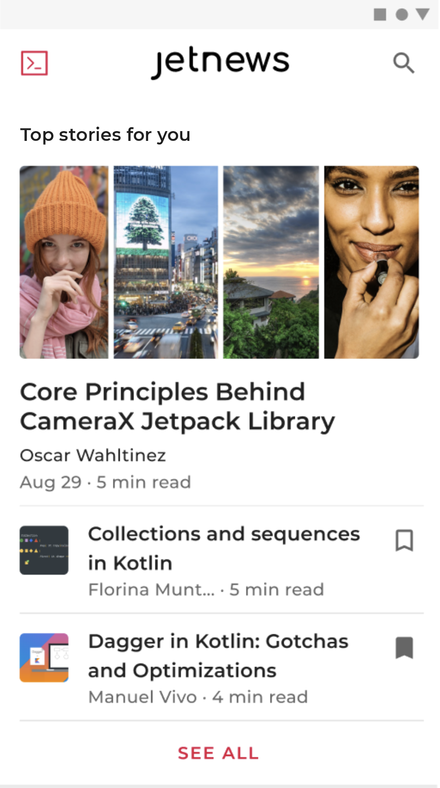
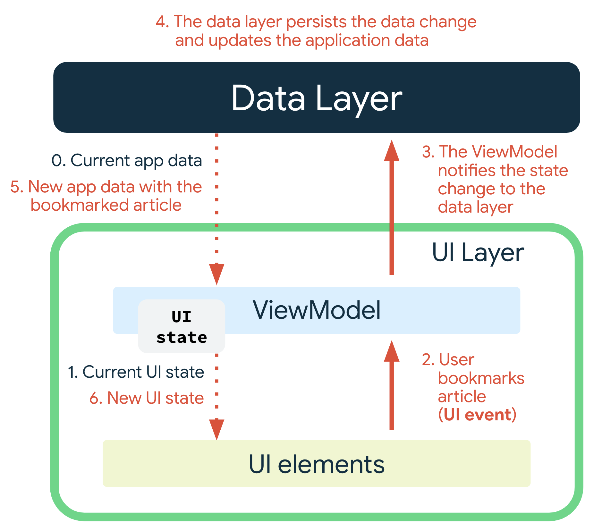

- [UI レイヤについて](#ui-レイヤについて)
  - [ニュースアプリを題材にしたケーススタディ](#ニュースアプリを題材にしたケーススタディ)
  - [UI 状態を定義する](#ui-状態を定義する)
    - [不変性](#不変性)
  - [単方向データフローで状態を管理する](#単方向データフローで状態を管理する)
    - [状態ホルダー](#状態ホルダー)
    - [ロジックのタイプ](#ロジックのタイプ)
    - [UDF を使用する理由](#udf-を使用する理由)
  - [UI 状態を公開する](#ui-状態を公開する)
    - [その他の考慮事項](#その他の考慮事項)
    - [1 つの UI 状態オブジェクトで、互いに関連付けられた複数の状態を保持するようにします。](#1-つの-ui-状態オブジェクトで互いに関連付けられた複数の状態を保持するようにします)
    - [UI 状態を 1 つのストリームにするか複数のストリームにするか。](#ui-状態を-1-つのストリームにするか複数のストリームにするか)
  - [UI 状態を使用する](#ui-状態を使用する)
    - [Flow を使用する場合](#flow-を使用する場合)
    - [インジケーターを表示する](#インジケーターを表示する)
    - [画面にエラーを表示する](#画面にエラーを表示する)
  - [スレッドと同時実行](#スレッドと同時実行)
  - [ナビゲーション](#ナビゲーション)
  - [ページング](#ページング)
  - [アニメーション](#アニメーション)
  - [引用元資料](#引用元資料)


# UI レイヤについて

UI の役割は、アプリデータを画面に表示することであり、また、ユーザー インタラクションの主要なポイントとして機能することです。ユーザー インタラクション（例: ボタンを押す）や外部入力（例: ネットワーク応答）によってデータが変更されるたびに、UI を更新してそのような変更を反映させる必要があります。UI は、実質的には、データレイヤから取得されたアプリの状態を視覚的に表したものです。

ただし、一般的に、データレイヤから取得するアプリデータの形式は、表示する必要がある情報の形式とは異なります。たとえば、UI では、データの一部だけが必要になる場合や、ユーザーに関連する情報を提示するために 2 つの異なるデータソースの統合が求められる場合があります。適用するロジックにかかわらず、UI を完全にレンダリングするために必要なすべての情報を UI に渡す必要があります。UI レイヤは、アプリデータの変更を UI が提示できる形式に変換して表示するパイプラインです。


## ニュースアプリを題材にしたケーススタディ

ニュース記事をフェッチして読者に提供するアプリを考えてみましょう。このアプリには、ユーザーが読むことのできる記事を提示する記事画面があり、ログインしているユーザーは目を引く記事をブックマークすることもできます。常に多くの記事が続々と生まれることを考えると、読者がカテゴリごとに記事を閲覧できることも必要です。要約すると、このアプリでユーザーは次のことができます。

- 読むことのできる記事を表示する。
- 記事をカテゴリ別に閲覧する。
- ログインして特定の記事をブックマークする。
- 利用資格がある場合は、プレミアム機能を利用する。



次のセクションでは、このサンプルをケーススタディとして使用し、単方向データフローの原則を紹介します。また、UI レイヤのアプリ アーキテクチャのコンテキストで、その原則を適用することにより解決できる問題を説明します。


## UI 状態を定義する

UI 状態は、 UI に表示されるデータそのものや、 UI の表示状態など、 UI に関する状態のことを示します。一方で、 UI 要素とは、 UI 状態以外の UI に関するもの全てと捉えることができます。

例えば、ニュースアプリの例では、 UI 状態は、以下のデータクラスにカプセル化できます。

```kotlin
data class NewsUiState(
    val isSignedIn: Boolean = false,
    val isPremium: Boolean = false,
    val newsItems: List<NewsItemUiState> = listOf(),
    val userMessages: List<Message> = listOf()
)

data class NewsItemUiState(
    val title: String,
    val body: String,
    val bookmarked: Boolean = false,
    ...
)
```


### 不変性

上記の data クラスは、プロパティが val でイミュータブル (不変) となっています。これにより、 UI の内部で、プロパティが変更されることを防ぎます。もし、 UI の内部で UI 状態を直接更新してしまうと、データベースなどの更新が漏れる可能性があります。そうなると、アプリは、 UI 状態とデータベースのどちらのデータを信頼すればよいのかがわからなくなってしまいます (信頼すべきデータソースが複数になってしまいます) 。これにより、バグの発見などにも時間がかかるようになってしまうでしょう。

**データのソースまたはオーナーのみが、それらが公開するデータを更新する責任を負うべきです。**


## 単方向データフローで状態を管理する

UI レイヤーでは、 UI の状態を使用してそれを表示することだけに専念するべきです。 UI にデータの表示以外の様々な機能を実装してしまうと、いずれ手に負えなくなります。それを実現するために、単方向データフロー ( UDF ) が有効です。


### 状態ホルダー

ViewModel は、データレイヤーから取得したデータを状態として保持し、 UI に表示します。 UI 要素は、ユーザーの操作によるイベントを ViewModel に伝えます。


サンプルのニュースアプリで、記事をブックマークする際のイベントとデータの流れは以下のようになります。




### ロジックのタイプ

ロジックは、ビジネスロジックと UI 動作ロジック ( UI ロジック) に分類することが可能です。

- ビジネスロジック
  - アプリデータに関するプロダクトの要件の実装です。前述のように、ケーススタディのアプリで記事をブックマークすることはその一例です。通常、ビジネス ロジックはドメインレイヤまたはデータレイヤに配置され、UI レイヤに配置されることはありません。
- UI 動作ロジック ( UI ロジック)
  - データレイヤに直接関係のない画面の表示を意味します。たとえば、 Android Resources を使って画面に表示する適切なテキストを取得したり、ユーザーがボタンをクリックしたときに特定の画面に移動したり、トーストまたはスナックバーを使ってユーザーメッセージを画面に表示する、などのロジックがこちらに分類されます。

UI ロジックは、特に Context のような UI タイプを含む場合、ViewModel ではなく UI 要素で実行する必要があります。

UI 要素が複雑になるため、テストのしやすさと関心の分離を重視して UI ロジックを別のクラスに委任したい場合は、単純なクラスを状態ホルダーとして作成することができます。単純なクラスを UI 要素からのみ参照させることで、 UI 要素とライフサイクルを一致させることが可能です。


### UDF を使用する理由

UDF により次のことが実現されます。

- データの整合性
  - UI に対して、信頼できる唯一のデータソースが存在します。
- テストのしやすさ
  - 状態のソースが分離されるため、UI から独立してテストを行うことができます。
- メンテナンスのしやすさ
  - 状態の変化は、ユーザー イベントおよびデータソースからのデータ取得の結果であるという、明確に定義されたパターンに従います。


## UI 状態を公開する

UI 状態を定義したら、次は、 UI 状態を UI 要素に公開します。

UI 状態を定義し、その状態の生成を管理する方法を決定したら、次のステップとして、生成された状態を UI に提示します。UDF を使用して状態の生成を管理するので、生成される状態をストリームとみなすことができます。つまり、時間の経過とともに状態の複数のバージョンが生成されます。したがって、 LiveData や StateFlow などの監視可能なデータホルダーで UI 状態を公開する必要があります。これは、UI が、 ViewModel から直接手動でデータを取得する手間をかけずに、状態の変更に反応できるようにするためです。

UiState のストリームを作成する一般的な方法は、可変のバッキング ストリームを ViewModel からの不変のストリームとして公開することです。たとえば、 `MutableStateFlow<UiState>` を `StateFlow<UiState>` として公開します。

```kotlin
class NewsViewModel(...) : ViewModel() {

    var uiState by mutableStateOf(NewsUiState())
        private set

}
```

次に、 ViewModel は、内部的に状態を変更するメソッドを公開して、 UI が使用する更新を公開できます。たとえば、非同期アクションを実行する必要がある場合を考えてみましょう。この場合、 viewModelScope を使用してコルーチンを起動することが可能で、完了したら可変の状態を更新できます。

```kotlin
class NewsViewModel(
    private val repository: NewsRepository
) : ViewModel() {

   var uiState by mutableStateOf(NewsUiState())
        private set

    private var fetchJob: Job? = null

    fun fetchArticles(category: String) {
        fetchJob?.cancel()
        fetchJob = viewModelScope.launch {
            try {
                val newsItems = repository.newsItemsForCategory(category)
                // copy 関数は data クラスで自動生成されるもの。
                // インスタンスのコピーを生成する。
                // パラメータが与えられた場合は、そのプロパティのみ、受け取った値で上書きする。
                uiState = uiState.copy(newsItems = newsItems)
            } catch (ioe: IOException) {
                // エラーをハンドリングして、適切なタイミングで UI に通知します。
                val messages = getMessagesFromThrowable(ioe)
                uiState = uiState.copy(userMessages = messages)
            }
        }
    }
}
```


### その他の考慮事項

### 1 つの UI 状態オブジェクトで、互いに関連付けられた複数の状態を保持するようにします。

そうすれば、データの不整合が減少し、コードが理解しやすくなります。ニュース アイテムのリストとブックマーク数を 2 つの異なるストリームで公開すると、一方が更新され、もう一方が更新されない状況が生じる可能性があります。使用するストリームを 1 つにすれば、両方の要素が常に最新の状態に保たれます。さらに、一部のビジネス ロジックでは、ソースの組み合わせが必要になる場合があります。たとえば、ブックマーク ボタンを表示する必要があるのは、ユーザーがログイン済みで、かつプレミアム ニュース サービスを定期購読している場合のみとします。その場合、次のように UI 状態クラスを定義できます。

```kotlin
data class NewsUiState(
    val isSignedIn: Boolean = false,
    val isPremium: Boolean = false,
    val newsItems: List<NewsItemUiState> = listOf()
)

val NewsUiState.canBookmarkNews: Boolean get() = isSignedIn && isPremium
```

この宣言において、ブックマーク ボタンを表示するかどうかは、他の 2 つのプロパティの派生プロパティです。ビジネス ロジックが複雑になるにつれて、すべてのプロパティを直接利用できる唯一の UiState クラスを作成することがいっそう重要になります。


### UI 状態を 1 つのストリームにするか複数のストリームにするか。

UI 状態を 1 つのストリームで公開するか複数のストリーム ( UiState ) で公開するかを選択する際の重要な指針は、直前のセクションに記載した通り、出力されるアイテム間の関係があるかどうかです。 1 つのストリームで公開する最大の利点は、利便性とデータの整合性です。状態のコンシューマは、最新の情報をいつでも利用できます。ただし、複数の状態ストリームを使用することが適切な場合もあります。

- 関連のないデータ型
  - UI のレンダリングに必要な状態は、互いに完全に独立している場合があります。このような場合は、完全に異なる複数の状態を一緒にまとめると、コストがメリットを上回る可能性があります。ある状態が他の状態より頻繁に更新される場合は、特にそうです。
- UiState の差分抽出
  - UiState オブジェクト内のフィールドの数が多いと、その分だけフィールドが更新された結果としてストリームが出力される可能性が高くなります。ビューシステムには、連続する出力が異なるものか同じものかを把握する差分抽出メカニズムがないため、出力ごとにビューの更新が発生します。つまり、 LiveData で Flow API や distinctUntilChanged() などのメソッドを使用した緩和策が必要になる場合があります。


## UI 状態を使用する

UI 状態を使用する一般的な方法は以下の通りです。

```kotlin
@Composable
fun LatestNewsScreen(
    viewModel: NewsViewModel = viewModel()
) {
    // Show UI elements based on the viewModel.uiState
}
```


### Flow を使用する場合

UI で UiState オブジェクトのストリームを使用するには、アプリで使用している監視可能なデータ型に終端演算子を使用します。たとえば、 LiveData の場合は observe() メソッドを使用し、 Kotlin Flow の場合は collect() メソッドまたはそのバリエーションを使用します。

UI で監視可能なデータホルダーを使用する際は、必ず UI のライフサイクルを考慮してください。これが重要なのは、ビューがユーザーに表示されていないとき、 UI は UI 状態を監視すべきでないからです。このトピックについて詳しくは、こちらのブログ投稿をご覧ください。 LiveData を使用している場合は、 LifecycleOwner が暗黙的にライフサイクルに関する問題に対処します。フローを使用している場合は、 repeatOnLifecycle API や [collectAsStateWithLifecycle](./Jetpack%20Compose%20から安全に%20flow%20を収集する.md) API を使用してこの問題を処理することをおすすめします。


### インジケーターを表示する

UiState クラスで読み込み状態を表現する簡単な方法は、次のブール値フィールドを使用することです。

```kotlin
data class NewsUiState(
    val isFetchingArticles: Boolean = false,
)
```

このフラグの値は、UI に進行状況バーが存在するかどうかを表します。

```kotlin
@Composable
fun LatestNewsScreen(
    modifier: Modifier = Modifier,
    viewModel: NewsViewModel = viewModel()
) {
    Box(modifier.fillMaxSize()) {

        if (viewModel.uiState.isFetchingArticles) {
            CircularProgressIndicator(Modifier.align(Alignment.Center))
        }

        // Add other UI elements. For example, the list.
    }
}
```


### 画面にエラーを表示する

UI にエラーを表示する処理は、進行中のオペレーションを表示する処理と似ています。どちらも、存在するかどうかを表すブール値で簡単に表現できるからです。ただし、エラーメッセージは、スナックバーなどの UI 要素の形式でユーザーに示されます。これは UI イベントがどのように生成され、使用されるかに関連するため、詳しくは [UI イベント](https://developer.android.com/topic/architecture/ui-layer/events?hl=ja&_gl=1*1lc7gsb*_up*MQ..*_ga*NTc1MDc4MDM2LjE3MjA1MDM5NTc.*_ga_6HH9YJMN9M*MTcyMDUwMzk1Ny4xLjAuMTcyMDUwMzk1Ny4wLjAuMA..) のページをご覧ください。


## スレッドと同時実行

ViewModel は、長時間実行オペレーションを実行する場合、 Kotlin コルーチンを使用することがおすすめです。 Android アプリでコルーチンを使用する方法について詳しくは、 [Android での Kotlin コルーチン](https://developer.android.com/kotlin/coroutines?hl=ja&_gl=1*1pw51kd*_up*MQ..*_ga*NTc1MDc4MDM2LjE3MjA1MDM5NTc.*_ga_6HH9YJMN9M*MTcyMDUwMzk1Ny4xLjAuMTcyMDUwMzk1Ny4wLjAuMA..) をご覧ください。


## ナビゲーション

アプリのナビゲーションの変更は、多くの場合、イベントのような出力によって引き起こされます。たとえば、 SignInViewModel クラスがログインを実行した後、 UiState で isSignedIn フィールドが true に設定される場合などです。このようなトリガーは、前述の UI 状態を使用するセクションで説明しているような方法で使用するべきです。ただし、例外として、その使用の実装は [Navigation コンポーネント](https://developer.android.com/guide/navigation?hl=ja&_gl=1*io56tp*_up*MQ..*_ga*NTc1MDc4MDM2LjE3MjA1MDM5NTc.*_ga_6HH9YJMN9M*MTcyMDUwMzk1Ny4xLjAuMTcyMDUwMzk1Ny4wLjAuMA..) に準ずる必要があります。


## ページング

[Paging ライブラリ](https://developer.android.com/topic/libraries/architecture/paging/v3-overview?hl=ja&_gl=1*p0h3f4*_up*MQ..*_ga*NTc1MDc4MDM2LjE3MjA1MDM5NTc.*_ga_6HH9YJMN9M*MTcyMDUwMzk1Ny4xLjAuMTcyMDUwMzk1Ny4wLjAuMA..) は、UI では PagingData という型で使用されます。 PagingData は時間とともに変化する可能性があるアイテムを表現および格納する（つまり、不変の型ではない）ため、不変の UI 状態で表現するべきではありません。代わりに、 ViewModel から固有のストリームで個別に公開する必要があります。具体例については、 [Android ページング Codelab](https://developer.android.com/codelabs/android-paging?hl=ja&_gl=1*n0zgij*_up*MQ..*_ga*NTc1MDc4MDM2LjE3MjA1MDM5NTc.*_ga_6HH9YJMN9M*MTcyMDUwMzk1Ny4xLjAuMTcyMDUwMzk1Ny4wLjAuMA..#0) をご覧ください。


## アニメーション

滑らかなトップレベル ナビゲーション遷移を実現するには、アニメーションを開始する前に、後続の画面でデータが読み込まれるのを待機します。 Android ビュー フレームワークには、 [postponeEnterTransition()](https://developer.android.com/reference/androidx/fragment/app/Fragment?_gl=1*n0zgij*_up*MQ..*_ga*NTc1MDc4MDM2LjE3MjA1MDM5NTc.*_ga_6HH9YJMN9M*MTcyMDUwMzk1Ny4xLjAuMTcyMDUwMzk1Ny4wLjAuMA..#postponeEnterTransition()) および [startPostponedEnterTransition()](https://developer.android.com/reference/androidx/fragment/app/Fragment?_gl=1*n0zgij*_up*MQ..*_ga*NTc1MDc4MDM2LjE3MjA1MDM5NTc.*_ga_6HH9YJMN9M*MTcyMDUwMzk1Ny4xLjAuMTcyMDUwMzk1Ny4wLjAuMA..#startPostponedEnterTransition()) API を使用して、フラグメント デスティネーション間の遷移を遅延させるフックが用意されています。これらの API により、後続の画面の UI 要素（通常はネットワークからフェッチされた画像）を表示する準備が確実に整ってから、 UI がその画面への遷移アニメーションを開始するようにできます。詳細と具体的な実装については、 [Android Motion sample](https://github.com/android/animation-samples/tree/main/Motion) をご覧ください。


## 引用元資料

- [UI レイヤ](https://developer.android.com/topic/architecture/ui-layer?hl=ja)

