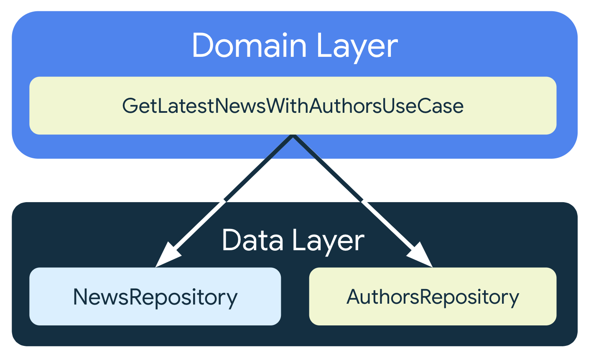
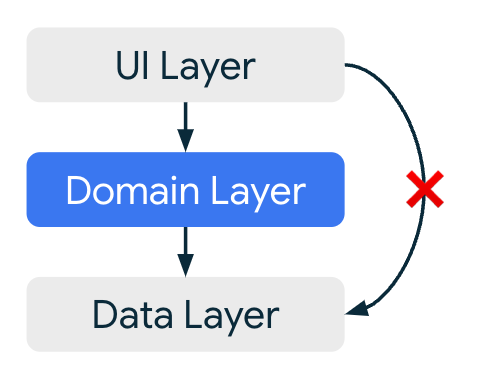

- [メインレイヤ](#メインレイヤ)
  - [依存関係](#依存関係)


# メインレイヤ

ドメインレイヤは、UI レイヤとデータレイヤの間に位置するオプションのレイヤです。


ドメインレイヤを使用する **目的** は以下の 3 つです。

- **複雑なビジネスロジックを ViewModel から切り離し、 ViewModel の肥大化を防ぐ**
- **複数の ViewModel で使用される処理を共通化する**
- **ViewModel から切り離すことでテストのしやすさを向上させる**

すべてのアプリにこのような要件があるわけではないため、このレイヤはオプションです。複雑さに対処する場合や再利用性を優先する場合など、必要な場合にのみ使用してください。

注: 「ドメインレイヤ」という用語は、「クリーン」なアーキテクチャなどの他のソフトウェア アーキテクチャで使用され、別の意味があります。 Android の公式アーキテクチャ ガイダンスで定義されている「ドメインレイヤ」の定義を、他の場所で読まれている他の定義と混同しないでください。微妙ながら重要な違いがある場合があります。

ドメインレイヤの利点は次のとおりです。

- コードの重複を回避できます。
- ドメインレイヤクラスを使用するクラスの読みやすさが向上します。
- アプリのテストのしやすさが向上します。
- 役割を分担することで、クラスが大規模になることを回避できます。

これらのクラスをシンプルかつ軽量に保つために、 **各ユースケースは 1 つの機能だけを担うべきであり、可変データを含むべきではありません (ステートレス) 。代わりに、可変データを UI レイヤまたはデータレイヤで処理する必要があります。**


## 依存関係

一般的なアプリ アーキテクチャでは、ユースケース クラスは UI レイヤの ViewModel とデータレイヤのリポジトリの間に位置します。つまり、ユースケース クラスは通常リポジトリ クラスに依存し、リポジトリと同じように、コールバック（Java の場合）またはコルーチン（Kotlin の場合）を使用して UI レイヤと通信します。詳しくは、データレイヤのページをご覧ください。

たとえば、ニュース リポジトリと著者リポジトリからデータを取得して組み合わせるユースケース クラスがアプリに用意されている場合があります。

```kotlin
class GetLatestNewsWithAuthorsUseCase(
    private val newsRepository: NewsRepository,
    private val authorsRepository: AuthorsRepository
) { /* ... */ }
```

ユースケースには再利用可能なロジックが含まれているため、他のユースケースでも利用できます。ドメインレイヤに複数のレベルのユースケースが存在することは普通です。たとえば、次の例で定義されているユースケースは、UI レイヤの複数のクラスが画面に適切なメッセージを表示するためにタイムゾーンに依存している場合、FormatDateUseCase のユースケースを利用できます。

```kotlin
class GetLatestNewsWithAuthorsUseCase(
    private val newsRepository: NewsRepository,
    private val authorsRepository: AuthorsRepository,
    private val formatDateUseCase: FormatDateUseCase
) { /* ... */ }
```


## Kotlin でユースケースを呼び出す

Kotlin では、operator 修飾子を使用して invoke() 関数を定義することで、ユースケース クラス インスタンスを関数として呼び出せるようにすることができます。次の例をご覧ください。

```kotlin
class FormatDateUseCase(userRepository: UserRepository) {

    private val formatter = SimpleDateFormat(
        userRepository.getPreferredDateFormat(),
        userRepository.getPreferredLocale()
    )

    operator fun invoke(date: Date): String {
        return formatter.format(date)
    }
}
```

この例では、FormatDateUseCase の invoke() メソッドにより、クラスのインスタンスを関数のように呼び出すことができます。invoke() メソッドは、特定のシグネチャに制限されることなく、任意の数のパラメータを取り、任意の型を返すことができます。クラスでさまざまなシグネチャを使用して invoke() をオーバーロードすることもできます。上の例からユースケースを呼び出すと次のようになります。

```kotlin
class MyViewModel(formatDateUseCase: FormatDateUseCase) : ViewModel() {
    init {
        val today = Calendar.getInstance()
        val todaysDate = formatDateUseCase(today)
        /* ... */
    }
}
```


## ライフサイクル

ユースケースに独自のライフサイクルはありません。代わりに、それを使用するクラスにスコープが設定されます。つまり、 UI レイヤのクラス、サービス、または Application クラス自体からユースケースを呼び出すことができます。 **ユースケースに可変データを含めることはできない(ステートレスである)** ため、依存関係として渡す際には、 **毎回ユースケースクラスの新しいインスタンスを作成する必要があります。**


## スレッド化

**ドメインレイヤのユースケースはメインセーフである必要があります。** つまり、メインスレッドから安全に呼び出せるようにする必要があります。長時間実行のブロッキングオペレーションを行うユースケースクラスは、そのロジックを適切なスレッドに移動する必要があります。ただしその前に、 **ブロッキング処理を他のレイヤに移動できないか検討してください。** 通常、再利用性やキャッシュ保存を促進するために、複雑な演算はデータレイヤで行われます。たとえば、大規模なリストでのリソースを大量に消費するオペレーションは、アプリの複数の画面で再利用するために結果をキャッシュに保存する必要がある場合、ドメインレイヤよりもデータレイヤに配置する方が適切です。

次の例は、バックグラウンドスレッドで処理を行うユースケースを示しています。

```kotlin
class MyUseCase(
    private val defaultDispatcher: CoroutineDispatcher = Dispatchers.Default
) {

    suspend operator fun invoke(...) = withContext(defaultDispatcher) {
        // 長時間実行ブロッキングオペレーションは、
        // バックグラウンドスレッドで実行します。
    }
}
```


## 一般的なタスク

このセクションでは、一般的なドメインレイヤのタスクを行う方法について説明します。


### 再利用可能でシンプルなビジネス ロジック

UI レイヤに存在する繰り返し可能なビジネス ロジックは、ユースケース クラスにカプセル化する必要があります。これにより、ロジックが使用されるあらゆる場所で変更を簡単に適用できます。また、ロジックを分離してテストすることもできます。

前述の FormatDateUseCase の場合、今後、日付形式に関するビジネス要件が変更された場合、 1 か所でコードを変更するだけで済みます。

注: 場合によっては、ユースケースに存在するロジックが、代わりに Util クラスの静的メソッドの一部になることもあります。しかし、Util クラスは探しにくく、機能も見つけにくいことが多いため、おすすめしません。


### リポジトリを組み合わせる

ニュースアプリには、ニュースと著者のデータ オペレーションを処理する NewsRepository クラスと AuthorsRepository クラスがあります。NewsRepository が公開する Article クラスには著者の名前しか含まれませんが、著者に関する詳細情報を画面に表示する必要があるとします。著者情報は AuthorsRepository から取得できます。



このロジックには複数のリポジトリが含まれており、複雑になる可能性があるため、GetLatestNewsWithAuthorsUseCase クラスを作成して、ViewModel からロジックを抽象化し、読みやすくします。また、ロジックを分離してテストしやすくなり、アプリのさまざまな部分で再利用できるようになります。

```kotlin
/**
 * このユースケースは最新の記事とそれに紐づく著者を取得します。
 */
class GetLatestNewsWithAuthorsUseCase(
    private val newsRepository: NewsRepository,
    private val authorsRepository: AuthorsRepository,
    private val defaultDispatcher: CoroutineDispatcher = Dispatchers.Default
) {
    suspend operator fun invoke(): List<ArticleWithAuthor> =
        withContext(defaultDispatcher) {
            val news = newsRepository.fetchLatestNews()
            val result: MutableList<ArticleWithAuthor> = mutableListOf()
            // この例では、著者情報の取得は並列化されておらず、
            // 記事ごとにリクエストされます。
            for (article in news) {
                // リポジトリは suspend 関数を公開しています。
                val author = authorsRepository.getAuthor(article.authorId)
                result.add(ArticleWithAuthor(article, author))
            }
            result
        }
}
```

このロジックでは、 news リスト内のすべてのアイテムがマッピングされます。したがって、データレイヤがメインセーフであっても、処理するアイテムの数は不明であるため、メインスレッドをブロックしてはなりません。そこで、このユースケースではデフォルトのディスパッチャを使用してバックグラウンドスレッドに処理を移動します。

注: Room ライブラリを使用すると、データベース内のさまざまなエンティティ間の関係をクエリできます。データベースが信頼できる情報源である場合、処理をすべて行うクエリを作成できます。その場合はユースケースではなく、 NewsWithAuthorsRepository のようなリポジトリ クラスを作成することをおすすめします。


## その他のコンシューマー（その他のユースケースの利用者）

UI レイヤとは別に、ドメインレイヤは、サービスや Application クラスなどの他のクラスで再利用できます。さらに、TV や Wear などの他のプラットフォームがコードベースをモバイルアプリと共有している場合は、それらの UI レイヤもユースケースを再利用して、前述のドメインレイヤのメリットをすべて享受できます。


## データレイヤのアクセス制限

ドメインレイヤを実装する際は、UI レイヤからデータレイヤへの直接アクセスを許可するか、すべてを強制的にドメインレイヤ経由にするかについても検討する必要があります。



この制限を行うメリットは、たとえば、ドメインレイヤで、データレイヤへの個々のアクセスリクエストを分析するためにロギングを実施している場合に、 UI がドメインレイヤロジックをバイパスするのを防止できることです。

ただし、 **潜在的な重大なデメリット** として、データレイヤへの単純な関数呼び出しだけであってもユースケースを追加しなければならないことがあります。つまり、わずかなメリットのために複雑性が増す可能性があります。

おすすめのアプローチは、必要なときにだけユースケースを追加することです。 UI レイヤがほぼ特定のユースケースに限ってデータにアクセスしていることを発見した場合は、その方法でのみデータにアクセスすることが合理的です。

最終的に、データレイヤへのアクセスを制限するかどうかの判断は、個別のコードベースに依存するとともに、厳格なルールと柔軟なアプローチのどちらを選ぶかに帰着します。

（で、結局どうやって制限するのか、実装方法がドキュメントに載っていない...）


## テスト

ドメインレイヤをテストする際は、 [一般的なテストガイダンス](https://developer.android.com/training/testing?hl=ja&_gl=1*1i0r3bl*_up*MQ..*_ga*NTc1MDc4MDM2LjE3MjA1MDM5NTc.*_ga_6HH9YJMN9M*MTcyMTExODU5OS41LjAuMTcyMTExODU5OS4wLjAuMA..) が適用されます。一般的に、他の UI テストではデベロッパーは偽のリポジトリを使用します。ドメインレイヤをテストするときも、偽のリポジトリを使用することが適切です。

