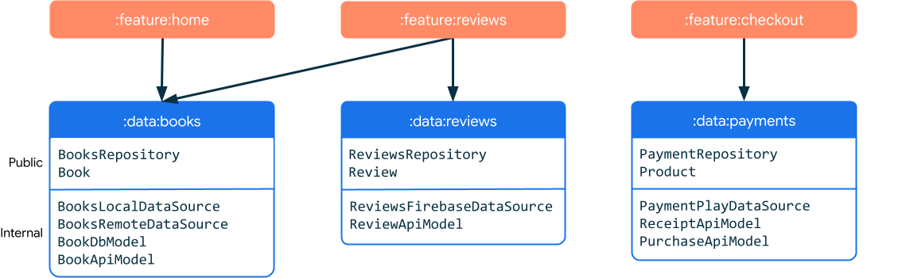
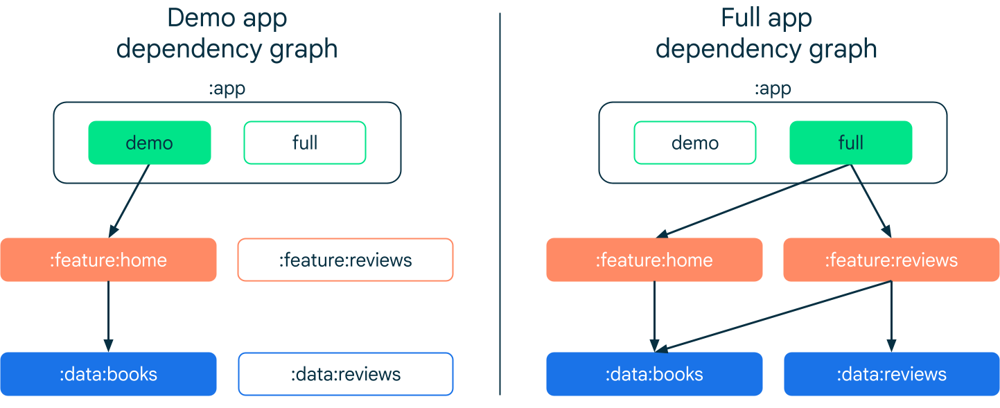
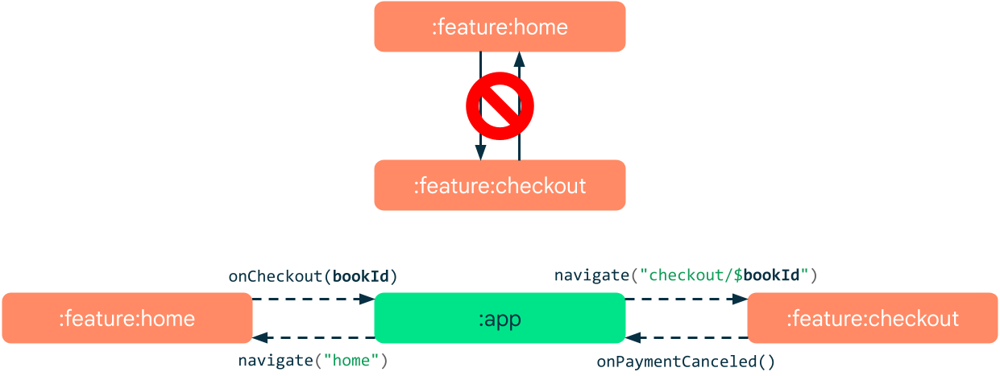
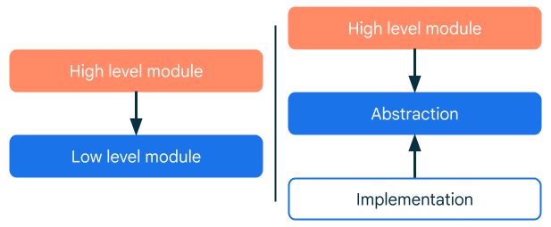
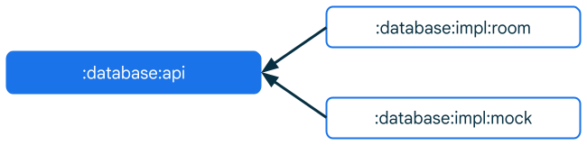
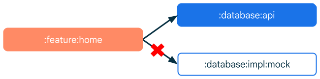
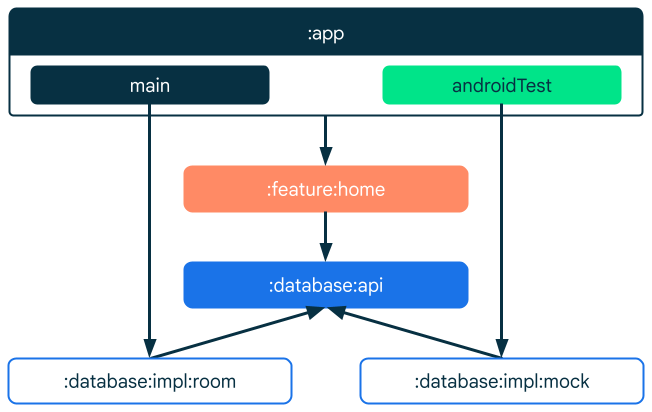

- [一般的なモジュール化パターン](#一般的なモジュール化パターン)
  - [このドキュメントで取り上げる例](#このドキュメントで取り上げる例)
  - [高凝集（ぎょうしゅう）度と低結合度の原則](#高凝集ぎょうしゅう度と低結合度の原則)
  - [モジュールの種類](#モジュールの種類)
    - [データ モジュール](#データ-モジュール)
    - [機能モジュール](#機能モジュール)
    - [アプリモジュール](#アプリモジュール)
    - [共通モジュール](#共通モジュール)
    - [テスト モジュール](#テスト-モジュール)
      - [テスト モジュールのユースケース](#テスト-モジュールのユースケース)
  - [モジュール間の通信](#モジュール間の通信)
  - [依存関係の逆転](#依存関係の逆転)
    - [例](#例)
    - [依存関係インジェクション](#依存関係インジェクション)
    - [メリット](#メリット)
    - [分離すべき時点](#分離すべき時点)
    - [導入方法](#導入方法)
  - [一般的なベストプラクティス](#一般的なベストプラクティス)
    - [設定の一貫性を維持する](#設定の一貫性を維持する)
    - [公開範囲を可能な限り限定する](#公開範囲を可能な限り限定する)
    - [Kotlin モジュールと Java モジュールを優先する](#kotlin-モジュールと-java-モジュールを優先する)
  - [引用元資料](#引用元資料)


# 一般的なモジュール化パターン

すべてのプロジェクトに適合する単独のモジュール化戦略はありません。Gradle は柔軟性が高いため、プロジェクトをまとめる方法について制約はほとんどありません。このページでは、マルチモジュール Android アプリを開発する際に使用できる一般的なルールとパターンの概要について説明します。

注: このページで紹介している推奨事項とベスト プラクティスは、さまざまなアプリに適用できます。それにより、アプリのスケーリングを可能にし、品質と堅牢性を高め、テストを容易にすることができます。ただし、これらはガイドラインとみなし、必要に応じて各自の条件に適応させる必要があります。


## このドキュメントで取り上げる例

このドキュメントで取り上げる例は、電子書籍アプリのようです。モジュール名に checkout というものがありますが、これは購入機能のモジュールだと思われます。


## 高凝集（ぎょうしゅう）度と低結合度の原則

モジュラーコードベースの特徴として、結合度と凝集度のプロパティの使用があげられます。 **結合度** は、 「モジュールが相互に依存している度合い」 を示します。 **凝集度** は、この文脈では、 「 1 つのモジュールの要素が機能面でどのように関連しているか」 を示します。原則として、 **結合度は低く、凝集度は高く** なるようにしてください。

- **結合度が低い** とは、モジュール間の依存度を可能な限り低くすることを指します。これにより、1 つのモジュールに対する変更が他のモジュールに及ぼす影響をゼロまたは最小限にできます。 **モジュールが他のモジュールの内部動作を認識しないようにする必要があります。**
- **凝集度が高い** とは、モジュールを構成するコードの集合が 1 つのシステムとして機能することを指します。モジュールには明確に定義された役割が必要で、また特定のドメイン知識の範囲内にある必要があります。電子書籍アプリケーションについて考えてみましょう。書籍関連のコードと支払い関連のコードは異なる 2 つの機能ドメインなので、同じモジュール内で併用するのは不適切な場合があります。

ヒント: 2 つのモジュールが互いの知識に大きく依存している場合は、それらが 1 つのシステムとして機能することが必要となる可能性が高くなります。逆に、モジュールの 2 つの部分の相互インタラクションがほとんどない場合は、分離したモジュールであると考えられます。


## モジュールの種類

モジュールを整理する方法は、主にアプリのアーキテクチャによって決まります。推奨されるアプリ アーキテクチャに沿ってアプリに導入できる一般的なモジュールには、次の種類があります。


### データ モジュール

データモジュールには通常、次のオブジェクトが含まれています。

- リポジトリ
- データソース
- モデルクラス

データモジュールの主な役割は次の 3 つです。

1. **特定のドメインのすべてのデータとビジネスロジックをカプセル化する**
   - 各データモジュールは、特定のドメインを表すデータの処理を行います。関連しているものであれば、数多くの種類のデータを処理できます。
2. **リポジトリを外部 API として公開する**
   - データモジュールの公開 API はアプリの他の部分にデータを公開する役割を担うため、リポジトリでなければなりません。
3. **すべての実装の詳細とデータソースを外部から認識できないようにする**
   - データソースには、同じモジュールのリポジトリしかアクセスできないようにする必要があります。外部からは認識できなくなります。これを実現するには、Kotlin の公開設定キーワード private または internal を使用します。



上記の図は、青色の枠一つが一つのデータモジュールを表します。

### 機能モジュール

機能モジュールとは、アプリの機能の独立した部分のことで、通常は 1 つの画面、または、一連の密接に関連する画面群 (例えば、登録フローの 3 画面で一つのモジュールとします) を示します。アプリにボトムバー ナビゲーションがある場合、それぞれのリンク先は機能モジュールであることが多いです。


重要な用語:「機能モジュール」とは、Play Feature Delivery でも使用される用語で、条件付きで配信可能なモジュールか、オンデマンドでダウンロード可能なモジュールを指します。そのため、ここでの 「機能モジュール」 とは意味が異なります。

機能はアプリの画面やリンク先に関連付けられます。そのため、通常、 UI と ViewModel を含みます。**機能モジュールはデータモジュールに依存します。**


上記の図は、オレンジ色の枠一つが一つの機能モジュールを表します。


### アプリモジュール

アプリモジュールは、アプリケーションのエントリポイントです。

これらは機能モジュールに依存します。

通常は依存関係ツリーのルートになります。

ビルドバリアントにより、 1 つのアプリモジュールをさまざまなバイナリにコンパイルできます。



アプリが複数のデバイスタイプ (自動車、スマートウォッチ、テレビなど) をターゲットとする場合は、それぞれについてアプリモジュールを定義します。これにより、プラットフォーム固有の依存関係を分離できます。


### 共通モジュール

共通モジュール（コアモジュールとも呼ばれます）には、他のモジュールが頻繁に使用するコードが含まれています。 **共通化** することにより冗長性が低くなります。また、これらのモジュールがアプリのアーキテクチャの **特定のレイヤを表すことはありません。** 共通モジュールの例を以下に示します。

- **UI モジュール**
  - アプリ内でカスタム UI 要素や精密なブランディングを使用する場合は、ウィジェット コレクションをカプセル化して、すべての機能を再利用できるようにモジュール化することを検討してください。これにより、複数の機能間で UI の一貫性を保つことができます。たとえば、テーマが一元管理されている場合、リブランディング時に手間のかかるリファクタリングを回避できます。
- **アナリティクスモジュール**
  - トラッキングは、アプリの機能自体に関連することがないため、モジュールとして切り離しやすいです。
  - 多くの場合、アナリティクストラッカーが使用されます。そのような場合は、専用のアナリティクスモジュールを用意することをおすすめします。
- **ネットワークモジュール**
  - 多くのモジュールでネットワーク接続を必要とする場合は、 HTTP クライアントの提供に特化したモジュールの用意を検討してください。これは、クライアントがカスタム設定を必要とする場合に特に便利です。
- **ユーティリティモジュール**
  - ユーティリティ（ヘルパーとも呼ばれます）は通常、アプリ全体で再利用される小規模のコードです。ユーティリティの例としては、テストヘルパー、通貨フォーマット関数、メール検証ツール、カスタム演算子などがあります。


### テスト モジュール

テストモジュールはテスト専用の Android モジュールです。このモジュールには、テストの実行にのみ必要で、アプリの実行時には不要なテストコード、テストリソース、テスト依存関係が含まれます。テストモジュールはテスト固有のコードをメインアプリと分離するために作られており、モジュールコードの管理と保守が容易になります。


#### テスト モジュールのユースケース

次の例は、テストモジュールの実装が特に役に立つケースを表しています。

- **共有テストコード**
  - プロジェクトに複数のモジュールがあり、一部のテストコードが複数のモジュールに適用される場合は、テストモジュールを作成してコードを共有できます。これにより、重複が排除され、テストコードを保守しやすくなります。共有テストコードには、カスタムアサーションやマッチャーなどのユーティリティクラスや関数に加え、シミュレートされた JSON レスポンスなどのテストデータを含められます。
- **すっきりとしたビルド構成**
  - テストモジュールによってテスト用の build.gradle ファイルを保持でき、すっきりとしたビルド構成にできます。テストにのみ関連する構成のせいでアプリモジュールの build.gradle ファイルが雑然となることを防げます。
- **統合テスト**
  - テストモジュールでは、ユーザーインターフェース、ビジネスロジック、ネットワークリクエスト、データベースクエリなど、アプリのさまざまな部分のインタラクションをテストする統合テストを保存できます。
- **大規模アプリ**
  - テストモジュールは複雑なコードベースと複数のモジュールを持つ大規模アプリで特に役に立ちます。このようなケースでは、テストモジュールによってコードを整理でき、保守性が改善します。

テストモジュールを使用すると依存するモジュールを分離することが可能です。


## モジュール間の通信

モジュールが完全に分離されていることはまれで、多くの場合、他のモジュールに依存し、他のモジュールと通信しています。モジュールが連携して頻繁に情報を交換する場合でも、結合度を低く抑えることが重要です。2 つのモジュール間の直接通信は、アーキテクチャの制約の場合のように、望ましくない場合があります。この問題を解決するには、3 つ目のモジュールで他の 2 つのモジュールをメディエーションします。



メディエータモジュールは、両方のモジュールからのメッセージをリッスンし、必要に応じて転送できます。このサンプルアプリでは、購入手続き画面で購入対象の書籍を認識する必要があります。この場合、メディエータは、ナビゲーショングラフを所有するモジュール (通常はアプリモジュール) です。この例では、 Navigation コンポーネントを使用して、以下のように、ホーム機能から決済機能にデータを渡します。

```kotlin
navController.navigate("checkout/$bookId")
```

決済機能では、書籍 ID を引数として受け取り、これを使用して書籍に関する情報を取得します。 ViewModel 内のナビゲーション引数を取得するには、保存済み状態ハンドルを使用します。

```kotlin
class CheckoutViewModel(savedStateHandle: SavedStateHandle, …) : ViewModel() {

    val uiState: StateFlow<CheckoutUiState> =
        savedStateHandle.getStateFlow<String>("bookId", "").map { bookId ->
            // bookRepository.getBook(bookId) を呼び出して、
            // UI 状態を取得します。
        }
}
```

ナビゲーション引数としてオブジェクトを渡さないようにしてください。代わりに、データレイヤーから目的のリソースにアクセスして読み込むために機能で使用されるシンプルな ID を使用します。これにより、結合度を低く抑えることができ、「信頼できる唯一の情報源」の原則を遵守できます。

以下の例では、両方の機能モジュールが同じデータモジュールに依存しています。これにより、メディエータモジュールが **転送する必要があるデータ量を最小限に抑え (※ 1 )** 、モジュール間の結合度を低く抑えることができます。モジュールはオブジェクトを渡す代わりに、 ID を交換し、データモジュールからリソースを読み込みます。

(※ 1 ) 単方向のデータフローの実装だけで済むため、実装がシンプルになります。


## 依存関係の逆転

依存関係の逆転とは、抽象化でカプセルかすることで、具体的な実装への依存をなくすことです。 **インターフェースを一枚挟んで、具体的なクラスへの依存をなくすイメージ** です。

- **抽象化**
  - アプリ内のコンポーネントまたはモジュールが相互にやり取りする方法を定義するコントラクト。抽象化モジュールには、 API が定義され、インターフェースとモデルが含まれています。
- **具体的な実装**
  - 抽象化モジュールに依存し、動作の詳細を実装するモジュール。



上位レベルのモジュールが下位レベルのモジュールに直接依存するのではなく、上位モジュールと実装モジュールが抽象化モジュールに依存します。


### 例

データベースが必要となる機能モジュールがあるとします。機能モジュールは、データベースの実装方法（ローカル Room データベースやリモート Firestore インスタンスなど）には関係ありません。必要なのは、アプリケーション データの保存と読み取りのみです。

これを実現するために、機能モジュールは特定のデータベース実装ではなく、抽象化モジュールに依存します。この抽象化によってアプリのデータベース API が定義されます。つまり、データベースの操作方法に関するルールが設定されます。これにより、機能モジュールは基盤となる実装の詳細を把握していなくても、任意のデータベースを使用できます。

具体的な実装モジュールは、抽象化モジュールで定義された API の実際の実装を提供します。そのため、この実装モジュールは抽象化モジュールに依存します。


### 依存関係インジェクション

ここまでの説明について、機能モジュールと実装モジュールがどのように連携するのか疑問に思う人もいるでしょう。その答えは、依存関係インジェクションです。機能モジュールは、必要なデータベース インスタンスを直接作成せず、必要な依存関係を指定します。これらの依存関係は外部（通常はアプリ モジュール）から提供されます。

```kotlin
// release ビルドでは、 firestore へ接続
releaseImplementation(project(":database:impl:firestore"))

// debug ビルドでは、 room へ接続
debugImplementation(project(":database:impl:room"))

// インストルメンテーションテストでは、 mock へ接続
androidTestImplementation(project(":database:impl:mock"))
```

インストルメンテーションテストとは、 UI の自動化テストのことで、ボタンをタップしたときのテストなどを自動化できます。


### メリット

API とその実装を分離すると、次のようなメリットがあります。

- **状況に応じて実装を容易に切り替え・機能の分離**
  - API モジュールと実装モジュールを明確に分離することにより、API を使用するコードを変更することなく、同じ API に複数の実装を開発して切り替えることができます。これは、状況によって異なる機能や動作が必要なシナリオで特に役立ちます。たとえば、テスト用のモック実装と本番環境用の実際の実装を比較できます。
  - 上位モジュールが特定のテクノロジーに依存しなくなります。後でデータベースを Room から Firestore に変更する場合、変更はジョブを行う特定のモジュール（実装モジュール）でのみ行われ、データベースの API を使用する他のモジュールには影響しないため、変更は簡単にできます。
- **テストの容易性**
  - API を実装から分離することで、テストが大幅に簡単になります。API コントラクトに対してテストケースを作成できます。また、さまざまな実装を使用して、モック実装などのさまざまなシナリオやエッジケースをテストできます。
- **ビルドのパフォーマンスの改善**
  - API とその実装を別々のモジュールに分割する場合、実装モジュールを変更しても、ビルドシステムは API モジュールに応じてモジュールを再コンパイルする必要がありません。これにより、ビルド時間が短縮され、生産性が向上します。特にビルド時間が長くなりうる大規模なプロジェクトでこの傾向は顕著です。


### 分離すべき時点

次の場合は、API の実装から API を分離することをおすすめします。要約すると、モジュールが 1 対 1 で結合しておらず、 1 対多や、多対多の場合は分離すると良いという意味かと思います。

- **多様な機能**
  - アプリの一部を複数の方法で実装できる場合は、明確な API を使用することで、さまざまな実装の互換性を維持できます。 Google Play または自社の課金 API と連携できる課金システムを使用できます。
- **複数のアプリケーション**
  - プラットフォーム間で共有される機能を備えた複数のアプリを開発する場合は、共通の API を定義し、プラットフォームごとに特定の実装を開発できます。
- **独立したチーム**
  - 分離により、異なるデベロッパーやチームがコードベースの異なる部分について同時に作業できます。デベロッパーは API コントラクトを理解し、正しく使用する必要がありますが、他のモジュールの実装の詳細を気にする必要はありません。
- **大規模なコードベース**
  - コードベースが大規模な場合や複雑な場合、API を実装から分離することで、コードの管理が容易になります。そうすることで、コードベースをより細かく、理解しやすく、メンテナンスしやすい単位に分けることができます。


### 導入方法

依存関係の逆転を実装する手順は次のとおりです。

1. **抽象化モジュールを作成する** : このモジュールには、機能の動作を定義する API（インターフェースとモデル）が含まれている必要があります。
2. **実装モジュールを作成する** : 実装モジュールは API モジュールに依存し、抽象化の動作を実装する必要があります。



3. **上位モジュールを抽象化モジュールに依存させる** : モジュールを特定の実装に直接依存させるのではなく、抽象化モジュールに依存させます。上位モジュールは実装の詳細を知っている必要はなく、コントラクト ( API ) のみが必要です。



4. **実装モジュールを提供する** : 最後に、依存関係の実際の実装を指定する必要があります。具体的な実装はプロジェクトの設定によって異なりますが、通常はアプリモジュールを使用することをおすすめします。実装を提供するには、 [選択したビルドバリアントまたはテストソースセットへの依存関係](https://developer.android.com/build/build-variants?hl=ja&_gl=1*1abpde4*_up*MQ..*_ga*MTE1ODIzNDI5Ny4xNzIxNzE2Njk2*_ga_6HH9YJMN9M*MTcyMTcxNjY5NS4xLjAuMTcyMTcxNjY5NS4wLjAuMA..#dependencies) として指定します。



特定のビルドバリアントまたはテストソースセットの依存関係を構成するには、次の例に示すように、ビルドバリアントまたはテストソースセットの名前を Implementation キーワードの前に付けます。

```kotlin
dependencies {
    // ローカルの "mylibrary" モジュールを "free" フレーバーの依存関係に追加します。
    "freeImplementation"(project(":mylibrary"))

    // ローカステストの場合のみ、リモートバイナリ依存関係を追加します。
    testImplementation("junit:junit:4.12")

    // インストルメンテーションテスト APK の場合のみ、りもーどバイナリ依存関係を追加します。
    androidTestImplementation("com.android.support.test.espresso:espresso-core:3.5.1")
}
```


## 一般的なベストプラクティス

冒頭で述べたように、マルチモジュールアプリを開発する方法として唯一の正解はありません。それでも、以下の推奨事項に従うことで、コードの可読性、保守性、テストの容易性が向上します。


### 設定の一貫性を維持する

どのモジュールでも、設定オーバーヘッドが発生します。モジュール数が一定のしきい値に達すると、一貫した設定の管理が難しくなります。たとえば、各モジュールで同じバージョンの依存関係を使用することが重要です。依存関係のバージョンを上げるためだけに多数のモジュールを更新する必要がある場合、作業量が増えるだけでなく、間違いが生じる可能性も高くなります。この問題を解決するには、Gradle のいずれかのツールを使用して設定を一元化します。

- [バージョンカタログ](https://docs.gradle.org/current/userguide/platforms.html) : 同期中に Gradle によって生成される依存関係の型安全なリストです。これは、すべての依存関係を 1 か所で宣言できるようにするための場所で、プロジェクト内のすべてのモジュールが使用できます。
- [コンベンションプラグイン](https://docs.gradle.org/current/samples/sample_convention_plugins.html) : モジュール間でビルドロジックを共有します。


### 公開範囲を可能な限り限定する

モジュールの公開インターフェースは最小限にとどめ、必要なものしか公開しないようにする必要があります。実装の詳細が外部に漏洩しないようにしなければなりません。すべての内容について、可能な限り範囲を限定します。Kotlin の公開設定スコープ private または internal を使用して、宣言をモジュール プライベートにします。モジュールで依存関係を宣言する場合は、api よりも implementation を優先して使用してください。前者の場合、モジュールを使用する側に対して、依存関係の推移が公開されます。implementation を使用すると、再ビルドが必要なモジュールの数が少なくなるため、ビルド時間が短縮されます。


### Kotlin モジュールと Java モジュールを優先する

Android Studio がサポートするモジュールには、次の 3 つのタイプがあります。

- **アプリモジュール**
  - ユーザーが直接インストールして使用するアプリケーションを含むモジュール。
  - アプリのエントリーポイントである MainActivity などが含まれる。
  - APK ファイルとしてパッケージングされる。
- **ライブラリモジュール**
  - 再利用可能なコードやリソースを含むモジュール。
  - アプリモジュールや他のライブラリモジュールで利用可能。
  - 直接実行可能なアプリではなく、他のモジュールで使用されることを目的としている。
  - AAR (Android Archive)ファイルとしてパッケージングされる。
- **Kotlin / Java モジュール**
  - Kotlin や Java で書かれたコードを含むモジュール。
  - Android 固有のコンポーネントを含まない。
  - JAR ファイルとしてパッケージングされる。

表にまとめると、以下のようになります。

| 項目                                                    | アプリモジュール | ライブラリモジュール   | Kotlin / Java モジュール |
| ------------------------------------------------------- | ---------------- | ---------------------- | ------------------------ |
| パッケージング形式                                      | APK or AAB       | AAR ( Android Archive) | JAR                      |
| 直接インストール                                        | ○                | ×                      | ×                        |
| Android 特有のコンポーネント (※ 1 ) を含むことができるか| ○                | ○                      | ×                        |

(※ 1 ) リソース、アセット、マニフェストファイルのこと


公式ドキュメントで 「 Android モジュール」 という言葉が使われている場合、それは通常アプリモジュールまたはライブラリモジュールを指しています。つまり、 Android 固有の機能を持ち、 Android のアプリケーションやライブラリを作成するためのモジュールです。

Android モジュールにはオーバーヘッドが伴うため、できるだけ Kotlin / Java モジュールを使用することをおすすめします。


## 引用元資料

- [一般的なモジュール化パターン](https://developer.android.com/topic/modularization/patterns?hl=ja)


