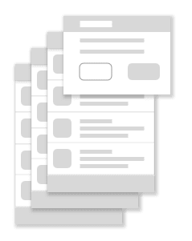
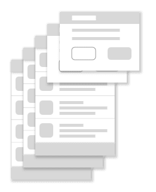
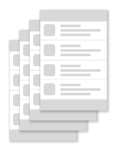

- [ダイアログのデスティネーション](#ダイアログのデスティネーション)
  - [概要](#概要)
  - [例](#例)
  - [引用元資料](#引用元資料)

# ダイアログのデスティネーション

このドキュメントでは、 [ダイアログデスティネーション](../3.ナビゲーショングラフを設計する/1.概要.md/#ダイアログのデスティネーション) 使用時の、バックスタックの管理方法に関する独自の考慮事項について概説します。

## 概要

1 つ以上のダイアログ デスティネーションは、バックスタックの一番上だけに配置できます。これは、ユーザーがダイアログ デスティネーション以外のデスティネーションに移動すると、NavController により、すべてのダイアログ デスティネーションがスタックの一番上から自動的にポップされるためです。これにより、現在のデスティネーションが、常にバックスタック上の他のデスティネーションの上に完全に表示されるようになります。

デスティネーションには、 [ホストされているデスティネーション](../3.ナビゲーショングラフを設計する/1.概要.md/#ホストされているデスティネーション) 、 [アクティビティのデスティネーション](../3.ナビゲーショングラフを設計する/1.概要.md/#アクティビティのデスティネーション) 、 [ダイアログのデスティネーション](../3.ナビゲーショングラフを設計する/1.概要.md/#ダイアログのデスティネーション) のいずれかを指定できます。

注: ダイアログのデスティネーションは、FloatingWindow インターフェースを実装します。そのため、ダイアログのデスティネーションは、バックスタック上に存在する他のデスティネーションの上に描画されます。

## 例

バックスタックが、ナビゲーション ホストを満たすホストされたデスティネーションのみで構成されており、ユーザーがダイアログ デスティネーションに移動した場合、バックスタックは次の図のようになります。

さらに、ユーザーが別のダイアログデスティネーションに移動すると、次の図に示すように、バックスタックの一番上に追加されます。

さらに、ユーザーが非フローティングデスティネーションに移動すると、ダイアログデスティネーションは、新しいデスティネーションに移動する前に、まず、バックスタックの一番上からポップされます。

## 引用元資料

- [ダイアログのデスティネーション](https://developer.android.com/guide/navigation/backstack/dialog?hl=ja)

