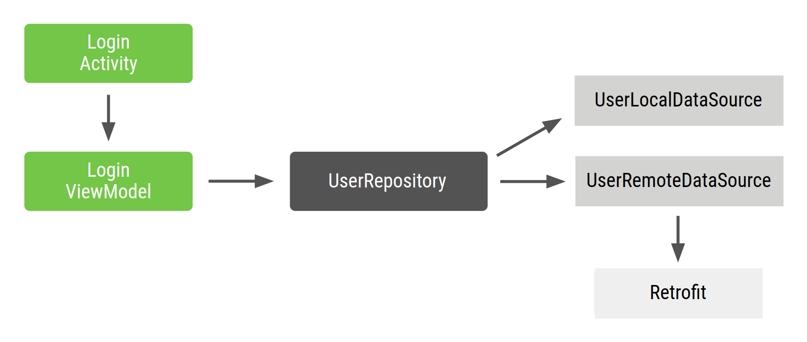

- [手動による依存関係挿入](#手動による依存関係挿入)
  - [手動依存関係挿入の基本](#手動依存関係挿入の基本)
  - [コンテナを使用した依存関係の管理](#コンテナを使用した依存関係の管理)
  - [アプリフローでの依存関係の管理](#アプリフローでの依存関係の管理)
  - [おわりに](#おわりに)


# 手動による依存関係挿入

Android アプリの推奨アーキテクチャでは、コードをクラスに分割して、関心の分離を活用することを推奨しています。関心の分離とは、階層の各クラスが定義された単一の責任を持つという原則です。 これにより、より多くの小さなクラスが互いに接続して互いの依存関係を満たす必要が生じます。


クラス間の依存関係はグラフで表すことができ、各クラスは依存するクラスに接続されます。すべてのクラスとその依存関係をあらわすことでアプリグラフが構成されます。上の図に、アプリグラフの概要を示します。 クラス A ( ViewModel ) がクラス B ( Repository ) に依存している場合、 A から B への線はその依存関係を表しています。

依存関係挿入により、これらの接続を確立し、テストのために実装を入れ替えることが可能になります。たとえば、リポジトリに依存する ViewModel をテストする場合、 Repository の異なる実装をフェイクやモックで渡して、それぞれのケースをテストできます。


## 手動依存関係挿入の基本

このセクションでは、実際の Android アプリのシナリオで手動依存関係挿入を適用する方法について説明します。ここでは、アプリで依存関係挿入を開始する反復的アプローチを説明します。このアプローチは、 Dagger が自動的に生成するものと非常によく似たポイントに達するまで改善されていきます。 Dagger の詳細については、 [Dagger の基本](https://developer.android.com/training/dependency-injection/dagger-basics?hl=ja&_gl=1*1jp2qm9*_up*MQ..*_ga*NTc1MDc4MDM2LjE3MjA1MDM5NTc.*_ga_6HH9YJMN9M*MTcyMTI1NjgwNS43LjAuMTcyMTI1NjgwNS4wLjAuMA..) をご覧ください。

以後の説明で登場する 「フロー」 は、アプリ内の画面ごとのグループ (機能) と考えてください。例えば、ログインフロー、登録フロー、決済フローなどがあります。

一般的な Android アプリのログインフローをカバーする場合、LoginActivity は LoginViewModel に依存し、さらに UserRepository に依存します。 この場合、UserRepository は UserLocalDataSource と UserRemoteDataSource に依存し、さらに、これらは Retrofit サービスに依存します。



LoginActivity はログインフローへのエントリポイントであり、 LoginActivity は LoginViewModel を作成する必要があります。

Repository と DataSource のクラスは次のようになります。

```kotlin
class UserRepository(
    private val localDataSource: UserLocalDataSource,
    private val remoteDataSource: UserRemoteDataSource
) { ... }

class UserLocalDataSource { ... }
class UserRemoteDataSource(
    private val loginService: LoginRetrofitService
) { ... }
```

Activity は次のように表示されます。

```kotlin
class LoginActivity: Activity() {

    private lateinit var loginViewModel: LoginViewModel

    override fun onCreate(savedInstanceState: Bundle?) {
        super.onCreate(savedInstanceState)

        val retrofit = Retrofit.Builder()
            .baseUrl("https://example.com")
            .build()
            .create(LoginService::class.java)

        val remoteDataSource = UserRemoteDataSource(retrofit)
        val localDataSource = UserLocalDataSource()

        val userRepository = UserRepository(localDataSource, remoteDataSource)

        loginViewModel = LoginViewModel(userRepository)
    }
}
```

この方法には次のような問題があります。

1. ボイラープレートコードが多い。コードの別の部分で LoginViewModel の別のインスタンスを作成する場合は、コードが重複してしまいます。

2. 依存関係は順番に宣言する必要があります。作成するには、 LoginViewModel の前に UserRepository をインスタンス化する必要があります。

3. オブジェクトを再利用するのは困難です。複数の機能で UserRepository を再利用する場合は、シングルトンパターンに従う必要があります。すべてのテストが同じシングルトンインスタンスを共有するため、各コンシューマーで異なるインスタンスを使用することができず、テストはより困難になります。


## コンテナを使用した依存関係の管理

オブジェクトの再利用に関する問題を解決するには、依存関係の取得に使用する独自の依存関係コンテナクラスを作成します。このコンテナで提供されるすべてのインスタンスを公開できます。この例では、UserRepository のインスタンスのみが必要と一旦仮定し、依存関係を非公開にしておきます。その後必要になった場合には、一般公開することができます。 ViewModel は後ほど Activity 内で生成するため、 AppContainer では生成していません。

```kotlin
// アプリ全体で共有されるオブジェクトのコンテナ
class AppContainer {

    private val retrofit = Retrofit.Builder()
                            .baseUrl("https://example.com")
                            .build()
                            .create(LoginService::class.java)

    private val remoteDataSource = UserRemoteDataSource(retrofit)
    private val localDataSource = UserLocalDataSource()

    val userRepository = UserRepository(localDataSource, remoteDataSource)
}
```

これらの依存関係はアプリ全体で使用されるため、すべてのアクティビティが使用できる共通の場所、つまり Application クラスに配置する必要があります。AppContainer インスタンスを含むカスタム Application クラスを作成します。

```kotlin
// カスタムアプリケーションクラスは、 AndroidManifest.xml
// ファイル内で定義することを忘れないでください。
class MyApplication : Application() {

    // Instance of AppContainer that will be used by all the Activities of the app
    val appContainer = AppContainer()
}
```

注: AppContainer は通常のクラスであり、Application クラス内のアプリ間で一意のインスタンスを共有します。ただし、 AppContainer はシングルトンパターンでは実装しません。 Kotlin では object ではなく、Java では一般的な Singleton.getInstance() メソッドでアクセスすることはできません。 (なぜシングルトンパターンで実装しないのか理由は不明)

これで、アプリから AppContainer のインスタンスを取得し、UserRepository インスタンスの共有を取得できます。

```kotlin
class LoginActivity: Activity() {

    private lateinit var loginViewModel: LoginViewModel

    override fun onCreate(savedInstanceState: Bundle?) {
        super.onCreate(savedInstanceState)

        val appContainer = (application as MyApplication).appContainer
        loginViewModel = LoginViewModel(appContainer.userRepository)
    }
}
```

シングルトン実装 ( object 宣言) の UserRepository は存在しません。代わりに、 UserRepository オブジェクトを含むすべてのアクティビティで AppContainer を共有し、 UserRepository のインスタンスを返します。

LoginViewModel がアプリ内のより多くの場所で必要な場合は、 LoginViewModel のインスタンスを作成する一元化された場所が必要です。 LoginViewModel の作成をコンテナに移動します。

```kotlin
// T 型のオブジェクトを生成する関数を持ったファクトリーインターフェース
interface Factory<T> {
    fun create(): T
}

// LoginViewModel 用のファクトリークラス
// LoginViewModel は UserRepository に依存しているため、
// LoginViewModel のインスタンスを生成するには、
// UserRepository のインスタンスを引数に渡す必要があります。
class LoginViewModelFactory(private val userRepository: UserRepository) : Factory
```

アクティビティから、ファクトリー関数を使用します。

```kotlin
// AppContainer は LoginViewModelFactory を通じて
// LoginViewModel のインスタンスを提供します。
class AppContainer {
    
    val userRepository = UserRepository(localDataSource, remoteDataSource)

    val loginViewModelFactory = LoginViewModelFactory(userRepository)
}

class LoginActivity: Activity() {

    private lateinit var loginViewModel: LoginViewModel

    override fun onCreate(savedInstanceState: Bundle?) {
        super.onCreate(savedInstanceState)

        val appContainer = (application as MyApplication).appContainer
        loginViewModel = appContainer.loginViewModelFactory.create()
    }
}
```

この方法は前の方法よりも優れていますが、次の点も考慮してください。

1. AppContainer を自分で管理し、すべての依存関係のインスタンスを手動で作成する必要があります。

2. 他にも多くのボイラープレート コードがあります。オブジェクトを再利用するかどうかに応じて、ファクトリやパラメータを手動で作成する必要があります。


## アプリフローでの依存関係の管理

AppContainer は、プロジェクトに機能を追加しようとすると複雑になります。アプリの規模が大きくなり、さまざまな機能フローを導入するようになると、さらに多くの問題が発生します。

1. 異なるフローがある場合は、オブジェクトをそのフローの範囲内で動作させることができます。たとえば、LoginUserData（ログインフローでのみ使用されるユーザー名とパスワード）を作成する場合、 **別のユーザーの古いログインフローのデータは保持しないことも可能です。** 新しいフローごとに新しいインスタンスが必要です。次のコード例で示すように、AppContainer 内に FlowContainer オブジェクトを作成することで、これを実現できます。

2. アプリグラフとフローコンテナの最適化も難しい場合があります。 **現在のフローに応じて、不要なインスタンスを削除する必要があります。**

1 つのアクティビティ（LoginActivity）と複数のフラグメント（LoginUsernameFragment と LoginPasswordFragment）で構成されるログインフローがあるとします。これらのビューでは、次のことができます。

1. ログインフローが終了するまで、共有する必要がある同じ LoginUserData インスタンスにアクセスします。

2. フローが再開されると、LoginUserData の新しいインスタンスを作成します。

これを行うには、ログインフローコンテナを使用します。 **このコンテナは、ログインフローの開始時に作成し、フローの終了時にメモリから削除する必要があります。**

ログインコンテナを追加します。

```kotlin
class LoginContainer(val userRepository: UserRepository) {

    val loginData = LoginUserData()

    val loginViewModelFactory = LoginViewModelFactory(userRepository)
}

class AppContainer {
    
    val userRepository = UserRepository(localDataSource, remoteDataSource)

    // AppContainer 内に LoginContainer を保持します。
    // ユーザーがログインフローにいない場合は null を設定します。
    var loginContainer: LoginContainer? = null
}
```

Activity のライフサイクルに連動して、 LoginContainer を生成したり削除したりします。実装では、あくまでもコンテナインスタンスを直接生成するのであって、 **実際に使用したいインスタンスを直接生成しないところもポイントです。**

```kotlin
class LoginActivity: Activity() {

    private lateinit var loginViewModel: LoginViewModel
    private lateinit var loginData: LoginUserData
    private lateinit var appContainer: AppContainer


    override fun onCreate(savedInstanceState: Bundle?) {
        super.onCreate(savedInstanceState)
        appContainer = (application as MyApplication).appContainer

        // ログインフローが開始されたので、
        // LoginContainer のインスタンスを生成します。
        appContainer.loginContainer = LoginContainer(appContainer.userRepository)

        loginViewModel = appContainer.loginContainer.loginViewModelFactory.create()
        loginData = appContainer.loginContainer.loginData
    }

    override fun onDestroy() {
        // ログインフローが終了したら LoginContainer をクリアします。
        appContainer.loginContainer = null
        super.onDestroy()
    }
}
```

LoginActivity と同様に、ログイン フラグメントは AppContainer から LoginContainer にアクセスし、共有の LoginUserData インスタンスを使用できます。

この場合はビューのライフサイクル ロジックを扱うため、 [ライフサイクルの観察](https://developer.android.com/topic/libraries/architecture/lifecycle?hl=ja&_gl=1*w2ag1l*_up*MQ..*_ga*NTc1MDc4MDM2LjE3MjA1MDM5NTc.*_ga_6HH9YJMN9M*MTcyMTI1NjgwNS43LjAuMTcyMTI1NjgwNS4wLjAuMA..) を使用するのが理にかなっています。

注: コンテナの設定変更に対応する必要がある場合は、UI の状態の保存ガイドに従います。プロセスの終了の場合と同じように処理する必要があります。そうしないと、メモリが少ないデバイスではアプリの状態が失われる可能性があります。


## おわりに

依存関係挿入は、スケーラブルでテスト可能な Android アプリを作成するための優れた手法です。コンテナは、アプリのさまざまな部分でクラスのインスタンスを共有する方法として、また、ファクトリを使用してクラスのインスタンスを作成する一元化された場所として使用します。

アプリの規模が大きくなると、大量のボイラープレート コード（ファクトリなど）を作成することになり、エラーが発生しやすくなります。また、コンテナのスコープとライフサイクルを自分で管理し、メモリを解放するためにコンテナを最適化して、不要になったコンテナを破棄する必要があります。 この処理を誤ると、アプリで小さなバグやメモリリークが発生する可能性があります。

[Dagger セクション](./8.Dagger/1.Dagger%20の基本.md) では、Dagger を使用してこのプロセスを自動化し、手動で記述した場合と同じコードを生成する方法を説明します。


