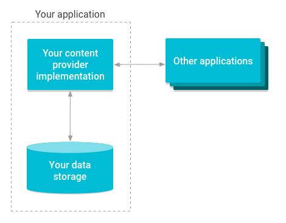
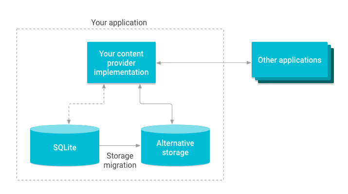

- [コンテンツプロバイダ](#コンテンツプロバイダ)
  - [コンテンツプロバイダのメリット](#コンテンツプロバイダのメリット)
  - [引用元資料](#引用元資料)

# コンテンツプロバイダ

コンテンツプロバイダは、アプリ自体が保存するデータ、または、他のアプリによって保存されたデータへのアクセスをアプリ側で管理し、他のアプリとデータを共有する方法を提供します。これらはデータをカプセル化し、データセキュリティを定義するメカニズムを提供します。コンテンツプロバイダは、あるプロセス内のデータと別のプロセスで実行されているコードを接続するための標準的なインターフェースです。

**注意** : コンテンツプロバイダは、データベースではありません。 [ユーザー定義の辞書](./2.コンテンツプロバイダの基本.md/#プロバイダにアクセスする) の例を見ると、データのクエリの方法が、データベースに似ているため、コンテンツプロバイダとは、データベースだと考えがちです。しかし、実際には、 **コンテンツプロバイダは、データソースへの CRUD を提供するインターフェース** にすぎません。データソースがファイルシステムの場合は、 `Content.Resolver.query()` メソッドでは、ファイルのメタデータを取得するのみで、実際にファイルを開きません。実際にファイルを開く処理は、クライアント側なら `ContentResolver.openInputStream()` メソッド、サーバー (プロバイダ) 側なら `ContentProvider.openFile()` メソッドです。 `query()` メソッドで、ファイルのメタデータを取得する際に、そのメタデータが、データベースから取得されているか、ファイルシステムから取得されているかは、どのコンテンツプロバイダを使用するかによります。繰り返しになりますが、コンテンツプロバイダには、データソースへのインターフェースの役割しかなく、データベースとセットになっているわけではありません。)

コンテンツプロバイダを実装すると、多くの利点があります。最も重要な点は、以下の図に示すように、 **他のアプリが安全にアプリデータにアクセスし、そのデータを変更できるようになる** ことです。

**データを共有する予定がある場合は、コンテンツプロバイダを使用してください。データを共有する予定がない場合は、使用する必要はありません。**

**コンテンツプロバイダには、他のアプリからのデータアクセスを抽象化する役割もあります。** たとえば、以下に示すように、 SQLite データベースを代替ストレージと交換する際に、外部アプリに影響することなく、交換が実施できます。

他の多くのクラスは ContentProvider クラスに依存しています。

- [AbstractThreadedSyncAdapter](https://developer.android.com/reference/android/content/AbstractThreadedSyncAdapter?hl=ja&_gl=1*rns1nn*_up*MQ..*_ga*MzI2OTg4NjcuMTcyMjMzMDE4OQ..*_ga_6HH9YJMN9M*MTcyMjMzMDE4OS4xLjAuMTcyMjMzMDg4NC4wLjAuMA..) (同期アダプター)
- [CursorAdapter](https://developer.android.com/reference/android/widget/CursorAdapter?hl=ja&_gl=1*rns1nn*_up*MQ..*_ga*MzI2OTg4NjcuMTcyMjMzMDE4OQ..*_ga_6HH9YJMN9M*MTcyMjMzMDE4OS4xLjAuMTcyMjMzMDg4NC4wLjAuMA..)
- [CursorLoader](https://developer.android.com/reference/androidx/loader/content/CursorLoader.html?_gl=1*1ikthso*_up*MQ..*_ga*MjE0MTg1MTUuMTcyMjM4NTQ5Ng..*_ga_6HH9YJMN9M*MTcyMjM4NTQ5NS4xLjAuMTcyMjM4NTQ5NS4wLjAuMA..) ( UI にデータを読み込む方法だが、現在は非推奨)

これらのクラスのいずれかを使用する場合は、アプリにコンテンツプロバイダを実装する必要があります。同期アダプターフレームワークを使用する場合は、代わりにスタブコンテンツプロバイダを作成することもできます。詳細については、 [スタブコンテンツプロバイダを作成する](./スタブコンテンツプロバイダを作成する.md) をご覧ください。また、次のような場合は、独自のコンテンツプロバイダが必要になります。

- カスタム検索候補をアプリに実装する場合
- アプリデータをウィジェットに公開する場合
- アプリケーションから複雑なデータやファイルをコピーして、別のアプリケーションに貼り付ける場合

**Android フレームワークには、音声、動画、画像、個人の連絡先情報などのデータを管理するコンテンツプロバイダが含まれています。** その一部は、 [android.provider パッケージのリファレンスドキュメント](https://developer.android.com/reference/android/provider/package-summary?_gl=1*tszgrs*_up*MQ..*_ga*MzI2OTg4NjcuMTcyMjMzMDE4OQ..*_ga_6HH9YJMN9M*MTcyMjMzMDE4OS4xLjAuMTcyMjMzMDg4NC4wLjAuMA..) に記載されています。一定の制限のもと、すべての Android アプリから、これらのプロバイダへアクセスできます。

コンテンツプロバイダを使用すると、 SQLite リレーショナルデータベースなどの構造化データや、画像ファイルなどの非構造化データの両方を含む、さまざまなデータストレージソースへのアクセスを管理できます。 Android で利用可能なストレージのタイプの詳細については、 [データストレージとファイルストレージの概要](https://developer.android.com/training/data-storage?hl=ja&_gl=1*jzcozo*_up*MQ..*_ga*MzI2OTg4NjcuMTcyMjMzMDE4OQ..*_ga_6HH9YJMN9M*MTcyMjMzMDE4OS4xLjAuMTcyMjMzMDg4NC4wLjAuMA..) 、および、 [データストレージを設計する](./3.コンテンツプロバイダの作成.md/#データストレージを設計する) をご覧ください。

## コンテンツプロバイダのメリット

**コンテンツプロバイダは、データへのアクセス権限をきめ細かく制御できます。** 例えば、次のことが設定できます。

- アクセスをアプリ内のコンテンツプロバイダのみに制限する
- 他のアプリのデータにアクセスするための包括的な権限を付与する
- データの読み取りと書き込みに異なる権限を設定する

コンテンツプロバイダを安全に使用する方法については、 [データストレージのセキュリティに関するヒント](https://developer.android.com/privacy-and-security/security-tips?hl=ja&_gl=1*z552u7*_up*MQ..*_ga*MzI2OTg4NjcuMTcyMjMzMDE4OQ..*_ga_6HH9YJMN9M*MTcyMjMzMDE4OS4xLjAuMTcyMjMzMDg4NC4wLjAuMA..#StoringData) と [コンテンツプロバイダの権限](./2.コンテンツプロバイダの基本.md/#コンテンツプロバイダの権限) をご覧ください。

**コンテンツプロバイダを使用すると、アプリ内のさまざまなデータソースへのアクセスに関する詳細を抽象化できます。たとえば、コンテンツプロバイダは、データベースにデータを保存したり、動画ファイルやオーディオファイルをファイルシステムに保存することもできます。コンテンツプロバイダを使用して、このようなデータのすべてにアクセスできます。**

また、 [CursorLoader](https://developer.android.com/reference/kotlin/androidx/loader/content/CursorLoader?_gl=1*z8zhvh*_up*MQ..*_ga*MzI2OTg4NjcuMTcyMjMzMDE4OQ..*_ga_6HH9YJMN9M*MTcyMjM1MTk2OS4yLjAuMTcyMjM1MTk2OS4wLjAuMA..) オブジェクトは、コンテンツプロバイダを利用して、非同期クエリを実行し、その結果をアプリの UI レイヤに返します。 CursorLoader を使用してバックグラウンドでデータを読み込む方法について詳しくは、 ~~[ローダ](https://developer.android.com/guide/components/loaders?hl=ja&_gl=1*nm5ri0*_up*MQ..*_ga*MzI2OTg4NjcuMTcyMjMzMDE4OQ..*_ga_6HH9YJMN9M*MTcyMjMzMDE4OS4xLjAuMTcyMjMzMDg4NC4wLjAuMA..) をご覧ください。~~ (※ 1 )

(※ 1 ) ローダは Android 9 ( API レベル 28 ) で非推奨になりました。 Activity と Fragment のライフサイクルの処理中にデータの読み込みを処理する場合は、 ViewModel オブジェクトと LiveData を組み合わせて使用することをおすすめします。

## 引用元資料

- [コンテンツプロバイダについて](https://developer.android.com/guide/topics/providers/content-providers?hl=ja)

