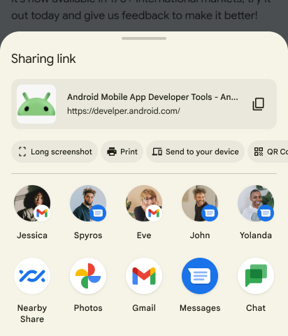
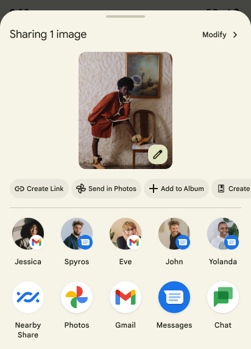
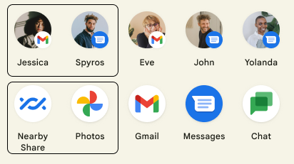

- [他のアプリにシンプルなデータを送信する](#他のアプリにシンプルなデータを送信する)
  - [Android Sharesheet を使用する理由](#android-sharesheet-を使用する理由)
  - [Android Sharesheet を使用する](#android-sharesheet-を使用する)
    - [テキストコンテンツを送信する](#テキストコンテンツを送信する)
    - [バイナリコンテンツを送信する](#バイナリコンテンツを送信する)
    - [正しい MIME タイプを使用する](#正しい-mime-タイプを使用する)
    - [複数のコンテンツを共有する](#複数のコンテンツを共有する)
    - [テキストプレビューにリッチコンテンツを追加する](#テキストプレビューにリッチコンテンツを追加する)
    - [共有シートにカスタムアクションを追加する](#共有シートにカスタムアクションを追加する)
    - [カスタムターゲットを追加する](#カスタムターゲットを追加する)
    - [特定コンポーネントのターゲットの除外](#特定コンポーネントのターゲットの除外)
    - [共有に関する情報を取得する](#共有に関する情報を取得する)
  - [Android インテントリゾルバを使用する](#android-インテントリゾルバを使用する)
  - [詳細](#詳細)
  - [引用元資料](#引用元資料)


# 他のアプリにシンプルなデータを送信する

Android では、インテントとそれに関連する追加機能を使用することにより、ユーザーがアプリで情報をすばやく簡単に共有できるようになっています。

Android では、ユーザーがアプリ間でデータを共有するのに、2 つの方法があります。

- Android Sharesheet
  - 共有するターゲットを毎回選択する必要があります。
  - SNS に共有する場合など、毎回、どのターゲットに共有するか選択したい場合に向いています。
- Android のインテントリゾルバ
  - デフォルトのアプリが設定されていれば、ターゲットの選択はスキップされ、すぐにアプリが開きます。
  - メールアプリでメールを作成するなど、デフォルトで使用するアプリが決まっている場合に向いています。
  - 起動できるアプリが一つしかない場合は、デフォルトアプリが設定されていなくても、ターゲットの選択 UI が表示されることなく、すぐにアプリが開きます。

インテントを作成する際には、実行したいアクションをインテントに設定します。 Android は、あるアクティビティから別のアクティビティにデータを送信するために、 [ACTION_SEND](https://developer.android.com/reference/android/content/Intent?hl=ja#ACTION_SEND) アクションを使用します。このアクションは、プロセスの境界を越えることができます。データを送信するアプリは、データとその MIME タイプを指定する必要があります。システムは、データを受信できるアクティビティを自動的に識別し、ユーザーに表示します。インテントリゾルバの場合、インテントを処理できるアクティビティが 1 つしかない場合は、そのアクティビティがすぐに開始されます。


## Android Sharesheet を使用する理由


全てのユーザーが、すべてのアプリ間で、操作と UI の一貫性を保つために、 Android Sharesheet を使用することを強くおすすめします。アプリ独自の共有シートを作成しないようにしてください。

Android Sharesheet を使用すると、ユーザーは 1 回のタップで、適切な人や関連するアプリと情報を共有できます。 Sharesheet を使用することで、一貫したランキングに基づいて、ターゲットが提案されます。これは、 Sharesheet が、システムでのみ利用可能な、アプリとユーザーの操作履歴に関する情報を考慮できるためです。

また、Android Sharesheet には、デベロッパーにとって便利な機能が多数あります。たとえば 次の操作を行います。

- [ユーザーがいつ共有を完了し、どこと共有したかを知る](#共有に関する情報を取得する)
- [カスタム ChooserTarget とアプリターゲットを追加する](#カスタムターゲットを追加する)
- [Android 10（API レベル 29）以降のリッチテキストコンテンツのプレビューを提供する](#テキストプレビューにリッチコンテンツを追加する)
- [特定のコンポーネント名に一致するターゲットを除外する](#特定コンポーネントのターゲットの除外)


## Android Sharesheet を使用する

どのような種類の共有についても、インテントを作成し、そのインテントに [Intent.ACTION_SEND](https://developer.android.com/reference/android/content/Intent#ACTION_SEND) アクションを設定します。 Android Sharesheet を表示するには、作成したその Intent オブジェクトを [Intent.createChooser()](https://developer.android.com/reference/android/content/Intent#createChooser(android.content.Intent,%20java.lang.CharSequence)) 関数に渡します。 createChooser() 関数は、 Android Sharesheet を表示する Intent を返します。 createChooser() 関数から返された Intent オブジェクトを使用して、 startActivity() 関数等で、次の処理を開始します。

Intent.createChooser() を用いた基本的な Sharesheet の利用は Android 6.0 ( API Level 23 ) から可能です


### テキストコンテンツを送信する

最も簡単で一般的な Android Sharesheet の使用方法は、あるアクティビティから別のアクティビティにテキストコンテンツを送信することです。たとえば、ほとんどのブラウザは、現在表示されているページの URL をテキストとして別のアプリと共有できます。これは、メールやソーシャルネットワークで友人と記事やウェブサイトを共有するのに便利です。以下はその方法の例です。

```kotlin
val sendIntent: Intent = Intent().apply {
    action = Intent.ACTION_SEND
    putExtra(Intent.EXTRA_TEXT, "This is my text to send.")
    type = "text/plain"
}

// 第二引数は、 Sharesheet のタイトルです。
val shareIntent = Intent.createChooser(sendIntent, null)
startActivity(shareIntent)
```

必要に応じて、メールの宛先（ [EXTRA_EMAIL](https://developer.android.com/reference/android/content/Intent?hl=ja#EXTRA_EMAIL) 、 [EXTRA_CC](https://developer.android.com/reference/android/content/Intent?hl=ja#EXTRA_CC) 、 [EXTRA_BCC](https://developer.android.com/reference/android/content/Intent?hl=ja#EXTRA_BCC) ）や件名（ [EXTRA_SUBJECT](https://developer.android.com/reference/android/content/Intent?hl=ja#EXTRA_SUBJECT) ）などの情報を、補足情報として追加できます。

**注** : Gmail などの一部のメールアプリでは、 EXTRA_EMAIL 、 EXTRA_CC などのエキストラに文字列配列 ( String[] ) を想定しています。そのような場合は、 [putExtra(String, String[])](https://developer.android.com/reference/android/content/Intent#putExtra(java.lang.String,%20java.lang.String[])) を使用して、エキストラを設定してください。


### バイナリコンテンツを送信する

[ACTION_SEND](https://developer.android.com/reference/android/content/Intent#ACTION_SEND) アクションを使用してバイナリデータを共有します。次の例に示すように、適切な MIME タイプを設定し、 [EXTRA_STREAM](https://developer.android.com/reference/android/content/Intent#EXTRA_STREAM) にデータへの URI を配置します。これは通常、イメージを共有するために使用されますが、あらゆる種類のバイナリコンテンツを共有するために使用できます。

```kotlin
val shareIntent: Intent = Intent().apply {
    action = Intent.ACTION_SEND
    // URI の例
    // content://com.google.android.apps.photos.contentprovider/...
    putExtra(Intent.EXTRA_STREAM, uriToImage)
    type = "image/jpeg"
}
startActivity(Intent.createChooser(shareIntent, null))
```

受信側アプリケーションには、URI が指すデータにアクセスするための権限が必要です。これを行うには、次の 2 つの方法が推奨されます。

- 独自の [ContentProvider](https://developer.android.com/reference/android/content/ContentProvider) にデータを保存し、他のアプリがプロバイダーにアクセスするための適切な権限を持っていることを確認します。アクセスを提供するための推奨メカニズムは、 [URI ごとの権限](https://developer.android.com/training/permissions/restrict-interactions#uri) を使用することです。これは一時的なもので、受信側アプリケーションにのみアクセスを許可します。このような ContentProvider を作成する簡単な方法は、 [FileProvider](https://developer.android.com/reference/androidx/core/content/FileProvider) ヘルパークラスを使用することです。

- [MediaStore](https://developer.android.com/reference/android/provider/MediaStore) を使用します。MediaStore は主にビデオ、オーディオ、および、画像の MIME タイプ用です。ただし、Android 3.0 (API レベル 11) 以降では、メディア以外のタイプも保存できます。詳細については、 [MediaStore.Files](https://developer.android.com/reference/android/provider/MediaStore.Files) を参照してください。ファイルは [scanFile()](https://developer.android.com/reference/android/media/MediaScannerConnection#scanFile(android.content.Context,%20java.lang.String[],%20java.lang.String[],%20android.media.MediaScannerConnection.OnScanCompletedListener)) を使用して MediaStore に挿入できます。その後、共有に適した content:// スタイルの [Uri](https://developer.android.com/reference/android/net/Uri) が、提供された [onScanCompleted()](https://developer.android.com/reference/android/media/MediaScannerConnection.OnScanCompletedListener#onScanCompleted(java.lang.String,%20android.net.Uri)) コールバックに渡されます。システム MediaStore に追加されると、デバイス上のどのアプリでもコンテンツにアクセスできるようになります。


### 正しい MIME タイプを使用する

送信するデータに使用できる最も具体的な MIME タイプを指定します。たとえば、プレーンテキストを共有する場合は `text/plain` を使用します。 Android で単純なデータを送信するときによく使用される MIME タイプを以下にいくつか示します。

| 受信側                           | 送信側          |
| -------------------------------- | --------------- |
| text/*                           | text/plain      |
| 〃                               | text/rtf        |
| 〃                               | text/html       |
| 〃                               | text/json       |
| image/*                          | image/jpg       |
| 〃                               | image/png       |
| 〃                               | image/gif       |
| video/*                          | video/mp4       |
| 〃                               | video/3gp       |
| サポートされているファイル拡張子 | application/pdf |

MIME タイプの詳細については、 MIME メディアタイプの [IANA](https://www.iana.org/assignments/media-types/media-types.xhtml) 公式レジストリを参照してください。

Android Sharesheet には、指定された MIME タイプに応じて、コンテンツのプレビューが表示される場合があります。プレビュー機能は、特定のタイプでのみ使用できます。


### 複数のコンテンツを共有する

複数のコンテンツを共有するには、 [ACTION_SEND_MULTIPLE](https://developer.android.com/reference/android/content/Intent#ACTION_SEND_MULTIPLE) アクションを使用します。その際、コンテンツを指す URI のリストを指定します。 MIME タイプは、共有するコンテンツの組み合わせによって異なります。たとえば、 3 つの JPEG 画像を共有する場合は、 `"image/jpg"` タイプを使用します。画像タイプが混在する場合は、 `"image/*"` を使用して、任意のタイプの画像を処理するアクティビティに一致させます。 **複数のタイプを混在させて共有することは可能ですが、** 受信者に送信される内容が不明瞭になるため、 **非推奨です。** もし、複数のタイプを送信する必要がある場合は、 `"*/*"` を使用できます。データの解析と処理は受信側アプリケーションに委ねられます。

以下に例を示します。

```kotlin
val imageUris: ArrayList<Uri> = arrayListOf(
        // image の URI をここに列挙します。
        imageUri1,
        imageUri2
)

val shareIntent = Intent().apply {
    action = Intent.ACTION_SEND_MULTIPLE
    putParcelableArrayListExtra(Intent.EXTRA_STREAM, imageUris)
    type = "image/*"
}
startActivity(Intent.createChooser(shareIntent, null))
```

提供された [Uri](https://developer.android.com/reference/android/net/Uri) オブジェクトは、受信側アプリケーションがアクセスできるデータを示すようにしてください。


### テキストプレビューにリッチコンテンツを追加する

**このセクションはサンプルコードが正常に動作せず、意味不明なので、スキップ推奨です。** サンプルでは、 `EXTRA_TITLE` で、共有する文字列にタイトルを付与することは可能です。しかし、 `data = contentUri` で、プレビューを表示することはできませんでした。そもそも、サンプルコードでは、 URL を共有しているのですが、なぜ、 Web ページのプレビューにわざわざコンテンツプロバイダーで、ローカルに存在するプレビューを指定する必要があるのかが謎です。 Web ページのプレビューなら、 URL さえわかれば、システムが自動的にプレビューを表示してくれそうなものです。そのため、このサンプルコードは不適切なユースケースにも思われます。

Android 10（API レベル 29）以降、 Android Sharesheet には、共有されるテキストのプレビューが表示されます。共有されるテキストがわかりにくい場合があります。 `https://www.google.com/search?ei=2rRVXcLkJajM0PEPoLy7oA4` のような複雑な URL を共有することを検討してください。より詳細なプレビューにより、ユーザーは何が共有されているか安心できます。

テキストをプレビューする場合は、タイトル、サムネイル画像、または、その両方を設定できます。 Intent.createChooser() を呼び出す前に Intent.EXTRA_TITLE に説明を追加し、 ClipData を使用して関連するサムネイルを追加します。

**注** : 画像コンテンツ URI は、通常は構成された `<cache-path>` から FileProvider から提供されます。詳細については、 [ファイルの共有](https://developer.android.com/training/secure-file-sharing) をご覧ください。サムネイルとして使用する画像を読み取るための適切な権限を Sharesheet に付与してください。詳細については、 [Intent.FLAG_GRANT_READ_URI_PERMISSION](https://developer.android.com/reference/android/content/Intent#FLAG_GRANT_READ_URI_PERMISSION) をご覧ください。

次に例を示します。

```kotlin
val share = Intent.createChooser(
    Intent().apply {
        action = Intent.ACTION_SEND
        putExtra(Intent.EXTRA_TEXT, "https://developer.android.com/")

        // (Optional) Here you're setting the title of the content
        putExtra(Intent.EXTRA_TITLE, "Android Mobile App Developer Tools - Android ...")

        // (Optional) Here you're passing a content URI to an image to be displayed
        data = contentUri
        flags = Intent.FLAG_GRANT_READ_URI_PERMISSION
    }, null)
startActivity(share)
```

プレビューは次のようになります。




### 共有シートにカスタムアクションを追加する

Android 14 (API レベル 34) 以上では、アプリは Android Sharesheet にカスタムアクションを追加できます。カスタムアクションは Android Sharesheet の上部に小さなアクションアイコンとして表示され、アプリはアイコンがクリックされたときに呼び出されるアクションとして任意のインテントを指定できます。

Android Sharesheet にカスタムアクションを追加するには、まず、 [ChooserAction.Builder](https://developer.android.com/training/sharing/reference/android/service/chooser/ChooserAction.Builder) を使用して、 [ChooserAction](https://developer.android.com/reference/android/service/chooser/ChooserAction) を作成します。アイコンがクリックされたときに呼び出されるアクションとして PendingIntent を指定できます。すべてのカスタムアクションを含む配列を作成し、それを共有インテントの [EXTRA_CHOOSER_CUSTOM_ACTIONS](https://developer.android.com/reference/android/content/Intent#EXTRA_CHOOSER_CUSTOM_ACTIONS) として指定します。

Android Sharesheet 上のカスタムアクションの例を以下に示します。



```kotlin
val sendIntent = Intent(Intent.ACTION_SEND)
    .setType("text/plain")
    .putExtra(Intent.EXTRA_TEXT, text)
val shareIntent = Intent.createChooser(sendIntent, null)
val customActions = arrayOf(
    ChooserAction.Builder(
        Icon.createWithResource(context, R.drawable.ic_custom_action),
        "Custom",
        PendingIntent.getBroadcast(
            context,
            1,
            Intent(Intent.ACTION_VIEW),
            PendingIntent.FLAG_IMMUTABLE or PendingIntent.FLAG_CANCEL_CURRENT
        )
    ).build()
)
shareIntent.putExtra(Intent.EXTRA_CHOOSER_CUSTOM_ACTIONS, customActions)
context.startActivity(shareIntent)
```


### カスタムターゲットを追加する

Android Sharesheet では、 ChooserTargetServices から読み込まれた共有ショートカットとセレクターターゲットの前に表示される [ChooserTarget](https://developer.android.com/reference/android/service/chooser/ChooserTarget) オブジェクトを最大 2 つ指定できます。また、アプリの提案の前にリストされるアクティビティを指すインテントを最大 2 つ指定することもできます。



[Intent.createChooser()](https://developer.android.com/reference/android/content/Intent#createChooser(android.content.Intent,%20java.lang.CharSequence)) を呼び出した後、共有インテントに Intent.EXTRA_CHOOSER_TARGETS と Intent.EXTRA_INITIAL_INTENTS を追加します。

```kotlin
val share = Intent.createChooser(myShareIntent, null).apply {
    // EXTRA_CHOOSER_TARGETS と EXTRA_INITIAL_INTENTS をそれぞれ
    // 最大 2 つずつ追加できるらしい。
    putExtra(Intent.EXTRA_CHOOSER_TARGETS, myChooserTargetArray)
    putExtra(Intent.EXTRA_INITIAL_INTENTS, myInitialIntentArray)
}
```

この機能は注意して使用してください。カスタム Intent と ChooserTarget を追加するたびに、システムが提案する数が減ります。通常、カスタムターゲットの追加は推奨されません。 Intent.EXTRA_INITIAL_INTENTS を追加する一般的な適切な例は、共有コンテンツに対してユーザーが実行できる追加のアクションを提供することです。たとえば、ユーザーが画像を共有し、代わりにリンクを送信できるようにするために Intent.EXTRA_INITIAL_INTENTS が使用されます。 Intent.EXTRA_CHOOSER_TARGETS を追加する一般的な適切な例は、アプリが提供する関連する人物やデバイスを表示することです。


### 特定コンポーネントのターゲットの除外

Android 14 (API レベル 34) 以上では、 Intent.EXTRA_EXCLUDE_COMPONENTS を提供することで、特定のターゲットを除外できます。これは、開発者が制御できるターゲットを削除する場合にのみ行ってください。一般的な使用例は、ユーザーがアプリ内から共有するときに、そのインテントがアプリ外で共有される可能性が高いため、アプリの共有ターゲットを非表示にすることです。

Intent.createChooser() を呼び出した後、インテントに Intent.EXTRA_EXCLUDE_COMPONENTS を追加します。

```kotlin
val share = Intent.createChooser(Intent(), null).apply {
    // 自分が制御できるコンポーネントにのみ使用してください
    val excludedComponentNames = arrayOf(ComponentName("com.example.android", "ExampleClass"))
    putExtra(Intent.EXTRA_EXCLUDE_COMPONENTS, excludedComponentNames)
}
```


### 共有に関する情報を取得する

ユーザーがいつ共有し、どのターゲットを選択したかを知ることは役に立ちます。 Android Sharesheet では、ユーザーが IntentSender を使用して選択したターゲットの ComponentName を提供することで、この情報を取得できます。

まず、 BroadcastReceiver の PendingIntent を作成し、 Intent.createChooser() でその IntentSender を指定します。

```kotlin
var share = Intent(Intent.ACTION_SEND)
// ...
val pi = PendingIntent.getBroadcast(
    myContext, requestCode,
    Intent(myContext, MyBroadcastReceiver::class.java),
    PendingIntent.FLAG_MUTABLE or PendingIntent.FLAG_UPDATE_CURRENT
)
share = Intent.createChooser(share, null, pi.intentSender)
```

MyBroadcastReceiver でコールバックを受信し、Intent.EXTRA_CHOSEN_COMPONENT を確認します。

```kotlin
override fun onReceive(context: Context, intent: Intent) {
    ...
    val clickedComponent : ComponentName = intent.getParcelableExtra(EXTRA_CHOSEN_COMPONENT);
}
```


## Android インテントリゾルバを使用する

Android インテントリゾルバは、明確に定義されたタスクフローの一部として別のアプリにデータを送信する場合に最適です。

Android インテントリゾルバを使用するには、 Android Sharesheet を呼び出す場合と同じように、インテントを作成し、追加機能を追加します。ただし、 [Intent.createChooser()](https://developer.android.com/reference/android/content/Intent#createChooser(android.content.Intent,%20java.lang.CharSequence)) は呼び出さないでください。

[ACTION_SEND](https://developer.android.com/reference/android/content/Intent#ACTION_SEND) と MIME タイプに一致するフィルターを持つ複数のアプリケーションがインストールされている場合、システムはインテント リゾルバと呼ばれる曖昧さ回避ダイアログを表示し、ユーザーが共有先を選択できるようにします。一致するアプリケーションが 1 つだけある場合は、そのアプリケーションが実行されます。

Android インテントリゾルバを使用してテキストを送信する方法の例を次に示します。

```kotlin
val sendIntent: Intent = Intent().apply {
    action = Intent.ACTION_SEND
    putExtra(Intent.EXTRA_TEXT, "This is my text to send.")
    type = "text/plain"
}
startActivity(sendIntent)
```


## 詳細

データの送信の詳細については、 [インテントとインテントフィルター](https://developer.android.com/guide/components/intents-filters) を参照してください。


## 引用元資料

- [他のアプリにシンプルなデータを送信する](https://developer.android.com/training/sharing/send?hl=ja)


