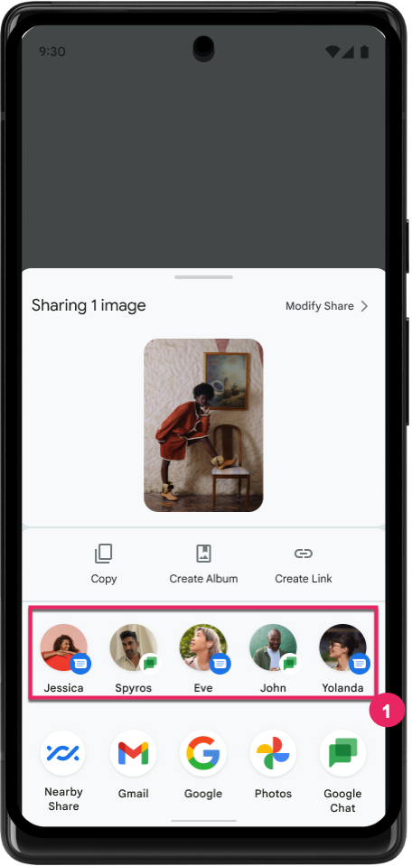

- [ダイレクト共有ターゲットを提供する](#ダイレクト共有ターゲットを提供する)
  - [Direct Share ターゲットを公開する](#direct-share-ターゲットを公開する)
  - [Direct Share ターゲットのランキングを向上させる](#direct-share-ターゲットのランキングを向上させる)
  - [共有ショートカット API](#共有ショートカット-api)
  - [ショートカット画像を提供する](#ショートカット画像を提供する)
  - [共有ターゲットを宣言する](#共有ターゲットを宣言する)
  - [通信アプリのショートカットの使用状況を報告する](#通信アプリのショートカットの使用状況を報告する)
    - [送信メッセージのショートカットの使用状況を報告](#送信メッセージのショートカットの使用状況を報告)
    - [受信メッセージのショートカット使用状況のレポート](#受信メッセージのショートカット使用状況のレポート)
  - [AndroidX を使用して共有ショートカットと ChooserTargets の両方を提供する](#androidx-を使用して共有ショートカットと-choosertargets-の両方を提供する)
  - [共有ショートカットに関するよくある質問](#共有ショートカットに関するよくある質問)
    - [ショートカットの使用データはどのように保存され、デバイスから出ますか?](#ショートカットの使用データはどのように保存されデバイスから出ますか)
    - [ダイレクト シェアの歴史は?](#ダイレクト-シェアの歴史は)
    - [共有ターゲット用に公開されたショートカットは、ランチャーショートカット (ランチャーでアプリアイコンを長押ししたときによく使用されるショートカット) とどう違うのでしょうか?](#共有ターゲット用に公開されたショートカットはランチャーショートカット-ランチャーでアプリアイコンを長押ししたときによく使用されるショートカット-とどう違うのでしょうか)
    - [公開すべき共有ショートカットの数に関するガイダンスを教えてください。](#公開すべき共有ショートカットの数に関するガイダンスを教えてください)
  - [引用元資料](#引用元資料)


# ダイレクト共有ターゲットを提供する

Direct Share ターゲットを使用すると、他のアプリのユーザーが URL 、画像、その他の種類のデータをアプリと簡単にすばやく共有できるようになります。 Direct Share は、メッセージングアプリやソーシャルアプリの連絡先を Android Sharesheet に直接表示することで機能します。ユーザーは、アプリを選択してから連絡先を検索する必要はありません。

**注** : Android 11 (API レベル 30) 以降では、このページで後述する [共有ショートカット API](#共有ショートカット-api) を通じてのみ Direct Share ターゲットを提供できます。

[ShortcutManagerCompat](https://developer.android.com/reference/androidx/core/content/pm/ShortcutManagerCompat) は、共有ショートカットを提供する AndroidX API であり、非推奨の ChooserTargetService API と下位互換性があります。これは、共有ショートカットと ChooserTargets の両方を公開するための推奨される方法です。手順については、このページの [AndroidX を使用して共有ショートカットと ChooserTargets の両方を提供する](#androidx-を使用して共有ショートカットと-choosertargets-の両方を提供する) を参照してください。

以下の図の ① の部分がダイレクト共有の部分です。




## Direct Share ターゲットを公開する

Sharesheet Direct Share 行 (上記の図の ① 部分) には、共有ショートカット API によって提供される動的ショートカットのみが表示されます。 Direct Share ターゲットを公開するには、次の手順を実行してください。

1. アプリの XML リソースファイルで、 share-target 要素を宣言します。

```xml
<shortcuts xmlns:android="http://schemas.android.com/apk/res/android">
    <share-target android:targetClass="com.example.android.sharingshortcuts.SendMessageActivity">
        <data android:mimeType="text/plain" />
        <category android:name="com.example.android.sharingshortcuts.category.TEXT_SHARE_TARGET" />
    </share-target>
</shortcuts>
```

2. アプリを初期化するときに、 [setDynamicShortcuts](https://developer.android.com/reference/androidx/core/content/pm/ShortcutManagerCompat#setDynamicShortcuts(android.content.Context,java.util.List%3Candroidx.core.content.pm.ShortcutInfoCompat%3E)) を使用して動的ショートカットを重要度順に並べます。

インデックスが低いほど重要度が高くなります。コミュニケーションアプリを作成している場合は、アプリに表示される会話を最新の順に並べることができます。古いショートカットを公開しないでください。過去 30 日間にユーザーアクティビティがない会話は古いものと見なされます。

```kotlin
ShortcutManagerCompat.setDynamicShortcuts(myContext, listOf(shortcut1, shortcut2, ..))
```

3.  通信アプリを開発している場合は、ユーザーが連絡先にメッセージを受信、または、送信するたびに、 [pushDynamicShortcut](https://developer.android.com/reference/androidx/core/content/pm/ShortcutManagerCompat#pushDynamicShortcut(android.content.Context,androidx.core.content.pm.ShortcutInfoCompat)) を通じてショートカットの使用状況を直ちに報告します。詳細については、このページの [通信アプリのショートカットの使用状況を報告する](#通信アプリのショートカットの使用状況を報告する) を参照してください。たとえば、 actions.intent.SEND_MESSAGE 機能を使用して、ショートカットで機能バインディングを指定することで、ユーザーが送信したメッセージの使用状況を報告します。

```kotlin
val shortcutInfo = ShortcutInfoCompat.Builder(myContext, staticConversationIdentifier)
    ...
    .setShortLabel(firstName)
    .setLongLabel(fullName)
    .setCategories(matchedCategories)
    .setLongLived(true)
    .addCapabilityBinding("actions.intent.SEND_MESSAGE").build()
ShortcutManagerCompat.pushDynamicShortcut(myContext, shortcutInfo)
```

4. ユーザーが連絡先を削除する場合は、 [removeLongLivedShortcut](https://developer.android.com/reference/androidx/core/content/pm/ShortcutManagerCompat#removeLongLivedShortcuts(android.content.Context,java.util.List%3Cjava.lang.String%3E)) を使用します。これは、システム サービスによってキャッシュされているかどうかに関係なく、ショートカットを削除する推奨される方法です。次のコード スニペットは、これを行う方法の例を示しています。

```kotlin
val deleteShortcutId = "..."
ShortcutManagerCompat.removeLongLivedShortcuts(myContext, listOf(deleteShortcutId))
```


## Direct Share ターゲットのランキングを向上させる

Android Sharesheet には、固定数の Direct Share ターゲットが表示されます。これらの提案は、ランク順に並べられています。次の操作を行うことで、ショートカットのランキングを向上させることができます。

- すべてのショートカット ID が一意であり、異なるターゲットで再利用されないようにします。

- [setLongLived(true)](https://developer.android.com/reference/androidx/core/content/pm/ShortcutInfoCompat.Builder#setLongLived()) を呼び出して、ショートカットが長期間有効であることを確認します。

- 会話関連のショートカットの場合は、 [ShortcutManagerCompat.pushDynamicShortcut](https://developer.android.com/reference/androidx/core/content/pm/ShortcutManagerCompat#pushDynamicShortcut(android.content.Context,androidx.core.content.pm.ShortcutInfoCompat)) を通じて対応するショートカットを再公開して、送信メッセージと受信メッセージのショートカットの使用状況を報告します。詳細については、このページの [通信アプリのショートカットの使用状況を報告する](#通信アプリのショートカットの使用状況を報告する) をご覧ください。

- 関連性のない、または古い Direct Share ターゲット (ユーザーが過去 30 日以内にメッセージを送信していない連絡先など) を提供しないようにしてください。

- SMS アプリの場合は、スパムの可能性があると判断されたショートコードや会話のショートカットを提供しないようにしてください。ユーザーがそれらの会話を共有する可能性はほとんどありません。

- [setCategories()](https://developer.android.com/reference/androidx/core/content/pm/ShortcutInfoCompat.Builder#setCategories(java.util.Set%3Cjava.lang.String%3E)) を呼び出して、ショートカットを適切な [mimeType 属性](https://developer.android.com/training/sharing/receive#supporting-mime-types) に関連付けます。たとえば、 SMS アプリの場合、連絡先が RCS 、または、 MMS に対応していない場合は、対応するショートカットを `image/*` や `video/*` などのテキスト以外の MIME タイプに関連付けることはありません。

- 特定の会話では、動的ショートカットがプッシュされ、使用状況が報告されたら、ショートカット ID を変更しないでください。これにより、ランキングに使用する使用状況データが保持されます。

ユーザーが Direct Share ターゲットをタップした場合、アプリは、ターゲットの件名に対して直接アクションを実行できる UI にユーザーを誘導する必要があります。ユーザーに曖昧さ回避 UI を表示したり、タップしたターゲットに関係のない UI にユーザーを配置したりしないでください。たとえば、メッセージングアプリでは、 Direct Share ターゲットをタップすると、ユーザーは選択した人との会話ビューに移動します。キーボードが表示され、メッセージには共有データが事前に入力されています。


## 共有ショートカット API

Android 10 (API レベル 29) 以降、 [ShortcutInfo.Builder](https://developer.android.com/reference/androidx/core/content/pm/ShortcutInfoCompat.Builder) に共有ターゲットに関する追加情報を提供するメソッドと拡張機能が追加されました:

- [setCategories()](https://developer.android.com/reference/androidx/core/content/pm/ShortcutInfoCompat.Builder#setCategories(java.util.Set%3Cjava.lang.String%3E))
  - Android 10 以降では、共有インテントまたはアクションを処理できるショートカットをフィルタリングするためにカテゴリも使用されます。詳細については、 [共有ターゲットの宣言](#共有ターゲットを宣言する) をご覧ください。このフィールドは、共有ターゲットとして使用するショートカットに必須です。

- [setLongLived()](https://developer.android.com/reference/androidx/core/content/pm/ShortcutInfoCompat.Builder#setLongLived())
  - ショートカットがアプリによって非公開または非表示にされた場合 (動的ショートカットまたは固定ショートカットとして)、ショートカットが有効かどうかを指定します。ショートカットが長期間有効な場合、動的ショートカットとして非公開にされた後でも、さまざまなシステムサービスによってキャッシュされる可能性があります。
  - ショートカットを長期間有効にすると、ランキングが向上する可能性があります。詳細については、 [最高のランキングを取得する](#direct-share-ターゲットのランキングを向上させる) をご覧ください。

- [setShortLabel()](https://developer.android.com/reference/androidx/core/content/pm/ShortcutInfoCompat.Builder#setShortLabel(java.lang.CharSequence)) 、 [setLongLabel()](https://developer.android.com/reference/androidx/core/content/pm/ShortcutInfoCompat.Builder#setLongLabel(java.lang.CharSequence))
  - 個人へのショートカットを公開する場合は、 setLongLabel() にフルネームを、 setShortLabel() にニックネームやファーストネームなどの短縮名を含めてください。

GitHub で [共有ショートカットを公開する例](https://github.com/android/storage-samples/tree/main/SharingShortcuts) をご覧ください。


## ショートカット画像を提供する

共有ショートカットを作成するには、 [setIcon()](https://developer.android.com/reference/androidx/core/content/pm/ShortcutInfoCompat.Builder#setIcon(androidx.core.graphics.drawable.IconCompat)) を使用して画像を追加する必要があります。

共有ショートカットはシステムサーフェス全体に表示される可能性があり、形状が変更されることがあります。さらに、 Android バージョン 7、8、または 9 (API レベル 25、26、27、および 28) を実行している一部のデバイスでは、背景のないビットマップのみのアイコンが表示されることがあり、コントラストが大幅に低下します。ショートカットが意図したとおりに表示されるようにするには、 [IconCompat.createWithAdaptiveBitmap()](https://developer.android.com/reference/androidx/core/graphics/drawable/IconCompat#createWithAdaptiveBitmap(android.graphics.Bitmap)) を使用してアダプティブビットマップを提供します。

アダプティブビットマップが、 [アダプティブアイコンに設定されているのと同じガイドラインと寸法](https://developer.android.com/guide/practices/ui_guidelines/icon_design_adaptive) に従っていることを確認してください。これを実現する最も一般的な方法は、意図した正方形のビットマップを 72x72 dp に拡大し、それを 108x108 dp の透明なキャンバスの中央に配置することです。アイコンに透明な領域が含まれている場合は、背景色を含める必要があります。そうしないと、透明な領域が黒く表示されます。

特定の形状にマスクされた画像を提供しないでください。たとえば、 Android 10 (API レベル 29) より前は、 Direct Share ChooserTarget のユーザーアバターを円にマスクして提供するのが一般的でした。 Android 10 の Android Sharesheet およびその他のシステムサーフェスでは、ショートカット画像の形状とテーマが設定されるようになりました。共有ショートカットを提供するための推奨方法は、 [ShortcutManagerCompat](https://developer.android.com/reference/androidx/core/content/pm/ShortcutManagerCompat) を介して、バックコンパチの Direct Share ChooserTarget オブジェクトを円に自動的に整形することです。


## 共有ターゲットを宣言する

共有ターゲットは、 [静的ショートカット定義](https://developer.android.com/guide/topics/ui/shortcuts/creating-shortcuts) と同様に、アプリのリソースファイルで宣言する必要があります。リソースファイルの `<shortcuts>` ルート要素内に、他の静的ショートカット定義とともに共有ターゲット定義を追加します。各 `<share-targets>` 要素には、共有データタイプ、一致するカテゴリ、共有インテントを処理するターゲット クラスに関する情報が含まれます。XML コードは次のようになります。

```xml
<shortcuts xmlns:android="http://schemas.android.com/apk/res/android">
    <share-target android:targetClass="com.example.android.sharingshortcuts.SendMessageActivity">
        <data android:mimeType="text/plain" />
        <category android:name="com.example.android.sharingshortcuts.category.TEXT_SHARE_TARGET" />
    </share-target>
</shortcuts>
```

共有ターゲットのデータ要素は、 [インテントフィルタのデータ仕様](https://developer.android.com/guide/topics/manifest/data-element) に似ています。各共有ターゲットには複数のカテゴリを設定できます。カテゴリは、アプリの公開ショートカットを共有ターゲット定義と一致させるためにのみ使用されます。カテゴリには、任意のアプリ定義値を設定できます。

ユーザーが Android Sharesheet で上記の例のターゲット共有に一致する共有ショートカットを選択した場合、アプリは次の共有インテントを取得します。

```
Action: Intent.ACTION_SEND
ComponentName: {com.example.android.sharingshortcuts /
                com.example.android.sharingshortcuts.SendMessageActivity}
Data: Uri to the shared content
EXTRA_SHORTCUT_ID: <ID of the selected shortcut>
```

ユーザーがランチャーショートカットから共有ターゲットを開くと、アプリは [ShortcutManagerCompat](https://developer.android.com/reference/androidx/core/content/pm/ShortcutManagerCompat) に共有ショートカットを追加したときに作成されたインテントを取得します。これは別のインテントであるため、 Intent.EXTRA_SHORTCUT_ID は利用できず、必要な場合は手動で ID を渡す必要があります。


## 通信アプリのショートカットの使用状況を報告する

通信アプリを開発している場合は、送信メッセージと受信メッセージの両方の使用状況を報告することで、 Android Sharesheet でのランキングを向上させることができます。これを行うには、 [ShortcutManagerCompat.pushDynamicShortcut](https://developer.android.com/reference/androidx/core/content/pm/ShortcutManagerCompat#pushDynamicShortcut(android.content.Context,androidx.core.content.pm.ShortcutInfoCompat)) を介して連絡先を表す会話ショートカットを再公開します。

ショートカットの使用状況と機能バインディングは、Android 5.0 (API 21) と下位互換性があります。


### 送信メッセージのショートカットの使用状況を報告

ユーザーが送信したメッセージの使用状況を報告することは、メッセージを作成した後に [送信] ボタンをクリックすることと機能的に似ています。

使用状況レポートをトリガーするには、 actions.intent.SEND_MESSAGE 機能を使用して、 [ShortcutInfoCompat.Builder#addCapabilityBinding](https://developer.android.com/reference/kotlin/androidx/core/content/pm/ShortcutInfoCompat.Builder#addCapabilityBinding(java.lang.String)) を通じてショートカットに機能バインディングを指定します。

```kotlin
val shortcutInfo = ShortcutInfoCompat.Builder(myContext, staticConversationIdentifier)
    ...
    .setShortLabel(firstName)
    .setLongLabel(fullName)
    .setCategories(matchedCategories)
    .setLongLived(true)
    .addCapabilityBinding("actions.intent.SEND_MESSAGE").build()
ShortcutManagerCompat.pushDynamicShortcut(myContext, shortcutInfo)
```

送信メッセージがグループチャット用である場合は、 [受信者 ( recipient )](https://schema.org/recipient) の種類が機能に関連付けられているため、 Audience パラメータ値も追加する必要があります。

```kotlin
val shortcutInfo = ShortcutInfoCompat.Builder(myContext, staticConversationIdentifier)
    ...
    .setShortLabel(groupShortTitle)
    .setLongLabel(groupLongTitle)
    .setCategories(matchedCategories)
    .setLongLived(true)
    .addCapabilityBinding("actions.intent.SEND_MESSAGE", "message.recipient.@type", listOf("Audience")).build()

ShortcutManagerCompat.pushDynamicShortcut(myContext, shortcutInfo)
```

### 受信メッセージのショートカット使用状況のレポート

ユーザーが SMS 、チャットメッセージ、メール、通知などのメッセージを受信したときに使用状況レポートをトリガーするには、 actions.intent.RECEIVE_MESSAGE 機能を使用して、ショートカットで [ShortcutInfoCompat.Builder#addCapabilityBinding](https://developer.android.com/reference/kotlin/androidx/core/content/pm/ShortcutInfoCompat.Builder#addCapabilityBinding(java.lang.String)) を通じて機能バインディングを追加で指定する必要があります。

```kotlin
val shortcutInfo = ShortcutInfoCompat.Builder(myContext, staticConversationIdentifier)
  ...
  .setShortLabel(firstName)
  .setLongLabel(fullName)
  .setCategories(matchedCategories)
  .setLongLived(true)
  .addCapabilityBinding("actions.intent.RECEIVE_MESSAGE").build()

ShortcutManagerCompat.pushDynamicShortcut(myContext, shortcutInfo)
```

受信メッセージがグループ チャットからのものである場合は、 [送信者 ( sender )](https://schema.org/sender) の種類が機能に関連付けられているため、Audience パラメータ値も追加する必要があります。

```kotlin
val shortcutInfo = ShortcutInfoCompat.Builder(myContext, staticConversationIdentifier)
    ...
    .setShortLabel(groupShortTitle)
    .setLongLabel(groupLongTitle)
    .setCategories(matchedCategories)
    .setLongLived(true)
    .addCapabilityBinding("actions.intent.RECEIVE_MESSAGE", "message.sender.@type", listOf("Audience")).build()

ShortcutManagerCompat.pushDynamicShortcut(myContext, shortcutInfo)
```


## AndroidX を使用して共有ショートカットと ChooserTargets の両方を提供する

AndroidX 互換性ライブラリを使用できるようにするには、アプリのマニフェストにメタデータ chooser-target-service と intent-filters セットが含まれている必要があります。現在の ChooserTargetService [Direct Share](https://developer.android.com/about/versions/marshmallow/android-6.0#direct-share) API を参照してください。

このサービスは互換性ライブラリで既に宣言されているため、ユーザーはアプリのマニフェストでサービスを宣言する必要はありません。ただし、共有アクティビティからサービスへのリンクは、 chooser ターゲットプロバイダーとして考慮する必要があります。

次の例では、 ChooserTargetService の実装は androidx.core.content.pm.ChooserTargetServiceCompat であり、これは AndroidX で既に定義されています。

```xml
<activity
    android:name=".SendMessageActivity"
    android:label="@string/app_name"
    android:theme="@style/SharingShortcutsDialogTheme">
    <!-- This activity can respond to Intents of type SEND -->
    <intent-filter>
        <action android:name="android.intent.action.SEND" />
        <category android:name="android.intent.category.DEFAULT" />
        <data android:mimeType="text/plain" />
    </intent-filter>
    <!-- Only needed if you import the sharetarget AndroidX library that
         provides backwards compatibility with the old DirectShare API.
         The activity that receives the Sharing Shortcut intent needs to be
         taken into account with this chooser target provider. -->
    <meta-data
        android:name="android.service.chooser.chooser_target_service"
        android:value="androidx.sharetarget.ChooserTargetServiceCompat" />
</activity>
```


## 共有ショートカットに関するよくある質問

### ショートカットの使用データはどのように保存され、デバイスから出ますか?

ショートカットは、暗号化されたディスクパーティションのシステムデータディレクトリに完全にデバイス上で保存されます。ショートカット内のアイコン、インテント、人やリソースの名前などの情報には、システムサービスとショートカットを公開するアプリのみがアクセスできます。


### ダイレクト シェアの歴史は?

Android 6.0 (API レベル 23) でダイレクトシェアが導入され、アプリは ChooserTargetService を通じて ChooserTarget オブジェクトを提供できるようになりました。結果はオンデマンドでリアクティブに取得されていたため、ターゲットの読み込み時間が遅くなっていました。

Android 10 (API レベル 29) では、ChooserTargetService ダイレクト シェア API が新しい共有ショートカット API に置き換えられました。オンデマンドでリアクティブに結果を取得する代わりに、共有ショートカット API を使用すると、アプリはダイレクトシェアターゲットを事前に公開できます。これにより、ShareSheet を準備するときにダイレクトシェアターゲットを取得するプロセスが急速に高速化されました。 ChooserTargetService ダイレクトシェアメカニズムは引き続き機能しますが、この方法で提供されるターゲットは、共有ショートカット API を使用するターゲットよりも低くランク付けされます。

Android 11 (API レベル 30) では ChooserTargetService サービスが非推奨となり、共有ショートカット API がダイレクトシェアターゲットを提供する唯一の方法になりました。


### 共有ターゲット用に公開されたショートカットは、ランチャーショートカット (ランチャーでアプリアイコンを長押ししたときによく使用されるショートカット) とどう違うのでしょうか?

「共有ターゲット」の目的で公開されたショートカットもランチャーショートカットであり、アプリのアイコンを長押しするとメニューに表示されます。アクティビティあたりの最大ショートカット数制限は、アプリが公開するショートカットの合計数 (共有ターゲットと従来のランチャーショートカットを合わせた数) にも適用されます。


### 公開すべき共有ショートカットの数に関するガイダンスを教えてください。

共有ショートカットの数は、 [getMaxShortcutCountPerActivity(android.content.Context)](https://developer.android.com/reference/androidx/core/content/pm/ShortcutManagerCompat#getMaxShortcutCountPerActivity(android.content.Context)) で利用できる動的ショートカットと同じ制限に制限されます。その制限まで任意の数のショートカットを公開できますが、共有ショートカットはアプリ ランチャーの長押しと共有シートに表示されることに留意してください。ほとんどのアプリ ランチャーの長押しでは、縦向きモードで最大 4 つまたは 5 つのショートカットが表示され、横向きモードでは最大 8 つのショートカットが表示されます。ショートカットの共有に関する詳細とガイダンスについては、この FAQ を参照してください。


## 引用元資料

- [ダイレクト共有ターゲットを提供する](https://developer.android.com/training/sharing/direct-share-targets?hl=ja)


