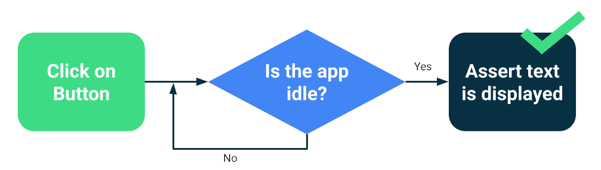
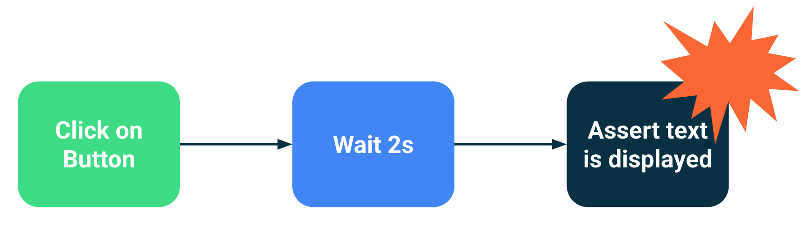

- [UI テストを自動化する](#ui-テストを自動化する)
  - [Android Studio でのインストルメンテーション UI テスト](#android-studio-でのインストルメンテーション-ui-テスト)
  - [Jetpack フレームワーク](#jetpack-フレームワーク)
  - [不安定さと同期](#不安定さと同期)
    - [同期のテスト](#同期のテスト)
  - [アーキテクチャとテスト設定](#アーキテクチャとテスト設定)
  - [自動テストを行う理由](#自動テストを行う理由)
  - [参考情報](#参考情報)
    - [ドキュメント](#ドキュメント)
    - [Codelab](#codelab)
  - [引用元資料](#引用元資料)

# UI テストを自動化する

ユーザー操作をテストすると、ユーザーがアプリを操作する際に、予期しない結果が生じたり、ユーザー エクスペリエンスが低下したりすることがなくなります。アプリの UI が正しく機能していることを確認する必要がある場合は、ユーザー インターフェース（UI）テストを作成する習慣を身につける必要があります。

UI テストのアプローチの一つとして、ターゲット アプリに対して一連のユーザー オペレーションを人間のテスターに実行してもらい、それが正しく動作するかどうかを検証するというものがあります。しかし、この手動のアプローチは時間がかかり、エラーも発生しがちです。より効率的なアプローチは、ユーザー アクションが自動的に実行されるよう UI テストを作成することです。自動化されたアプローチにより、再現可能な方法で迅速かつ確実にテストを実行できます。

UI テストは、アプリ（またはその一部）を起動し、ユーザー操作をシミュレートして、最後にアプリが適切に反応したことを確認します。このテストは、小さなコンポーネントの動作から、ユーザーフロー全体を走査する大規模なナビゲーション テストまで、多岐にわたります。回帰をチェックしたり、さまざまな API レベルや物理デバイスとの互換性を確認したりするのに役立ちます。

注: UI テストは、UI の正しい動作を検証するテストを指す用語です。通常は、デバイスまたはエミュレータで実行されるインストルメンテーション テストであり、アプリが正しく動作するかどうかをインストルメンテーションによってチェックします。ただし、ローカルテストである UI テストを作成することもできます。ローカルテストはホストマシンで実行され、デバイスやエミュレータは必要ありません。

## Android Studio でのインストルメンテーション UI テスト

Android Studio を使用してインストルメンテーション UI テストを実行するには、別の Android テストフォルダ（src/androidTest/java）にテストコードを実装します。 [Android Plug-in for Gradle](https://developer.android.com/studio/releases/gradle-plugin?hl=ja&_gl=1*k1bpeq*_up*MQ..*_ga*MzgzNjQyNS4xNzIzMTAyNTUx*_ga_6HH9YJMN9M*MTcyMzEwMjU1MC4xLjAuMTcyMzEwMjU1MC4wLjAuMA..) は、テストコードに基づいてテストアプリをビルドし、ターゲット アプリと同じデバイスにテストアプリを読み込みます。テストコードでは、UI テスト フレームワークを使用してターゲット アプリでのユーザー操作をシミュレートし、特定の使用シナリオをカバーするテストタスクを実行できます。

## Jetpack フレームワーク

Jetpack には、UI テストを作成するための API を提供するさまざまなフレームワークが用意されています。

- [Espresso テスト フレームワーク](https://developer.android.com/training/testing/espresso?hl=ja&_gl=1*1n015na*_up*MQ..*_ga*MzgzNjQyNS4xNzIzMTAyNTUx*_ga_6HH9YJMN9M*MTcyMzEwMjU1MC4xLjAuMTcyMzEwMjU1MC4wLjAuMA..) （Android 4.0.1、API レベル 14 以降）には、単一のターゲット アプリ内のビューに対するユーザー操作をシミュレートする UI テストを作成するための API が用意されています。Espresso を使用する主な利点は、テスト対象アプリの UI とテスト アクションを自動的に同期できることです。 **Espresso はメインスレッドがアイドル状態になったことを検出する** ため、適切なタイミングでテストコマンドを実行できるため、テストの信頼性が向上します。

- [Jetpack Compose](https://developer.android.com/jetpack/compose?hl=ja&_gl=1*1n015na*_up*MQ..*_ga*MzgzNjQyNS4xNzIzMTAyNTUx*_ga_6HH9YJMN9M*MTcyMzEwMjU1MC4xLjAuMTcyMzEwMjU1MC4wLjAuMA..) （Android 5.0、API レベル 21 以降）には、Compose の画面とコンポーネントを起動して操作するためのテスト API のセットが用意されています。Compose 要素とのやり取りはテストと同期し、時間、アニメーション、再コンポーズを完全に制御できます。

- [UI Automator](https://developer.android.com/training/testing/ui-automator?hl=ja&_gl=1*1n015na*_up*MQ..*_ga*MzgzNjQyNS4xNzIzMTAyNTUx*_ga_6HH9YJMN9M*MTcyMzEwMjU1MC4xLjAuMTcyMzEwMjU1MC4wLjAuMA..) （Android 4.3、API レベル 18 以降）は、システムとインストール済みのアプリ間でのアプリ間の機能 UI テストに適した UI テスト フレームワークです。UI Automator API を使用すると、テストデバイスで設定メニューやアプリ ランチャーを開くなどの操作を行うことができます。

- [Robolectric](http://robolectric.org/) （Android 4.1、API レベル 16 以降）を使用すると、エミュレータやデバイスではなく、通常の JVM のワークステーションまたは継続的インテグレーション環境で実行する **ローカルテストを作成できます。** Espresso または Compose のテスト API を使用して、 **UI コンポーネントを操作できます。**

## 不安定さと同期

モバイルアプリとフレームワークの非同期という特性により、信頼性が高く再現性のあるテストを作成することがしばしば困難になります。ユーザー イベントが挿入されると、テスト フレームワークは、アプリがそれに対する反応を終了するまで待機しなければなりません。これには、画面上のテキストの変更からアクティビティの完全な再作成まで、多岐にわたります。決定論的な動作がないテストは、不安定です。

Compose や Espresso などの最新のフレームワークはテストを念頭に置いて設計されているため、 **次のテストアクションやアサーションの前に UI がアイドル状態であることが確実です。これが同期です。**

### 同期のテスト

データベースからのデータの読み込みや、無限のアニメーションの表示など、テストでは認識できない非同期処理やバックグラウンド オペレーションを実行すると、問題が発生することがあります。

テストスイートの信頼性を高めるために、 [Espresso アイドリング リソース](https://developer.android.com/training/testing/espresso/idling-resource?hl=ja&_gl=1*143dua6*_up*MQ..*_ga*MzgzNjQyNS4xNzIzMTAyNTUx*_ga_6HH9YJMN9M*MTcyMzEwMjU1MC4xLjAuMTcyMzEwMjU1MC4wLjAuMA..) などのバックグラウンド オペレーションを追跡する方法をインストールできます。また、コルーチン用の [TestDispatcher](https://developer.android.com/kotlin/coroutines/coroutines-best-practices?hl=ja&_gl=1*143dua6*_up*MQ..*_ga*MzgzNjQyNS4xNzIzMTAyNTUx*_ga_6HH9YJMN9M*MTcyMzEwMjU1MC4xLjAuMTcyMzEwMjU1MC4wLjAuMA..#test-coroutine-dispatcher) や RxJava 用の [RxIdler](https://github.com/square/RxIdler) など、アイドル状態を照会できるテスト バージョンや同期を改善できるテスト バージョンのモジュールを置き換えることもできます。

警告: アプリを実行して安定させるため、任意の期間（スリープ）テストを一時停止しないでください。これにより、同じテストを異なる環境で実行しても、実行に必要な時間が増減する場合があるため、テストが不要で低速または不安定になります。要するに、自分で任意の時間のスリープを入れると、デバイスによっては、そのスリープによって、アイドル状態になるかもしれないが、アイドル状態になる前に次のテストが開始されるデバイスもある。など、テストが不安定になる。

## アーキテクチャとテスト設定

アプリのアーキテクチャでは、double をテストするためにテストで部分を置き換える必要があります。また、テストに役立つユーティリティを提供するライブラリを使用する必要があります。たとえば、データ リポジトリ モジュールを、テスト用の偽の確定的なデータを提供するインメモリ バージョンに置き換えることができます。

この機能を有効にするには、依存関係インジェクションを使用することをおすすめします。独自のシステムは [手動で](https://developer.android.com/training/dependency-injection/manual?hl=ja&_gl=1*neqf7t*_up*MQ..*_ga*MzgzNjQyNS4xNzIzMTAyNTUx*_ga_6HH9YJMN9M*MTcyMzEwMjU1MC4xLjAuMTcyMzEwMjU1MC4wLjAuMA..) 作成できますが、これには Hilt のような DI フレームワークを使用することをおすすめします。

## 自動テストを行う理由

Android アプリは、多くの API レベルとフォーム ファクタを持つ何千ものデバイスをターゲットにできますが、OS がユーザーに提供する高度なカスタマイズは、アプリが正しくレンダリングされなかったり、一部のデバイスでクラッシュしたりする可能性があります。

UI テストでは互換性テストを行い、さまざまなコンテキストでアプリの動作を検証できます。以下のような異なるデバイスで UI テストを実行することをおすすめします。

- **API レベル** : 21、25、30。
- **言語 / 地域** : 英語、アラビア語、中国語。
- **向き** : 縦向き、横向き。

さらに、アプリはスマートフォン以外の動作も確認する必要があります。タブレット、折りたたみ式デバイス、その他のデバイスでテストする必要があります。

## 参考情報

UI テストの作成の詳細については、次のリソースをご覧ください。

### ドキュメント

- [インストルメンテーションテストを作成する](https://developer.android.com/training/testing/instrumented-tests?hl=ja&_gl=1*1hwtuip*_up*MQ..*_ga*MzgzNjQyNS4xNzIzMTAyNTUx*_ga_6HH9YJMN9M*MTcyMzEwMjU1MC4xLjAuMTcyMzEwMjU1MC4wLjAuMA..)
- Espresso
- [Compose のテスト](https://developer.android.com/jetpack/compose/testing?hl=ja&_gl=1*1hwtuip*_up*MQ..*_ga*MzgzNjQyNS4xNzIzMTAyNTUx*_ga_6HH9YJMN9M*MTcyMzEwMjU1MC4xLjAuMTcyMzEwMjU1MC4wLjAuMA..)

### Codelab

- [テストダブルと依存関係インジェクションの概要](https://developer.android.com/codelabs/advanced-android-kotlin-training-testing-test-doubles?hl=ja&_gl=1*1hwtuip*_up*MQ..*_ga*MzgzNjQyNS4xNzIzMTAyNTUx*_ga_6HH9YJMN9M*MTcyMzEwMjU1MC4xLjAuMTcyMzEwMjU1MC4wLjAuMA..)

## 引用元資料

引用元資料が移動したようですが、元資料は以下の二つのような気がします。

- [大規模テストの安定性](https://developer.android.com/training/testing/instrumented-tests/stability?hl=ja)
- [UI テストを自動化する](https://developer.android.com/training/testing/ui-tests?hl=ja)

