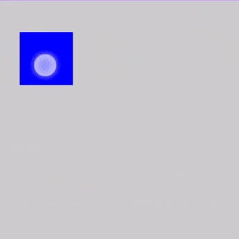
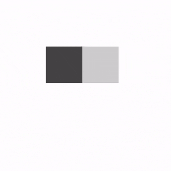

- [ドラッグ、スワイプ、フリング](#ドラッグスワイプフリング)
  - [スワイプ](#スワイプ)
    - [参考までに swipeable 修飾子の使用方法を掲載しておきます。](#参考までに-swipeable-修飾子の使用方法を掲載しておきます)


# ドラッグ、スワイプ、フリング

[draggable](https://developer.android.com/reference/kotlin/androidx/compose/foundation/gestures/package-summary?_gl=1*1za68v*_up*MQ..*_ga*MjExMDE2NTk5NS4xNzI3MzM1MzI5*_ga_6HH9YJMN9M*MTcyNzMzNTMyOC4xLjAuMTcyNzMzNTMyOC4wLjAuMTM2Njk3ODM2MA..#(androidx.compose.ui.Modifier).draggable(androidx.compose.foundation.gestures.DraggableState,androidx.compose.foundation.gestures.Orientation,kotlin.Boolean,androidx.compose.foundation.interaction.MutableInteractionSource,kotlin.Boolean,kotlin.coroutines.SuspendFunction2,kotlin.coroutines.SuspendFunction2,kotlin.Boolean)) 修飾子は、単一の方向でドラッグ ジェスチャを実行するための高レベルのエントリ ポイントであり、ドラッグ距離をピクセル単位で報告します。

この修飾子は、ジェスチャを検出するだけという点で scrollable に似ていることに注意してください。たとえば、 [offset](https://developer.android.com/reference/kotlin/androidx/compose/foundation/layout/package-summary?_gl=1*1huuxng*_up*MQ..*_ga*MjExMDE2NTk5NS4xNzI3MzM1MzI5*_ga_6HH9YJMN9M*MTcyNzMzNTMyOC4xLjAuMTcyNzMzNTMyOC4wLjAuMTM2Njk3ODM2MA..#(androidx.compose.ui.Modifier).offset(androidx.compose.ui.unit.Dp,%20androidx.compose.ui.unit.Dp)) 修飾子を使用して要素を移動することにより、状態を保持して画面上に表示する必要があります。

```kotlin
@Composable
private fun DraggableText() {
    var offsetX by remember { mutableStateOf(0f) }
    Text(
        modifier = Modifier
            // IntOffset の第二引数は Y 軸のオフセットです。
            .offset { IntOffset(offsetX.roundToInt(), 0) }
            .draggable(
                orientation = Orientation.Horizontal,
                state = rememberDraggableState { delta ->
                    offsetX += delta
                }
            ),
        text = "Drag me!"
    )
}
```

ドラッグなしの状態では以下のようになります。


右に少しドラッグすると以下のようになります。


ドラッグ ジェスチャ全体 ( X 軸と Y 軸の両方) を制御する必要がある場合は、代わりに、 [pointerInput](https://developer.android.com/reference/kotlin/androidx/compose/ui/input/pointer/package-summary?_gl=1*1mg2f6q*_up*MQ..*_ga*MjExMDE2NTk5NS4xNzI3MzM1MzI5*_ga_6HH9YJMN9M*MTcyNzMzNTMyOC4xLjAuMTcyNzMzNTMyOC4wLjAuMTM2Njk3ODM2MA..#(androidx.compose.ui.Modifier).pointerInput(kotlin.Any,kotlin.coroutines.SuspendFunction1)) 修飾子を介して detectDragGestures を使用することを検討してください。

```kotlin
@Composable
private fun DraggableTextLowLevel() {
    Box(modifier = Modifier.fillMaxSize()) {
        var offsetX by remember { mutableStateOf(0f) }
        var offsetY by remember { mutableStateOf(0f) }

        Box(
            Modifier
                .offset { IntOffset(offsetX.roundToInt(), offsetY.roundToInt()) }
                .background(Color.Blue)
                .size(50.dp)
                .pointerInput(Unit) {
                    detectDragGestures { change, dragAmount ->
                        change.consume()
                        offsetX += dragAmount.x
                        offsetY += dragAmount.y
                    }
                }
        )
    }
}
```




## スワイプ

[swipeable](https://developer.android.com/reference/kotlin/androidx/compose/material/package-summary?_gl=1*nghe5c*_up*MQ..*_ga*MjExMDE2NTk5NS4xNzI3MzM1MzI5*_ga_6HH9YJMN9M*MTcyNzMzNTMyOC4xLjAuMTcyNzMzNTMyOC4wLjAuMTM2Njk3ODM2MA..#(androidx.compose.ui.Modifier).swipeable(androidx.compose.material.SwipeableState,kotlin.collections.Map,androidx.compose.foundation.gestures.Orientation,kotlin.Boolean,kotlin.Boolean,androidx.compose.foundation.interaction.MutableInteractionSource,kotlin.Function2,androidx.compose.material.ResistanceConfig,androidx.compose.ui.unit.Dp)) 修飾子を使用すると、要素をドラッグできます。要素は、離すと、通常、方向で定義された 2 つ以上のアンカー ポイントに向かってアニメーション化されます。この一般的な使用法は、「スワイプして閉じる」パターンを実装することです。

**注: swipeable API は、Jetpack Compose 1.6.0-alpha01 で Foundation の anchoredDraggable API に置き換えられました。 [移行ガイド](./6.Swipeable%20から%20AnchoredDraggable%20に移行する.md) で詳細をご覧ください。**


### 参考までに swipeable 修飾子の使用方法を掲載しておきます。

この修飾子は要素を移動せず、ジェスチャを検出するだけであることに注意してください。状態を保持し、たとえば offset 修飾子を使用して要素を移動して画面上に表示する必要があります。

スワイプ可能な状態はスワイプ可能な修飾子で必須であり、rememberSwipeableState() を使用して作成および記憶できます。この状態は、プログラムでアンカーにアニメーション化するための便利なメソッド セット (snapTo、animateTo、performFling、performDrag を参照) と、ドラッグの進行状況を監視するプロパティも提供します。

スワイプ ジェスチャは、FixedThreshold(Dp) や FractionalThreshold(Float) などの異なるしきい値タイプを持つように構成でき、アンカー ポイントの from-to の組み合わせごとに異なる値にすることができます。

柔軟性を高めるために、境界を越えてスワイプするときの抵抗と、位置しきい値に達していなくてもスワイプを次の状態にアニメーション化する velocityThreshold を構成することもできます。

```kotlin
@OptIn(ExperimentalMaterialApi::class)
@Composable
private fun SwipeableSample() {
    val width = 96.dp
    val squareSize = 48.dp

    val swipeableState = rememberSwipeableState(0)
    val sizePx = with(LocalDensity.current) { squareSize.toPx() }
    val anchors = mapOf(0f to 0, sizePx to 1) // Maps anchor points (in px) to states

    Box(
        modifier = Modifier
            .width(width)
            .swipeable(
                state = swipeableState,
                anchors = anchors,
                thresholds = { _, _ -> FractionalThreshold(0.3f) },
                orientation = Orientation.Horizontal
            )
            .background(Color.LightGray)
    ) {
        Box(
            Modifier
                .offset { IntOffset(swipeableState.offset.value.roundToInt(), 0) }
                .size(squareSize)
                .background(Color.DarkGray)
        )
    }
}
```



