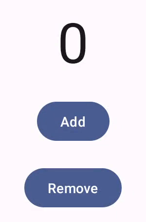
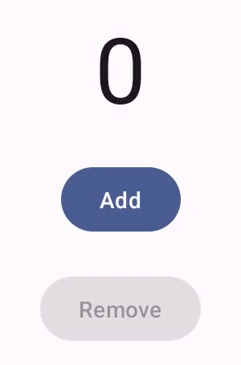

- [ユーザー操作を処理する](#ユーザー操作を処理する)

# ユーザー操作を処理する

ユーザー インターフェイス コンポーネントは、ユーザー操作への応答方法によってデバイス ユーザーにフィードバックを提供します。

各コンポーネントには、操作に対する独自の応答方法があり、これによりユーザーは操作が何を行っているかを把握できます。

たとえば、ユーザーがデバイスのタッチスクリーン上のボタンをタッチすると、ボタンはハイライト色の追加など、何らかの方法で変化する可能性があります。この変化により、ユーザーはボタンをタッチしたことを知ることができます。ユーザーがそれを望まなかった場合、指をボタンからドラッグしてから離す必要があることがわかります。そうしないと、ボタンがアクティブになります。

以下は、常に有効で、リップルエフェクトのないボタンです。

以下は、常に有効 / 無効の切り替えがあり、リップルエフェクトがあるボタンです。

Compose は、ポインタの移動やクリックなどの低レベルのポインタ イベントを高レベルのインタラクションに抽象化してすぐに使用できます。

たとえば、一連のポインタ イベントがボタンの押して放す動作にまとめられることがあります。これらの高レベルの抽象化を理解することで、UI がユーザーにどのように応答するかをカスタマイズできます。

たとえば、ユーザーがコンポーネントを操作したときにコンポーネントの外観がどのように変化するかをカスタマイズしたり、ユーザー アクションのログを保持したりしたい場合があります。

このドキュメントでは、標準の UI 要素を変更したり、独自の UI 要素を設計したりするために必要な情報を提供します。

注: このドキュメントの一部のコード スニペットには、少なくとも次のライブラリ バージョンが必要です。

- androidx.compose.foundation:foundation:1.7.0-alpha01
- androidx.wear.compose:compose-material:1.4.0-alpha01
- androidx.compose.material:material:1.7.0-alpha01
- androidx.wear.compose:compose-material3:1.0.0-alpha16

## 操作

多くの場合、Compose コンポーネントがユーザー操作をどのように解釈しているかを知る必要はありません。たとえば、Button は [Modifier.clickable](https://developer.android.com/reference/kotlin/androidx/compose/foundation/package-summary?_gl=1*32ljje*_up*MQ..*_ga*MjExMDE2NTk5NS4xNzI3MzM1MzI5*_ga_6HH9YJMN9M*MTcyNzQwMjcyMy4yLjAuMTcyNzQwMjcyMy4wLjAuMTE1MDg2NjIyNQ..#(androidx.compose.ui.Modifier).clickable(kotlin.Boolean,kotlin.String,androidx.compose.ui.semantics.Role,kotlin.Function0)) を利用して、ユーザーがボタンをクリックしたかどうかを判断します。アプリに一般的なボタンを追加する場合は、ボタンの onClick コードを定義し、Modifier.clickable が適切な場合にそのコードを実行します。つまり、ユーザーが画面をタップしたのか、キーボードでキーを押下したのかを知る必要はありません。Modifier.clickable はユーザーがクリックを実行したことを判断し、onClick コードを実行して応答します。

ただし、ユーザーの動作に対する UI コンポーネントの応答をカスタマイズする場合は、内部で何が起こっているかを詳しく知る必要がある場合があります。このセクションでは、その情報の一部を示します。

ユーザーが UI コンポーネントを操作すると、システムはいくつかの [Interaction](https://developer.android.com/reference/kotlin/androidx/compose/foundation/interaction/Interaction?_gl=1*32ljje*_up*MQ..*_ga*MjExMDE2NTk5NS4xNzI3MzM1MzI5*_ga_6HH9YJMN9M*MTcyNzQwMjcyMy4yLjAuMTcyNzQwMjcyMy4wLjAuMTE1MDg2NjIyNQ..) イベントを生成してその動作を表します。たとえば、ユーザーがボタンに触れると、ボタンは [PressInteraction.Press](https://developer.android.com/reference/kotlin/androidx/compose/foundation/interaction/PressInteraction.Press?_gl=1*32ljje*_up*MQ..*_ga*MjExMDE2NTk5NS4xNzI3MzM1MzI5*_ga_6HH9YJMN9M*MTcyNzQwMjcyMy4yLjAuMTcyNzQwMjcyMy4wLjAuMTE1MDg2NjIyNQ..) を生成します。ユーザーがボタン内で指を離すと、ボタンは [PressInteraction.Release](https://developer.android.com/reference/kotlin/androidx/compose/foundation/interaction/PressInteraction.Release?_gl=1*32ljje*_up*MQ..*_ga*MjExMDE2NTk5NS4xNzI3MzM1MzI5*_ga_6HH9YJMN9M*MTcyNzQwMjcyMy4yLjAuMTcyNzQwMjcyMy4wLjAuMTE1MDg2NjIyNQ..) を生成し、クリックが完了したことを知らせます。一方、ユーザーがボタンの外側に指をドラッグしてから指を離すと、ボタンは [PressInteraction.Cancel](https://developer.android.com/reference/kotlin/androidx/compose/foundation/interaction/PressInteraction.Cancel?_gl=1*32ljje*_up*MQ..*_ga*MjExMDE2NTk5NS4xNzI3MzM1MzI5*_ga_6HH9YJMN9M*MTcyNzQwMjcyMy4yLjAuMTcyNzQwMjcyMy4wLjAuMTE1MDg2NjIyNQ..) を生成し、ボタンの押下が完了したのではなくキャンセルされたことを示します。

これらのインタラクションは非独断的です。つまり、これらの低レベルのインタラクション イベントは、ユーザー アクションの意味やそのシーケンスを解釈するものではありません。また、どのユーザー アクションが他のアクションよりも優先されるかも解釈しません。

これらのインタラクションは通常、開始と終了のペアで行われます。2 番目のインタラクションには、最初のインタラクションへの参照が含まれます。たとえば、ユーザーがボタンをタッチしてから指を離すと、タッチによって PressInteraction.Press インタラクションが生成され、リリースによって PressInteraction.Release が生成されます。リリースには、最初の PressInteraction.Press を識別する press プロパティがあります。

特定のコンポーネントのインタラクションは、その InteractionSource を観察することで確認できます。 InteractionSource は Kotlin フロー上に構築されているため、他のフローと同じように、そこからインタラクションを収集できます。この設計上の決定の詳細については、 [Illuminating Interactions](https://medium.com/androiddevelopers/illuminating-interactions-visual-state-in-jetpack-compose-188fa041b791) のブログ投稿を参照してください。

## 操作の状態
## Interaction の消費と出力
### 修飾子の使用例
### 修飾子の生成例
### 消費と生成を行うコンポーネントを構築する
## InteractionSource と連携する
## 例: カスタム操作処理を含むビルド コンポーネント
## Indication で再利用可能なカスタム エフェクトを作成して適用する
### エフェクトを Indication に置き換える
### 枠線がアニメーション化された高度な Indication を作成する

