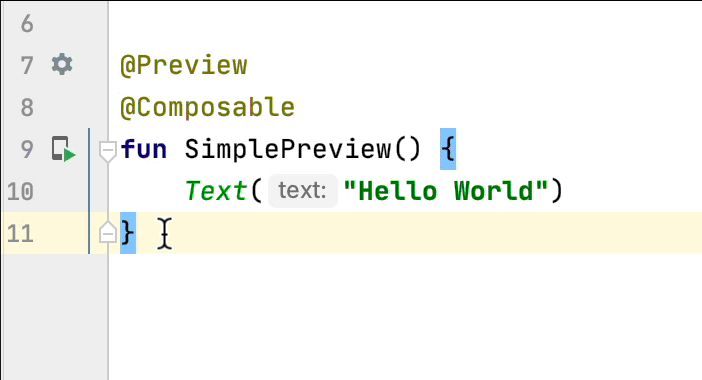
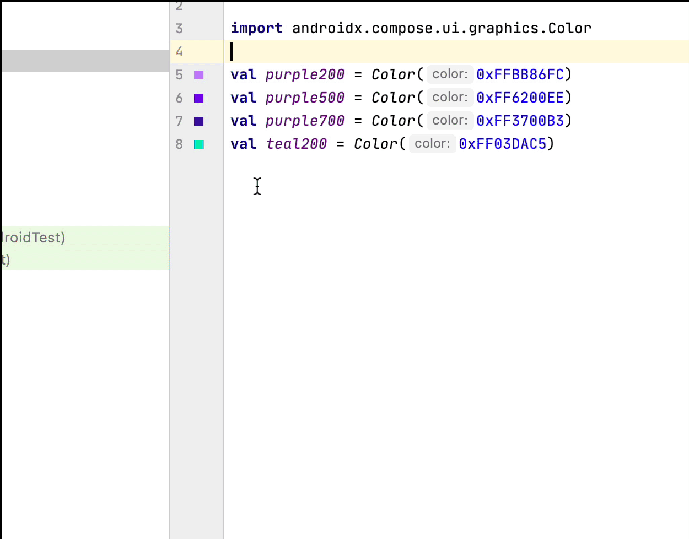
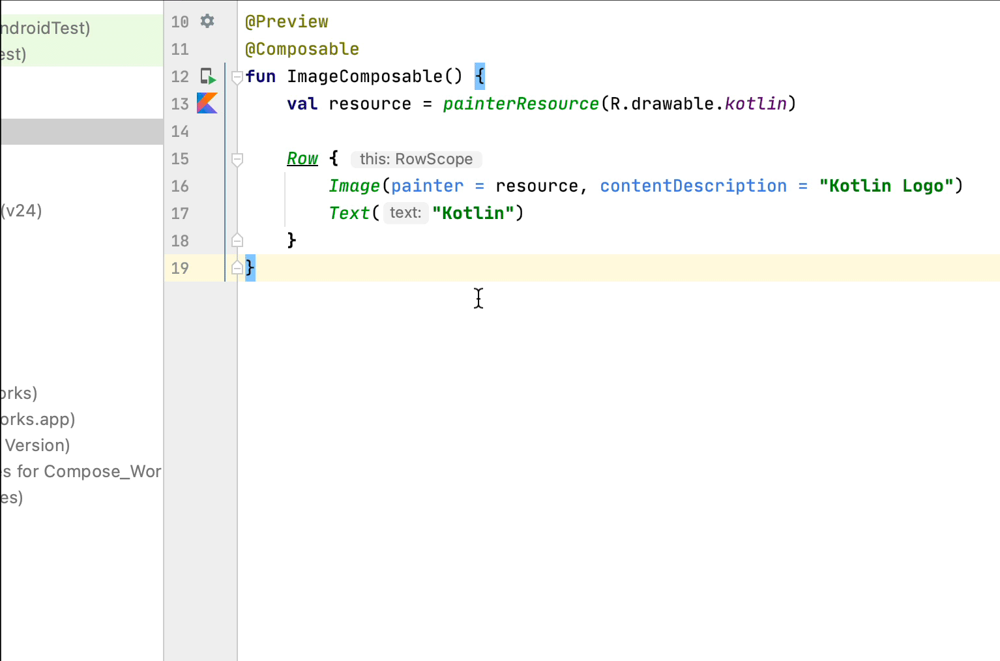

- [エディタのアクション](#エディタのアクション)
  - [ライブ テンプレート](#ライブ-テンプレート)
  - [ガターアイコン](#ガターアイコン)
    - [特定の @Preview をデバイスに直接デプロイする](#特定の-preview-をデバイスに直接デプロイする)
    - [カラー選択ツール](#カラー選択ツール)
    - [画像リソース選択ツール](#画像リソース選択ツール)

# エディタのアクション

Android Studio のエディタ領域には、Jetpack Compose で生産性を向上させるための機能があります。

## ライブ テンプレート

Android Studio には Compose 関連の次のライブ テンプレートが用意されており、対応するテンプレートの略称を入力することで、コード スニペットをすばやく挿入できます。

- comp: @Composable 関数を設定する

- prev: コンポーズ可能な関数 @Preview を作成する

- paddp: padding 修飾子を dp で追加する

- weight: weight 修飾子を追加する

- W、WR、WC: 現在のコンポーザブルを Box、Row、または Column コンテナで囲む

## ガターアイコン

ガターアイコンは、サイドバーにある行番号の横に表示されるコンテキスト アクションです。Android Studio では、デベロッパーのエクスペリエンスを向上させるために、Jetpack Compose 固有のガターアイコンがいくつか導入されています。

### 特定の @Preview をデバイスに直接デプロイする

ガターアイコンから特定の @Preview を、エミュレータまたは物理デバイスに直接デプロイできます。

### カラー選択ツール

コンポーザブルの内部または外部で色が定義されている場合、プレビューがガターに表示されます。次のようにカラー選択ツールをクリックすると、色を変更できます。

### 画像リソース選択ツール

コンポーザブルの内部または外部でドローアブル、ベクター、画像が定義されている場合、ガターにプレビューが表示されます。次のように画像リソース選択ツールをクリックして変更できます。

