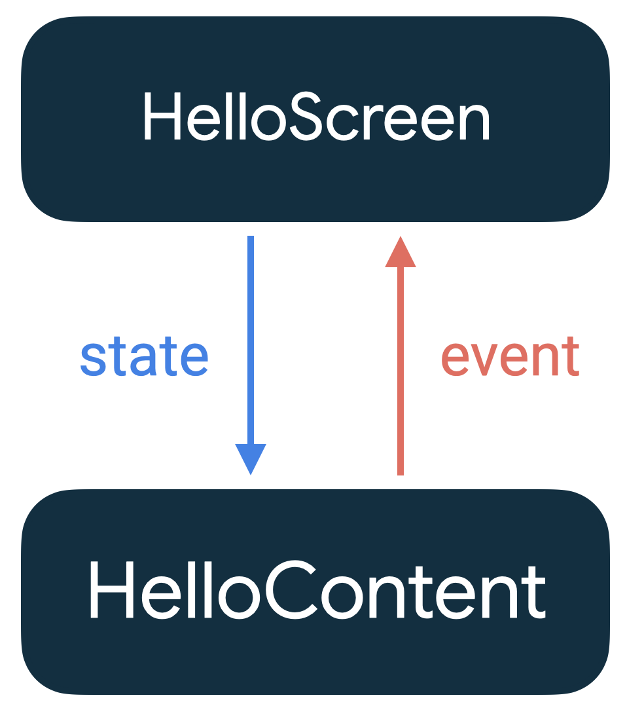

- [概要](#概要)
  - [状態とコンポジション](#状態とコンポジション)
    - [ユーザー入力と画面の更新](#ユーザー入力と画面の更新)
  - [コンポーザブルの内部状態](#コンポーザブルの内部状態)
    - [MutableState](#mutablestate)
      - [【方法１】val mutableState = remember {} を使用する場合](#方法１val-mutablestate--remember--を使用する場合)
      - [【方法２】var value by remember {} を使用する場合](#方法２var-value-by-remember--を使用する場合)
      - [【方法３】val (value, setValue) = remember {} を使用する場合](#方法３val-value-setvalue--remember--を使用する場合)
    - [コンポーザブルから ViewModel の StateFlow の状態を取得する場合](#コンポーザブルから-viewmodel-の-stateflow-の状態を取得する場合)
    - [状態を他のコンポーザブルやビジネスロジックで使用する](#状態を他のコンポーザブルやビジネスロジックで使用する)
    - [構成変更で状態を保持](#構成変更で状態を保持)
    - [可変長の状態（データ）を保持したい場合](#可変長の状態データを保持したい場合)
      - [1. 要素の更新を監視する方法](#1-要素の更新を監視する方法)
      - [2. コレクション全体の更新を監視する方法](#2-コレクション全体の更新を監視する方法)
  - [その他サポートされている状態の種類](#その他サポートされている状態の種類)
    - [ステートフルとステートレス](#ステートフルとステートレス)
  - [状態ホイスティング](#状態ホイスティング)
  - [Compose 内の状態を復元する](#compose-内の状態を復元する)
    - [独自のオブジェクトを保存する場合は Parcelize する](#独自のオブジェクトを保存する場合は-parcelize-する)
    - [mapSaver](#mapsaver)
    - [listSaver](#listsaver)
  - [Compose の状態ホルダー](#compose-の状態ホルダー)
  - [キーが変更されたときに remember を再計算する](#キーが変更されたときに-remember-を再計算する)
    - [remember で再コンポーズ後もデータを保持](#remember-で再コンポーズ後もデータを保持)
    - [remember では、計算コストの高い処理の結果も保持できる](#remember-では計算コストの高い処理の結果も保持できる)
    - [remember にキーを渡す](#remember-にキーを渡す)
    - [プレーンな状態ホルダークラスで remember にキーを渡す例](#プレーンな状態ホルダークラスで-remember-にキーを渡す例)
    - [その他の注意事項](#その他の注意事項)
  - [input パラメータが変更されたときに rememberSaveable を再計算する](#input-パラメータが変更されたときに-remembersaveable-を再計算する)
  - [引用元資料](#引用元資料)


# 概要

このガイドでは、状態とコンポーザブルの関係に加え、Jetpack Compose が提供する、状態を簡単に処理するための API を中心に説明します。


## 状態とコンポジション

コンポジションとは、 Jetpack Compose がコンポーザブル関数を実行して構築する UI のことを示します。

Compose は宣言型であるため、更新する唯一の方法は、新しい引数で同じコンポーザブル関数を呼び出すことです。

Compose ライブラリでは、 State オブジェクトが更新されると、その State を参照しているコンポーザブル関数が再実行します。


### ユーザー入力と画面の更新

次の OutlinedTextField に、ユーザーが文字を入力しようとして、ソフトキーボードをタップしたとしても、 OutlinedTextField には、文字が表示されません。

```kotlin
@Composable
private fun HelloContent() {
    Column(modifier = Modifier.padding(16.dp)) {
        Text(
            text = "Hello!",
            modifier = Modifier.padding(bottom = 8.dp),
            style = MaterialTheme.typography.bodyMedium
        )
        OutlinedTextField(
            value = "",
            onValueChange = { },
            label = { Text("Name") }
        )
    }
}
```

これは、 Jetpack Compose は、命令型の XML ベースのビューとは異なり、ウィジェットが自動更新されないためです。ウィジェットを更新するためには、コンポーザブル関数に、新しい状態を提供する必要があります。この例の場合では、 TextField の value パラメータを更新することで、新しい状態を提供します。


## コンポーザブルの内部状態

コンポーズ可能な関数は、 remember API を使用して、状態をメモリに格納できます。

remember によって保持される状態のライフサイクルは以下の通りです。

- 状態の生成
  - 初回コンポーズ時 (※ 1 ) にのみ、 remember {} ブロック内の処理が実行され、初期化されます。
- 状態の再利用
  - 保持された状態は、再コンポーズが発生しても破棄されることはなく、再コンポーズ前の状態を再利用します。
- 状態の破棄
  - remember 関数を直接呼び出したコンポーザブル関数が、コンポジションから破棄されると、状態も破棄されます。

(※ 1 )  
コンポジションに、今まで存在していなかったコンポーザブルが、初めて追加されたときのこと。 (呼ばれていなかったコンポーザブル関数が、初めて呼ばれたときのこと。)

remember 関数では、可変オブジェクトと不変オブジェクトの両方を保存できます。


### MutableState

mutableStateOf はオブザーバブルな `MutableState<T>` を作成します。

```kotlin
interface MutableState<T> : State<T> {
    override var value: T
}
```

MutableState で保持している値 ( value ) が更新されると、 value を参照するすべてのコンポーザブル関数の再コンポーズがスケジュール設定されます。

MutableState オブジェクトを宣言するには、次の 3 つの方法があります。

```kotlin
val mutableState = remember { mutableStateOf(default) }

var value by remember { mutableStateOf(default) }

val (value, setValue) = remember { mutableStateOf(default) }
```

by デリゲート構文には、次のインポートが必要です。

```kotlin
import androidx.compose.runtime.getValue
import androidx.compose.runtime.setValue
```


#### 【方法１】val mutableState = remember {} を使用する場合

**参考** : この方法よりも、【方法２】の `var value by remember {}` を使用することをお勧めします。そのほうが簡潔な書き方が可能です。

この方法では、 value プロパティにアクセスして値を読み書きする必要があります。例えば、 mutableState.value で値を取得し、mutableState.value = newValue で値を更新します。

```kotlin
val mutableState = remember { mutableStateOf(0) }
val currentValue = mutableState.value
mutableState.value = currentValue + 1
```


#### 【方法２】var value by remember {} を使用する場合

この方法では、デリゲートを使用するため、値に直接アクセスできます。【方法１】のように value を記述する必要はありません。コードが簡潔になるため、この方法を使用するのがおすすめです。

```kotlin
var value by remember { mutableStateOf(0) }
value += 1
```

**注意** : この方法では、変数に値が直接設定されるため、 val とすることはできません。 var で変数を定義してください。


#### 【方法３】val (value, setValue) = remember {} を使用する場合

これは、 Kotlin の分解宣言を使用した方法です。使用例は以下のようになります。

```kotlin
@Composable
fun CounterExample() {
    // 状態を保持する
    val (count, setCount) = remember { mutableStateOf(0) }

    // UIを描画する
    Column(
        modifier = Modifier.padding(16.dp),
        horizontalAlignment = Alignment.CenterHorizontally
    ) {
        Text(text = "Count: $count", fontSize = 24.sp)
        
        Spacer(modifier = Modifier.height(16.dp))

        Button(onClick = { setCount(count + 1) }) {
            Text("Increment")
        }
    }
}
```

`count` は参照専用の変数、 `setCount` は更新用の関数となります。

この方法を使用するメリットは、参照と更新で、使用するものが明確に異なってくるため、文字列でコード検索をした場合に参照箇所のみ or 更新箇所のみを検索できることでしょう。 (変数に直接アクセスせずに、ゲッターとセッターを使用するメリットと同様です。)


### コンポーザブルから ViewModel の StateFlow の状態を取得する場合

XxxxScreen のようなコンポーザブルから、 ViewModel のプロパティとして定義された StateFlow の状態を取得する場合は、以下のように実装します。

```kotlin
@Composable
fun XxxxScreen(
    // hilt を使用する場合
    viewModel: MyViewModel = hiltViewModel()
) {
    val uiState by myViewModel.uiState.collectAsStateWithLifecycle()
}

class MyViewModel: ViewModel() {
    /**
     * 更新用
     */
    private val _uiState = MutableStateFlow(XxxxUiState())

    /**
     * 読み取り専用
     */
    val uiState: StateFlow<XxxxUiState> = _uiState.asStateFlow()
}

data class XxxxUiState(
    val id: Int = "0",
    val name: String = "",
)
```

collectAsStateWithLifecycle() 関数についての詳しい情報は、 [Jetpack Compose から安全に flow を収集する](../../../../../ガイド/4.アプリアーキテクチャ/1.アーキテクチャガイド/2.UIレイヤ/Jetpack%20Compose%20から安全に%20flow%20を収集する.md) を参照してください。


### 状態を他のコンポーザブルやビジネスロジックで使用する

remember で保持している値を、他のコンポーザブルのパラメータとして使用したり、ビジネスロジックの一部として使用できます。

先ほどの例に、入力された値を利用するコードを追加してみましょう。

```kotlin
@Composable
fun HelloContent() {
    Column(modifier = Modifier.padding(16.dp)) {
        var name by remember { mutableStateOf("") }

        // ビジネスロジックで name を使用しています。
        if (name.isNotEmpty()) {
            // 他のコンポーザブル関数内で name を使用しています。
            Text(
                text = "Hello, $name!",
                modifier = Modifier.padding(bottom = 8.dp),
                style = MaterialTheme.typography.bodyMedium
            )
        }
        // 入力の変更を検知して、 name に代入しています。
        // name を value に代入することで、画面に文字を表示しています。
        OutlinedTextField(
            value = name,
            onValueChange = { name = it },
            label = { Text("Name") }
        )
    }
}
```


### 構成変更で状態を保持

remember を使用すると、状態は再コンポーズをまたいで保持されますが、構成変更後は保持されません。保持するには、 remember の代わりに、 rememberSaveable を使用する必要があります。 rememberSaveable は、 Bundle に保存可能なすべての値を自動的に保存します。 rememberSaveable で要件を満たせない場合は、カスタムのセーバーオブジェクトに渡すことを検討してください。

rememberSaveable について、詳しくは [Compose 内の状態を復元する](#compose-内の状態を復元する) セクションを参照してください。


### 可変長の状態（データ）を保持したい場合

公式ドキュメントには、以下のように記述されていますが、この記述は古いものだと思われます。現時点 ( 2024 年 9 月) では、コレクションを状態として保持し、その更新を通知する方法が確立されているようです。

```
ArrayList<T> や mutableListOf() のような可変オブジェクトを Compose で状態として使用すると、
アプリで誤ったデータや古いデータがユーザーに表示される現象が発生します。
ArrayList や可変データクラスなどの非オブザーバブルな可変オブジェクトは、
Compose による監視が不可能であり、変更時に再コンポーズをトリガーしません。
非オブザーバブルな可変オブジェクトを使用する代わりに、
State<List<T>> などのオブザーバブルなデータホルダーや
不変の listOf() を使用することをおすすめします。
```

コレクションを状態として保持し、その更新を通知する方法を以下に示します。これには二種類の方法があります。どちらの方法を使用した場合も、 rememeber 関数の結果は List or MutableList 型が返される (どちらも List である) ため、 numbers プロパティは、 List に所属する関数が使用可能です。


#### 1. 要素の更新を監視する方法

要素の更新を監視して、要素が更新された場合に再コンポーズをトリガーするには、 `mutableStateListOf()` 関数を使用して実装します。

```kotlin
val numbers = remember {
    mutableStateListOf(1, 2, 3)
}
```

この際、 mutableStateListOf() 関数の引数に Range 型を直接渡すことはできないため、注意してください。 Range 型を直接渡した場合は、 `MutableList<Range>` に解決されるため、要素数が 1 のリストだとみなされてしまいます。

Range 型を渡したい場合は以下のような実装を検討してください。

```kotlin
val numbers = remember {
    // 引数の先頭にアスタリスクがあることに注意！！
    mutableStateListOf(*(1..50).toList().toTypedArray())
}
```

toTypedArray 関数は、 Kotlin の List や Collection などのコレクション型を、適切な型の配列（ `Array<T>` ）に変換するための関数です。

上記の例では、 `List<Int>` 型のコレクションを `Array<Int>` 型の配列に変換しています。その後、アスタリスクによって、配列 ( Array ) を可変長引数 ( vararg ) に変換しています。

**注意1** : mutableStateListOf() 関数は可変長引数（ vararg ）を取るため、配列を直接引数に渡すことはできません。 **アスタリスク使用して、配列を可変長引数に変換** したうえで、関数に渡す必要があります。配列の前にアスタリスクを付与するだけで、配列は可変長引数に展開されます。

**注意2** : by を使用してデリゲートすることはできません。上記の例のように、 `val` と `=` を使用して初期化してください。


#### 2. コレクション全体の更新を監視する方法

コレクション全体 ( Collection そのもの) の更新を監視して、コレクション自身が更新された場合に再コンポーズをトリガーするには、 `mutableStateOf()` 関数を使用して実装します。

```kotlin
var numbers by remember { mutableStateOf(listOf(1, 2, 3)) }
```

この際、 mutableStateOf() 関数の引数に MutableList を渡すことは可能ですが、そうした場合は、要素に更新が発生しても、再コンポーズがトリガーされることはありません。


## その他サポートされている状態の種類


### ステートフルとステートレス

remember を使用してオブジェクトを保存するコンポーザブルは、内部状態を作成し、コンポーザブルをステートフルにします。たとえば、 HelloContent は、 name 状態を内部に保持して変更するため、ステートフルなコンポーザブルです。これは呼び出し元が状態を制御する必要がない場合に便利です。呼び出し元は、状態を管理しなくても使用できます。ただし、内部状態を持つコンポーザブルは、再利用性が低く、テストも難しくなりがちです。

ステートレスなコンポーザブルとは、一切の状態を保持しないコンポーザブルです。ステートレスは、状態ホイスティング (後述) を使用すると簡単に実現できます。

再利用可能なコンポーザブルを開発する際は、同じコンポーザブルのステートフルバージョンとステートレスバージョンの両方を公開することがよくあります。状態を考慮しない呼び出し元にとっては、ステートフルバージョンが便利です。状態の制御、または、ホイスティングを行う必要がある呼び出し元には、ステートレスバージョンが必要です。


## 状態ホイスティング

Compose の状態ホイスティングは、状態をコンポーザブルの呼び出し元に移動してコンポーザブルをステートレスにするプログラミングパターンです。 Hoist とは、巻き上げ機のことです。 (状態ホイスティングと言いつつも、関数もホイスティングすることが可能です。)

この方法でホイスティングされる状態には、次のような重要な特性があります。

- 信頼できる唯一の情報源
  - 状態を複製するのではなく移動することで、信頼できる情報源を 1 つだけにすることができます。これは、バグを防ぐのに役立ちます。
- カプセル化
  - 状態を変更できるのは、ステートフルコンポーザブルに限られます。完全な内部化です。
- 共有可能
  - ホイスティングされた状態は、ホイスティング後の配下にある複数のコンポーザブルで共有できます。
- インターセプト可能
  - ステートレスなコンポーザブルの呼び出し元は、状態を変更する前にイベントを無視するか変更するかを決定できます。
- 分離
  - ステートレスなコンポーザブルの状態は、どこにでも保存できます。たとえば、 name を ViewModel に移動できるようになりました。

以下の例では、 name と onValueChange を HelloContent から抽出して、 HelloContent を呼び出すツリー上位の HelloScreen コンポーザブルに移動します。

```kotlin
@Composable
fun HelloScreen() {
    var name by rememberSaveable { mutableStateOf("") }

    HelloContent(name = name, onNameChange = { name = it })
}

@Composable
fun HelloContent(name: String, onNameChange: (String) -> Unit) {
    Column(modifier = Modifier.padding(16.dp)) {
        Text(
            text = "Hello, $name",
            modifier = Modifier.padding(bottom = 8.dp),
            style = MaterialTheme.typography.bodyMedium
        )
        OutlinedTextField(value = name, onValueChange = onNameChange, label = { Text("Name") })
    }
}
```

HelloContent の状態をホイスティングすることで、 HelloContent の再利用を可能にし、また、テストを容易にすることが可能です。なぜなら、状態は HelloScreen によって設定が可能であり、また、状態変更後の処理は HelloScreen で定義されているためです。



状態が下降し、イベントが上昇するパターンは、 **単方向データフロー** と呼ばれます。 ( 「イベント」 とは、関数呼び出しのことだと考えられると思う。)


## Compose 内の状態を復元する

構成変更時に、 Compose 内の状態を復元するには、 `rememberSaveable` API を使用します。この API では、状態を Bundle に保存するため、 Bundle に保存可能な型のデータであれば、 remember の代わりに rememberSaveable を使用するだけで実装が可能です。


### 独自のオブジェクトを保存する場合は Parcelize する

独自のオブジェクトを保存する最も簡単な解決策は、 @Parcelize アノテーションをオブジェクトに追加することです。オブジェクトが Parcelable になり、バンドルできます。たとえば、このコードは Parcelable な City データ型を作成し、状態に保存します。

```kotlin
@Parcelize
data class City(val name: String, val country: String) : Parcelable

@Composable
fun CityScreen() {
    var selectedCity = rememberSaveable {
        mutableStateOf(City("Madrid", "Spain"))
    }
}
```


### mapSaver

@Parcelize が適さない場合は mapSaver を使用することも可能です。 mapSaver は、 Map 形式でデータを保持します。独自のオブジェクトをどのように Map に変換するのか、また、 Map から独自オブジェクトを復元する方法を自分で定義します。

以下の例では、独自クラスのプロパティ名を Map のキーとし、その値を Map の値にすることで Map に変換しています。 "[City = Madrid, Country = Spain]" という要素数が二つの Map に変換します。

```kotlin
data class City(val city: String, val country: String)

// run は、 mapSaver 関数の結果 ( Saver ) を返す。
val CitySaver = run {
    val cityKey = "City"
    val countryKey = "Country"
    mapSaver(
        // 独自クラスを Map に変換
        save = { mapOf(cityKey to it.name, countryKey to it.country) },
        // Map を独自クラスに変換
        restore = { City(it[cityKey] as String, it[countryKey] as String) }
    )
}

@Composable
fun CityScreen() {
    // Saver を状態に紐づける
    var selectedCity = rememberSaveable(stateSaver = CitySaver) {
        mutableStateOf(City("Madrid", "Spain"))
    }
}
```


### listSaver

Map のキーを定義する必要がない場合は、 List 形式でデータを保存することが可能です。

```kotlin
data class City(val name: String, val country: String)

val CitySaver = listSaver<City, Any>(
    save = { listOf(it.name, it.country) },
    restore = { City(it[0] as String, it[1] as String) }
)

@Composable
fun CityScreen() {
    var selectedCity = rememberSaveable(stateSaver = CitySaver) {
        mutableStateOf(City("Madrid", "Spain"))
    }
}
```


## Compose の状態ホルダー

以下を参照してください。

[状態ホルダーと UI 状態 - Android Developers](https://developer.android.com/topic/architecture/ui-layer/stateholders?hl=ja&_gl=1*1954l7t*_up*MQ..*_ga*NTAyMzc3MjIxLjE3MTk0OTY0MjM.*_ga_6HH9YJMN9M*MTcxOTczNjM5NS4yLjAuMTcxOTczNjM5NS4wLjAuMA..)


## キーが変更されたときに remember を再計算する

### remember で再コンポーズ後もデータを保持

remember API は、多くの場合 MutableState と併用されます。

```kotlin
var name by remember { mutableStateOf("") }
```

ここで、remember 関数を使用すると、MutableState 値が再コンポーズ後も保持されます。

一般的に、remember は calculation ラムダ パラメータを受け取ります。remember が初めて実行されると、calculation ラムダが呼び出され、結果が保存されます。再コンポーズの際に、remember は最後に保存された値を返します。


### remember では、計算コストの高い処理の結果も保持できる

キャッシュ状態とは別に、 remember を使用して、初期化や計算のコストが高いオブジェクト、または、オペレーションの結果を Composition に保存することもできます。この計算を再コンポーズのたびに繰り返すことは、おすすめしません。例としては、次の ShaderBrush オブジェクトの作成が挙げられます。これは高コストのオペレーションです。

```kotlin
val brush = remember {
    ShaderBrush(
        BitmapShader(
            ImageBitmap.imageResource(res, avatarRes).asAndroidBitmap(),
            Shader.TileMode.REPEAT,
            Shader.TileMode.REPEAT
        )
    )
}
```

この例では、処理結果を State オブジェクトでラップしていません。この場合は、計算結果が変更されても、そのプロパティの変更によって、再コンポーズがトリガーされることはありません。ただし、計算結果が変わるということは、再コンポーズが現在進行形で実施されている可能性があり、その場合は、この brush パラメータを使用した後続のコンポーザブル関数が、実質的に、再コンポーズされるのと同じです。

ちなみに、コンポーザブル関数内の変数は、クラスのメンバープロパティではなく、 「関数」 の変数であるため、メンバープロパティのように、定義よりも前 (コードの行数的に上) に、その変数を参照することはできません。


### remember にキーを渡す

remember 関数には、キーを渡すことが可能です。キーが前回と同じ場合は、ラムダ式 ( remember の calculation パラメータ) 内の処理を再実行せず、前回の結果を再利用しますが、キーが前回と異なる場合は、ラムダ式内の処理を再実行します。キーを渡さない場合は、 remember 関数を直接呼び出したコンポーザブルが、コンポーズから破棄されない限り、ラムダ式が再実行されることはありませんでした。キーを渡すことにより、より柔軟にラムダ式を再実行することが可能になります。

次のスニペットでは、ShaderBrush が作成され、Box コンポーザブルの背景塗りとして使用されます。前述のように、再作成にコストがかかるため、remember は ShaderBrush インスタンスを保存します。remember は、選択された背景画像である key1 パラメータとして avatarRes を受け取ります。avatarRes が変化すると、ブラシは新しい画像で再コンポーズし、Box に再適用されます。この処理は、ユーザーが選択ツールから背景に別の画像を選択したときに行われる可能性があります。

```kotlin
@Composable
private fun BackgroundBanner(
    @DrawableRes avatarRes: Int,
    modifier: Modifier = Modifier,
    res: Resources = LocalContext.current.resources
) {
    val brush = remember(key1 = avatarRes) {
        // キーが前回と同じなら、ラムダ式内の処理を再実行せず、前回の結果 (キャッシュ) を再利用します。
        ShaderBrush(
            BitmapShader(
                ImageBitmap.imageResource(res, avatarRes).asAndroidBitmap(),
                Shader.TileMode.REPEAT,
                Shader.TileMode.REPEAT
            )
        )
    }

    Box(
        modifier = modifier.background(brush)
    ) {
        /* ... */
    }
}
```


### プレーンな状態ホルダークラスで remember にキーを渡す例

以下は、プレーンな状態ホルダークラスに状態をホイスティングし、それを remember のキーが変わるたびにラムダ式を再実行する例です。プレーンな状態ホルダークラスについて、詳しくは、 [プレーン状態ホルダークラスに UI 要素状態と UI ロジックをデリゲートする](./2.状態をホイスティングする場所.md/#プレーン状態ホルダークラスに-ui-要素状態と-ui-ロジックをデリゲートする) を参照してください。

```kotlin
@Composable
private fun rememberMyAppState(
    windowSizeClass: WindowSizeClass
): MyAppState {
    return remember(windowSizeClass) {
        MyAppState(windowSizeClass)
    }
}

@Stable
class MyAppState(
    private val windowSizeClass: WindowSizeClass
) { /* ... */ }
```


### その他の注意事項

キーが一致しているかどうかの判定には、オブジェクトの equals() 関数が使用されます。

キーは複数個渡すことが可能です。複数のキーを渡した場合は、一つでも一致しないキーが存在すれば、ラムダ式内の処理が再実行されます。

一見すると、 remember(key) を使用することは、 derivedStateOf API を使用する場合と類似しているように見えることがあります。この違いについては、 [Jetpack Compose - derivedStateOf を使用すべき状況に関するブログ投稿](./【ブログ】derivedStateOf%20を使用すべき状況.md) ( [引用元資料はこちら](https://medium.com/androiddevelopers/jetpack-compose-when-should-i-use-derivedstateof-63ce7954c11b) ) をご覧ください。


## input パラメータが変更されたときに rememberSaveable を再計算する

rememberSaveable は、 remember が keys を受け取るのと同じ目的で、 input パラメータを受け取ります。パラメータ名が keys なのか、 input なのかの違いだけです。 remember と rememberSaveable で、パラメータの名前が違う理由は、 rememberSaveable には、すでに key という名前のパラメータが存在しているためです。 rememberSaveable の key パラメータは、 Bundle に保存する際に使用されるキーです。

input のいずれかが変更されると、キャッシュは無効になります。次回、関数が再コンポーズされたときに、 rememberSaveable のラムダ式が再実行します。

次の例では、 typedQuery が変更されると rememberSaveable が再計算されます。

```kotlin
var userTypedQuery by rememberSaveable(typedQuery, stateSaver = TextFieldValue.Saver) {
    mutableStateOf(
        TextFieldValue(text = typedQuery, selection = TextRange(typedQuery.length))
    )
}
```


## 引用元資料

- [状態と Jetpack Compose - Android Developers](https://developer.android.com/develop/ui/compose/state?hl=ja&_gl=1*wdetfc*_up*MQ..*_ga*NTY3MDY5MDA1LjE3MjQ2NTg1MjY.*_ga_6HH9YJMN9M*MTcyNTY5MjI5OC4xMC4wLjE3MjU2OTIyOTguMC4wLjA.)
