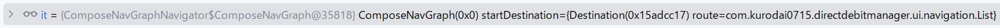

- [ナビゲーション](#ナビゲーション)
  - [セットアップ](#セットアップ)
  - [開始する](#開始する)
  - [NavController を作成する](#navcontroller-を作成する)
  - [NavHost を作成する](#navhost-を作成する)
  - [コンポーザブルに移動する](#コンポーザブルに移動する)
  - [引数を使用して移動する](#引数を使用して移動する)
    - [操作時に複雑なデータを取得](#操作時に複雑なデータを取得)
    - [オプションの引数を追加する](#オプションの引数を追加する)
  - [ディープリンク](#ディープリンク)
  - [ネストナビゲーション](#ネストナビゲーション)
  - [ボトムナビゲーションバーとの統合](#ボトムナビゲーションバーとの統合)
    - [hasRoute() が上手く動作しない場合](#hasroute-が上手く動作しない場合)
      - [解決策](#解決策)
        - [方法１：スタートデスティネーションを判定する](#方法１スタートデスティネーションを判定する)
        - [方法２： findNode() 関数を使用する](#方法２-findnode-関数を使用する)
  - [画面遷移時のアニメーションをカスタマイズする](#画面遷移時のアニメーションをカスタマイズする)
  - [相互運用性](#相互運用性)
    - [Fragment で Navigation を使用して Compose の画面から移動する](#fragment-で-navigation-を使用して-compose-の画面から移動する)
  - [テスト](#テスト)
    - [NavHost のテスト](#navhost-のテスト)
    - [ナビゲーションアクションのテスト](#ナビゲーションアクションのテスト)
  - [さらに詳しく](#さらに詳しく)
    - [サンプル](#サンプル)
  - [引用元資料](#引用元資料)


# ナビゲーション

Navigation コンポーネントは、Jetpack Compose アプリをサポートしています。Navigation コンポーネントのインフラストラクチャと機能を活用しながら、コンポーザブル間を移動できます。

注: Compose についてよく知らない場合は、先に進む前に Jetpack Compose のリソースをご確認ください。


## セットアップ

Compose をサポートするには、アプリ モジュールの build.gradle ファイルで次の依存関係を使用します。

```kotlin
dependencies {
    val nav_version = "2.7.7"

    implementation("androidx.navigation:navigation-compose:$nav_version")
}
```

最新の記述方法は以下なのですが、いったん、上記の記述をしてワーニングを表示してから、その対応方法の提案から修正すると、ワーニングなく、以下の記述に書き換えることができる模様。(2024年8月現在)

```kotlin
implementation(libs.androidx.navigation.compose)
```


## 開始する

アプリにナビゲーションを実装する場合は、ナビゲーション ホスト、グラフ、コントローラを実装します。詳細については、 [ナビゲーションの概要](https://developer.android.com/guide/navigation?hl=ja&_gl=1*ta8je1*_up*MQ..*_ga*ODE2OTg0MTAyLjE3MjM1NDg0MzM.*_ga_6HH9YJMN9M*MTcyMzU0ODQzMy4xLjAuMTcyMzU0ODQzMy4wLjAuMA..) をご覧ください。


## NavController を作成する

Compose で NavController を作成する方法については、 [ナビゲーションコントローラを作成する](https://developer.android.com/guide/navigation/navcontroller?hl=ja&_gl=1*875rd7*_up*MQ..*_ga*ODE2OTg0MTAyLjE3MjM1NDg0MzM.*_ga_6HH9YJMN9M*MTcyMzU0ODQzMy4xLjAuMTcyMzU0ODQzMy4wLjAuMA..) の Compose セクションをご覧ください。


## NavHost を作成する

Compose で NavHost を作成する方法については、Compose のセクションをご覧ください。 [ナビゲーション グラフを設計する](https://developer.android.com/guide/navigation/design?hl=ja&_gl=1*tn1eqj*_up*MQ..*_ga*MTQ1ODQyNjk1OC4xNzI3Njk0MTUx*_ga_6HH9YJMN9M*MTcyNzY5NDE1MS4xLjAuMTcyNzY5NDE1MS4wLjAuMTE0ODgyNzY3Mw..#compose) をご覧ください。


## コンポーザブルに移動する

コンポーザブルへの移動について詳しくは、 [アーキテクチャ内の宛先](https://developer.android.com/guide/navigation/use-graph/navigate?hl=ja&_gl=1*tn1eqj*_up*MQ..*_ga*MTQ1ODQyNjk1OC4xNzI3Njk0MTUx*_ga_6HH9YJMN9M*MTcyNzY5NDE1MS4xLjAuMTcyNzY5NDE1MS4wLjAuMTE0ODgyNzY3Mw..) ご覧ください


## 引数を使用して移動する

Navigation Compose では、コンポーザブルのデスティネーション間で引数を渡すこともできます。これを行うには、基本のナビゲーション ライブラリを使用する場合に [ディープリンクに引数を追加する](https://developer.android.com/guide/navigation/navigation-deep-link?hl=ja&_gl=1*1ct7cpk*_up*MQ..*_ga*MTQ1ODQyNjk1OC4xNzI3Njk0MTUx*_ga_6HH9YJMN9M*MTcyNzY5NDE1MS4xLjAuMTcyNzY5NDE1MS4wLjAuMTE0ODgyNzY3Mw..#implicit) 方法と同様に、引数のプレースホルダをルートに追加する必要があります。

文法的には、 `/{引数名}` の形式で、ルート文字列の後ろに連結します。引数を複数定義する場合は、 `/{引数名1}/{引数名2}/{引数名3}` のような形式にしてください。ただし、この形式は、必須の引数の形式です。任意の引数の形式については [オプションの引数を追加する](#オプションの引数を追加する) を参照してください。

```kotlin
NavHost(startDestination = "profile/{userId}") {
    ...
    composable("profile/{userId}") {...}
}
```

composable() の arguments パラメータは [NamedNavArgument](https://developer.android.com/reference/androidx/navigation/NamedNavArgument?hl=ja&_gl=1*3w5vp8*_up*MQ..*_ga*MTQ1ODQyNjk1OC4xNzI3Njk0MTUx*_ga_6HH9YJMN9M*MTcyNzY5NDE1MS4xLjAuMTcyNzY5NDE1MS4wLjAuMTE0ODgyNzY3Mw..) オブジェクトのリストを受け入れます。 ( NamedNavArgument の定義を省略したら、自動的に String 型の引数になるっぽい)

NamedNavArgument オブジェクトには、引数に関する以下の情報を保持します。

- 名前
- 型
- Null の可否
- デフォルト値

NamedNavArgument オブジェクトを生成する便利な関数 [navArgument()](https://developer.android.com/reference/kotlin/androidx/navigation/package-summary?hl=ja&_gl=1*3w5vp8*_up*MQ..*_ga*MTQ1ODQyNjk1OC4xNzI3Njk0MTUx*_ga_6HH9YJMN9M*MTcyNzY5NDE1MS4xLjAuMTcyNzY5NDE1MS4wLjAuMTE0ODgyNzY3Mw..#navArgument(kotlin.String,kotlin.Function1)) が用意されています。第一引数に、引数の名前を指定し、第二引数のラムダで、型、 Null の可否、デフォルト値を指定することができます。

```kotlin
NavHost(startDestination = "profile/{userId}") {
    ...
    composable(
        "profile/{userId}",
        arguments = listOf(navArgument("userId") { type = NavType.StringType })
    ) {...}
}
```

セットされた引数は、 composable() 関数のラムダ式の引数 ( [NavBackStackEntry](https://developer.android.com/reference/kotlin/androidx/navigation/NavBackStackEntry?hl=ja&_gl=1*4bgoyc*_up*MQ..*_ga*MTQ1ODQyNjk1OC4xNzI3Njk0MTUx*_ga_6HH9YJMN9M*MTcyNzY5NDE1MS4xLjAuMTcyNzY5NDE1MS4wLjAuMTE0ODgyNzY3Mw..) ) を経由して取得します。

```kotlin
composable("profile/{userId}") { backStackEntry ->
    // getString の部分は、取得する型に応じて変更します。
    Profile(navController, backStackEntry.arguments?.getString("userId"))
}
```

デスティネーションに引数を渡すには、 navigate() 関数を呼び出すときに、ルート文字列の後ろに、 `/{引数の値}` の形式で引数を設定します。

```kotlin
navController.navigate("profile/user1234")
```

サポートされる型の一覧については、 [デスティネーション間でデータを渡す](https://developer.android.com/guide/navigation/navigation-pass-data?hl=ja&_gl=1*xq4spb*_up*MQ..*_ga*MTQ1ODQyNjk1OC4xNzI3Njk0MTUx*_ga_6HH9YJMN9M*MTcyNzY5NDE1MS4xLjAuMTcyNzY5NDE1MS4wLjAuMTE0ODgyNzY3Mw..#supported_argument_types) をご覧ください。


### 操作時に複雑なデータを取得

移動時には複雑なデータ オブジェクトを渡すのではなく、ナビゲーション アクションの実行時に引数として必要最低限の情報（一意の識別子やその他の形式の ID など）を渡すことを強くおすすめします。

```kotlin
// ユーザー ID のみを渡す例
navController.navigate("profile/user1234")
```

複雑なオブジェクトは、デスティネーションに到達してから、渡された ID を使用して、作成します。 ID さえ取得できれば、信頼できる単一の情報源から必要な情報を読み込むことができます。

例えば、 ViewModel 内で複雑なオブジェクトを生成したい場合は、 SavedStateHandle を使用します。 ( SavedStateHandle は、メモリ不足によるプロセスの終了時に、データを保持してくれる仕組みです。詳しくは、 [ViewModel の保存済み状態のモジュール](../../../../ガイド/4.アプリアーキテクチャ/3.アーキテクチャコンポーネント/1.UI%20レイヤのライブラリ/3.ライフサイクル対応コンポーネント/2.ViewModel/4.ViewModel%20の保存済み状態のモジュール.md) を参照してください。)

```kotlin
class UserViewModel(
    savedStateHandle: SavedStateHandle,
    private val userInfoRepository: UserInfoRepository
) : ViewModel() {

    private val userId: String = checkNotNull(savedStateHandle["userId"])

    // 渡されたユーザー ID を使用して、 userInfoRepository などの
    // データレイヤーからユーザー情報を取得します。
    private val userInfo: Flow<UserInfo> = userInfoRepository.getUserInfo(userId)

// …

}
```

この手法により、設定の変更時のデータ損失や、対象のオブジェクトの更新時や変更時の不整合を防ぐことができます。

複雑なデータを引数として渡すのを避けるべき理由についての詳しい説明と、サポートされる引数タイプのリストについては、 [デスティネーション間でデータを渡す](https://developer.android.com/guide/navigation/navigation-pass-data?hl=ja&_gl=1*1hcwrjg*_up*MQ..*_ga*MTQ1ODQyNjk1OC4xNzI3Njk0MTUx*_ga_6HH9YJMN9M*MTcyNzY5NDE1MS4xLjAuMTcyNzY5NDE1MS4wLjAuMTE0ODgyNzY3Mw..#supported_argument_types) をご覧ください。


### オプションの引数を追加する

Navigation Compose は、省略可能なナビゲーション引数もサポートしています。省略可能な引数が、必須の引数と異なる点は、以下の 2 点です。

- クエリ パラメータの構文 ( `"?argName={argName}"` ) を使用して指定する必要があります。

- 以下のいずれかの方法で、デフォルト値を設定する必要があります。
  - `defaultValue` を設定する。
  - nullable = true を指定する。 ( デフォルト値が省略されていた場合に、デフォルト値を暗黙的に null に設定するためです。)

つまり、省略可能なすべての引数は、 NamedNavArgument を生成して、 composable() 関数の arguments 引数に、明示的に渡す必要があります。

```kotlin
composable(
    "profile?userId={userId}",
    // 任意パラメータの場合は、ここが省略不可になります。
    arguments = listOf(navArgument("userId") { defaultValue = "user1234" })
) { backStackEntry ->
    Profile(navController, backStackEntry.arguments?.getString("userId"))
}
```

デスティネーションに渡される引数がない場合でも、代わりに defaultValue の「user1234」が使用されます。

ルートを通じて引数を処理するという構造のため、コンポーザブルは Navigation から完全に独立しており、テストがかなり容易になります。


## ディープリンク

Navigation Compose は、 composable() 関数の一部として定義できる暗黙的なディープリンクもサポートしています。 composable() 関数の deepLinks パラメータには、 [NavDeepLink](https://developer.android.com/reference/androidx/navigation/NavDeepLink?hl=ja&_gl=1*t4szj4*_up*MQ..*_ga*MTQ1ODQyNjk1OC4xNzI3Njk0MTUx*_ga_6HH9YJMN9M*MTcyNzY5NDE1MS4xLjAuMTcyNzY5NDE1MS4wLjAuMTE0ODgyNzY3Mw..) オブジェクトを渡します。これを生成する便利な関数に [navDeepLink()](https://developer.android.com/reference/kotlin/androidx/navigation/package-summary?hl=ja&_gl=1*qgj2bm*_up*MQ..*_ga*MTQ1ODQyNjk1OC4xNzI3Njk0MTUx*_ga_6HH9YJMN9M*MTcyNzY5NDE1MS4xLjAuMTcyNzY5NDE1MS4wLjAuMTE0ODgyNzY3Mw..#navDeepLink(kotlin.Function1)) 関数が用意されています。

```kotlin
// 型安全な実装の例

@Serializable data class Profile(val id: String)
val uri = "https://www.example.com"

composable<Profile>(
  deepLinks = listOf(
    navDeepLink<Profile>(basePath = "$uri/profile")
  )
) { backStackEntry ->
  ProfileScreen(id = backStackEntry.toRoute<Profile>().id)
}
```

```kotlin
// 型安全ではない実装の例

val uri = "https://www.example.com"

composable(
    "profile?id={id}",
    deepLinks = listOf(navDeepLink { uriPattern = "$uri/{id}" })
) { backStackEntry ->
    Profile(navController, backStackEntry.arguments?.getString("id"))
}
```

これらのディープリンクを使用すると、特定の URL、アクション、または MIME タイプを 作成します。

デフォルトでは、これらのディープリンクは外部アプリには公開されません。これらのディープリンクを外部に公開するには、` <intent-filter>` 要素をアプリの manifest.xml ファイルに追加します。マニフェストの `<activity>` 要素を使用します。

```xml
<activity>
    <intent-filter>
        <data android:scheme="https" android:host="www.example.com" />
    </intent-filter>
</activity>
```

別のアプリによってディープリンクがトリガーされると、Navigation はそのコンポーザブルに自動的にディープリンクします。

この同じディープリンクを使用して、コンポーザブルの適切なディープリンクを含む PendingIntent を作成することもできます。

```kotlin
val id = "exampleId"
val context = LocalContext.current
val deepLinkIntent = Intent(
    Intent.ACTION_VIEW,
    "https://www.example.com/$id".toUri(),
    context,
    MyActivity::class.java
)

val deepLinkPendingIntent: PendingIntent? = TaskStackBuilder.create(context).run {
    addNextIntentWithParentStack(deepLinkIntent)
    getPendingIntent(0, PendingIntent.FLAG_UPDATE_CURRENT)
}
```

この deepLinkPendingIntent を他の PendingIntent と同様に使用して、ディープリンクのデスティネーションでアプリを開くことができます。


## ネストナビゲーション

ネストされたナビゲーション グラフの作成方法については、以下をご覧ください。

- [ネストされたグラフ](https://developer.android.com/guide/navigation/design/nested-graphs?hl=ja&_gl=1*11uy9c7*_up*MQ..*_ga*MTQ1ODQyNjk1OC4xNzI3Njk0MTUx*_ga_6HH9YJMN9M*MTcyNzY5NDE1MS4xLjAuMTcyNzY5NDE1MS4wLjAuMTE0ODgyNzY3Mw..)


## ボトムナビゲーションバーとの統合

コンポーザブルの階層内の上位のレベルで NavController を定義することで、Navigation を他のコンポーネント（ボトム ナビゲーション コンポーネントなど）と接続できます。これにより、下部のアイコンを選択して移動できるようになります。

[BottomNavigation](https://developer.android.com/reference/kotlin/androidx/compose/material/package-summary?hl=ja&_gl=1*1cy0xxw*_up*MQ..*_ga*MzQyMTg2MjQ5LjE3MzQwODMzODE.*_ga_6HH9YJMN9M*MTczNDA4MzM4MS4xLjAuMTczNDA4MzM4MS4wLjAuMTkxNzE4MjQxNA..#BottomNavigation(androidx.compose.ui.Modifier,androidx.compose.ui.graphics.Color,androidx.compose.ui.graphics.Color,androidx.compose.ui.unit.Dp,kotlin.Function1)) コンポーネントと [BottomNavigationItem](https://developer.android.com/reference/kotlin/androidx/compose/material/package-summary?hl=ja&_gl=1*1cy0xxw*_up*MQ..*_ga*MzQyMTg2MjQ5LjE3MzQwODMzODE.*_ga_6HH9YJMN9M*MTczNDA4MzM4MS4xLjAuMTczNDA4MzM4MS4wLjAuMTkxNzE4MjQxNA..#(androidx.compose.foundation.layout.RowScope).BottomNavigationItem(kotlin.Boolean,kotlin.Function0,kotlin.Function0,androidx.compose.ui.Modifier,kotlin.Boolean,kotlin.Function0,kotlin.Boolean,androidx.compose.foundation.interaction.MutableInteractionSource,androidx.compose.ui.graphics.Color,androidx.compose.ui.graphics.Color)) コンポーネントを使用するには、androidx.compose.material の依存関係を Android アプリに追加します。

```kotlin
dependencies {
    implementation("androidx.compose.material:material:1.7.2")
}

android {
    buildFeatures {
        compose = true
    }

    composeOptions {
        kotlinCompilerExtensionVersion = "1.5.15"
    }

    kotlinOptions {
        jvmTarget = "1.8"
    }
}
```

ボトムナビゲーション バーのアイテムをナビゲーション グラフ内のルートにリンクするには、ルートクラスとアイコンを持つクラス（下記の TopLevelRoute など）を定義することをおすすめします。

```kotlin
data class TopLevelRoute<T : Any>(
    val name: String,
    val route: T,
    val icon: ImageVector
)
```

次に、そのアイテムを [BottomNavigationItem](https://developer.android.com/reference/kotlin/androidx/compose/material/package-summary?hl=ja&_gl=1*t8v954*_up*MQ..*_ga*MTQ1ODQyNjk1OC4xNzI3Njk0MTUx*_ga_6HH9YJMN9M*MTcyNzY5NDE1MS4xLjAuMTcyNzY5NDE1MS4wLjAuMTE0ODgyNzY3Mw..#(androidx.compose.foundation.layout.RowScope).BottomNavigationItem(kotlin.Boolean,kotlin.Function0,kotlin.Function0,androidx.compose.ui.Modifier,kotlin.Boolean,kotlin.Function0,kotlin.Boolean,androidx.compose.foundation.interaction.MutableInteractionSource,androidx.compose.ui.graphics.Color,androidx.compose.ui.graphics.Color)) が参照予定のリストに格納します。

```kotlin
val topLevelRoutes = listOf(
    TopLevelRoute("Profile", Profile, Icons.Profile),
    TopLevelRoute("Friends", Friends, Icons.Friends)
)
```

[BottomNavigation](https://developer.android.com/reference/kotlin/androidx/compose/material/package-summary?hl=ja&_gl=1*1usy7jb*_up*MQ..*_ga*Mjc5NDcyMzQ2LjE3MzM3MzcyMTU.*_ga_6HH9YJMN9M*MTczMzczNzIxNS4xLjAuMTczMzczNzIxNS4wLjAuMTk4MjY5OTIwNA..#BottomNavigation(androidx.compose.ui.Modifier,androidx.compose.ui.graphics.Color,androidx.compose.ui.graphics.Color,androidx.compose.ui.unit.Dp,kotlin.Function1)) コンポーザブルで、currentBackStackEntryAsState() 関数を使用して、現在の NavBackStackEntry を取得します。このエントリにより、現在の NavDestination にアクセスできるようになります。 [NavDestination](https://developer.android.com/reference/androidx/navigation/NavDestination?hl=ja&_gl=1*1usy7jb*_up*MQ..*_ga*Mjc5NDcyMzQ2LjE3MzM3MzcyMTU.*_ga_6HH9YJMN9M*MTczMzczNzIxNS4xLjAuMTczMzczNzIxNS4wLjAuMTk4MjY5OTIwNA..) 階層を使用して、アイテムのルートを現在のデスティネーション、および、その親デスティネーションのルートと比較することで、各 BottomNavigationItem の選択された状態を判定できます。これにより、 [ネストされたナビゲーション](https://developer.android.com/develop/ui/compose/navigation?hl=ja&_gl=1*ejbxqk*_up*MQ..*_ga*Mjc5NDcyMzQ2LjE3MzM3MzcyMTU.*_ga_6HH9YJMN9M*MTczMzczNzIxNS4xLjAuMTczMzczNzIxNS4wLjAuMTk4MjY5OTIwNA..#nested-nav) を使用しているケースに対応できます。

アイテムをタップすると、そのアイテムに移動するように、 onClick ラムダを navigate の呼び出しに接続するためにも、アイテムのルートが使用されます。saveState と restoreState のフラグを使用すると、ボトム ナビゲーション アイテムを切り替えるときに、そのアイテムの状態とバックスタックが正しく保存され、復元されます。

```kotlin
import androidx.navigation.NavDestination.Companion.hasRoute

val navController = rememberNavController()
Scaffold(
    bottomBar = {
        BottomNavigation {
            val navBackStackEntry by navController.currentBackStackEntryAsState()
            val currentDestination = navBackStackEntry?.destination
            topLevelRoutes.forEach { topLevelRoute ->
                BottomNavigationItem(
                    icon = {
                        Icon(topLevelRoute.icon,
                            contentDescription = topLevelRoute.name)
                    },
                    label = { Text(topLevelRoute.name) },
                    selected = currentDestination?.hierarchy?.any {
                        // 上記 import 文が必要です。
                        it.hasRoute(topLevelRoute.route::class)

                        // 型安全なルートの場合は、おそらく以下の記述になります。
                        it.hasRoute<Profile>()

                        // hasRoute() が上手く動作しない場合があるようです。
                        // 詳細は、後述のセクション 「 hasRoute() が上手く動作しない場合」
                        // を参照してください。
                    } == true,
                    onClick = {
                        navController.navigate(topLevelRoute.route) {
                            // ユーザーがアイテムを選択する際に、バックスタックに
                            // 大量の宛先スタックが蓄積されるのを避けるために、
                            // グラフの開始デスティネーションにポップアップします。
                            popUpTo(navController.graph.findStartDestination().id) {
                                saveState = true
                            }
                            // 同じアイテムを再選択するときに、
                            // 同じ宛先が複数回コピーされないようにする。
                            launchSingleTop = true
                            // 以前に選択した項目を再選択するときに状態を復元する。
                            restoreState = true
                        }
                    }
                )
            }
        }
    }
) { innerPadding ->
    NavHost(
        navController,
        startDestination = Profile,
        Modifier.padding(innerPadding)
    ) {
        composable<Profile> { ProfileScreen(...) }
        composable<Friends> { FriendsScreen(...) }
    }
}
```

ここでは、 navController をホイスティングすることにより、 BottomNavigation 内で、 navController.currentBackStackEntryAsState() 関数を実行することが可能になり、最新の NavBackStackEntry の状態を参照することが可能になっています。


### hasRoute() が上手く動作しない場合

hasRoute() 関数が上手く動作しない場合がありました。 (というか、今のところ、上手くいったことがないです。)

例えば、以下のコードは、バックスタックに List ルートを含んでいても、 true を返してくれませんでした。

```kotlin
val hasList = navController.currentBackStackEntry?.destination?.hierarchy?.any {
    it.hasRoute<List>()
} ?: false
```

原因として、考えられるのは、 List デスティネーションの上に 「ダイアログデスティネーション」 を表示していたため、ナビゲーショングラフが意図せずネストしてしまい、 (ダイアログデスティネーションをホストされているデスティネーションの上に表示すると、グラフがネストしているように見えます。) hasRoute() 関数は、ネストされたグラフの親のグラフまでは探索しないようで、 List が含まれていないと判定されたように見えました。

以下の 2 つの図は、 any{} ブロック内の it が何を参照しているかデバッグした様子です。

まず、以下の図からは、ダイアログデスティネーション ( DelComp というルート) を直接参照していることがわかります。


次に、以下の図からは、ホストされたデスティネーション ( List というルート) が DelComp の場合とは異なり、 ComposeNavGraph を介して、間接的に参照されていることがわかります。



このことから、ダイアログデスティネーションを使用すると、グラグがネストされているのでは？と思いました。


#### 解決策

では、ダイアログデスティネーションを使用した場合でも、バックスタック内に特定のルートが含まれているかを判定するにはどうすれば良いでしょうか？

以下の 2 通りの方法で、正しく判定可能な実装が実現できました。


##### 方法１：スタートデスティネーションを判定する

```kotlin
val hasList = navController.graph.findStartDestination().hasRoute<List>()
```

この方法では、現在のバックスタックに含まれる全てのデスティネーションを探索せず、スタートデスティネーションのみを判定します。

そのため、バックスタックの中間に含まれているデスティネーションを判定するのには使用できません。


##### 方法２： findNode() 関数を使用する

【注意】この方法もうまくいかない場合があります。 (スタートデスティネーションに設定したデスティネーションは、常に見つかってしまうような...？よくわかりません...。)

```kotlin
val hasList = navController.graph.findNode(List) != null
```

findNode() 関数は、デスティネーション自体 ( NavDestination ) を返す関数です。

そのため、方法１よりも、コストが高くなると思われますが、バックスタックの中間に存在するデスティネーションも判定の対象に含まれるはずです。

findNode() 関数が null を返す場合は、バックスタックに該当のデスティネーションが含まれていなかった。と判定できると思われます。


## 画面遷移時のアニメーションをカスタマイズする

[こちら](../../../../ガイド/4.アプリアーキテクチャ/5.アプリの操作/2.Navigation%20コンポーネント/4.ナビゲーショングラフを使用する/5.デスティネーション間の遷移をアニメーション化する.md/#compose-の場合) のドキュメントを参照してください。


## 相互運用性

Compose で Navigation コンポーネントを使用するには、次の 2 つの方法があります。

- Navigation コンポーネントを使用して、フラグメントにナビゲーション グラフを定義します。
- Compose のデスティネーションを使用する NavHost コンポーザブル関数で、ナビゲーション グラフを定義します。
  - これは、ナビゲーション グラフ内のすべての画面がコンポーザブルである場合にのみ可能です。

したがって、Compose アプリと View アプリを組み合わせる場合は、フラグメント ベースの Navigation コンポーネントを使用することをおすすめします。フラグメントは、View ベースの画面、Compose の画面、および View と Compose の両方を使用する画面を保持します。

将来的に、各フラグメントのコンテンツが Compose 置き換えられたら、これらすべての画面を Navigation Compose に関連付けて、すべてのフラグメントを削除することで、フラグメントベースの Navigation から移行できます。


### Fragment で Navigation を使用して Compose の画面から移動する

Compose コード内のデスティネーションを変更するには、階層内の任意のコンポーザブルに渡してそのコンポーザブルからトリガーできるイベントを公開します。

```kotlin
@Composable
fun MyScreen(onNavigate: (Int) -> Unit) {
    Button(onClick = { onNavigate(R.id.nav_profile) } { /* ... */ }
}
```

フラグメント内で、NavController を見つけてデスティネーションに移動することにより、Compose とフラグメント ベースの Navigation コンポーネントを橋渡しします。

```kotlin
override fun onCreateView( /* ... */ ) {
    setContent {
        MyScreen(onNavigate = { dest -> findNavController().navigate(dest) })
    }
}
```

または、NavController を Compose 階層の上から下に渡すこともできます。ただし、シンプルな関数を公開すると、再利用とテストがより簡単になります。


## テスト

Navigation のコードをコンポーザブルのデスティネーションから分離して、NavHost コンポーザブルとは別に、各コンポーザブルを個別にテストできるようにします。

つまり、navController を任意のコンポーザブルに直接渡すのではなく、ナビゲーション コールバックをパラメータとして渡す必要があります。これにより、テストで navController のインスタンスが不要になるため、すべてのコンポーザブルを個別にテストできます。

composable ラムダによって一定のレベルの間接性が提供されるため、Navigation のコードをコンポーザブル自体と分離できるようになります。このことは次の 2 つの方向に機能します。

- 解析された引数のみをコンポーザブルに渡します。
- NavController 自体ではなく、移動するコンポーザブルによってトリガーされるラムダを渡します。

たとえば、userId を入力として取り、ユーザーに友だちのプロフィール ページへの移動を許可する ProfileScreen コンポーザブルの場合、次のようなシグネチャになります。

```kotlin
@Composable
fun ProfileScreen(
    userId: String,
    navigateToFriendProfile: (friendUserId: String) -> Unit
) {
    // ...
}
```

このように、ProfileScreen コンポーザブルは Navigation とは独立して動作するため、独立してテストできます。composable ラムダは、Navigation API とコンポーザブルの間のギャップを埋めるために必要な最小限のロジックをカプセル化することになります。

```kotlin
@Serializable data class Profile(id: String)

composable<Profile> { backStackEntry ->
    val profile = backStackEntry.toRoute<Profile>()
    ProfileScreen(userId = profile.id) { friendUserId ->
        navController.navigate(route = Profile(id = friendUserId))
    }
}
```

NavHost、コンポーザブルに渡されるナビゲーション アクション、個々の画面コンポーザブルをテストすることにより、アプリ ナビゲーションの要件に対応するテストを作成することをおすすめします。


### NavHost のテスト

NavHost のテストを開始するには、次の navigation-testing の依存関係を追加します。

```
dependencies {
// ...
    androidTestImplementation "androidx.navigation:navigation-testing:$navigationVersion"
    // ...
}
```

アプリの NavHost を、NavHostController をパラメータとして受け取るコンポーザブルでラップします。

```kotlin
@Composable
fun AppNavHost(navController: NavHostController){
  NavHost(navController = navController){ ... }
}
```

これで、ナビゲーション テスト アーティファクト [TestNavHostController](https://developer.android.com/reference/kotlin/androidx/navigation/testing/TestNavHostController?hl=ja&_gl=1*zq2j48*_up*MQ..*_ga*MTU0NjM2NDc1Mi4xNzMzNzkyNDc4*_ga_6HH9YJMN9M*MTczMzc5MjQ3Ny4xLjAuMTczMzc5MjQ3OC4wLjAuMTQ5MTIzMzk1) のインスタンスを渡すことで、AppNavHost と NavHost 内で定義されたすべてのナビゲーション ロジックをテストできます。アプリの開始デスティネーションと NavHost を検証する UI テストは次のようになります。

```kotlin
class NavigationTest {

    @get:Rule
    val composeTestRule = createComposeRule()
    lateinit var navController: TestNavHostController

    @Before
    fun setupAppNavHost() {
        composeTestRule.setContent {
            navController = TestNavHostController(LocalContext.current)
            navController.navigatorProvider.addNavigator(ComposeNavigator())
            AppNavHost(navController = navController)
        }
    }

    // Unit test
    @Test
    fun appNavHost_verifyStartDestination() {
        composeTestRule
            .onNodeWithContentDescription("Start Screen")
            .assertIsDisplayed()
    }
}
```


### ナビゲーションアクションのテスト

ナビゲーションの実装は複数の方法でテストできます。UI 要素をクリックして表示されたデスティネーションを検証する方法や、想定されるルートと現在のルートを比較する方法があります。

具体的なアプリの実装をテストする場合は、UI をクリックすることをおすすめします。このテスト方法と、個々のコンポーズ可能な関数を個別にテストする方法については、 [Jetpack Compose でのテスト](https://developer.android.com/codelabs/jetpack-compose-testing?hl=ja&_gl=1*68ofdy*_up*MQ..*_ga*MTU0NjM2NDc1Mi4xNzMzNzkyNDc4*_ga_6HH9YJMN9M*MTczMzc5MjQ3Ny4xLjAuMTczMzc5MjQ3OC4wLjAuMTQ5MTIzMzk1) Codelab をご覧ください。

navController（navController の currentBackStackEntry）を使用して、現在のルートと想定されるルートを比較することで、アサーションを確認することもできます。

```kotlin
@Test
fun appNavHost_clickAllProfiles_navigateToProfiles() {
    composeTestRule.onNodeWithContentDescription("All Profiles")
        .performScrollTo()
        .performClick()

    assertTrue(navController.currentBackStackEntry?.destination?.hasRoute<Profile>() ?: false)
}
```

Compose のテストの基本の詳細については、 [Compose レイアウトのテスト](https://developer.android.com/develop/ui/compose/testing?hl=ja&_gl=1*68ofdy*_up*MQ..*_ga*MTU0NjM2NDc1Mi4xNzMzNzkyNDc4*_ga_6HH9YJMN9M*MTczMzc5MjQ3Ny4xLjAuMTczMzc5MjQ3OC4wLjAuMTQ5MTIzMzk1) と [Jetpack Compose でのテスト](https://developer.android.com/codelabs/jetpack-compose-testing?hl=ja&_gl=1*wymxcl*_up*MQ..*_ga*MTU0NjM2NDc1Mi4xNzMzNzkyNDc4*_ga_6HH9YJMN9M*MTczMzc5MjQ3Ny4xLjAuMTczMzc5MjQ3OC4wLjAuMTQ5MTIzMzk1) の Codelab をご覧ください。ナビゲーション コードの高度なテストについて詳しくは、 [ナビゲーションをテストする](https://developer.android.com/guide/navigation/navigation-testing?hl=ja&_gl=1*wymxcl*_up*MQ..*_ga*MTU0NjM2NDc1Mi4xNzMzNzkyNDc4*_ga_6HH9YJMN9M*MTczMzc5MjQ3Ny4xLjAuMTczMzc5MjQ3OC4wLjAuMTQ5MTIzMzk1) のガイドをご覧ください。


## さらに詳しく

Jetpack Navigation の詳細については、 [Navigation コンポーネント スタートガイド](https://developer.android.com/guide/navigation/navigation-getting-started?hl=ja&_gl=1*wymxcl*_up*MQ..*_ga*MTU0NjM2NDc1Mi4xNzMzNzkyNDc4*_ga_6HH9YJMN9M*MTczMzc5MjQ3Ny4xLjAuMTczMzc5MjQ3OC4wLjAuMTQ5MTIzMzk1) を参照するか、 [Jetpack Compose ナビゲーション Codelab](https://developer.android.com/codelabs/jetpack-compose-navigation?hl=ja&_gl=1*wymxcl*_up*MQ..*_ga*MTU0NjM2NDc1Mi4xNzMzNzkyNDc4*_ga_6HH9YJMN9M*MTczMzc5MjQ3Ny4xLjAuMTczMzc5MjQ3OC4wLjAuMTQ5MTIzMzk1) をご覧ください。

さまざまな画面サイズ、向き、フォーム ファクタに適応するようにアプリのナビゲーションを設計する方法については、 [レスポンシブ UI のナビゲーション](https://developer.android.com/guide/topics/large-screens/navigation-for-responsive-uis?hl=ja&_gl=1*1q9yfp7*_up*MQ..*_ga*MTU0NjM2NDc1Mi4xNzMzNzkyNDc4*_ga_6HH9YJMN9M*MTczMzc5MjQ3Ny4xLjAuMTczMzc5MjQ3OC4wLjAuMTQ5MTIzMzk1) をご覧ください。

モジュール化されたアプリでの Compose ナビゲーションのより高度な実装（ネストされたグラフや下部のナビゲーション バーの統合などの概念）について詳しくは、GitHub の [最新の Android](https://github.com/android/nowinandroid) アプリをご覧ください。


### サンプル

- [Jetnews sample - Github](https://github.com/android/compose-samples/tree/main/JetNews)
- [Now in Android App - Github](https://github.com/android/nowinandroid/tree/main)


## 引用元資料

- [Compose でのナビゲーション](https://developer.android.com/develop/ui/compose/navigation?hl=ja)
