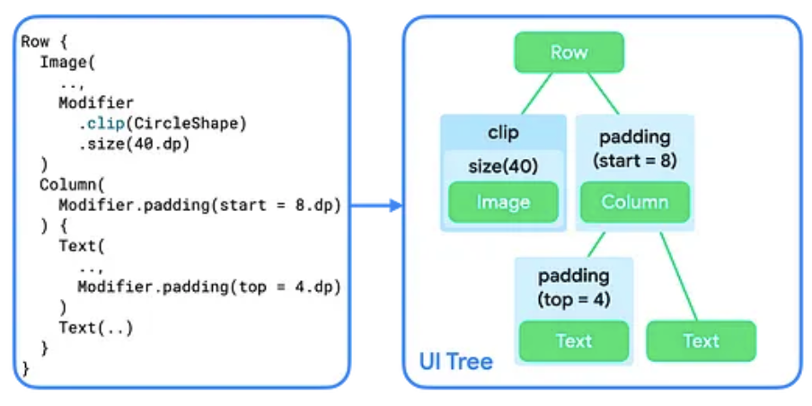

- [制約と修飾子の順序](#制約と修飾子の順序)
  - [UI ツリーの修飾子](#ui-ツリーの修飾子)
  - [レイアウトフェーズの制約](#レイアウトフェーズの制約)
    - [制約とは](#制約とは)
    - [制約のタイプ](#制約のタイプ)
    - [親から子に制約を渡す方法](#親から子に制約を渡す方法)

# 制約と修飾子の順序

## UI ツリーの修飾子

UI ツリーでは、修飾子をレイアウトノードのラッパーノードとして可視化できます。

レイアウトフェーズでは、ツリーをたどる際に、修飾子ノードにもアクセスされます。そのため、修飾子は、ラップするノード ( or チェーンされた修飾子) のサイズと配置に影響を与えることが可能になります。

上記の例で、 Image は `Modifier.clip().size()` のようにチェーンしています。すると、図のように、 Image は size にラップされ、さらに clip でラップされます。

## レイアウトフェーズの制約

レイアウトフェーズでは、次の 3 ステップのアルゴリズムに従って、各レイアウトノードの幅と高さ、 x 座標と y 座標を決定します。

1. 子を測定する
   - ノードはその子が存在する場合は、子のサイズを測定します。
2. 自分自身のサイズを決定する
   - 子のサイズの測定値に基づいて、自分自身のサイズを決定します。
3. 子を配置する
   - 自分自身の位置を基準として、子ノードを配置します。

Constraints は、アルゴリズムの最初の 2 つのステップで、ノードに適したサイズを見つけるのに役立ちます。

### 制約とは

制約は、ノードの幅と高さの最小値と最大値を定義します。ノードがサイズを決定するとき、測定されたサイズはこのサイズ範囲内に収まる必要があります。

### 制約のタイプ

制約は次のいずれかに分類されます。

- 制限付き
  - 最小値と最大値が指定されたもの
  - 有限な範囲を示します。
- 制限なし
  - 最小値と最大値の制限がないもの
  - 0 ～ 無限大まで、どんな値でもとることが可能です。
- 完全一致
  - 最小値と最大値が同じ状態のもの
  - 指定したサイズに完全に一致する必要があります。
- 組み合わせ
  - 上記三つのパターンの中から複数のパターンを組み合わせたもの
  - 例えば、最小値は制限付きだけど、最大値は制限なしなど。

### 親から子に制約を渡す方法

「レイアウトフェーズの制約」 セクションで説明した通り、ノードは、最初のステップで子ノードのサイズを測定します。その際に、制約は親から子へ渡されます。つまり、親は子に、最大値と最小値の制約を渡して、子は、この範囲内でサイズを決定することになります。

以降の説明は、制約がどのように渡され、どのようにサイズが決定するかの説明です。 YouTube でも詳しく説明されていますが、実際のコードがなかったため、まとめの記述は後日に回します。制約の実際のコードは、カスタムレイアウトの章で説明があるようです。

