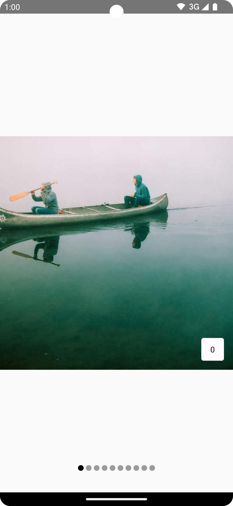
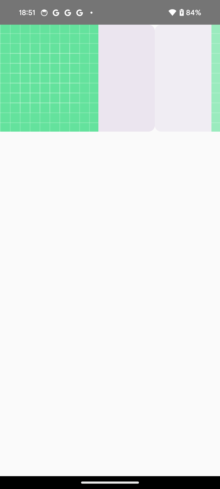

- [Pager](#pager)
  - [HorizontalPager](#horizontalpager)
  - [VerticalPager](#verticalpager)
  - [遅延作成](#遅延作成)
    - [画面外のページを読み込む](#画面外のページを読み込む)
  - [ページング内のアイテムまでスクロール](#ページング内のアイテムまでスクロール)
  - [ページの状態の変更に関する通知を受け取る](#ページの状態の変更に関する通知を受け取る)
  - [ページインジケーターを追加する](#ページインジケーターを追加する)
  - [アイテムのスクロール効果をコンテンツに適用する](#アイテムのスクロール効果をコンテンツに適用する)
  - [カスタムのページサイズ](#カスタムのページサイズ)
  - [コンテンツのパディング](#コンテンツのパディング)
  - [スクロール動作をカスタマイズする](#スクロール動作をカスタマイズする)
    - [スナップ距離](#スナップ距離)


# Pager

**ここに記載しているページャーは試験運用中であるため、今後廃止されたり変更される可能性があります。ただし、ページャーの API が存在しないなんてことはないと思うので、近いうちに安定板がリリースされるとは思う。**


## HorizontalPager

左右に水平方向にスクロールするページャーを作成するには、 HorizontalPager を使用します。

```kotlin
// Display 10 items
val pagerState = rememberPagerState(pageCount = {
    10
})
HorizontalPager(state = pagerState) { page ->
    // Our page content
    Text(
        text = "Page: $page",
        modifier = Modifier.fillMaxWidth()
    )
}
```


## VerticalPager

上下にスクロールするページャーを作成するには、 VerticalPager を使用します。

```kotlin
// Display 10 items
val pagerState = rememberPagerState(pageCount = {
    10
})
VerticalPager(state = pagerState) { page ->
    // Our page content
    Text(
        text = "Page: $page",
        modifier = Modifier.fillMaxWidth()
    )
}
```


## 遅延作成

HorizontalPager と VerticalPager の両方のページは、必要になってからページを生成する遅延生成と配置が行われます。ユーザーがページをスクロールすると、コンポーザブルは不要になったページを削除します。


### 画面外のページを読み込む

デフォルトでは、ページャーは画面に表示されているページのみを読み込みます。より多くのページを画面外に読み込むには、 beyondBoundsPageCount を 0 より大きい値に設定します。


## ページング内のアイテムまでスクロール

ページャーで特定のページにスクロールするには、 rememberPagerState() を使用して PagerState オブジェクトを作成し、 state パラメータとしてページャーに渡します。この状態に対して、 CoroutineScope 内で PagerState#scrollToPage() を呼び出すことができます。

```kotlin
val pagerState = rememberPagerState(pageCount = {
    10
})
HorizontalPager(state = pagerState) { page ->
    // Our page content
    Text(
        text = "Page: $page",
        modifier = Modifier
            .fillMaxWidth()
            .height(100.dp)
    )
}

// scroll to page
val coroutineScope = rememberCoroutineScope()
Button(onClick = {
    coroutineScope.launch {
        // Call scroll to on pagerState
        pagerState.scrollToPage(5)
    }
}, modifier = Modifier.align(Alignment.BottomCenter)) {
    Text("Jump to Page 5")
}
```

ページ移動にアニメーションをつけるには、 `scrollToPage` 関数を `animateScrollToPage` 関数に変更すれば OK です。


## ページの状態の変更に関する通知を受け取る

PagerState には、ページに関する情報を含む 3 つのプロパティ ( currentPage , settledPage , targetPage ) があります。

- currentPage
  - 指を離したときに表示されるページが変化したときに値が返されます
  - デフォルトでは、 1 / 2 ページ分移動したら表示されるページが変わるようです。
- settledPage
  - アニメーションが終了して、ページが表示されきった際に、そのページを返します
- targetPage
  - 1 / 5 ページ分くらいスワイプしたときに、次のページの番号を返します。
  - ドキュメントには、 「ページ遷移を意図した際に、その遷移先のページが返される」 と記載されていますが、非常に使いづらいパラメータだと思います。

```kotlin
val pagerState = rememberPagerState(pageCount = {
    10
})

LaunchedEffect(pagerState) {
    // snapshotFlow から値を収集します。 
    snapshotFlow { pagerState.currentPage }.collect { page ->
        // 値が変更された際に実施したい処理
        Log.d("Page change", "Page changed to $page")
    }
}

HorizontalPager(
    state = pagerState,
) { page ->
    Text(
        text = "Page: $page",
        fontSize = 40.sp,
        modifier = Modifier
            .fillMaxWidth()
            .height(100.dp)
    )
}
```


## ページインジケーターを追加する

ページにインジケーターを追加するには、PagerState オブジェクトを使用して、ページ数の中から選択されているページに関する情報を取得し、カスタム インジケーターを描画します。

たとえば、単純な円のインジケーターが必要な場合は、pagerState.currentPage を使用して、円の数を繰り返し、ページが選択されているかどうかに応じて円の色を変更できます。

```kotlin
val pagerState = rememberPagerState(pageCount = {
    4
})
HorizontalPager(
    state = pagerState,
    modifier = Modifier.fillMaxSize()
) { page ->
    // Our page content
    Text(
        text = "Page: $page",
    )
}
Row(
    Modifier
        .wrapContentHeight()
        .fillMaxWidth()
        .align(Alignment.BottomCenter)
        .padding(bottom = 8.dp),
    horizontalArrangement = Arrangement.Center
) {
    repeat(pagerState.pageCount) { iteration ->
        val color = if (pagerState.currentPage == iteration) Color.DarkGray else Color.LightGray
        Box(
            modifier = Modifier
                .padding(2.dp)
                .clip(CircleShape)
                .background(color)
                .size(16.dp)
        )
    }
}
```




## アイテムのスクロール効果をコンテンツに適用する

以下のコードは、カードが完全に表示されているときは、完全に不透明で、カードが完全に隠れるまでに不透明度が 30 % (透明度が 70 % ) になるアニメーションを行う例です。


```kotlin
val pagerState = rememberPagerState(pageCount = {
    4
})

HorizontalPager(state = pagerState) { page ->
    Card(
        Modifier
            .fillMaxWidth()
            .height(200.dp)
            .graphicsLayer {
                // スナップ位置から各ページまでの距離
                // スナップ位置は、-0.5から+0.5までの範囲で表され、少しもページがスワイプされていなければ、
                // 中央の 0.0 の位置となる。
                // currentPageOffsetFraction は、中心位置からどれだけスワイプされたかの距離を示す。
                val pageOffset =
                    ((pagerState.currentPage - page) + pagerState.currentPageOffsetFraction)
                        .absoluteValue
                // 最小値 0 、最大値 1 までの距離の中で、透明度を 0.3 ～ 1.0 で設定する。
                alpha = lerp(
                    start = 0.3f, stop = 1f, fraction = 1f - pageOffset.coerceIn(0f, 1f)
                )
            }) {
        Image(
            painter = painterResource(id = R.drawable.ic_launcher_background),
            contentDescription = null,
            modifier = Modifier.fillMaxSize()
        )
    }
}
```




## カスタムのページサイズ

デフォルトでは、 HorizontalPager は画面の幅いっぱいを、 VerticalPager は高さいっぱいを占有します。 pageSize 変数を設定すると、その動作を変更することができます。 pageSize に設定できるものは以下の三種類です。

- PageSize.Fill (デフォルト)
  - 画面の幅、もしくは高さいっぱいに広がります。
- PageSize.Fixed
  - 計算の必要がない固定値を設定できます。
- PageSize
  - 独自の計算によって動的に値を設定できます。

たとえば、固定幅のページを 100.dp に設定するには、次のようにします。

```kotlin
val pagerState = rememberPagerState(pageCount = {
    4
})
HorizontalPager(
    state = pagerState,
    pageSize = PageSize.Fixed(100.dp)
) { page ->
    // page content
}
```

独自の計算によって、動的に値を設定するには、以下のようにします。

```kotlin
val pagerState = rememberPagerState(pageCount = {
    4
})
HorizontalPager(
    state = pagerState,
    pageSize = threePagesPerViewport
) { page ->
    // page content
}

// 一つのページの幅が、画面幅の 1 / 3 の幅になります。
private val threePagesPerViewport = object : PageSize {
    override fun Density.calculateMainAxisPageSize(
        availableSpace: Int, // 利用可能なスペース
        pageSpacing: Int // ページ間の余白
    ): Int {
        return (availableSpace - 2 * pageSpacing) / 3
    }
}
```


## コンテンツのパディング

HorizontalPager には、左右 ( start / end ) のパディングを設定することが可能です。同様に、 VerticalPager には、上下 ( top / bottom ) のパディングを設定することが可能です。

```kotlin
val pagerState = rememberPagerState(pageCount = {
    4
})
HorizontalPager(
    state = pagerState,
    // start のみに設定した例
    contentPadding = PaddingValues(start = 64.dp),
) { page ->
    // page content
}
```

```kotlin
val pagerState = rememberPagerState(pageCount = {
    4
})
HorizontalPager(
    state = pagerState,
    // 左右両方に設定した例
    contentPadding = PaddingValues(horizontal = 32.dp),
) { page ->
    // page content
}
```

```kotlin
val pagerState = rememberPagerState(pageCount = {
    4
})
HorizontalPager(
    state = pagerState,
    // end のみに設定した例
    contentPadding = PaddingValues(end = 64.dp),
) { page ->
    // page content
}
```


## スクロール動作をカスタマイズする
デフォルトの HorizontalPager コンポーザブルと VerticalPager コンポーザブルは、ページャーでのスクロール操作の動作を指定します。ただし、 pagerSnapDistance や flingBehavior などのデフォルトをカスタマイズして変更できます。


### スナップ距離

デフォルトでは、 HorizontalPager と VerticalPager はフリング操作で一度に 1 ページまでスクロールできるページの最大数を設定します。これを変更するには、 flingBehavior で pagerSnapDistance を設定します。

```kotlin
val pagerState = rememberPagerState(pageCount = { 10 })

val fling = PagerDefaults.flingBehavior(
    state = pagerState,
    pagerSnapDistance = PagerSnapDistance.atMost(10)
)

Column(modifier = Modifier.fillMaxSize()) {
    HorizontalPager(
        state = pagerState,
        pageSize = PageSize.Fixed(200.dp),
        beyondBoundsPageCount = 10,
        flingBehavior = fling
    ) {
        PagerSampleItem(page = it)
    }
}
```


