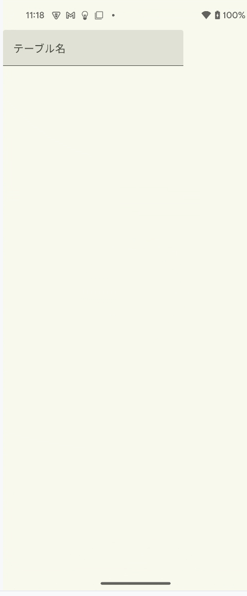

- [自分で定義したコンポーザブルに Modifier でサイズ指定しても効かない場合](#自分で定義したコンポーザブルに-modifier-でサイズ指定しても効かない場合)
  - [例](#例)
  - [対策](#対策)


# 自分で定義したコンポーザブルに Modifier でサイズ指定しても効かない場合

## 例

例えば、次のようなコードについて考えます。

```kotlin
@Composable
fun CreateTableScreen() {

    Column(
        modifier = Modifier.fillMaxSize(),
        horizontalAlignment = Alignment.CenterHorizontally
    ) {
        val columnList = remember { mutableStateListOf<String>() }

        TableInfo(
            columnList, modifier = Modifier.weight(1f)
        )

        Button({ columnList.add("") }) {
            Text(stringResource(R.string.add_column))
        }
    }
}

@Composable
private fun TableInfo(columnList: List<String>, modifier: Modifier) {
    val listState = rememberLazyListState()

    LazyColumn(state = listState) {
        item {
            var tableName by remember { mutableStateOf("") }

            TextField(
                value = tableName,
                onValueChange = { tableName = it },
                label = { Text(stringResource(R.string.table_name)) },
            )
        }

        items(columnList.size) {
            TableColumnItem(it)
        }
    }
}
```

このコードでは、 CreateTableScreen コンポーザブルを画面いっぱいに表示して、 Button を画面の一番下に表示し、残りの部分を TableInfo で埋めたいとします。つまり、次のような画面をイメージしています。


しかし、実際には、次のようになってしまいます。


## 対策

上記の問題を解決するには、 TableInfo コンポーザブルの直下にあるコンポーザブルに、 Modifier.weight() が指定された modifier インスタンスを渡し、それに対して、 fillMaxSize() を指定します。

```kotlin
@Composable
private fun TableInfo(columnList: List<String>, modifier: Modifier) {
    val listState = rememberLazyListState()

    LazyColumn(state = listState, modifier = modifier.fillMaxSize()) {
        item {
            var tableName by remember { mutableStateOf("") }

            TextField(
                value = tableName,
                onValueChange = { tableName = it },
                label = { Text(stringResource(R.string.table_name)) },
            )
        }

        items(columnList.size) {
            TableColumnItem(it)
        }
    }
}
```

ここで重要なポイントは、 Modifier インスタンスを新たに生成するのではなく、 weight() が指定された Modifier を TableInfo (親) から受け取ることです。もし、新しく生成した Modifier に対して、 fillMaxSize() を指定してしまった場合は、 LazyColumn は画面いっぱいに広がってしまい、 Button が画面外に押し出されてしまいます。




