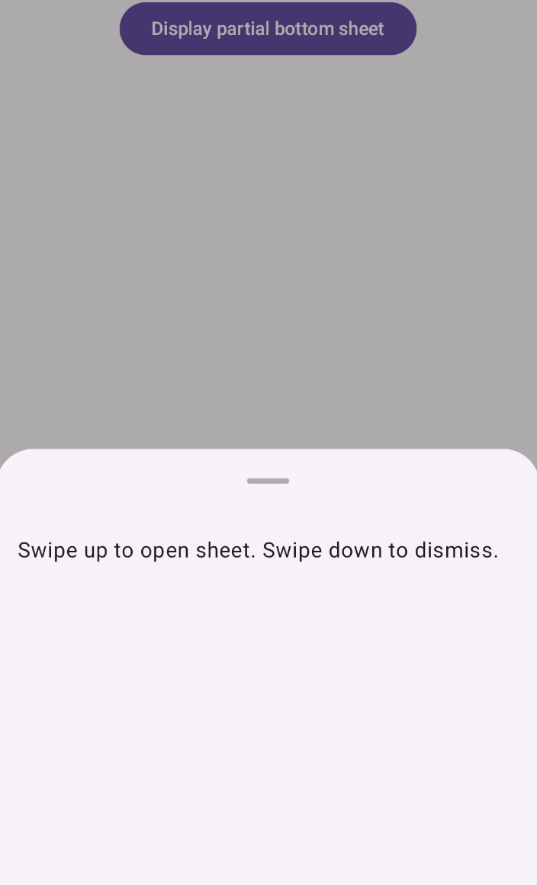
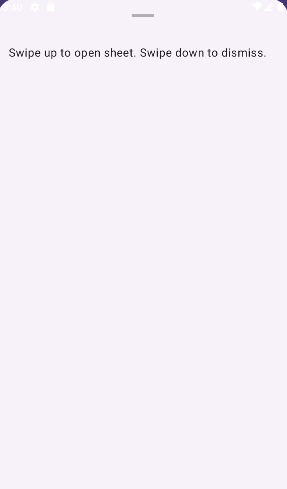

- [ボトムシートの一部](#ボトムシートの一部)
  - [例](#例)
    - [コードに関する主なポイント](#コードに関する主なポイント)
    - [結果](#結果)
  - [参考情報](#参考情報)


# ボトムシートの一部

ボトムシートを部分的に表示し、ユーザーがそれを全画面にするか閉じるかを選択できます。

これを行うには、ModalBottomSheet に、skipPartiallyExpanded を false に設定した SheetState のインスタンスを渡します。

注: ModalBottomSheet は実験的なものです。


## 例

この例では、ModalBottomSheet の sheetState プロパティを使用して、最初はシートを部分的にのみ表示する方法を示します。

```kotlin
@Composable
fun PartialBottomSheet() {
    var showBottomSheet by remember { mutableStateOf(false) }
    val sheetState = rememberModalBottomSheetState(
        skipPartiallyExpanded = false,
    )

    Column(
        modifier = Modifier.fillMaxWidth(),
        horizontalAlignment = Alignment.CenterHorizontally,
    ) {
        Button(
            onClick = { showBottomSheet = true }
        ) {
            Text("Display partial bottom sheet")
        }

        if (showBottomSheet) {
            ModalBottomSheet(
                modifier = Modifier.fillMaxHeight(),
                sheetState = sheetState,
                onDismissRequest = { showBottomSheet = false }
            ) {
                Text(
                    "Swipe up to open sheet. Swipe down to dismiss.",
                    modifier = Modifier.padding(16.dp)
                )
            }
        }
    }
}
```


### コードに関する主なポイント

この例では、次の点に注意してください。

- showBottomSheet は、アプリが下部のシートを表示するかどうかを制御します。

- sheetState は、skipPartiallyExpanded が false である SheetState のインスタンスです。

- ModalBottomSheet は、完全に展開されたときに画面全体に表示されるようにする修飾子 ( fillMaxHeight ) を受け取っています。

  - 高さを数値指定した場合
    - 完全に展開した場合にその高さになります。
    - 指定した高さが画面？親？の半分の高さ未満の場合は、シートを開いた際に途中で止まることなく、最大の高さまで一気に開きます。
    - そもそも、シートを途中で止める設定にした場合、その高さは画面？親？の半分の高さで止まる仕様になっているようです。

- ModalBottomSheet は、sheetState を sheetState パラメータの値として受け取ります。

  - その結果、最初に開いたときはシートが部分的にしか表示されません。その後、ユーザーはシートをドラッグまたはスワイプして全画面表示にしたり、閉じたりすることができます。

- onDismissRequest ラムダは、ユーザーが下部のシートを閉じようとしたときに何が起こるかを制御します。この場合、シートのみが削除されます。


### 結果

ユーザーが最初にボタンを押すと、シートが部分的に表示されます。



ユーザーがシートを上にスワイプすると、画面全体に表示されます。



skipPartiallyExpanded を true に設定すると、シートがすぐに全画面表示で開きます。


## 参考情報

- [ボトムシート](https://developer.android.com/develop/ui/compose/components/bottom-sheets?hl=ja&_gl=1*i7s55a*_up*MQ..*_ga*NTY3MDY5MDA1LjE3MjQ2NTg1MjY.*_ga_6HH9YJMN9M*MTcyNTM3NTE0Ny44LjAuMTcyNTM3NTE0Ny4wLjAuMA..)

