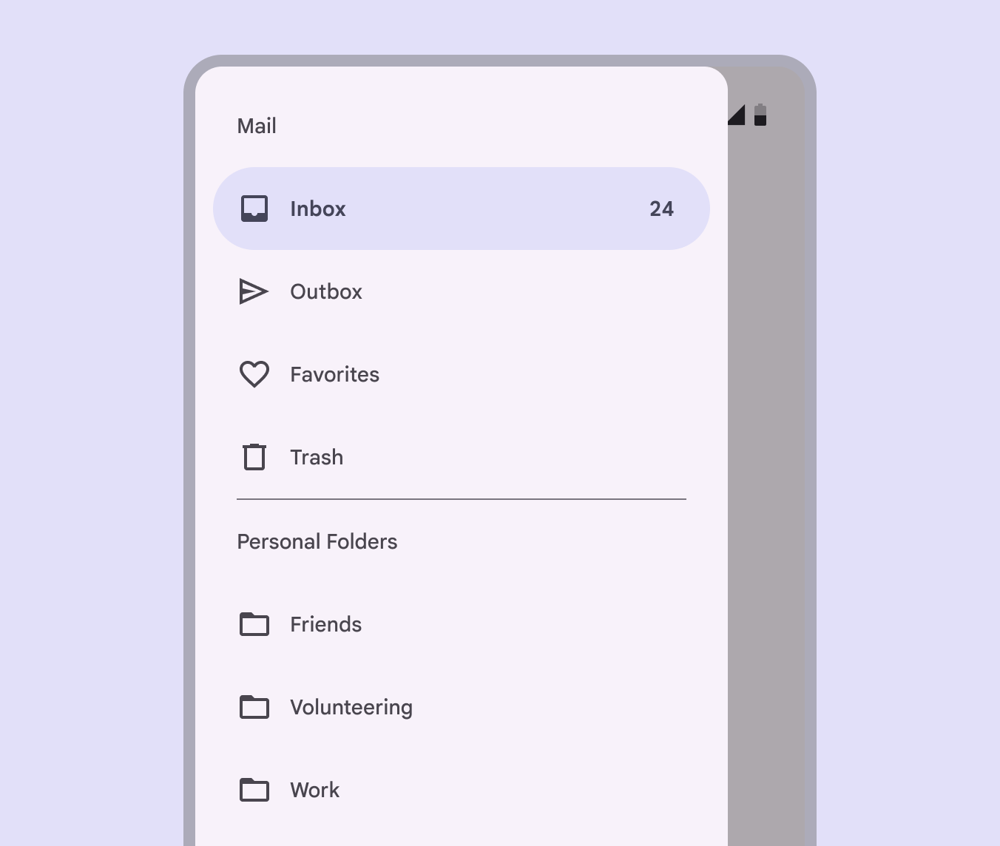
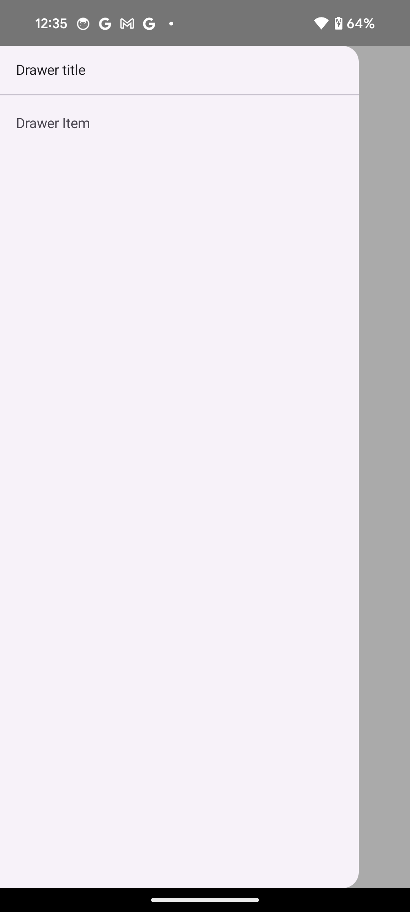
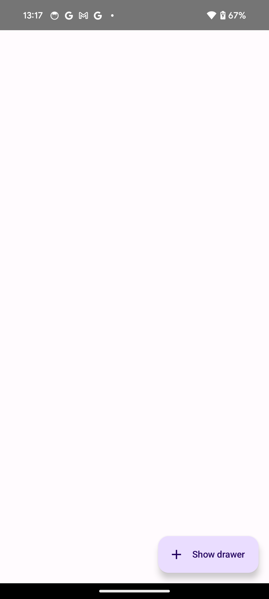
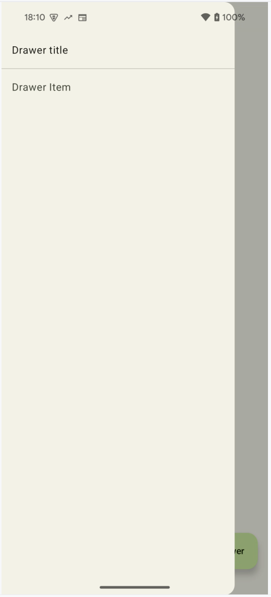
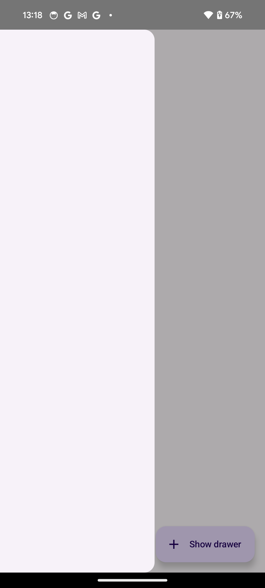

- [ナビゲーションドロワー](#ナビゲーションドロワー)
  - [例](#例)
  - [動作を制御する](#動作を制御する)
  - [ナビゲーション ドロワー内にグループを作成する](#ナビゲーション-ドロワー内にグループを作成する)
    - [コードに関する主なポイント](#コードに関する主なポイント)
    - [実行結果](#実行結果)
  - [アイテムの先頭と末尾にアイコン等を配置する](#アイテムの先頭と末尾にアイコン等を配置する)
  - [引用元資料](#引用元資料)


# ナビゲーションドロワー

[ナビゲーションドロワー](https://m3.material.io/components/navigation-drawer/overview) コンポーネントは、ユーザーがアプリのさまざまなセクションに移動できるようにするスライドイン メニューです。ユーザーは、**横からスワイプするか、メニュー アイコンをタップしてメニューを開く (アクティブにする) ことができます。**

ナビゲーション ドロワーを実装する次の 3 つのユースケースを検討してください。

- **コンテンツの整理**: ニュース アプリやブログ アプリなどで、ユーザーがさまざまなカテゴリを切り替えることができるようにします。

- **アカウント管理**: ユーザー アカウントを持つアプリで、アカウント設定やプロフィール セクションへのクイック リンクを提供します。

- **機能の検出**: 複雑なアプリでユーザーが簡単に見つけてアクセスできるように、複数の機能と設定を 1 つのメニューに整理します。

マテリアル デザインには、2 種類のナビゲーション ドロワーがあります。

- **標準 (スタンダード)**: 画面内のスペースを他のコンテンツと共有します。

- **モーダル**: 画面内の他のコンテンツの上に表示されます。

次の画像は、標準ナビゲーションドロワーの例です。


次の画像は、モーダルナビゲーションドロワーの例です。




## 例

ModalNavigationDrawer コンポーザブルを使用して、ナビゲーション ドロワーを実装できます。

次の例のように、drawerContent スロットに ModalDrawerSheet を生成します。 ModalDrawerSheet は、ドロワーのコンテンツになります。

```kotlin
ModalNavigationDrawer(
    drawerContent = {
        ModalDrawerSheet {
            Text("Drawer title", modifier = Modifier.padding(16.dp))
            HorizontalDivider()
            NavigationDrawerItem(
                label = { Text(text = "Drawer Item") },
                selected = false,
                onClick = { /*TODO*/ }
            )
            // 他の DrawerItem がここに続きます。
        }
    }
) {
    // Screen content
}
```




ModalNavigationDrawer は、いくつかの追加のドロワー パラメータを受け入れます。たとえば、次の例のように、gesturesEnabled パラメータを使用して、ドロワーがドラッグに応答するかどうかを切り替えることができます。

```kotlin
ModalNavigationDrawer(
    drawerContent = {
        ModalDrawerSheet {
            // Drawer contents
        }
    },
    gesturesEnabled = false
) {
    // Screen content
}
```


## 動作を制御する

ドロワーの開閉を制御するには、 [DrawerState](https://developer.android.com/reference/kotlin/androidx/compose/material3/DrawerState?_gl=1*1mp2fn7*_up*MQ..*_ga*MTA0NTg2NTA1Mi4xNzI0NjU4NTI1*_ga_6HH9YJMN9M*MTcyNTE3OTU2Ni40LjAuMTcyNTE3OTU2Ni4wLjAuMA..) を使用します。

ModalNavigationDrawer の drawerState パラメータに DrawerState を渡します。

DrawerState は、 [open](https://developer.android.com/reference/kotlin/androidx/compose/material3/DrawerState?_gl=1*1mp2fn7*_up*MQ..*_ga*MTA0NTg2NTA1Mi4xNzI0NjU4NTI1*_ga_6HH9YJMN9M*MTcyNTE3OTU2Ni40LjAuMTcyNTE3OTU2Ni4wLjAuMA..#open) 関数と [close](https://developer.android.com/reference/kotlin/androidx/compose/material3/DrawerState?_gl=1*1mp2fn7*_up*MQ..*_ga*MTA0NTg2NTA1Mi4xNzI0NjU4NTI1*_ga_6HH9YJMN9M*MTcyNTE3OTU2Ni40LjAuMTcyNTE3OTU2Ni4wLjAuMA..#close) 関数、および現在のドロワー状態に関連するプロパティへのアクセスを提供します。これらの suspend 関数には CoroutineScope が必要です。これは [rememberCoroutineScope](https://developer.android.com/reference/kotlin/androidx/compose/runtime/package-summary?_gl=1*1mp2fn7*_up*MQ..*_ga*MTA0NTg2NTA1Mi4xNzI0NjU4NTI1*_ga_6HH9YJMN9M*MTcyNTE3OTU2Ni40LjAuMTcyNTE3OTU2Ni4wLjAuMA..#rememberCoroutineScope(kotlin.Function0)) を使用してインスタンス化できます。また、UI イベントに応じて suspend 関数を呼び出すこともできます。

```kotlin
val drawerState = rememberDrawerState(initialValue = DrawerValue.Closed)
val scope = rememberCoroutineScope()
ModalNavigationDrawer(
    drawerState = drawerState,
    drawerContent = {
        ModalDrawerSheet { /* Drawer content */ }
    },
) {
    Scaffold(
        floatingActionButton = {
            ExtendedFloatingActionButton(
                text = { Text("Show drawer") },
                icon = { Icon(Icons.Filled.Add, contentDescription = "") },
                onClick = {
                    scope.launch {
                        drawerState.apply {
                            if (isClosed) {
                                // 現時点でドロワーが閉じている場合は
                                // ドロワーを開きます。
                                // この open() 関数は、 DrawerState クラスの
                                // ビルトイン関数です。
                                open()
                            } else {
                                // この close() 関数は、 DrawerState クラスの
                                // ビルトイン関数です。
                                close()
                            }
                        }
                    }
                }
            )
        }
    ) { contentPadding ->
        // Screen content
    }
}
```

ドロワーを閉じている時の実行結果は以下の通りです。



ドロワーを開いている時の実行結果は以下の通りです。



ちなみに、 ModalDrawerSheet{} 内のコンテンツが設定されていない状態だと、次の画像のように、ドロワーがあまり広がりませんが、コンテンツを設定していない場合の最小幅が定義されているか何かだと思うので、気にしなくて良いと思います。




## ナビゲーション ドロワー内にグループを作成する

次のスニペットは、セクションと分割線を含む詳細なナビゲーション ドロワーを作成する方法を示しています。 (ただ単に、 HorizontalDivider() で区切ったり、文字を太字にしてあるだけです。)

```kotlin
@Composable
fun DetailedDrawerExample(
    content: @Composable (PaddingValues) -> Unit
) {
    val drawerState = rememberDrawerState(initialValue = DrawerValue.Closed)
    val scope = rememberCoroutineScope()

    ModalNavigationDrawer(
        drawerContent = {
            ModalDrawerSheet {
                Column(
                    modifier = Modifier.padding(horizontal = 16.dp)
                        .verticalScroll(rememberScrollState())
                ) {
                    Spacer(Modifier.height(12.dp))
                    Text("Drawer Title", modifier = Modifier.padding(16.dp), style = MaterialTheme.typography.titleLarge)
                    HorizontalDivider()

                    Text("Section 1", modifier = Modifier.padding(16.dp), style = MaterialTheme.typography.titleMedium)
                    NavigationDrawerItem(
                        label = { Text("Item 1") },
                        selected = false,
                        onClick = { /* Handle click */ }
                    )
                    NavigationDrawerItem(
                        label = { Text("Item 2") },
                        selected = false,
                        onClick = { /* Handle click */ }
                    )

                    HorizontalDivider(modifier = Modifier.padding(vertical = 8.dp))

                    Text("Section 2", modifier = Modifier.padding(16.dp), style = MaterialTheme.typography.titleMedium)
                    NavigationDrawerItem(
                        label = { Text("Settings") },
                        selected = false,
                        icon = { Icon(Icons.Outlined.Settings, contentDescription = null) },
                        badge = { Text("20") }, // Placeholder
                        onClick = { /* Handle click */ }
                    )
                    NavigationDrawerItem(
                        label = { Text("Help and feedback") },
                        selected = false,
                        icon = { Icon(Icons.AutoMirrored.Outlined.Help, contentDescription = null) },
                        onClick = { /* Handle click */ },
                    )
                    Spacer(Modifier.height(12.dp))
                }
            }
        },
        drawerState = drawerState
    ) {
        Scaffold(
            topBar = {
                TopAppBar(
                    title = { Text("Navigation Drawer Example") },
                    navigationIcon = {
                        IconButton(onClick = {
                            scope.launch {
                                if (drawerState.isClosed) {
                                    drawerState.open()
                                } else {
                                    drawerState.close()
                                }
                            }
                        }) {
                            Icon(Icons.Default.Menu, contentDescription = "Menu")
                        }
                    }
                )
            }
        ) { innerPadding ->
            content(innerPadding)
        }
    }
}
```


### コードに関する主なポイント

- セクション、分割線、ナビゲーション アイテムを含む Column を drawerContent に入力します。
- [ModalDrawerSheet](https://developer.android.com/reference/kotlin/androidx/compose/material3/package-summary?hl=ja#ModalDrawerSheet(androidx.compose.ui.Modifier,androidx.compose.ui.graphics.Shape,androidx.compose.ui.graphics.Color,androidx.compose.ui.graphics.Color,androidx.compose.ui.unit.Dp,androidx.compose.foundation.layout.WindowInsets,kotlin.Function1)) は、ドロワーにマテリアル デザインのスタイル設定を提供します。
- [HorizontalDivider](https://developer.android.com/reference/kotlin/androidx/compose/material3/package-summary?hl=ja#HorizontalDivider(androidx.compose.ui.Modifier,androidx.compose.ui.unit.Dp,androidx.compose.ui.graphics.Color)) : 引き出し内のセクションを区切ります。
- [ModalNavigationDrawer](https://developer.android.com/reference/kotlin/androidx/compose/material3/package-summary?hl=ja#ModalNavigationDrawer(kotlin.Function0,androidx.compose.ui.Modifier,androidx.compose.material3.DrawerState,kotlin.Boolean,androidx.compose.ui.graphics.Color,kotlin.Function0)) は引き出しを作成します。
- `drawerContent` は、ドロワーのコンテンツを定義します。
- `ModalDrawerSheet` 内で、 Column が引き出し要素を垂直方向に配置します。
- [NavigationDrawerItem](https://developer.android.com/reference/kotlin/androidx/compose/material3/package-summary?hl=ja#NavigationDrawerItem(kotlin.Function0,kotlin.Boolean,kotlin.Function0,androidx.compose.ui.Modifier,kotlin.Function0,kotlin.Function0,androidx.compose.ui.graphics.Shape,androidx.compose.material3.NavigationDrawerItemColors,androidx.compose.foundation.interaction.MutableInteractionSource)) コンポーザブルは、引き出し内の個々のアイテムを表します。
- `Scaffold` は、 TopAppBar など、画面の基本構造を提供します。
- `TopAppBar` の navigationIcon は、引き出しの開閉状態を制御します。


### 実行結果

実行結果は以下のようになります。


## アイテムの先頭と末尾にアイコン等を配置する

上記の [実行結果](#実行結果) の Setting 項目の先頭にある歯車のアイコンや、末尾にある 20 という数字は、いずれも任意のコンポーザブル関数を配置できます。

先頭にコンポーザブルを配置したい場合には、 `icon` パラメータにコンポーザブルを渡してください。

末尾にコンポーザブルを配置したい場合には、 `badge` パラメータにコンポーザブルを渡してください。


## 引用元資料

- [ナビゲーションドロワー](https://developer.android.com/develop/ui/compose/components/drawer?hl=ja)

