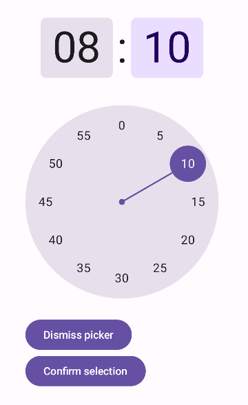
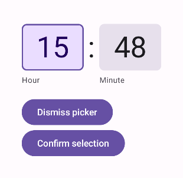

- [時刻選択ツール](#時刻選択ツール)


# 時刻選択ツール

[タイムピッカー](https://m3.material.io/components/time-pickers/overview) は、ユーザーが時間を選択する方法を提供します。 [TimePicker](https://developer.android.com/reference/kotlin/androidx/compose/material3/package-summary?_gl=1*gidpnu*_up*MQ..*_ga*MTA0NTg2NTA1Mi4xNzI0NjU4NTI1*_ga_6HH9YJMN9M*MTcyNTE3OTU2Ni40LjAuMTcyNTE3OTU2Ni4wLjAuMA..#TimePicker(androidx.compose.material3.TimePickerState,androidx.compose.ui.Modifier,androidx.compose.material3.TimePickerColors,androidx.compose.material3.TimePickerLayoutType)) および [TimeInput](https://developer.android.com/reference/kotlin/androidx/compose/material3/package-summary?_gl=1*gidpnu*_up*MQ..*_ga*MTA0NTg2NTA1Mi4xNzI0NjU4NTI1*_ga_6HH9YJMN9M*MTcyNTE3OTU2Ni40LjAuMTcyNTE3OTU2Ni4wLjAuMA..#TimeInput(androidx.compose.material3.TimePickerState,androidx.compose.ui.Modifier,androidx.compose.material3.TimePickerColors)) コンポーザブルを使用して、アプリにタイムピッカーを実装できます。

**注: TimePicker と TimeInput は試験段階です。問題がある場合は、問題追跡ツールに報告してください。**


## 型

タイム ピッカーには 2 つの種類があります:

- **ダイヤル**: ダイヤルのハンドルを動かして時間を設定できます。

- **入力**: キーボードを使用して時間を設定できます。

次の図は、左側がダイヤル タイム ピッカーの例で、右側が入力タイム ピッカーの例です。


## API サーフェス

タイムピッカーを実装するには、TimePicker または TimeInput コンポーザブルを使用します。

- `TimePicker` : ダイヤルタイムピッカーを実装します。

- `TimeInput` : 入力タイムピッカーを実装します。

注: 表示されるコンポーネントは異なりますが、TimePicker と TimeInput は、パラメータの点で非常によく似たコンポーザブルです。したがって、これらはほぼ互換性があります。


### 状態

TimePicker と TimeInput の両方で、 [TimePickerState](https://developer.android.com/reference/kotlin/androidx/compose/material3/TimePickerState?_gl=1*kz2y63*_up*MQ..*_ga*MTA0NTg2NTA1Mi4xNzI0NjU4NTI1*_ga_6HH9YJMN9M*MTcyNTE3OTU2Ni40LjAuMTcyNTE3OTU2Ni4wLjAuMA..) も渡す必要があります。これにより、ピッカーに表示されるデフォルトの選択時間を設定できます。また、 TimePickerState を通じて、ユーザーがピッカーを使用して選択した時間を取得することも可能です。


### ダイアログ

タイムピッカーはダイアログに表示されます。このガイドの例では、ダイアログは使用しません。ダイアログを使用する例については、 [タイムピッカーダイアログのガイド](./2.タイムピッカーダイアログ.md) を参照してください。


## ダイヤルタイムピッカー

このスニペットは、基本的なダイヤルタイムピッカーを実装する方法を示しています。

```kotlin
@Composable
fun DialExample(
    onConfirm: () -> Unit,
    onDismiss: () -> Unit,
) {
    val currentTime = Calendar.getInstance()

    val timePickerState = rememberTimePickerState(
        initialHour = currentTime.get(Calendar.HOUR_OF_DAY),
        initialMinute = currentTime.get(Calendar.MINUTE),
        is24Hour = true,
    )

    Column {
        TimePicker(
            state = timePickerState,
        )
        // 「閉じる」ボタン
        Button(onClick = onDismiss) {
            Text("Dismiss picker")
        }
        // 「決定」ボタン
        Button(onClick = onConfirm) {
            Text("Confirm selection")
        }
    }
}
```

このスニペットでは、次の点を考慮してください。

- Calendar.getInstance() は、現在の時刻で TimePickerState を初期化します。

  - この例では、java.util.Calendar を使用します。プロジェクトで [Java 8+ API の desugar](https://developer.android.com/studio/write/java8-support?_gl=1*3opmhv*_up*MQ..*_ga*MTA0NTg2NTA1Mi4xNzI0NjU4NTI1*_ga_6HH9YJMN9M*MTcyNTE3OTU2Ni40LjAuMTcyNTE3OTU2Ni4wLjAuMA..#library-desugaring) を有効にして、すべての Android バージョンで java.time.LocalTime を使用することもできます。

- TimePicker コンポーザブルは、timePickerState をパラメータとして受け取り、タイム ピッカーを表示します。

- 実装には 2 つのボタンが含まれています。1 つは選択を決定するボタン、もう 1 つはピッカーを閉じるボタンです。

この実装は次のようになります。




## 入力タイムピッカー

このスニペットは、基本的な入力タイムピッカーを実装する方法を示しています。

```kotlin
@Composable
fun InputExample(
    onConfirm: () -> Unit,
    onDismiss: () -> Unit,
) {
    val currentTime = Calendar.getInstance()

    val timePickerState = rememberTimePickerState(
        initialHour = currentTime.get(Calendar.HOUR_OF_DAY),
        initialMinute = currentTime.get(Calendar.MINUTE),
        is24Hour = true,
    )

    Column {
        TimeInput(
            state = timePickerState,
        )
        Button(onClick = onDismiss) {
            Text("Dismiss picker")
        }
        Button(onClick = onConfirm) {
            Text("Confirm selection")
        }
    }
}
```

この実装で注目すべき重要な点:

- 構造は基本的にダイヤル タイム ピッカーと同じですが、主な違いは TimePicker ではなく TimeInput を使用していることです。

- timePickerState の is24Hour パラメータ ( 24 時間表示) は明示的に true に設定されています。デフォルトでは、この値は false です。

この実装は次のようになります。




## 状態を使用する

ユーザーがタイムピッカーで選択した時間を利用するには、適切な TimePickerState を onConfirm 関数に渡します。親コンポーザブルは、TimePickerState.hour と TimePickerState.minute を通じて選択された時間にアクセスできます。

次のスニペットは、これを行う方法を示しています。

```kotlin
@Composable
fun DialUseStateExample(
    onConfirm: (TimePickerState) -> Unit,
    onDismiss: () -> Unit,
) {
    val currentTime = Calendar.getInstance()

    val timePickerState = rememberTimePickerState(
        initialHour = currentTime.get(Calendar.HOUR_OF_DAY),
        initialMinute = currentTime.get(Calendar.MINUTE),
        is24Hour = true,
    )

    Column {
        TimePicker(
            state = timePickerState,
        )
        Button(onClick = onDismiss) {
            Text("Dismiss picker")
        }
        Button(onClick = { onConfirm(timePickerState) }) {
            Text("Confirm selection")
        }
    }
}
```

上記のコンポーザブルを以下のように呼び出すことが可能です。

```kotlin
var selectedTime: TimePickerState? by remember { mutableStateOf(null) }

// ...

DialUseStateExample(
    onDismiss = {
        // この変数の更新は、別紙のダイアログ表示の部分で開設されているかも？
        showDialExample = false
    },
    onConfirm = {
            time ->
        selectedTime = time
        showDialExample = false
    },
)

// ...

if (selectedTime != null) {
    val cal = Calendar.getInstance()
    cal.set(Calendar.HOUR_OF_DAY, selectedTime!!.hour)
    cal.set(Calendar.MINUTE, selectedTime!!.minute)
    // isLenient は厳密性の指定です。
    // Lenient には、「寛大な」という意味があり、
    // true の場合は、厳密ではなく、 false の場合は厳密になります。
    // 厳密になっている場合は、 6 月 31 日などのありえない日付を検出して、エラーにしてくれます。
    cal.isLenient = false
    Text("Selected time = ${formatter.format(cal.time)}")
} else {
    Text("No time selected.")
}
```

詳細については、 [上記スニペットの完全な実装](https://github.com/android/snippets/blob/main/compose/snippets/src/main/java/com/example/compose/snippets/components/TimePickers.kt) を参照してください。


## 参考情報

- [TimePicker](https://developer.android.com/reference/kotlin/androidx/compose/material3/package-summary?hl=ja&_gl=1*nluuh2*_up*MQ..*_ga*NTY3MDY5MDA1LjE3MjQ2NTg1MjY.*_ga_6HH9YJMN9M*MTcyNTM3NTE0Ny44LjAuMTcyNTM3NTE0Ny4wLjAuMA..#TimePicker(androidx.compose.material3.TimePickerState,androidx.compose.ui.Modifier,androidx.compose.material3.TimePickerColors,androidx.compose.material3.TimePickerLayoutType))
- [マテリアル デザイン - 時間選択ツール](https://m3.material.io/components/time-pickers/overview)

