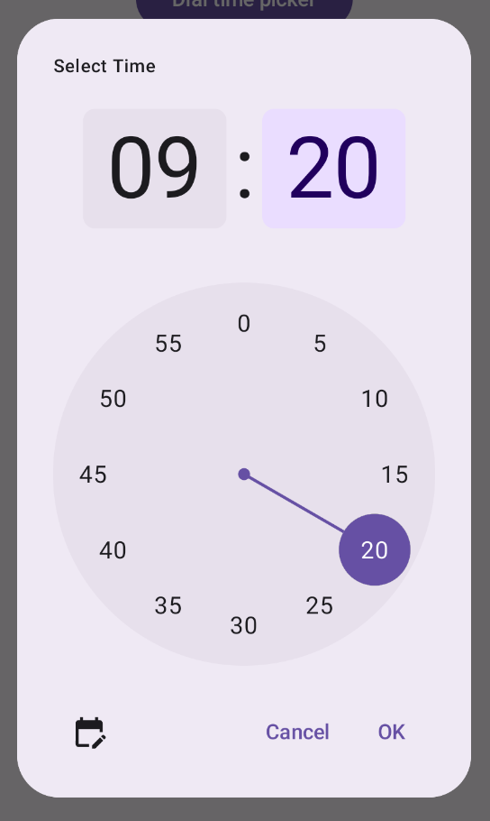

- [タイムピッカーのダイアログ](#タイムピッカーのダイアログ)
  - [基本的な例](#基本的な例)
  - [高度な例](#高度な例)
  - [参考情報](#参考情報)


# タイムピッカーのダイアログ

タイム ピッカーはダイアログに表示されることがよくあります。比較的汎用的で最小限のダイアログの実装を使用することも、より柔軟性の高いカスタム ダイアログを実装することもできます。

タイム ピッカーの状態の使用方法など、ダイアログ全般の詳細については、 [タイムピッカーガイド](./1.概要.md) をご覧ください。


## 基本的な例

タイム ピッカーのダイアログを作成する最も簡単な方法は、AlertDialog を実装するコンポーザブルを作成することです。次のスニペットは、このアプローチを使用した比較的最小限のダイアログの例を示しています。

```kotlin
@Composable
fun DialWithDialogExample(
    onConfirm: (TimePickerState) -> Unit,
    onDismiss: () -> Unit,
) {
    val currentTime = Calendar.getInstance()

    val timePickerState = rememberTimePickerState(
        initialHour = currentTime.get(Calendar.HOUR_OF_DAY),
        initialMinute = currentTime.get(Calendar.MINUTE),
        is24Hour = true,
    )

    TimePickerDialog(
        onDismiss = { onDismiss() },
        // 呼び出し元の画面から、渡された onConfirm() を呼び出します。
        // その際、 timePickerState を渡しているため、
        // 呼び出し元の画面は、 timePickerState
        // から、ユーザーが選択した時刻を取り出せます。
        onConfirm = { onConfirm(timePickerState) }
    ) {
        TimePicker(
            state = timePickerState,
        )
    }
}

@Composable
fun TimePickerDialog(
    onDismiss: () -> Unit,
    onConfirm: () -> Unit,
    content: @Composable () -> Unit
) {
    AlertDialog(
        onDismissRequest = onDismiss,
        dismissButton = {
            TextButton(onClick = { onDismiss() }) {
                Text("Dismiss")
            }
        },
        confirmButton = {
            TextButton(onClick = { onConfirm() }) {
                Text("OK")
            }
        },
        // ポイントはここ！
        // コンテンツエリア ( text パラメータ) に、
        // タイムピッカーコンポーザブルを渡しているところ。
        text = { content() }
    )
}
```

このスニペットの重要なポイントに注意してください。

1. DialWithDialogExample コンポーザブルは、ダイアログで TimePicker をラップします。

2. TimePickerDialog は、次のパラメータを AlertDialog に渡し、ダイアログを作成します

   - onDismiss: ユーザーがダイアログを閉じるときに呼び出される関数 ( Dismiss ボタンまたは戻るナビゲーションを使用)。

   - onConfirm: ユーザーが [OK] ボタンをクリックしたときに呼び出される関数。

   - content: ダイアログ内にタイム ピッカーを表示するコンポーザブル。

3. AlertDialog には次のものが含まれます:

   - 「 Dismiss 」というラベルの閉じるボタン。

   - 「 OK 」というラベルの確定ボタン。

   - text パラメータに渡されるタイムピッカーコンテンツ。

4. DialWithDialogExample は、現在の時刻で TimePickerState を初期化し、それを TimePicker と onConfirm 関数の両方に渡します。


## 高度な例

このスニペットは、タイムピッカーダイアログをカスタマイズした高度な実装の例です。

このコードでは、左下のボタンをタップすると、ダイアル型のタイムピッカーと入力型のタイムピッカーを切り替える実装となっています。

```kotlin
@Composable
fun AdvancedTimePickerExample(
    onConfirm: (TimePickerState) -> Unit,
    onDismiss: () -> Unit,
) {

    val currentTime = Calendar.getInstance()

    val timePickerState = rememberTimePickerState(
        initialHour = currentTime.get(Calendar.HOUR_OF_DAY),
        initialMinute = currentTime.get(Calendar.MINUTE),
        is24Hour = true,
    )

    // タイムピッカーがダイアル型か入力型かを定義します。
    var showDial by remember { mutableStateOf(true) }

    // ダイアル型か入力型かによって、アイコンボタンのアイコンを切り替えます。
    val toggleIcon = if (showDial) {
        Icons.Filled.EditCalendar
    } else {
        Icons.Filled.AccessTime
    }

    AdvancedTimePickerDialog(
        onDismiss = { onDismiss() },
        onConfirm = { onConfirm(timePickerState) },
        toggle = {
            IconButton(onClick = { showDial = !showDial }) {
                Icon(
                    imageVector = toggleIcon,
                    contentDescription = "Time picker type toggle",
                )
            }
        },
    ) {
        if (showDial) {
            TimePicker(
                state = timePickerState,
            )
        } else {
            TimeInput(
                state = timePickerState,
            )
        }
    }
}

@Composable
fun AdvancedTimePickerDialog(
    title: String = "Select Time",
    onDismiss: () -> Unit,
    onConfirm: () -> Unit,
    toggle: @Composable () -> Unit = {},
    content: @Composable () -> Unit,
) {
    Dialog(
        onDismissRequest = onDismiss,
        properties = DialogProperties(usePlatformDefaultWidth = false),
    ) {
        Surface(
            shape = MaterialTheme.shapes.extraLarge,
            tonalElevation = 6.dp,
            modifier =
            Modifier
                .width(IntrinsicSize.Min)
                .height(IntrinsicSize.Min)
                .background(
                    shape = MaterialTheme.shapes.extraLarge,
                    color = MaterialTheme.colorScheme.surface
                ),
        ) {
            Column(
                modifier = Modifier.padding(24.dp),
                horizontalAlignment = Alignment.CenterHorizontally
            ) {
                Text(
                    modifier = Modifier
                        .fillMaxWidth()
                        .padding(bottom = 20.dp),
                    text = title,
                    style = MaterialTheme.typography.labelMedium
                )
                content()
                Row(
                    modifier = Modifier
                        .height(40.dp)
                        .fillMaxWidth()
                ) {
                    toggle()
                    Spacer(modifier = Modifier.weight(1f))
                    TextButton(onClick = onDismiss) { Text("Cancel") }
                    TextButton(onClick = onConfirm) { Text("OK") }
                }
            }
        }
    }
}
```

このスニペットの重要なポイントに注意してください。

1. AdvancedTimePickerExample コンポーザブルは、カスタマイズ可能なタイムピッカーダイアログを作成します。

2. AlertDialog よりも柔軟性を高めるために、Dialog コンポーザブルを使用します。

3. ダイアログには、カスタマイズ可能なタイトルと、ダイヤルモードと入力モードを切り替えるトグルボタンが含まれています。

4. Surface は、幅と高さの両方に IntrinsicSize.Min を使用して、ダイアログに形状と高度を適用します。 ( IntrinsicSize.Min は、ざっくり言うと、 「可能な限り小さいサイズにする」 という意味だった気がする。)

5. Column と Row の部分は、ダイアログのレイアウト構造を定義しています。

6. 例では、showDial を使用してピッカーのモードを追跡します。

   - IconButton はモードを切り替え、それに応じてアイコンを更新します。

   - ダイアログの内容は、showDial の状態に基づいて TimePicker と TimeInput の間で切り替わります。

この高度な実装は、アプリのさまざまなユースケースに適応できる、高度にカスタマイズ可能で再利用可能なタイムピッカーダイアログを提供します。

`DialogProperties` の使用方法については、 [こちら](../7.ダイアログ.md/#dialogproperties) を参照してください。

`Surface` の使用方法については、 [こちら](../Surface.md) を参照してください。

この実装は次のようになります。




## 参考情報

- [タイムピッカーのガイド](./1.概要.md)
- [マテリアル デザイン - 時間選択ツール](https://m3.material.io/components/time-pickers/overview)

