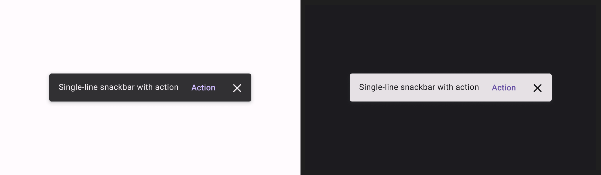
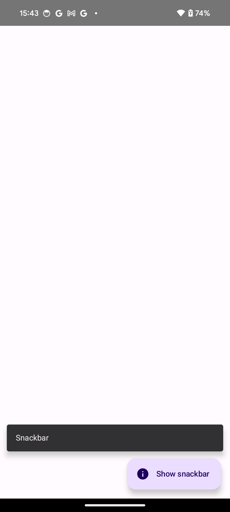
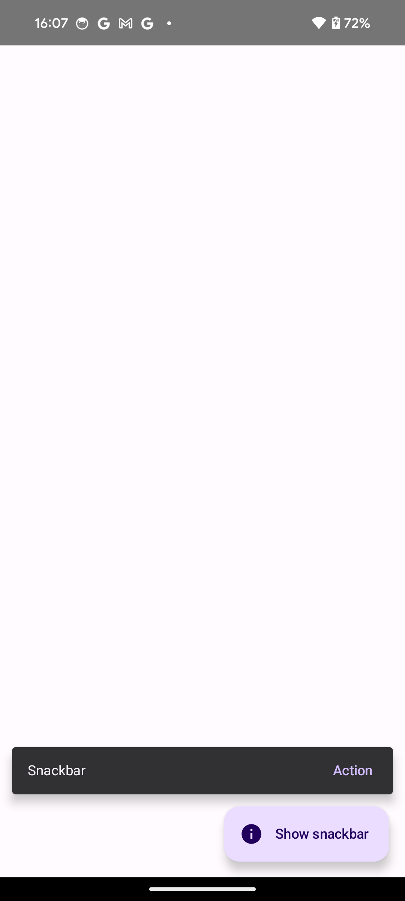

- [スナックバー](#スナックバー)
  - [基本的な例](#基本的な例)
  - [アクションが表示されているスナックバー](#アクションが表示されているスナックバー)
  - [Snackbar がキーボードで隠れないようにする](#snackbar-がキーボードで隠れないようにする)
  - [引用元資料](#引用元資料)


# スナックバー

[スナックバー](https://m3.material.io/components/snackbar/overview) コンポーネントは、画面の下部に表示される短い通知として機能します。ユーザー エクスペリエンスを中断することなく、操作やアクションに関するフィードバックを提供します。スナックバーは数秒後に消えます。ユーザーは、ボタンをタップするなどのアクションでスナックバーを閉じることもできます。

スナックバーを使用する可能性がある次の 3 つのユースケースは以下になります。

- **アクションの取り消し**: ユーザーがメールまたはメッセージを削除すると、スナックバーが表示され、アクションが確認され、「元に戻す」オプションが提供されます。

- **ネットワークステータス**: アプリのインターネット接続が失われると、スナックバーがポップアップ表示され、アプリがオフラインになったことが示されます。

- **データの送信**: フォームの送信または設定の更新に成功すると、スナックバーに変更が正常に保存されたことが示されます。




## 基本的な例

スナックバーを実装するには、まず SnackbarHost を作成します。これには SnackbarHostState プロパティを渡します。 SnackbarHostState は、スナックバーを表示するために使用できる showSnackbar() 関数へのアクセスを提供します。

この suspend 関数を呼び出すには、 rememberCoroutineScope などの CoroutineScope が必要です。また、 UI イベントに応答して呼び出すことで、 **Scaffold 内に Snackbar を表示できます。**

```kotlin
val scope = rememberCoroutineScope()
val snackbarHostState = remember { SnackbarHostState() }
Scaffold(
    snackbarHost = {
        SnackbarHost(hostState = snackbarHostState)
    },
    floatingActionButton = {
        ExtendedFloatingActionButton(
            text = { Text("Show snackbar") },
            icon = { Icon(Icons.Filled.Image, contentDescription = "") },
            onClick = {
                scope.launch {
                    snackbarHostState.showSnackbar("Snackbar")
                }
            }
        )
    }
) { contentPadding ->
    // Screen content
}
```

FAB をタップしたときの画面は以下のようになります。




## アクションが表示されているスナックバー

オプションのアクションを指定して、Snackbar の期間を調整できます。

snackbarHostState.showSnackbar() 関数は、追加の actionLabel および duration パラメータを受け入れ、 [SnackbarResult](https://developer.android.com/reference/kotlin/androidx/compose/material3/SnackbarResult?_gl=1*1sop7cv*_up*MQ..*_ga*MTA0NTg2NTA1Mi4xNzI0NjU4NTI1*_ga_6HH9YJMN9M*MTcyNTE3OTU2Ni40LjAuMTcyNTE3OTU2Ni4wLjAuMA..) を返します。

```kotlin
val scope = rememberCoroutineScope()
val snackbarHostState = remember { SnackbarHostState() }
Scaffold(
    snackbarHost = {
        SnackbarHost(hostState = snackbarHostState)
    },
    floatingActionButton = {
        ExtendedFloatingActionButton(
            text = { Text("Show snackbar") },
            icon = { Icon(Icons.Filled.Image, contentDescription = "") },
            onClick = {
                scope.launch {
                    val result = snackbarHostState
                        .showSnackbar(
                            message = "Snackbar",
                            actionLabel = "Action",
                            // 表示時間の指定
                            duration = SnackbarDuration.Indefinite
                        )
                    when (result) {
                        SnackbarResult.ActionPerformed -> {
                            /* スナックバーがタイムアウトする前に、アクションがタップされた場合 */
                        }
                        SnackbarResult.Dismissed -> {
                            /* 表示されているスナックバーが、タイムアウト、または、ユーザーによって閉じられた場合 */
                        }
                    }
                }
            }
        )
    }
) { contentPadding ->
    // Screen content
}
```

SnackbarHost パラメータを使用してカスタム Snackbar を提供できます。詳細については、 [SnackbarHost API リファレンス ドキュメント](https://developer.android.com/reference/kotlin/androidx/compose/material/package-summary?_gl=1*1uocroi*_up*MQ..*_ga*MTA0NTg2NTA1Mi4xNzI0NjU4NTI1*_ga_6HH9YJMN9M*MTcyNTE3OTU2Ni40LjAuMTcyNTE3OTU2Ni4wLjAuMA..#snackbarhost) を参照してください。

SnackbarDuration には、次の三つのオプションがあります。

- Short : 短い時間だけ表示します。
- Long : 少し長い時間表示します。
- Indefinite : 明示的に閉じられるかアクションがクリックされるまで、スナックバーを無期限に表示します。

デフォルト値は SnackbarDuration.Short です。

showSnackbar 関数の actionLabel パラメータは、アクションボタンに表示される文字列です。

FAB をタップした際の画面は、以下のようになります。




## Snackbar がキーボードで隠れないようにする

```kotlin
@Composable
fun XxxScreen() {

    val snackbarHostState = remember { SnackbarHostState() }

    Scaffold(snackbarHost = {
        SnackbarHost(
            hostState = snackbarHostState,
            // キーボードの高さ分のインセットを
            // SnackbarHost コンポーザブルの padding として設定します。
            modifier = Modifier.safeDrawingPadding()
        )
    }) { paddingValues ->
        // コンテンツ
    }
}
```


## 引用元資料


