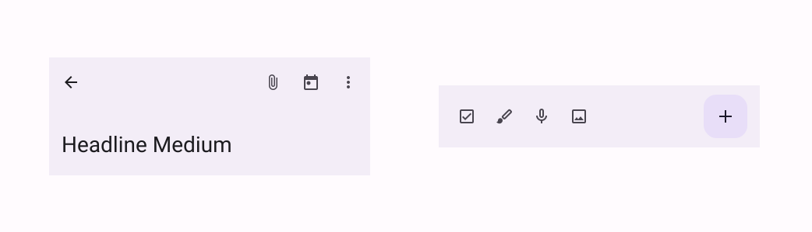
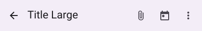
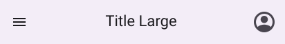
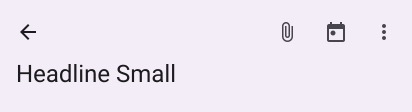
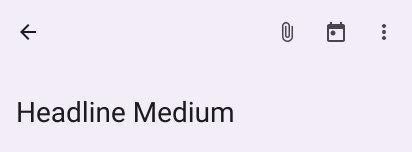
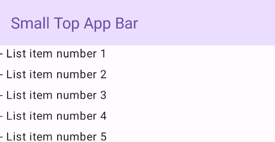
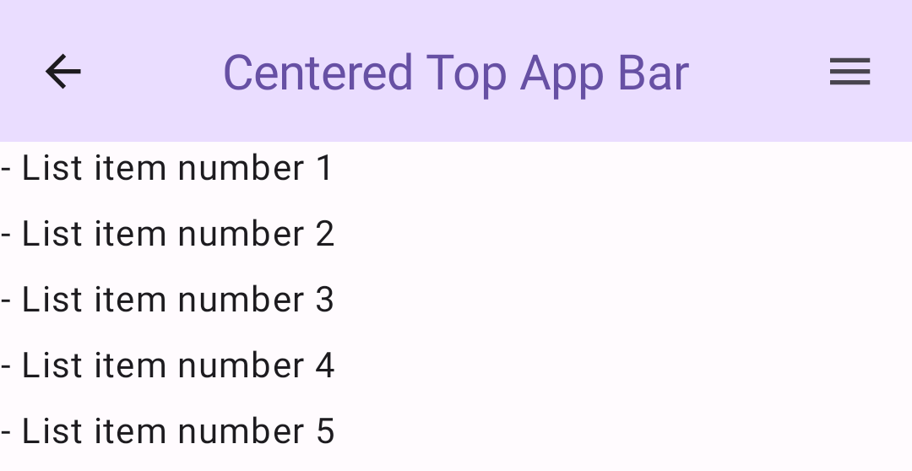
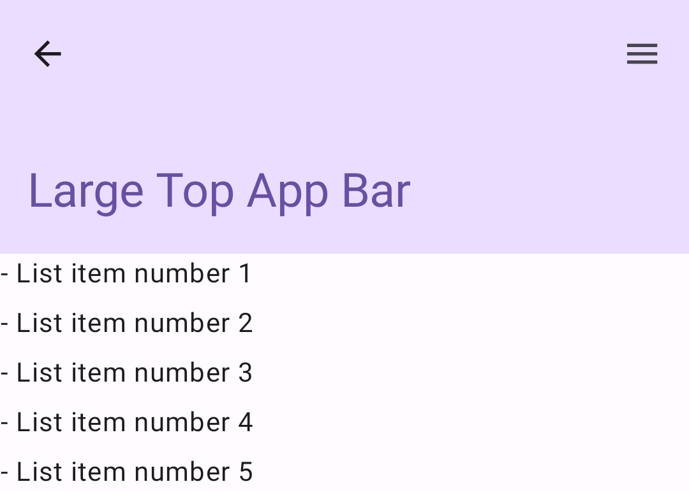
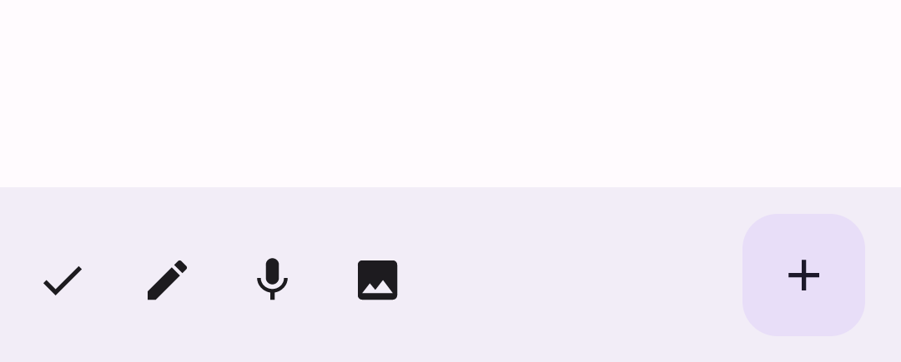

- [アプリバー](#アプリバー)
  - [トップアプリバー](#トップアプリバー)
    - [4 種類のトップ アプリバーの外観と用途](#4-種類のトップ-アプリバーの外観と用途)
    - [重要なパラメータ](#重要なパラメータ)
    - [スクロール動作](#スクロール動作)
  - [トップアプリバーの例](#トップアプリバーの例)
    - [小](#小)
    - [中央揃え（小）](#中央揃え小)
    - [中](#中)
    - [大](#大)
  - [ボトムアプリバー](#ボトムアプリバー)
  - [参考情報](#参考情報)


# アプリバー

アプリバーは、ユーザーに主要な機能やナビゲーション項目へのアクセスを提供するコンテナです。アプリバーには、トップアプリバーとボトムアプリバーの2種類があります。それぞれの外観と目的は次のとおりです。

**トップアプリバー**

- デザイン
  - 画面上部
- 目的
  - 主要なタスクと情報へのアクセスを提供します。通常、タイトル、コアアクションアイテム、特定のナビゲーションアイテムをホストします。


**ボトムアプリバー**

- デザイン
  - 画面下部
- 目的
  - 通常、主要なナビゲーション項目が含まれます。組み込みのフローティングアクションボタンなど、その他の主要なアクションへのアクセスを提供することもできます。



上部アプリバーを実装するには、以下のいずれかのコンポーザブルを使用します。

- [TopAppBar](https://developer.android.com/reference/kotlin/androidx/compose/material3/package-summary?_gl=1*p8z2j1*_up*MQ..*_ga*MTg5MjMyNDQ3Ni4xNzMwODU5Njk5*_ga_6HH9YJMN9M*MTczMDg1OTY5OS4xLjAuMTczMDg1OTY5OS4wLjAuMTc3MzMzOTgyMQ..#TopAppBar(kotlin.Function0,androidx.compose.ui.Modifier,kotlin.Function0,kotlin.Function1,androidx.compose.ui.unit.Dp,androidx.compose.foundation.layout.WindowInsets,androidx.compose.material3.TopAppBarColors,androidx.compose.material3.TopAppBarScrollBehavior))
- [CenterAlignedTopAppBar](https://developer.android.com/reference/kotlin/androidx/compose/material3/package-summary?_gl=1*15o9ml2*_up*MQ..*_ga*MTg5MjMyNDQ3Ni4xNzMwODU5Njk5*_ga_6HH9YJMN9M*MTczMDg1OTY5OS4xLjAuMTczMDg1OTY5OS4wLjAuMTc3MzMzOTgyMQ..#MediumTopAppBar(kotlin.Function0,androidx.compose.ui.Modifier,kotlin.Function0,kotlin.Function1,androidx.compose.ui.unit.Dp,androidx.compose.ui.unit.Dp,androidx.compose.foundation.layout.WindowInsets,androidx.compose.material3.TopAppBarColors,androidx.compose.material3.TopAppBarScrollBehavior))
- [MediumTopAppBar](https://developer.android.com/reference/kotlin/androidx/compose/material3/package-summary?_gl=1*p8z2j1*_up*MQ..*_ga*MTg5MjMyNDQ3Ni4xNzMwODU5Njk5*_ga_6HH9YJMN9M*MTczMDg1OTY5OS4xLjAuMTczMDg1OTY5OS4wLjAuMTc3MzMzOTgyMQ..#MediumTopAppBar(kotlin.Function0,androidx.compose.ui.Modifier,kotlin.Function0,kotlin.Function1,androidx.compose.ui.unit.Dp,androidx.compose.ui.unit.Dp,androidx.compose.foundation.layout.WindowInsets,androidx.compose.material3.TopAppBarColors,androidx.compose.material3.TopAppBarScrollBehavior))
- [LargeTopAppBar](https://developer.android.com/reference/kotlin/androidx/compose/material3/package-summary?_gl=1*1n52od3*_up*MQ..*_ga*MTg5MjMyNDQ3Ni4xNzMwODU5Njk5*_ga_6HH9YJMN9M*MTczMDg1OTY5OS4xLjAuMTczMDg1OTY5OS4wLjAuMTc3MzMzOTgyMQ..#LargeTopAppBar(kotlin.Function0,androidx.compose.ui.Modifier,kotlin.Function0,kotlin.Function1,androidx.compose.ui.unit.Dp,androidx.compose.ui.unit.Dp,androidx.compose.foundation.layout.WindowInsets,androidx.compose.material3.TopAppBarColors,androidx.compose.material3.TopAppBarScrollBehavior))

下部アプリバーを実装するには、 [BottomAppBar](https://developer.android.com/reference/kotlin/androidx/compose/material3/package-summary?_gl=1*1n52od3*_up*MQ..*_ga*MTg5MjMyNDQ3Ni4xNzMwODU5Njk5*_ga_6HH9YJMN9M*MTczMDg1OTY5OS4xLjAuMTczMDg1OTY5OS4wLjAuMTc3MzMzOTgyMQ..#BottomAppBar(androidx.compose.ui.Modifier,androidx.compose.ui.graphics.Color,androidx.compose.ui.graphics.Color,androidx.compose.ui.unit.Dp,androidx.compose.foundation.layout.PaddingValues,androidx.compose.foundation.layout.WindowInsets,kotlin.Function1)) コンポーザブルを使用します。

これらを使用すると、ナビゲーションコントロールとアクションコントロールをカプセル化し、マテリアルデザインの原則に沿った一貫性のあるインターフェースを作成できます。

**重要** : アプリバーは通常、アプリバーを受け取るための特定のパラメータを持つ Scaffold コンポーザブルに渡されます。 Scaffold がアプリを構造化する便利な方法を提供する方法の詳細については、 [Scaffold ページ](../1.Scaffold.md) をご覧ください。


## トップアプリバー

### 4 種類のトップ アプリバーの外観と用途

**小**

多くのナビゲーションやアクションを必要としない画面に向いています。




**中央揃え (小)**

メインの操作が 1 つだけ含まれる画面の場合に向いています。




**中**

中程度のナビゲーションとアクションが必要な画面に適しています。




**大**

多数のナビゲーションとアクションが必要な画面に適しています。




### 重要なパラメータ

4 つの異なるトップアプリバーに共通の重要なパラメータには以下のものがあります。

- title: アプリ バー全体に表示されるテキスト。
- navigationIcon: ナビゲーションアイコン。アプリバーの左側に表示されます。
- actions: ユーザーが主要なアクションにアクセスできるようにするアイコン。アプリバーの右側に表示されます。
- scrollBehavior: Scaffold の内部コンテンツのスクロールに対して上部のアプリバーがどのように反応するかを決定します。
- colors: アプリバーの色を決定します。


### スクロール動作

ユーザーが特定の Scaffold の内部コンテンツをスクロールしたときにアプリバーがどのように反応するかを制御できます。これを行うには、 [TopAppBarScrollBehavior](https://developer.android.com/reference/kotlin/androidx/compose/material3/TopAppBarScrollBehavior?hl=ja&_gl=1*19l27x*_up*MQ..*_ga*NTY3MDY5MDA1LjE3MjQ2NTg1MjY.*_ga_6HH9YJMN9M*MTcyNTAyODI3OS40LjAuMTcyNTAyODI3OS4wLjAuMA..) のインスタンスを作成し、それを scrollBehavior パラメータとしてトップ アプリ バーに渡します。

TopAppBarScrollBehavior には 3 つのタイプがあります。次のとおりです:

- enterAlwaysScrollBehavior: ユーザーがスキャフォールドの内部コンテンツをプルアップすると、トップアプリバーが折りたたまれます。次にユーザーが内部コンテンツをプルダウンすると、アプリバーが展開されます。
- exitUntilCollapsedScrollBehavior: enterAlwaysScrollBehavior に似ていますが、ユーザーが Scaffold の内部コンテンツの先頭に到達し、さらにプルダウンした場合のみ、アプリバーが展開されます。
- pinnedScrollBehavior: アプリバーは所定の位置に留まり、スクロールには反応しません。

次の例では、これらのオプションのいくつかを実装しています。


## トップアプリバーの例

次のセクションでは、スクロール動作を制御するさまざまな例を含め、 4 つの異なるタイプのトップアプリバーの実装について説明します。


### 小

小サイズのトップアプリバーを作成するには、 TopAppBar コンポーザブルを使用します。これは、可能な限りシンプルなトップアプリバーであり、この例ではタイトルのみが含まれています。

次の例では、 TopAppBar に scrollBehavior の値を渡さないため、内部コンテンツのスクロールには反応しません。

```kotlin
@Composable
fun SmallTopAppBarExample() {
    Scaffold(
        topBar = {
            TopAppBar(
                colors = TopAppBarDefaults.topAppBarColors(
                    containerColor = MaterialTheme.colorScheme.primaryContainer,
                    titleContentColor = MaterialTheme.colorScheme.primary,
                ),
                title = {
                    Text("Small Top App Bar")
                }
            )
        },
    ) { innerPadding ->
        ScrollContent(innerPadding)
    }
}
```

これを実装すると次のようになります。




### 中央揃え（小）

中央揃えのトップアプリバーは、タイトルがコンポーネント内で中央揃えになっている点を除けば、基本的に小サイズのアプリバーと同じです。これを実装するには、専用の CenterAlignedTopAppBar コンポーザブルを使用します。

この例では、enterAlwaysScrollBehavior() を使用して、scrollBehavior に渡す値を取得します。そのため、ユーザーがスキャフォールドの内部コンテンツをスクロールすると、バーが折りたたまれます。

```kotlin
@Composable
fun CenterAlignedTopAppBarExample() {
    val scrollBehavior = TopAppBarDefaults.pinnedScrollBehavior(rememberTopAppBarState())

    Scaffold(
        modifier = Modifier.nestedScroll(scrollBehavior.nestedScrollConnection),

        topBar = {
            CenterAlignedTopAppBar(
                colors = TopAppBarDefaults.centerAlignedTopAppBarColors(
                    containerColor = MaterialTheme.colorScheme.primaryContainer,
                    titleContentColor = MaterialTheme.colorScheme.primary,
                ),
                title = {
                    Text(
                        "Centered Top App Bar",
                        maxLines = 1,
                        overflow = TextOverflow.Ellipsis
                    )
                },
                navigationIcon = {
                    IconButton(onClick = { /* do something */ }) {
                        Icon(
                            imageVector = Icons.AutoMirrored.Filled.ArrowBack,
                            contentDescription = "Localized description"
                        )
                    }
                },
                actions = {
                    IconButton(onClick = { /* do something */ }) {
                        Icon(
                            imageVector = Icons.Filled.Menu,
                            contentDescription = "Localized description"
                        )
                    }
                },
                scrollBehavior = scrollBehavior,
            )
        },
    ) { innerPadding ->
        ScrollContent(innerPadding)
    }
}
```

これを実装すると次のようになります。




### 中

ここに掲載するサンプルコードは、以下の 2 点を除いて、中央揃えのトップアプリバーのサンプルコードと同じです。

1. 中サイズのトップアプリバーでは、追加のアイコンの下にタイトルが配置されます。タイトルを作成するには、 [MediumTopAppBar](https://developer.android.com/reference/kotlin/androidx/compose/material3/package-summary?_gl=1*4t8ins*_up*MQ..*_ga*MTA0NTg2NTA1Mi4xNzI0NjU4NTI1*_ga_6HH9YJMN9M*MTcyNTE1OTYzNC4zLjAuMTcyNTE1OTYzNC4wLjAuMA..#MediumTopAppBar(kotlin.Function0,androidx.compose.ui.Modifier,kotlin.Function0,kotlin.Function1,androidx.compose.foundation.layout.WindowInsets,androidx.compose.material3.TopAppBarColors,androidx.compose.material3.TopAppBarScrollBehavior)) コンポーザブルを使用します。

2. この例では enterAlwaysScrollBehavior() を使用して、 scrollBehavior に渡す値を取得します。

```kotlin
@Composable
fun MediumTopAppBarExample() {
    val scrollBehavior = TopAppBarDefaults.enterAlwaysScrollBehavior(rememberTopAppBarState())

    Scaffold(
        modifier = Modifier.nestedScroll(scrollBehavior.nestedScrollConnection),
        topBar = {
            MediumTopAppBar(
                colors = TopAppBarDefaults.topAppBarColors(
                    containerColor = MaterialTheme.colorScheme.primaryContainer,
                    titleContentColor = MaterialTheme.colorScheme.primary,
                ),
                title = {
                    Text(
                        "Medium Top App Bar",
                        maxLines = 1,
                        overflow = TextOverflow.Ellipsis
                    )
                },
                navigationIcon = {
                    IconButton(onClick = { /* do something */ }) {
                        Icon(
                            imageVector = Icons.AutoMirrored.Filled.ArrowBack,
                            contentDescription = "Localized description"
                        )
                    }
                },
                actions = {
                    IconButton(onClick = { /* do something */ }) {
                        Icon(
                            imageVector = Icons.Filled.Menu,
                            contentDescription = "Localized description"
                        )
                    }
                },
                scrollBehavior = scrollBehavior
            )
        },
    ) { innerPadding ->
        ScrollContent(innerPadding)
    }
}
```

この実装は、次のようになります。 ( enterAlwaysScrollBehavior() からのスクロール動作がどのように表示されるかを含みます。)

https://youtu.be/QCkY2LJu4Dk


### 大

大サイズのアプリバーと中サイズのアプリバーの違いは、使用するコンポーザブルが変わっただけです。

大サイズのトップアプリバーはミディアムと似ていますが、タイトルとアイコンの間の余白が大きく、画面全体で占めるスペースが大きくなります。大サイズのトップアプリバーを作成するには、 [LargeTopAppBar](https://developer.android.com/reference/kotlin/androidx/compose/material3/package-summary?hl=ja&_gl=1*6ul57s*_up*MQ..*_ga*NTY3MDY5MDA1LjE3MjQ2NTg1MjY.*_ga_6HH9YJMN9M*MTcyNTAyODI3OS40LjAuMTcyNTAyODI3OS4wLjAuMA..#LargeTopAppBar(kotlin.Function0,androidx.compose.ui.Modifier,kotlin.Function0,kotlin.Function1,androidx.compose.foundation.layout.WindowInsets,androidx.compose.material3.TopAppBarColors,androidx.compose.material3.TopAppBarScrollBehavior)) コンポーザブルを使用します。

この例では exitUntilCollapsedScrollBehavior() を使用して、scrollBehavior に渡す値を取得します。そのため、ユーザーが Scaffold の内部コンテンツをスクロールするとバーは折りたたまれますが、ユーザーが内部コンテンツを先頭までスクロールし、さらにスクロールすると、アプリバーが展開されます。

```kotlin
@Composable
fun LargeTopAppBarExample() {
    val scrollBehavior = TopAppBarDefaults.exitUntilCollapsedScrollBehavior(rememberTopAppBarState())

    Scaffold(
        modifier = Modifier.nestedScroll(scrollBehavior.nestedScrollConnection),
        topBar = {
            LargeTopAppBar(
                colors = TopAppBarDefaults.topAppBarColors(
                    containerColor = MaterialTheme.colorScheme.primaryContainer,
                    titleContentColor = MaterialTheme.colorScheme.primary,
                ),
                title = {
                    Text(
                        "Large Top App Bar",
                        maxLines = 1,
                        overflow = TextOverflow.Ellipsis
                    )
                },
                navigationIcon = {
                    IconButton(onClick = { /* do something */ }) {
                        Icon(
                            imageVector = Icons.AutoMirrored.Filled.ArrowBack,
                            contentDescription = "Localized description"
                        )
                    }
                },
                actions = {
                    IconButton(onClick = { /* do something */ }) {
                        Icon(
                            imageVector = Icons.Filled.Menu,
                            contentDescription = "Localized description"
                        )
                    }
                },
                scrollBehavior = scrollBehavior
            )
        },
    ) { innerPadding ->
        ScrollContent(innerPadding)
    }
}
```




## ボトムアプリバー

下部アプリバーを作成するには、 BottomAppBar コンポーザブルを使用します。このコンポーザブルの使用方法は、このページの前のセクションで説明した [トップアプリバー](#トップアプリバーの例) と非常に似ています。次の主要なパラメータのコンポーザブルを渡します:

- actions: バーの左側に表示される一連のアイコン。これらは通常、特定の画面の主要なアクション、または、ナビゲーション項目のいずれかです。

- floatingActionButton: バーの右側に表示されるフローティングアクションボタンです。

```kotlin
@Composable
fun BottomAppBarExample() {
    Scaffold(
        bottomBar = {
            BottomAppBar(
                actions = {
                    IconButton(onClick = { /* do something */ }) {
                        Icon(
                            Icons.Filled.Check,
                            contentDescription = "Localized description")
                    }
                    IconButton(onClick = { /* do something */ }) {
                        Icon(
                            Icons.Filled.Edit,
                            contentDescription = "Localized description",
                        )
                    }
                    IconButton(onClick = { /* do something */ }) {
                        Icon(
                            Icons.Filled.Mic,
                            contentDescription = "Localized description",
                        )
                    }
                    IconButton(onClick = { /* do something */ }) {
                        Icon(
                            Icons.Filled.Image,
                            contentDescription = "Localized description",
                        )
                    }
                },
                floatingActionButton = {
                    FloatingActionButton(
                        onClick = { /* do something */ },
                        containerColor = BottomAppBarDefaults.bottomAppBarFabColor,
                        elevation = FloatingActionButtonDefaults.bottomAppBarFabElevation()
                    ) {
                        Icon(Icons.Filled.Add, "Localized description")
                    }
                }
            )
        },
    ) { innerPadding ->
        Text(
            modifier = Modifier.padding(innerPadding),
            text = "Example of a scaffold with a bottom app bar."
        )
    }
}
```

これを実装すると次のようになります。



**注** : また、 actions と floatingActionButton に値を渡さずに BottomAppBar を使用することもできます。その場合は、他のコンテナーと同様に BottomAppBar にコンテンツを入力して、カスタムのボトムアプリバーを作成できます。


## 参考情報

- [マテリアル 3 のドキュメント - トップアプリバー](https://m3.material.io/components/top-app-bar/overview)

- [マテリアル 3 のドキュメント - ボトムアプリバー](https://m3.material.io/components/bottom-app-bar/overview)

