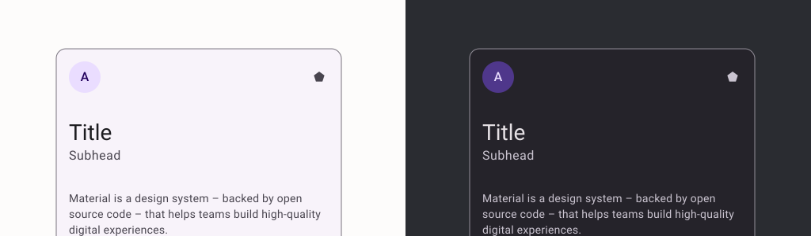
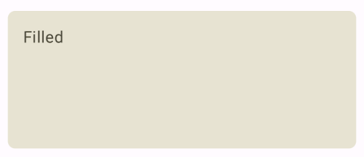
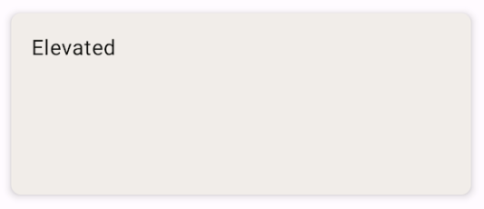
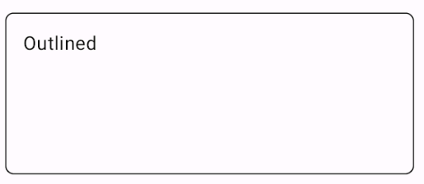

- [カード](#カード)


# カード

Card コンポーザブルは UI のマテリアル デザイン コンテナとして機能します。カードは通常単一の一貫したコンテンツを示します。カードを使用する例を以下に示します。

ショッピング アプリの商品
ニュースアプリのニュース記事
コミュニケーション アプリのメッセージ
単一のコンテンツを表示することに焦点を当て、別のコンテナの Card と区別します。たとえば、Scaffold は画面全体の一般的な構造を提供します。カードは通常大きなレイアウトの中の小さな UI 要素である一方、Column や Row などのレイアウト コンポーネントはよりシンプルでより汎用的な API となります。




## 基本的な実装

Card は Compose の他のコンテナとほぼ同様に動作します。その中の他のコンポーザブルを呼び出して、コンテンツを宣言します。例として、次の簡単な例を使って、Card がどのように Text の呼び出しを含むかをご確認ください。

```kotlin
@Composable
fun CardMinimalExample() {
    Card() {
        Text(text = "Hello, world!")
    }
}
```

デフォルトでは Card はコンテンツを Column コンポーザブルでラップして、カード内の各アイテムを下へ配置します。


## 高度な実装

Card の API 定義に関するリファレンスをご覧ください。コンポーネントのデザインと動作をカスタマイズできるいくつかのパラメータが定義されています。

主なパラメータには次のものがあります。

- **elevation**: コンポーネントに影を加えて、背景から浮き上がって見えるようにします。
- **colors**: CardColors タイプを使用して、コンテナと子の両方のデフォルトの色を設定します。
- **enabled**: このパラメータで false を渡すと、カードは無効のように見え、ユーザー入力に反応しません。
- **onClick**: 通常 Card はクリック イベントに対応していません。そのため、覚えておく基本のオーバーロードは onClick パラメータを定義するオーバーロードです。Card の実装でユーザーからの押下に対応するには、このオーバーロードを使用する必要があります。

次の例はこのようなパラメータに加え、shape や modifier などの他の一般的なパラメータを使う方法を示しています。

**ベータ版**: onClick パラメータを定義する Card オーバーロードは試験運用版です。


### 塗りつぶしカード

以下に塗りつぶしカードを実装する方法の例を示します。

ポイントは colors プロパティを使用して、塗りつぶしの色を変更することです。

```kotlin
@Composable
fun FilledCardExample() {
    Card(
        colors = CardDefaults.cardColors(
            containerColor = MaterialTheme.colorScheme.surfaceVariant,
        ),
        modifier = Modifier
            .size(width = 240.dp, height = 100.dp)
    ) {
        Text(
            text = "Filled",
            modifier = Modifier
                .padding(16.dp),
            textAlign = TextAlign.Center,
        )
    }
}
```

これを実装すると次のようになります。




### 立体カード

以下のスニペットは立体カードを実装する方法を示しています。専用の [ElevatedCard](https://developer.android.com/reference/kotlin/androidx/compose/material3/package-summary?hl=ja&_gl=1*u2zmyd*_up*MQ..*_ga*NTY3MDY5MDA1LjE3MjQ2NTg1MjY.*_ga_6HH9YJMN9M*MTcyNTAyODI3OS40LjAuMTcyNTAyODI3OS4wLjAuMA..#ElevatedCard(androidx.compose.ui.Modifier,androidx.compose.ui.graphics.Shape,androidx.compose.material3.CardColors,androidx.compose.material3.CardElevation,kotlin.Function1)) コンポーザブルを使用します。

elevation プロパティを使って浮き上がりのデザインとその結果表示される影をコントロールできます。

```kotlin
@Composable
fun ElevatedCardExample() {
    ElevatedCard(
        elevation = CardDefaults.cardElevation(
            defaultElevation = 6.dp
        ),
        modifier = Modifier
            .size(width = 240.dp, height = 100.dp)
    ) {
        Text(
            text = "Elevated",
            modifier = Modifier
                .padding(16.dp),
            textAlign = TextAlign.Center,
        )
    }
}
```

これを実装すると次のようになります。




### 枠線付きカード

以下に枠線付きカードの例を示します。専用の [OutlinedCard](https://developer.android.com/reference/kotlin/androidx/compose/material3/package-summary?hl=ja&_gl=1*u2zmyd*_up*MQ..*_ga*NTY3MDY5MDA1LjE3MjQ2NTg1MjY.*_ga_6HH9YJMN9M*MTcyNTAyODI3OS40LjAuMTcyNTAyODI3OS4wLjAuMA..#OutlinedCard(androidx.compose.ui.Modifier,androidx.compose.ui.graphics.Shape,androidx.compose.material3.CardColors,androidx.compose.material3.CardElevation,androidx.compose.foundation.BorderStroke,kotlin.Function1)) コンポーザブルを使用します。

```kotlin
@Composable
fun OutlinedCardExample() {
    OutlinedCard(
        colors = CardDefaults.cardColors(
            containerColor = MaterialTheme.colorScheme.surface,
        ),
        border = BorderStroke(1.dp, Color.Black),
        modifier = Modifier
            .size(width = 240.dp, height = 100.dp)
    ) {
        Text(
            text = "Outlined",
            modifier = Modifier
                .padding(16.dp),
            textAlign = TextAlign.Center,
        )
    }
}
```

これを実装すると次のようになります。




## 制限事項

カードにはスクロール アクションと閉じるアクションが備わっていませんが、このような機能を提供するコンポーザブルに統合できます。たとえば、スワイプを実装してカードを閉じるには、 [SwipeToDismiss](https://developer.android.com/reference/kotlin/androidx/compose/material3/package-summary?hl=ja&_gl=1*rxqou6*_up*MQ..*_ga*NTY3MDY5MDA1LjE3MjQ2NTg1MjY.*_ga_6HH9YJMN9M*MTcyNTAyODI3OS40LjAuMTcyNTAyODI3OS4wLjAuMA..#SwipeToDismiss(androidx.compose.material3.DismissState,kotlin.Function1,kotlin.Function1,androidx.compose.ui.Modifier,kotlin.collections.Set)) コンポーザブルと統合します。スクロールを統合するには、 [verticalScroll](https://developer.android.com/reference/kotlin/androidx/compose/foundation/package-summary?hl=ja&_gl=1*q9xgsv*_up*MQ..*_ga*NTY3MDY5MDA1LjE3MjQ2NTg1MjY.*_ga_6HH9YJMN9M*MTcyNTAyODI3OS40LjAuMTcyNTAyODI3OS4wLjAuMA..#(androidx.compose.ui.Modifier).verticalScroll(androidx.compose.foundation.ScrollState,kotlin.Boolean,androidx.compose.foundation.gestures.FlingBehavior,kotlin.Boolean)) などのスクロール修飾子を使用します。詳しくは [スクロールのドキュメント](https://developer.android.com/develop/ui/compose/touch-input/pointer-input/scroll?hl=ja&_gl=1*rxqou6*_up*MQ..*_ga*NTY3MDY5MDA1LjE3MjQ2NTg1MjY.*_ga_6HH9YJMN9M*MTcyNTAyODI3OS40LjAuMTcyNTAyODI3OS4wLjAuMA..) をご覧ください。


## 参考情報

- [マテリアル UI のドキュメント](https://m3.material.io/components/cards/overview)

