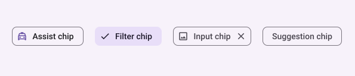
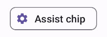
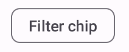
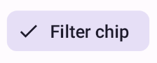
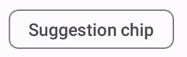

- [チップ](#チップ)
  - [API サーフェス](#api-サーフェス)
  - [アシストチップ](#アシストチップ)
  - [フィルターチップ](#フィルターチップ)
  - [入力チップ](#入力チップ)
  - [提案・候補チップ](#提案候補チップ)
  - [上昇したチップ](#上昇したチップ)
  - [参考情報](#参考情報)


# チップ

Chip コンポーネントは、コンパクトでインタラクティブな UI 要素です。連絡先やタグなどの複雑なエンティティを表し、多くの場合、アイコンとラベルが付いています。チェック可能、非表示、またはクリック可能です。

チップの 4 つのタイプと、その使用場所は次のとおりです。

- **アシスト**: タスク中にユーザーをガイドします。多くの場合、ユーザー入力に応じて一時的な UI 要素として表示されます。
  - 例
    - **検索アシスト**: ユーザーが「レストラン」と入力を開始すると、「レストラン 東京」「レストラン フレンチ」「レストラン 駐車場あり」などの関連キーワードがChipとして表示されます。ユーザーがいずれかのChipをタップすると、そのキーワードが検索バーに入力され、すぐに検索を実行できます。

- **フィルター**: ユーザーが一連のオプションからコンテンツを絞り込むことができます。選択または選択解除でき、選択するとチェックマーク アイコンが表示される場合があります。

- **入力**: メニューの選択など、ユーザーが提供する情報を表します。アイコンとテキストを含めることができ、削除する場合は「X」が表示されます。
  - 例
    - **タグ付け**: ブログ投稿や記事作成アプリにおいて、ユーザーが投稿に関連するタグを追加するためにChipを使用します。たとえば、「旅行」「料理」「写真」といったタグがChipとして表示され、ユーザーはそれらをタップして投稿に追加できます。追加されたタグはChipの見た目が変わり、選択されていることを示します。

- **提案・候補**: ユーザーの最近のアクティビティまたは入力に基づいて、ユーザーに推奨事項を提供します。通常、入力フィールドの下に表示され、ユーザーのアクションを促します。
  - 例
    - Notification に自動生成される提案ボタン




## API サーフェス

4 種類のチップに対応する 4 つのコンポーザブルがあります。次のセクションでは、これらのコンポーザブルとその違いについて詳しく説明します。ただし、次のパラメータは共通です:

- **label**: チップに表示される文字列。
- **icon**: チップの先頭に表示されるアイコン。特定のコンポーザブルの中には、leadingIcon (先頭に表示されるアイコン) と trailingIcon (末尾に表示されるアイコン) という別個のパラメータを持つものがあります。
- **onClick**: ユーザーがクリックしたときにチップが呼び出すラムダ。


## アシストチップ

[AssistChip](https://developer.android.com/reference/kotlin/androidx/compose/material3/package-summary?hl=ja&_gl=1*rx6vnd*_up*MQ..*_ga*NTY3MDY5MDA1LjE3MjQ2NTg1MjY.*_ga_6HH9YJMN9M*MTcyNTAyODI3OS40LjAuMTcyNTAyODI3OS4wLjAuMA..#AssistChip(kotlin.Function0,kotlin.Function0,androidx.compose.ui.Modifier,kotlin.Boolean,kotlin.Function0,kotlin.Function0,androidx.compose.ui.graphics.Shape,androidx.compose.material3.ChipColors,androidx.compose.material3.ChipElevation,androidx.compose.material3.ChipBorder,androidx.compose.foundation.interaction.MutableInteractionSource)) コンポーザブルを使用すると、ユーザーを特定の方向に誘導するアシスト チップを簡単に作成できます。際立った機能の 1 つは、チップの左側にアイコンを表示できる leadingIcon パラメータです。次の例は、これを実装する方法を示しています。

```kotlin
@Composable
fun AssistChipExample() {
    AssistChip(
        onClick = { Log.d("Assist chip", "hello world") },
        label = { Text("Assist chip") },
        leadingIcon = {
            Icon(
                Icons.Filled.Settings,
                contentDescription = "Localized description",
                Modifier.size(AssistChipDefaults.IconSize)
            )
        }
    )
}
```

この実装は次のようになります。




## フィルターチップ

[FilterChip](https://developer.android.com/reference/kotlin/androidx/compose/material3/package-summary?hl=ja&_gl=1*nzr4eb*_up*MQ..*_ga*NTY3MDY5MDA1LjE3MjQ2NTg1MjY.*_ga_6HH9YJMN9M*MTcyNTAyODI3OS40LjAuMTcyNTAyODI3OS4wLjAuMA..#FilterChip(kotlin.Boolean,kotlin.Function0,kotlin.Function0,androidx.compose.ui.Modifier,kotlin.Boolean,kotlin.Function0,kotlin.Function0,androidx.compose.ui.graphics.Shape,androidx.compose.material3.SelectableChipColors,androidx.compose.material3.SelectableChipElevation,androidx.compose.material3.SelectableChipBorder,androidx.compose.foundation.interaction.MutableInteractionSource)) コンポーザブルでは、チップが選択されているかどうかを追跡する必要があります。次の例は、ユーザーがチップを選択した場合にのみ、先頭のチェック済みアイコンを表示する方法を示しています。

```kotlin
@Composable
fun FilterChipExample() {
    var selected by remember { mutableStateOf(false) }

    FilterChip(
        onClick = { selected = !selected },
        label = {
            Text("Filter chip")
        },
        selected = selected,
        leadingIcon = if (selected) {
            {
                Icon(
                    imageVector = Icons.Filled.Done,
                    contentDescription = "Done icon",
                    modifier = Modifier.size(FilterChipDefaults.IconSize)
                )
            }
        } else {
            null
        },
    )
}
```

この実装は、選択解除状態では次のようになります。




選択状態では次のようになります。




## 入力チップ

[InputChip](https://developer.android.com/reference/kotlin/androidx/compose/material3/package-summary?hl=ja&_gl=1*1adwf2m*_up*MQ..*_ga*NTY3MDY5MDA1LjE3MjQ2NTg1MjY.*_ga_6HH9YJMN9M*MTcyNTAyODI3OS40LjAuMTcyNTAyODI3OS4wLjAuMA..#InputChip(kotlin.Boolean,kotlin.Function0,kotlin.Function0,androidx.compose.ui.Modifier,kotlin.Boolean,kotlin.Function0,kotlin.Function0,kotlin.Function0,androidx.compose.ui.graphics.Shape,androidx.compose.material3.SelectableChipColors,androidx.compose.material3.SelectableChipElevation,androidx.compose.material3.SelectableChipBorder,androidx.compose.foundation.interaction.MutableInteractionSource)) コンポーザブルを使用すると、ユーザー操作の結果として生じるチップを作成できます。たとえば、電子メール クライアントでユーザーが電子メールを書いているとき、入力チップは、ユーザーが「宛先:」フィールドに入力したアドレスの持ち主を表す場合があります。

次の実装は、すでに選択状態になっている入力チップを示しています。ユーザーがチップを押すと、チップが閉じられます。

```kotlin
@Composable
fun InputChipExample(
    text: String,
    onDismiss: () -> Unit,
) {
    var enabled by remember { mutableStateOf(true) }
    if (!enabled) return

    InputChip(
        onClick = {
            // onDismiss 関数には、引数で渡される text を
            // 空にする実装をしておくと良いと思われます。
            // それによって、 InputChipExample コンポーザブルが
            // 再コンポーズされ、チップが非表示になると思われます。
            onDismiss()
            enabled = !enabled
        },
        label = { Text(text) },
        selected = enabled,
        avatar = {
            Icon(
                Icons.Filled.Person,
                contentDescription = "Localized description",
                Modifier.size(InputChipDefaults.AvatarSize)
            )
        },
        trailingIcon = {
            Icon(
                Icons.Default.Close,
                contentDescription = "Localized description",
                Modifier.size(InputChipDefaults.AvatarSize)
            )
        },
    )
}
```

この実装は次のようになります。


## 提案・候補チップ

SuggestionChip コンポーザブルは、このページに記載されているコンポーザブルの中で最も基本的なものです。提案・候補チップは、動的に生成されたヒントを提示します。たとえば、AI チャット アプリでは、提案チップを使用して最新のメッセージに対する可能な応答を提示できます。

```kotlin
@Composable
fun SuggestionChipExample() {
    SuggestionChip(
        onClick = { Log.d("Suggestion chip", "hello world") },
        label = { Text("Suggestion chip") }
    )
}
```

これを実装すると次のようになります。




## 上昇したチップ

このドキュメントのすべての例では、フラットな外観の基本コンポーザブルを使用しています。外観が立体になったチップが必要な場合は、次の 3 つのコンポーザブルのいずれかを使用します。

- [ElevatedAssistChip](https://developer.android.com/reference/kotlin/androidx/compose/material3/package-summary?hl=ja&_gl=1*zk46ro*_up*MQ..*_ga*NTY3MDY5MDA1LjE3MjQ2NTg1MjY.*_ga_6HH9YJMN9M*MTcyNTAyODI3OS40LjAuMTcyNTAyODI3OS4wLjAuMA..#ElevatedAssistChip(kotlin.Function0,kotlin.Function0,androidx.compose.ui.Modifier,kotlin.Boolean,kotlin.Function0,kotlin.Function0,androidx.compose.ui.graphics.Shape,androidx.compose.material3.ChipColors,androidx.compose.material3.ChipElevation,androidx.compose.material3.ChipBorder,androidx.compose.foundation.interaction.MutableInteractionSource))
- [ElevatedFilterChip](https://developer.android.com/reference/kotlin/androidx/compose/material3/package-summary?hl=ja&_gl=1*zk46ro*_up*MQ..*_ga*NTY3MDY5MDA1LjE3MjQ2NTg1MjY.*_ga_6HH9YJMN9M*MTcyNTAyODI3OS40LjAuMTcyNTAyODI3OS4wLjAuMA..#ElevatedFilterChip(kotlin.Boolean,kotlin.Function0,kotlin.Function0,androidx.compose.ui.Modifier,kotlin.Boolean,kotlin.Function0,kotlin.Function0,androidx.compose.ui.graphics.Shape,androidx.compose.material3.SelectableChipColors,androidx.compose.material3.SelectableChipElevation,androidx.compose.material3.SelectableChipBorder,androidx.compose.foundation.interaction.MutableInteractionSource))
- [ElevatedSuggestionChip](https://developer.android.com/reference/kotlin/androidx/compose/material3/package-summary?hl=ja&_gl=1*zk46ro*_up*MQ..*_ga*NTY3MDY5MDA1LjE3MjQ2NTg1MjY.*_ga_6HH9YJMN9M*MTcyNTAyODI3OS40LjAuMTcyNTAyODI3OS4wLjAuMA..#ElevatedSuggestionChip(kotlin.Function0,kotlin.Function0,androidx.compose.ui.Modifier,kotlin.Boolean,kotlin.Function0,androidx.compose.ui.graphics.Shape,androidx.compose.material3.ChipColors,androidx.compose.material3.ChipElevation,androidx.compose.material3.ChipBorder,androidx.compose.foundation.interaction.MutableInteractionSource))


## 参考情報

- [マテリアル UI のドキュメント](https://m3.material.io/components/chips/overview)


