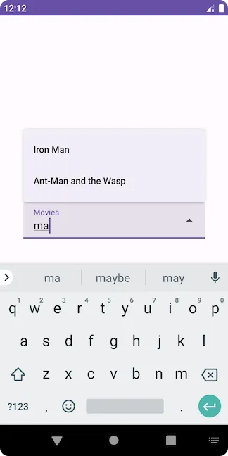

- [Material 3 Jetpack Compose のドロップダウン メニュー (例付き)](#material-3-jetpack-compose-のドロップダウン-メニュー-例付き)
  - [2. 公開ドロップダウン メニュー:](#2-公開ドロップダウン-メニュー)
    - [ExposedDropdownMenuBox():](#exposeddropdownmenubox)
    - [ExposedDropdownMenu():](#exposeddropdownmenu)
  - [引用元資料](#引用元資料)


# Material 3 Jetpack Compose のドロップダウン メニュー (例付き)

## 2. 公開ドロップダウン メニュー:

現在選択されている項目を表示します。次の API を使用して実装できます:

- ExposedDropdownMenuBox()
- TextField()
- ExposedDropdownMenu()
- DropdownMenuItem()

ExposedDropdownMenuBox() には TextField() と ExposedDropdownMenu() が含まれています。メニューでは、DropdownMenuItem() を使用して項目を追加します。

### ExposedDropdownMenuBox():

```kotlin
@Composable
fun ExposedDropdownMenuBox(
    expanded: Boolean,
    onExpandedChange: (Boolean) -> Unit,
    modifier: Modifier = Modifier,
    content: @Composable ExposedDropdownMenuBoxScope.() -> Unit     
)
```

- expand — メニューが表示されているかどうか。
- onExpandedChange — 公開されたドロップダウン メニューがクリックされたときに呼び出されます。
- modifier — レイアウトを変更する修飾子。
- content — このメニュー ボックスの内容。ここでテキスト フィールドと公開されたメニューを追加します。


### ExposedDropdownMenu():

```kotlin
@Composable
fun ExposedDropdownMenu(
    expanded: Boolean,
    onDismissRequest: () -> Unit,
    modifier: Modifier = Modifier,
    scrollState: ScrollState = rememberScrollState(),
    content: @Composable ColumnScope.() -> Unit     
)
```

- expand — メニューが表示されているかどうか。
- onDismissRequest — ユーザーがメニューの境界外をタップするか、戻るボタンを押したときに呼び出されます。
- modifier — レイアウトを変更する修飾子。
- scrollState — メニューのスクロール状態。
- content — メニューのコンテンツ。 DropdownMenuItem() メソッドを使用して項目を追加します。

例:

```kotlin
@OptIn(ExperimentalMaterial3Api::class)
@Composable
fun MyUI() {
    val moviesList = listOf(
        "Iron Man",
        "Thor: Ragnarok",
        "Captain America: Civil War",
        "Doctor Strange",
        "The Incredible Hulk",
        "Ant-Man and the Wasp"
    )
    var expanded by remember { mutableStateOf(false) }
    var selectedMovie by remember { mutableStateOf(moviesList[0]) }

    // menu box
    ExposedDropdownMenuBox(
        expanded = expanded,
        onExpandedChange = {
            expanded = !expanded
        }
    ) {
        // textfield
        TextField(
            modifier = Modifier.menuAnchor(MenuAnchorType.PrimaryNotEditable),
            readOnly = true,
            value = selectedMovie,
            onValueChange = {},
            label = { Text("Movies") },
            trailingIcon = { ExposedDropdownMenuDefaults.TrailingIcon(expanded = expanded) },
            colors = ExposedDropdownMenuDefaults.textFieldColors(),
        )

        // menu
        ExposedDropdownMenu(
            expanded = expanded,
            onDismissRequest = {
                expanded = false
            },
        ) {
            // menu items
            moviesList.forEach { selectionOption ->
                DropdownMenuItem(
                    text = { Text(selectionOption) },
                    onClick = {
                        selectedMovie = selectionOption
                        expanded = false
                    },
                    contentPadding = ExposedDropdownMenuDefaults.ItemContentPadding,
                )
            }
        }
    }
}
```

結果


**注意** : ドロップダウンの幅を画面いっぱいに広げたい場合は、 ExposedDropdownMenuBox() に `modifier = Modifier.fillMaxWidth()` を設定するのではなく、その下の TextField に対して、 fillMaxWidth() を指定してください。そうしないと幅いっぱいに広がりません。

TextField() の readOnly パラメータを true に設定します。その結果、入力は受け入れられず、現在選択されているムービーが表示されます。編集可能にして、入力に基づいてメニュー項目をフィルタリングしてみましょう。

```kotlin
@OptIn(ExperimentalMaterial3Api::class)
@Composable
fun MyUI() {
    val moviesList = listOf(
        "Iron Man",
        "Thor: Ragnarok",
        "Captain America: Civil War",
        "Doctor Strange",
        "The Incredible Hulk",
        "Ant-Man and the Wasp"
    )
    var expanded by remember { mutableStateOf(false) }
    var textFieldValue by remember { mutableStateOf("") }

    // container for textfield and menu
    ExposedDropdownMenuBox(
        expanded = expanded,
        onExpandedChange = {
            expanded = !expanded
        }
    ) {
        // textfield
        TextField(
            modifier = Modifier
                .menuAnchor(), // menuAnchor modifier must be passed to the text field for correctness      
            value = textFieldValue,
            onValueChange = { newValue ->
                textFieldValue = newValue
            },
            label = { Text("Movies") },
            trailingIcon = { ExposedDropdownMenuDefaults.TrailingIcon(expanded = expanded) },
            colors = ExposedDropdownMenuDefaults.textFieldColors(),
        )

        // filter options based on text field value
        val filteringOptions = moviesList.filter { it.contains(textFieldValue, ignoreCase = true) }
        if (filteringOptions.isNotEmpty()) {
            ExposedDropdownMenu(
                expanded = expanded,
                onDismissRequest = { expanded = false },
            ) {
                filteringOptions.forEach { selectedMovie_ ->
                    DropdownMenuItem(
                        text = { Text(selectedMovie_) },
                        onClick = {
                            textFieldValue = selectedMovie_
                            expanded = false
                        },
                        contentPadding = ExposedDropdownMenuDefaults.ItemContentPadding,
                    )
                }
            }
        }
    }
}
```



注: TextFiled の代わりに、OutlinedTextField を使用することもできます。

これは、Material 3 Jetpack Compose のドロップダウン メニュー API に関するすべてです。何か新しいことを学んでいただければ幸いです。疑問や提案があれば、お知らせください。

コーディングを楽しんでください :)


## 引用元資料

- [Dropdown Menu in Material 3 Jetpack Compose (with Examples)](https://kumar331.medium.com/dropdown-menu-in-material-3-jetpack-compose-with-examples-3298c9564412)


