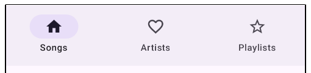

- [ボトムナビゲーションバー](#ボトムナビゲーションバー)
  - [androidx.compose.material3:material3.NavigationBar](#androidxcomposematerial3material3navigationbar)
    - [シグネチャ](#シグネチャ)
  - [サンプル](#サンプル)
  - [引用元資料](#引用元資料)


# ボトムナビゲーションバー

## androidx.compose.material3:material3.NavigationBar

### シグネチャ

```kotlin
@Composable
fun NavigationBar(
    modifier: Modifier = Modifier,
    containerColor: Color = NavigationBarDefaults.containerColor,
    contentColor: Color = MaterialTheme.colorScheme.contentColorFor(containerColor),
    tonalElevation: Dp = NavigationBarDefaults.Elevation,
    windowInsets: WindowInsets = NavigationBarDefaults.windowInsets,
    content: @Composable RowScope.() -> Unit
): Unit
```


## サンプル

```kotlin
import androidx.compose.material.icons.Icons
import androidx.compose.material.icons.filled.Favorite
import androidx.compose.material.icons.filled.Home
import androidx.compose.material.icons.filled.Star
import androidx.compose.material.icons.outlined.FavoriteBorder
import androidx.compose.material.icons.outlined.Home
import androidx.compose.material.icons.outlined.StarBorder
import androidx.compose.material3.Icon
import androidx.compose.material3.NavigationBar
import androidx.compose.material3.NavigationBarItem
import androidx.compose.material3.Text
import androidx.compose.runtime.mutableIntStateOf
import androidx.compose.runtime.remember

var selectedItem by remember { mutableIntStateOf(0) }
val items = listOf("Songs", "Artists", "Playlists")
val selectedIcons = listOf(Icons.Filled.Home, Icons.Filled.Favorite, Icons.Filled.Star)
val unselectedIcons =
    listOf(Icons.Outlined.Home, Icons.Outlined.FavoriteBorder, Icons.Outlined.StarBorder)

NavigationBar {
    items.forEachIndexed { index, item ->
        NavigationBarItem(
            icon = {
                Icon(
                    if (selectedItem == index) selectedIcons[index] else unselectedIcons[index],
                    contentDescription = item
                )
            },
            label = { Text(item) },
            selected = selectedItem == index,
            onClick = { selectedItem = index }
        )
    }
}
```




## 引用元資料

- [NavigationBar - Android Developer](https://developer.android.com/reference/kotlin/androidx/compose/material3/package-summary#NavigationBar(androidx.compose.ui.Modifier,androidx.compose.ui.graphics.Color,androidx.compose.ui.graphics.Color,androidx.compose.ui.unit.Dp,androidx.compose.foundation.layout.WindowInsets,kotlin.Function1))


