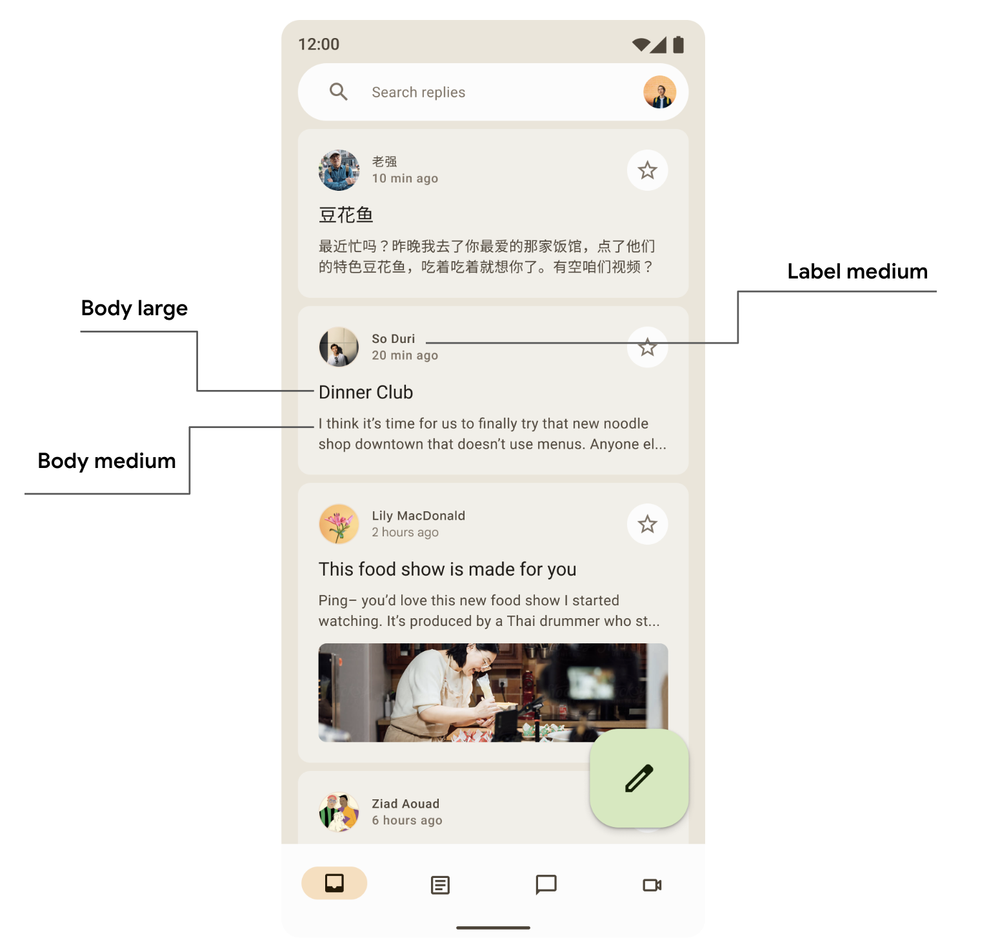
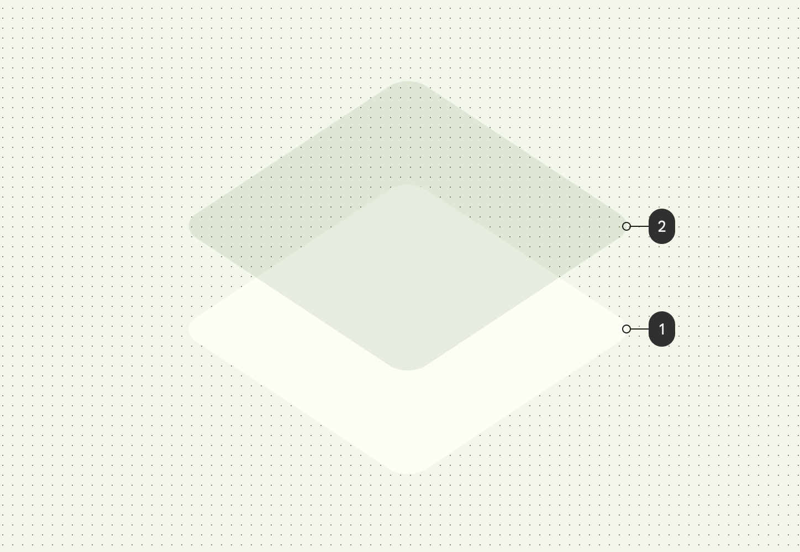
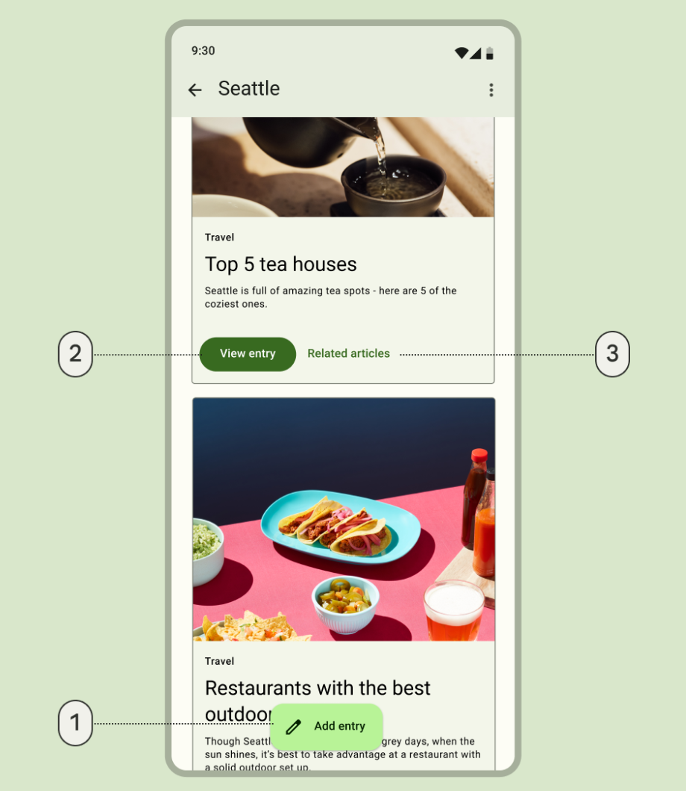
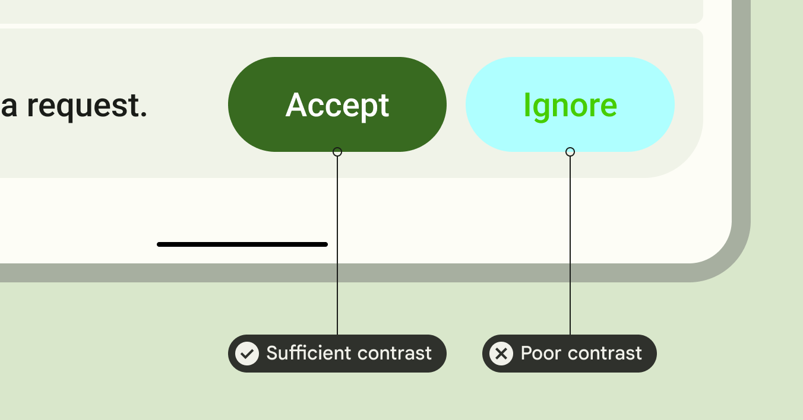

- [マテリアルデザイン 3](#マテリアルデザイン-3)
  - [依存関係](#依存関係)
    - [試験運用版 API](#試験運用版-api)
  - [マテリアル テーマ設定](#マテリアル-テーマ設定)
    - [カラースキーム（カラーパターン）](#カラースキームカラーパターン)
      - [カラースキームを生成する](#カラースキームを生成する)
      - [動的なカラースキーム](#動的なカラースキーム)
        - [デバイスの壁紙からソースカラーを抽出する場合](#デバイスの壁紙からソースカラーを抽出する場合)
        - [特定の画像などのアプリ内コンテンツからソースカラーを抽出する場合](#特定の画像などのアプリ内コンテンツからソースカラーを抽出する場合)
      - [色の使用](#色の使用)
    - [タイポグラフィ](#タイポグラフィ)
      - [タイポグラフィを定義する](#タイポグラフィを定義する)
      - [テキスト スタイルを使用する](#テキスト-スタイルを使用する)
    - [シェイプ](#シェイプ)
      - [シェイプを定義する](#シェイプを定義する)
      - [シェイプを使用する](#シェイプを使用する)
    - [強調](#強調)
  - [エレベーション](#エレベーション)
  - [マテリアルコンポーネント](#マテリアルコンポーネント)
    - [Navigation コンポーネント](#navigation-コンポーネント)
    - [コンポーネントのテーマ設定をカスタマイズする](#コンポーネントのテーマ設定をカスタマイズする)
  - [システム UI](#システム-ui)
    - [リップル](#リップル)
    - [オーバースクロール](#オーバースクロール)
  - [ユーザー補助](#ユーザー補助)
    - [色のユーザー補助](#色のユーザー補助)
    - [タイポグラフィのユーザー補助機能](#タイポグラフィのユーザー補助機能)
  - [大画面](#大画面)
  - [カスタムテーマの設定場所](#カスタムテーマの設定場所)
  - [詳細](#詳細)
    - [サンプルアプリ](#サンプルアプリ)
    - [ドキュメント](#ドキュメント)
    - [API リファレンスとソースコード](#api-リファレンスとソースコード)
    - [動画](#動画)
    - [引用元資料](#引用元資料)


# マテリアルデザイン 3

Jetpack Compose は、マテリアル デザインの次の進化形である [マテリアル デザイン 3](https://m3.material.io/) の実装を提供します。マテリアル 3 には、更新されたテーマ設定、コンポーネント、動的な色などの Material You パーソナライゼーション機能が含まれており、Android 12 以降の新しいビジュアル スタイルとシステム UI と調和するように設計されています。

注: 「マテリアル デザイン 3」、「マテリアル 3」、「M3」という用語は互換性があります。既存のマテリアル デザイン仕様と対応する androidx.compose.material ライブラリは、「マテリアル デザイン 2」、「マテリアル 2」、または「M2」と呼ばれます。

以下では、 [Reply サンプル アプリ](https://github.com/android/compose-samples/tree/main/Reply) を例として、マテリアル デザイン 3 の実装を示します。Reply サンプルは完全にマテリアル デザイン 3 に基づいています。


## 依存関係

Compose アプリでマテリアル 3 の使用を開始するには、Compose マテリアル 3 を追加します。 build.gradle ファイルに以下の依存関係を追加します。

```
implementation "androidx.compose.material3:material3:$material3_version"
```

依存関係が追加されると、色、タイポグラフィ、形状などのマテリアル デザイン システムをアプリに追加できるようになります。


### 試験運用版 API

一部の M3 API は試験的と見なされます。このような場合は、 [ExperimentalMaterial3Api](https://developer.android.com/reference/kotlin/androidx/compose/material3/ExperimentalMaterial3Api?hl=ja&_gl=1*iwwqs9*_up*MQ..*_ga*NTY3MDY5MDA1LjE3MjQ2NTg1MjY.*_ga_6HH9YJMN9M*MTcyNTk2NjAzNy4xMC4wLjE3MjU5NjYwMzcuMC4wLjI2NzIzMzE5OA..) アノテーションを使用して関数またはファイル レベルでオプトインする必要があります。


## マテリアル テーマ設定

M3 テーマには、配色、タイポグラフィ、シェイプなどのサブシステムが含まれています。これらの値をカスタマイズすると、アプリの構築に使用する M3 コンポーネントに変更が自動的に反映されます。


Jetpack Compose は、M3 の `MaterialTheme` コンポーザブルを使用してこれらの概念を実装します。

```kotlin
MaterialTheme(
    colorScheme = /* ... */
    typography = /* ... */
    shapes = /* ... */
) {
    // M3 app content
}
```

アプリケーション コンテンツのテーマを設定するには、アプリ固有のカラーパターン、タイポグラフィ、および形状を定義します。


### カラースキーム（カラーパターン）

[カラースキーム](../../../../../../マテリアルデザイン/マテリアルデザイン%203/5.Styles/2.Color/3.Color%20schemes/1.Choosing%20a%20scheme.md/#スキームを選択する) の基礎は、5 つの [キーカラー](../../../../../../マテリアルデザイン/マテリアルデザイン%203/5.Styles/2.Color/1.Color%20system.md/#キーカラーを生成する) のセットです。これらの色はそれぞれ、Material 3 コンポーネントで使用される 13 段階のトーン パレットに関連しています。たとえば、 [Reply](https://github.com/android/compose-samples/tree/main/Reply) のライト テーマの配色は次のとおりです。


詳しくは、 [カラースキームとカラーロール](https://m3.material.io/styles/color/roles) もしくは、それを [マークダウン形式で書き出した資料](../../../../../../マテリアルデザイン/マテリアルデザイン%203/5.Styles/2.Color/2.Color%20roles.md) をご覧ください。


#### カラースキームを生成する

カスタムの ColorScheme は手動で作成できますが、多くの場合、ブランドのソースカラーを使用して生成するほうが簡単です。 [マテリアル テーマ ビルダー ツール](https://m3.material.io/blog/material-theme-builder) を使用すると、この処理を行い、必要に応じて、 Compose 用のテーマ設定コードをエクスポートできます。

エクスポートされた Color.kt には、すべてのロールとそれに紐づく色が定義されています。ライトモードとダークモードの両方の色を含みます。

```kotlin
val md_theme_light_primary = Color(0xFF476810)
val md_theme_light_onPrimary = Color(0xFFFFFFFF)
val md_theme_light_primaryContainer = Color(0xFFC7F089)
// ..
// ..

val md_theme_dark_primary = Color(0xFFACD370)
val md_theme_dark_onPrimary = Color(0xFF213600)
val md_theme_dark_primaryContainer = Color(0xFF324F00)
// ..
// ..
```

Theme.kt には、ライトモードとダークモードのスキーム、およびアプリのテーマの設定が含まれています。

```kotlin
// ライトモードのカラースキーム
private val LightColorScheme = lightColorScheme(
    primary = md_theme_light_primary,
    onPrimary = md_theme_light_onPrimary,
    primaryContainer = md_theme_light_primaryContainer,
    // ..
)

// ダークモードのカラースキーム
private val DarkColorScheme = darkColorScheme(
    primary = md_theme_dark_primary,
    onPrimary = md_theme_dark_onPrimary,
    primaryContainer = md_theme_dark_primaryContainer,
    // ..
)

@Composable
fun ReplyTheme(
    darkTheme: Boolean = isSystemInDarkTheme(),
    content: @Composable () -> Unit
) {
    val colorScheme =
        if (!darkTheme) {
            LightColorScheme
        } else {
            DarkColorScheme
        }
    MaterialTheme(
        colorScheme = colorScheme,
        content = content
    )
}
```

明るいテーマと暗いテーマをサポートするには、 `isSystemInDarkTheme()` を使用します。システム設定に基づいて、明るい色と暗い色のどちらの配色を使用するかを定義します。


#### 動的なカラースキーム

[動的な色](https://m3.material.io/styles/color/dynamic-color/overview) は Material You の重要な部分であり、アルゴリズムがユーザーの壁紙からカスタム色を導出して、アプリやシステム UI に適用します。このカラー パレットは、明るい色と暗い色のカラースキームを生成するための開始点として使用されます。


ダイナミック カラーは Android 12 以降で利用できます。ダイナミック カラーが利用できる場合は、ダイナミック ColorScheme を設定できます。利用できない場合は、カスタムのライトまたはダーク ColorScheme を使用する必要があります。


##### デバイスの壁紙からソースカラーを抽出する場合

ColorScheme には、ダイナミックなライトまたはダーク カラー スキームを作成するためのビルダー関数が用意されています。

```kotlin
// Android 12 以降かどうかの判定
val dynamicColor = Build.VERSION.SDK_INT >= Build.VERSION_CODES.S
val colorScheme = when {
    dynamicColor && darkTheme -> dynamicDarkColorScheme(LocalContext.current)
    dynamicColor && !darkTheme -> dynamicLightColorScheme(LocalContext.current)
    darkTheme -> DarkColorScheme
    else -> LightColorScheme
}
```


##### 特定の画像などのアプリ内コンテンツからソースカラーを抽出する場合

アプリ内の画像やその他のコンテンツからソースカラーを取得するには、Palette API を利用する方法が一般的です。Palette API を使って、画像の主要な色を解析し、その色をアプリのテーマに反映させることができます。

以下は、画像から色を抽出する例です。

```kotlin
import androidx.palette.graphics.Palette
import android.graphics.Bitmap

fun extractColorFromImage(bitmap: Bitmap, onColorExtracted: (Int) -> Unit) {
    Palette.from(bitmap).generate { palette ->
        // 主要な色（ドミナントカラー）を抽出
        val dominantColor = palette?.getDominantColor(0) ?: 0
        onColorExtracted(dominantColor)
    }
}
```

この関数では、Palette API を使用して、画像から主要な色（DominantColor）を抽出しています。抽出した色をコールバック関数で受け取り、後でテーマに反映できます。

抽出した色を使用して、カラースキームを作成するには、以下のようにします。

```kotlin
import androidx.compose.material3.ColorScheme
import androidx.compose.material3.darkColorScheme
import androidx.compose.material3.lightColorScheme
import androidx.compose.runtime.Composable
import androidx.compose.ui.graphics.Color

@Composable
fun customColorScheme(dominantColor: Color, darkTheme: Boolean): ColorScheme {
    return if (darkTheme) {
        darkColorScheme(
            primary = dominantColor, // 抽出した色を使う
            onPrimary = Color.White,
            // 他の色も必要に応じて設定
        )
    } else {
        lightColorScheme(
            primary = dominantColor, // 抽出した色を使う
            onPrimary = Color.Black,
            // 他の色も必要に応じて設定
        )
    }
}
```

作成したカラースキームは、静的なカラースキームと同様にしてアプリに適用します。

```kotlin
@Composable
fun MyAppTheme(dominantColor: Color, darkTheme: Boolean = isSystemInDarkTheme(), content: @Composable () -> Unit) {
    val colors = customColorScheme(dominantColor, darkTheme)
    
    MaterialTheme(
        colorScheme = colors,
        typography = Typography, // Typography や他のテーマ設定も必要に応じて
        content = content
    )
}
```


#### 色の使用

MaterialTheme.colorScheme を介してアプリ内のマテリアル テーマ カラーにアクセスできます。

```kotlin
Text(
    text = "Hello theming",
    color = MaterialTheme.colorScheme.primary
)
```

各色の役割は、コンポーネントの状態、目立つ度合い、強調に応じて、さまざまな場所で使用できます。

- プライマリは基本色で、目立つボタン、アクティブ状態、隆起面の色合いなどの主要コンポーネントに使用されます。

- セカンダリ キー カラーは、フィルター チップなどの UI 内の目立たないコンポーネントに使用され、色表現の機会を広げます。

- ターシャリ キー カラーは、プライマリ カラーとセカンダリ カラーのバランスをとったり、要素に注目度を高めたりするために使用できる **対照的なアクセントの役割を導き出す** ために使用されます。

Reply サンプル アプリ デザインでは、 Primary Container の上に On Primary Container の色を使用して、選択した項目を強調しています。


```kotlin
Card(
    colors = CardDefaults.cardColors(
        containerColor =
        if (isSelected) MaterialTheme.colorScheme.primaryContainer
        else
            MaterialTheme.colorScheme.surfaceVariant
    )
) {
    Text(
        text = "Dinner club",
        style = MaterialTheme.typography.bodyLarge,
        color =
        if (isSelected) MaterialTheme.colorScheme.onPrimaryContainer
        else MaterialTheme.colorScheme.onSurface,
    )
}
```

ここでは、 Reply ナビゲーション ドロワーで、 Secondary Container カラーと Tertiary Container カラーのコントラストを使用して強調とアクセントを作成する方法を確認できます。


上記の例では、 Compose というラベルのボタンは FAB のようです。このボタンの役割は、おそらく、メッセージの新規作成ボタンだと思われます。一方で、 Inbox というラベルのボタンは、現在表示中の画面だと思われます。


### タイポグラフィ

Material Design 3 は、Material Design 2 から適応されたテキスト スタイルを含む [タイプ スケール](https://m3.material.io/styles/typography/overview) を定義します。命名とグループ化は、ディスプレイ、見出し、タイトル、本文、ラベルに簡素化され、それぞれに大、中、小のサイズが付けられています。


| M3             | デフォルトの フォントサイズ / 行の高さ |
| -------------- | -------------------------------------- |
| displayLarge   | Roboto 57/64                           |
| displayMedium  | Roboto 45/52                           |
| displaySmall   | Roboto 36/44                           |
| headlineLarge  | Roboto 32/40                           |
| headlineMedium | Roboto 28/36                           |
| headlineSmall  | Roboto 24/32                           |
| titleLarge     | New- Roboto Medium 22/28               |
| titleMedium    | Roboto Medium 16/24                    |
| titleSmall     | Roboto Medium 14/20                    |
| bodyLarge      | Roboto 16/24                           |
| bodyMedium     | Roboto 14/20                           |
| bodySmall      | Roboto 12/16                           |
| labelLarge     | Roboto Medium 14/20                    |
| labelMedium    | Roboto Medium 12/16                    |
| labelSmall     | New Roboto Medium, 11/16               |

注: M2 Typography クラスとは異なり、M3 Typography クラスには現在 defaultFontFamily パラメータが含まれていません。代わりに、各 TextStyles で fontFamily パラメータを使用する必要があります。


#### タイポグラフィを定義する

Compose は、Material 3 の type scale をモデル化するために、既存の [TextStyle](https://developer.android.com/reference/kotlin/androidx/compose/ui/text/TextStyle?_gl=1*g0ryrq*_up*MQ..*_ga*MTA0NTg2NTA1Mi4xNzI0NjU4NTI1*_ga_6HH9YJMN9M*MTcyNTE3OTU2Ni40LjAuMTcyNTE3OTU2Ni4wLjAuMA..) および [フォント関連](https://developer.android.com/reference/kotlin/androidx/compose/ui/text/font/package-summary?_gl=1*507o69*_up*MQ..*_ga*MTA0NTg2NTA1Mi4xNzI0NjU4NTI1*_ga_6HH9YJMN9M*MTcyNTE3OTU2Ni40LjAuMTcyNTE3OTU2Ni4wLjAuMA..) のクラスとともに M3 [Typography](https://developer.android.com/reference/kotlin/androidx/compose/material3/Typography?_gl=1*g0ryrq*_up*MQ..*_ga*MTA0NTg2NTA1Mi4xNzI0NjU4NTI1*_ga_6HH9YJMN9M*MTcyNTE3OTU2Ni40LjAuMTcyNTE3OTU2Ni4wLjAuMA..) クラスを提供します。Typography コンストラクターは各スタイルのデフォルト値が設定されているため、カスタマイズしたくないパラメータは省略できます。

```kotlin
val replyTypography = Typography(
    titleLarge = TextStyle(
        fontWeight = FontWeight.SemiBold,
        fontSize = 22.sp,
        lineHeight = 28.sp,
        letterSpacing = 0.sp
    ),
    titleMedium = TextStyle(
        fontWeight = FontWeight.SemiBold,
        fontSize = 16.sp,
        lineHeight = 24.sp,
        letterSpacing = 0.15.sp
    ),
    // ..
)
// ..
```



製品には、マテリアル デザイン タイプ スケールの 15 個のデフォルト スタイルすべてが必要ない可能性があります。この例では、5 つのサイズが縮小セットとして選択され、残りは省略されています。

TextStyle のデフォルト値と、fontFamily や letterSpacing などのフォント関連のプロパティを変更することで、タイポグラフィをカスタマイズできます。

```kotlin
bodyLarge = TextStyle(
    fontWeight = FontWeight.Normal,
    fontFamily = FontFamily.SansSerif,
    fontStyle = FontStyle.Italic,
    fontSize = 16.sp,
    lineHeight = 24.sp,
    letterSpacing = 0.15.sp,
    baselineShift = BaselineShift.Subscript
),
```

タイポグラフィを定義したら、それを M3 MaterialTheme に渡します。

```kotlin
MaterialTheme(
    typography = replyTypography,
) {
    // M3 app Content
}
```


#### テキスト スタイルを使用する

MaterialTheme.typography を使用すると、M3 MaterialTheme コンポーザブルに提供されるタイポグラフィを取得できます。

```kotlin
Text(
    text = "Hello M3 theming",
    style = MaterialTheme.typography.titleLarge
)
Text(
    text = "you are learning typography",
    style = MaterialTheme.typography.bodyMedium
)
```

さらに詳しい情報は、 [タイポグラフィの適用](https://m3.material.io/styles/typography/applying-type) に関するマテリアル ガイドラインをご覧ください。


### シェイプ

マテリアル サーフェスはさまざまなシェイプで表示できます。シェイプは注意を向けさせ、コンポーネントを識別し、状態を伝え、ブランドを表現します。

シェイプ スケールはコンテナーの角のスタイルを定義し、四角形から完全な円形までさまざまな丸みを提供します。


#### シェイプを定義する

Compose は、新しい M3 シェイプをサポートするために拡張されたパラメーターを備えた M3 [Shapes](https://developer.android.com/reference/kotlin/androidx/compose/material3/Shapes?_gl=1*10chhnv*_up*MQ..*_ga*MTA0NTg2NTA1Mi4xNzI0NjU4NTI1*_ga_6HH9YJMN9M*MTcyNTE3OTU2Ni40LjAuMTcyNTE3OTU2Ni4wLjAuMA..) クラスを提供します。M3 シェイプ スケールは [タイプ スケール](https://m3.material.io/styles/typography/overview) に似ており、UI 全体でさまざまなシェイプを表現できます。

M3 のシェイプには、 7 種類のサイズがあります。

- None
- Extra Small
- Small
- Medium
- Large
- Extra Large
- Full

各シェイプにデフォルト値がありますが、オーバーライドできます。 ( None は直角、 Full は完全な円であるため、オーバーライドはできません。)

```kotlin
val replyShapes = Shapes(
    extraSmall = RoundedCornerShape(4.dp),
    small = RoundedCornerShape(8.dp),
    medium = RoundedCornerShape(12.dp),
    large = RoundedCornerShape(16.dp),
    extraLarge = RoundedCornerShape(24.dp)
)
```

シェイプを定義したら、それを M3 MaterialTheme に渡すことができます。

```kotlin
MaterialTheme(
    shapes = replyShapes,
) {
    // M3 app Content
}
```


#### シェイプを使用する

MaterialTheme のすべてのコンポーネントのシェイプ スケールをカスタマイズすることも、コンポーネントごとにカスタマイズすることもできます。

デフォルト値を使用して中サイズと大サイズのシェイプを適用します。

```kotlin
Card(shape = MaterialTheme.shapes.medium) { /* card content */ }
FloatingActionButton(
    shape = MaterialTheme.shapes.large,
    onClick = {
    }
) {
    /* fab content */
}
```


Compose には、他に RectangleShape と CircleShape という 2 つの図形があります。Rectangle 図形には境界半径がなく、円形図形には完全な円のエッジが表示されます。

```kotlin
Card(shape = RectangleShape) { /* card content */ }
Card(shape = CircleShape) { /* card content */ }
```

以下の例は、デフォルトのシェイプ値が適用されたコンポーネントの例です。


さらに詳しい情報を得るには、 [シェイプの適用](https://m3.material.io/styles/shape/overview) に関するマテリアルのガイドラインを参照してください。


### 強調

M3 では、UI に強調を追加する方法が 2 つあります。

1. 背景色と文字色の組み合わせを使用して提供されます。たとえば、サーフェスを、あえて、オンサーフェス バリアントと一緒に使用したり、サーフェス バリアントを、あえて、オンサーフェスと一緒に使用して、さまざまなレベルの強調を提供できます。


2. テキストに異なるフォントの太さを使用します。以下のコードでは、異なる強調を提供するために、タイプ スケールにカスタムの太さを指定しています。

```kotlin
bodyLarge = TextStyle(
    fontWeight = FontWeight.Bold
),
bodyMedium = TextStyle(
    fontWeight = FontWeight.Normal
)
```

注: M3 の無効な状態では、アルファ値を持つ「On Xxx」( x は Primary や Surface など) の色を使用することは引き続き可能です。


## エレベーション

用語 : 「オーバーレイ」 という言葉には、薄いものを覆いかぶせるという意味があります。

マテリアル 3 は、主に色調オーバーレイを使用して高度を表現します。これは、影に加えて (※ 1 ) 、 **コンポーネントの高度を上げるとより目立つ色調を使用する** ため、コンテナーと表面を区別する新しい方法です。

(※ 1 ) 影がなく、色調のみで高度を表現することもあります。



ダーク テーマの高度オーバーレイも、マテリアル 3 では色調 カラー オーバーレイに変更されました。オーバーレイの色は、プライマリ カラー スロットから取得されます。


M3 Surface (ほとんどの M3 コンポーネントの背後で構成可能なバッキングコンポーザブル) には、トーンとシャドウのエレベーションの両方のサポートが含まれています。

```kotlin
Surface(
    modifier = Modifier,
    tonalElevation = /*...
    shadowElevation = /*...
) {
    Column(content = content)
}
```


## マテリアルコンポーネント

マテリアル デザインには、マテリアル テーマに準拠した豊富な [マテリアル コンポーネント](https://m3.material.io/components) (ボタン、チップ、カード、ナビゲーション バーなど) が付属しており、美しいマテリアル デザイン アプリの作成に役立ちます。デフォルトのプロパティを持つコンポーネントをすぐに使い始めることができます。

```kotlin
Button(onClick = { /*..*/ }) {
    Text(text = "My Button")
}
```

M3 は、重点や注目度に応じて異なる役割で使用できるように、同じコンポーネントの多くのバージョンを提供します。



- 最も強調されるアクションのための拡張フローティング アクション ボタン

```kotlin
ExtendedFloatingActionButton(
    onClick = { /*..*/ },
    modifier = Modifier
) {
    Icon(
        imageVector = Icons.Default.Edit,
        contentDescription = stringResource(id = R.string.edit),
    )
    Text(
        text = stringResource(id = R.string.add_entry),
    )
}
```

- 強調度の高いアクションを表す塗りつぶされたボタン

```kotlin
Button(onClick = { /*..*/ }) {
    Text(text = stringResource(id = R.string.view_entry))
}
```

- 低強調アクション用のテキスト ボタン:

```kotlin
TextButton(onClick = { /*..*/ }) {
    Text(text = stringResource(id = R.string.replated_articles))
}
```

Material ボタンやその他のコンポーネントの詳細については、 [こちら](https://m3.material.io/components/all-buttons) をご覧ください。Material 3 には、さまざまなユースケースや画面サイズに合わせて特別に設計されたボタン、アプリ バー、ナビゲーション コンポーネントなど、さまざまなコンポーネント スイートが用意されています。


### Navigation コンポーネント

Material には、さまざまな画面サイズや状態に応じてナビゲーションを実装するのに役立つナビゲーション コンポーネントもいくつか用意されています。


左側の図は、ボトムナビゲーションバーの例で、右側の図は、ナビゲーションレールの例です。

NavigationBar は、ターゲットとする移動先が 5 つ以下のコンパクトなデバイスで使用されます。

```kotlin
NavigationBar(modifier = Modifier.fillMaxWidth()) {
    Destinations.entries.forEach { replyDestination ->
        NavigationBarItem(
            selected = selectedDestination == replyDestination,
            onClick = { },
            icon = { }
        )
    }
}
```

NavigationRail は、小型から中型のタブレットや横向きのスマートフォンに使用されます。ユーザーに人間工学を提供し、これらのデバイスのユーザー エクスペリエンスを向上させます。

```kotlin
NavigationRail(
    modifier = Modifier.fillMaxHeight(),
) {
    Destinations.entries.forEach { replyDestination ->
        NavigationRailItem(
            selected = selectedDestination == replyDestination,
            onClick = { },
            icon = { }
        )
    }
}
```

Reply サンプルアプリでは、デフォルトのテーマ設定で両方を使用しているため、すべてのデバイス サイズで没入感のあるユーザー エクスペリエンスを提供できます。

NavigationDrawer は、詳細を表示するのに十分なスペースがある中型から大型のタブレットで使用されます。PermanentNavigationDrawer または ModalNavigationDrawer の両方を NavigationRail と一緒に使用できます。

```kotlin
PermanentNavigationDrawer(modifier = Modifier.fillMaxHeight(), drawerContent = {
    Destinations.entries.forEach { replyDestination ->
        NavigationRailItem(
            selected = selectedDestination == replyDestination,
            onClick = { },
            icon = { },
            label = { }
        )
    }
}) {
}
```

以下の図は、 Reply サンプルアプリで、ドロワーナビゲーションを固定 (常に表示) にしている例です。


ナビゲーション オプションにより、ユーザー エクスペリエンス、人間工学、到達可能性が向上します。Material ナビゲーション コンポーネントの詳細については、 [Compose アダプティブ コードラボ](https://codelabs.developers.google.com/jetpack-compose-adaptability) をご覧ください。


### コンポーネントのテーマ設定をカスタマイズする

M3 は、パーソナライズと柔軟性を促進します。すべてのコンポーネントにはデフォルトの色が適用されますが、必要に応じて色をカスタマイズするための柔軟な API が公開されています。

カードやボタンなどのほとんどのコンポーネントは、色と高度のインターフェースを公開するデフォルトのオブジェクトを提供し、これを変更してコンポーネントをカスタマイズできます。

```kotlin
val customCardColors = CardDefaults.cardColors(
    contentColor = MaterialTheme.colorScheme.primary,
    containerColor = MaterialTheme.colorScheme.primaryContainer,
    disabledContentColor = MaterialTheme.colorScheme.surface,
    disabledContainerColor = MaterialTheme.colorScheme.onSurface,
)
val customCardElevation = CardDefaults.cardElevation(
    defaultElevation = 8.dp,
    pressedElevation = 2.dp,
    focusedElevation = 4.dp
)
Card(
    colors = customCardColors,
    elevation = customCardElevation
) {
    // m3 card content
}
```

マテリアル 3 のカスタマイズの詳細については、 [こちら](https://m3.material.io/foundations/customization) をご覧ください。


## システム UI

Material You の一部の側面は、Android 12 以降の新しいビジュアル スタイルとシステム UI から来ています。変更がある 2 つの主要な領域は、リップルとオーバースクロールです。これらの変更を実装するために追加の作業は必要ありません。


### リップル

リップルは、押されたときに表面を照らすために微妙な輝きを使用するようになりました。 [Compose Material Ripple](https://developer.android.com/reference/kotlin/androidx/compose/material/ripple/package-summary?_gl=1*iht7ue*_up*MQ..*_ga*MTA0NTg2NTA1Mi4xNzI0NjU4NTI1*_ga_6HH9YJMN9M*MTcyNTE3OTU2Ni40LjAuMTcyNTE3OTU2Ni4wLjAuMA..) は、Android の内部でプラットフォーム RippleDrawable を使用するため、スパークル リップルは Android 12 以降ですべての Material コンポーネントで利用できます。


上記の画像は Gif 画像なんだけど、何も動いていない気がする...。


### オーバースクロール

オーバースクロールでは、スクロール コンテナーの端で [ストレッチ効果](https://developer.android.com/about/versions/12/behavior-changes-all?_gl=1*v757po*_up*MQ..*_ga*MTA0NTg2NTA1Mi4xNzI0NjU4NTI1*_ga_6HH9YJMN9M*MTcyNTE3OTU2Ni40LjAuMTcyNTE3OTU2Ni4wLjAuMA..#overscroll) を使用するようになりました。ストレッチ オーバースクロールは、API レベルに関係なく、 [Compose Foundation](https://developer.android.com/jetpack/androidx/releases/compose-foundation?_gl=1*xhbptz*_up*MQ..*_ga*MTA0NTg2NTA1Mi4xNzI0NjU4NTI1*_ga_6HH9YJMN9M*MTcyNTE3OTU2Ni40LjAuMTcyNTE3OTU2Ni4wLjAuMA..) 1.1.0 以降ではスクロール コンテナー コンポーザブル (LazyColumn、LazyRow、LazyVerticalGrid など) でデフォルトでオンになっています。


## ユーザー補助

マテリアル コンポーネントに組み込まれたアクセシビリティ標準は、包括的な製品設計の基盤を提供するように設計されています。製品のアクセシビリティを理解することで、視力低下、失明、聴覚障害、認知障害、運動障害、または状況的障害 (腕の骨折など) を持つユーザーを含むすべてのユーザーの使いやすさを向上させることができます。


### 色のユーザー補助

ダイナミック カラーは、色のコントラストのアクセシビリティ標準を満たすように設計されています。色調パレットのシステムは、デフォルトですべての配色をアクセシビリティ対応にするために不可欠です。

マテリアルの色システムは、アクセシビリティ対応のコントラスト比を満たすために使用できる標準の色調値と測定値を提供します。


すべてのマテリアル コンポーネントと動的テーマ設定では、アクセシビリティ要件を満たすように選択された一連の [色調パレット](https://m3.material.io/styles/color/the-color-system/key-colors-tones#a828e350-1551-45e5-8430-eb643e6a7713) から上記のカラー ロールがすでに使用されています。ただし、コンポーネントをカスタマイズする場合は、適切なカラー ロールを使用して不一致を回避するようにしてください。

primary の上に on-primary を使用し、 primary-container の上に on-primary-container を使用し、他のアクセント カラーとニュートラル カラーにも同じことを行って、ユーザーにわかりやすいコントラストを提供します。

プライマリの上に tertiary-container を使用すると、ユーザーにはコントラストの低いボタンが表示されます。

```kotlin
// ✅ 十分なコントラストを持つボタン
Button(
    onClick = { },
    colors = ButtonDefaults.buttonColors(
        containerColor = MaterialTheme.colorScheme.primary,
        contentColor = MaterialTheme.colorScheme.onPrimary
    )
) {
}

// ❌ 十分なコントラストを持たないボタン
Button(
    onClick = { },
    colors = ButtonDefaults.buttonColors(
        containerColor = MaterialTheme.colorScheme.tertiaryContainer,
        contentColor = MaterialTheme.colorScheme.primaryContainer
    )
) {
}
```




### タイポグラフィのユーザー補助機能

M3 タイプ スケールは、静的なタイプ ランプと値を更新して、デバイス間でスケーリングされるサイズ カテゴリの単純化されながらも動的なフレームワークを提供します。

たとえば、M3 では、電話やタブレットなどのデバイスのコンテキストに応じて、 Display Small に異なる値を割り当てることができます。


## 大画面

Material は、アプリのアクセシビリティを高め、大型デバイスを持つユーザーの人間工学を向上させるために、アダプティブ レイアウトと折りたたみ式デバイスに関するガイダンスを提供します。

Material は、大型デバイスでより優れたユーザー エクスペリエンスを提供するために、さまざまな種類の [ナビゲーション](https://m3.material.io/components/navigation-bar/overview) を提供します。

Android の [大画面アプリの品質ガイドラインの詳細](https://developer.android.com/docs/quality-guidelines/large-screen-app-quality?_gl=1*1dtc6cu*_up*MQ..*_ga*MTA0NTg2NTA1Mi4xNzI0NjU4NTI1*_ga_6HH9YJMN9M*MTcyNTE3OTU2Ni40LjAuMTcyNTE3OTU2Ni4wLjAuMA..) を確認し、アダプティブでアクセシビリティの高いデザインに関する [Reply サンプル](https://github.com/android/compose-samples/tree/main/Reply) をご覧ください。


## カスタムテーマの設定場所

カスタムテーマのコンポーザブル関数をどこで実行したらよいかについて説明します。

つまり、例えば、 [カラースキームを生成する](#カラースキームを生成する) の章で提示しているサンプルコードにある `ReplyTheme` コンポーザブル関数の呼び出し箇所がどこなのかについての説明になります。

ReplyTheme コンポーザブル関数は、アプリ全体のテーマを適用するための関数です。これを適用する場所は、通常アプリのエントリーポイントや、アプリの主要な UI 構成要素を定義する最初のコンポーザブル関数のラップとして使用します。

具体的には、 MainActivity の onCreate 内の setContent 関数の中や、他のトップレベルのコンポーザブル関数の中で ReplyTheme をラップして、全体の UI に対してテーマを適用します。 setContent 内で呼び出す場合は、以下のようになります。

```kotlin
class MainActivity : ComponentActivity() {
    override fun onCreate(savedInstanceState: Bundle?) {
        super.onCreate(savedInstanceState)
        setContent {
            ReplyTheme {
                // アプリのコンテンツ全体がこのテーマでラップされます
                MyAppContent()
            }
        }
    }
}

@Composable
fun MyAppContent() {
    // アプリのメインUI
}
```

これで、ReplyTheme で定義した色やスタイルが、MyAppContent 以下のすべてのコンポーザブルに適用されます。


## 詳細

Compose のマテリアル テーマ設定の詳細については、次のリソースをご覧ください。


### サンプルアプリ

- [Reply M3 サンプルアプリ](https://github.com/android/compose-samples/tree/main/Reply)


### ドキュメント

- [Compose でマテリアル 2 からマテリアル 3 に移行する](https://developer.android.com/develop/ui/compose/designsystems/material2-material3?hl=ja&_gl=1*1reg2lr*_up*MQ..*_ga*NTY3MDY5MDA1LjE3MjQ2NTg1MjY.*_ga_6HH9YJMN9M*MTcyNTk2NjAzNy4xMC4wLjE3MjU5NjYwMzcuMC4wLjI2NzIzMzE5OA..)
- [マテリアル デザイン ガイドライン](https://m3.material.io/)


### API リファレンスとソースコード

- [Compose Material 3 API リファレンス](https://developer.android.com/reference/kotlin/androidx/compose/material3/package-summary?hl=ja&_gl=1*1reg2lr*_up*MQ..*_ga*NTY3MDY5MDA1LjE3MjQ2NTg1MjY.*_ga_6HH9YJMN9M*MTcyNTk2NjAzNy4xMC4wLjE3MjU5NjYwMzcuMC4wLjI2NzIzMzE5OA..)
- [ソースコード内の Compose Material 3 サンプル](https://cs.android.com/androidx/platform/frameworks/support/+/androidx-main:compose/material3/material3/samples/src/main/java/androidx/compose/material3/samples/?hl=ja)


### 動画

- [Jetpack Compose での Material You](https://www.youtube.com/watch?v=jrfuHyMlehc&hl=ja)


### 引用元資料

- [Compose のマテリアル デザイン 3](https://developer.android.com/develop/ui/compose/designsystems/material3?hl=ja&_gl=1*1c6enc9*_up*MQ..*_ga*MTU1ODkxOTQ0NC4xNzI5MjU4NTc3*_ga_6HH9YJMN9M*MTcyOTI1ODU3Ny4xLjAuMTcyOTI1ODU3Ny4wLjAuOTUyODkyMDc.)

