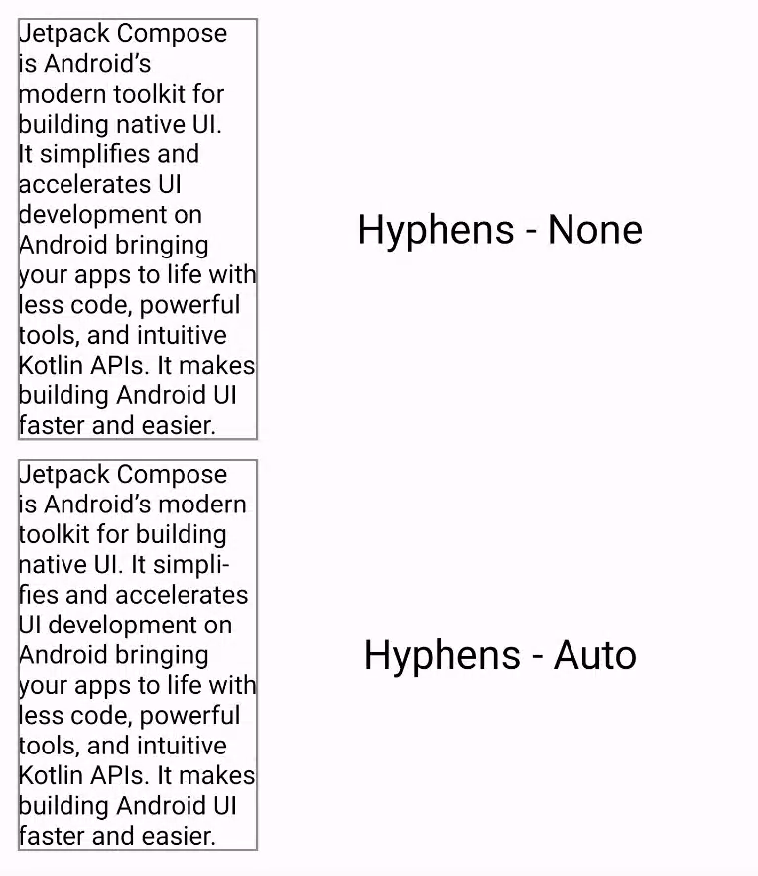

- [段落に対するスタイル設定](#段落に対するスタイル設定)
  - [テキストの配置を設定](#テキストの配置を設定)
  - [段落に複数のスタイルを追加する](#段落に複数のスタイルを追加する)
  - [行の高さとパディングを調整する](#行の高さとパディングを調整する)
  - [改行を挿入する](#改行を挿入する)
    - [改行をカスタマイズする](#改行をカスタマイズする)
    - [CJK に関する考慮事項](#cjk-に関する考慮事項)
  - [行をまたいでテキストを分割する（ハイフネーション）](#行をまたいでテキストを分割するハイフネーション)


# 段落に対するスタイル設定

このページでは、段落に対してテキストのスタイルを設定する方法について説明します。段落レベルのスタイルを設定するには、textAlign や lineHeight などのパラメータを構成するか、独自の ParagraphStyle を定義します。


## テキストの配置を設定

textAlign パラメータを使用すると、テキストの構成可能なサーフェス領域内での [テキストの水平方向の配置](https://developer.android.com/reference/kotlin/androidx/compose/ui/text/style/TextAlign?_gl=1*cbg77p*_up*MQ..*_ga*MTcwMzU5OTM3OS4xNzI2MTUyNTE0*_ga_6HH9YJMN9M*MTcyNjE1MjUxMy4xLjAuMTcyNjE1MjUxMy4wLjAuMTAzODExODk0NQ..) を設定できます。

デフォルトでは、テキストはコンテンツの値に応じて自然なテキスト配置を選択します。

- ラテン語、キリル文字、ハングルなどの左から右のアルファベットの場合は、テキスト コンテナの左端
- アラビア語やヘブライ語などの右から左のアルファベットの場合は、テキスト コンテナの右端

```kotlin
@Composable
fun CenterText() {
    Text(
        "Hello World", textAlign = TextAlign.Center, modifier = Modifier.width(150.dp)
    )
}
```


わかりずらいですが、上記の図は、 Hello World の左右にパディングが設定されて、水平方向に対して中央寄せになっています。

Text コンポーザブルのテキスト配置を手動で設定する場合は、それぞれ TextAlign.Left と TextAlign.Right ではなく TextAlign.Start と TextAlign.End を使用することをお勧めします。

注: テキスト配置は、 Row や Column などのコンテナ内で Composable を配置するレイアウト配置とは異なります。


## 段落に複数のスタイルを追加する

段落に複数のスタイルを追加するには、任意のアノテーションスタイルで、アノテーションを付けることができる AnnotatedString で ParagraphStyle を使用できます。

**テキストの一部に ParagraphStyle が付けられると、その部分は、先頭と末尾に改行があるかのように、残りのテキストから分離されます。**

テキストに複数のスタイルを追加する方法の詳細については、 [テキストに複数のスタイルを追加する](./2.テキストのスタイルを設定する.md/#テキストに複数のスタイルを追加する) を参照してください。

AnnotatedString には、作成を容易にする型セーフなビルダーである buildAnnotatedString があります。次のスニペットでは、buildAnnotatedString を使用して ParagraphStyle を設定しています。

```kotlin
@Composable
fun ParagraphStyle() {
    Text(
        buildAnnotatedString {
            withStyle(style = ParagraphStyle(lineHeight = 30.sp)) {
                withStyle(style = SpanStyle(color = Color.Blue)) {
                    append("Hello\n")
                }
                withStyle(
                    style = SpanStyle(
                        fontWeight = FontWeight.Bold, color = Color.Red
                    )
                ) {
                    append("World\n")
                }
                append("Compose")
            }
        }
    )
}
```


## 行の高さとパディングを調整する

includeFontPadding は、テキストの最初の行の上部と最後の行の下部にフォント メトリックに基づいて追加のパディングを追加するレガシー プロパティです。Compose BOM バージョン 2024.01.01 以降、includeFontPadding はデフォルトで false に設定され、デフォルトのテキスト レイアウトが一般的なデザイン ツールとより一致するようになりました。

lineHeight を構成する機能は新しいものではなく、Android Q 以降で使用可能です。テキストの lineHeight は、各テキスト行の行の高さを分散する lineHeight パラメータを使用して構成できます。その後、新しい LineHeightStyle API を使用して、このテキストをスペース内でどのように配置するかをさらに構成し、空白を削除できます。

精度を向上させるために、テキスト単位「sp」(スケーリングされたピクセル) ではなくテキスト単位「em」(相対フォント サイズ) を使用して lineHeight を調整することをお勧めします。適切なテキスト単位の選択の詳細については、TextUnit をご覧ください。


```kotlin
Text(
    text = text,
    style = LocalTextStyle.current.merge(
        TextStyle(
            // lineHeight は、一行分の高さ。
            // 1 em は、上下に余白を考えない場合の最小の高さであり、
            // それを 2 にすれば、その 2 倍の高さになるなど、
            // em は、相対的な大きさを示す単位です。
            lineHeight = 2.5.em,
            platformStyle = PlatformTextStyle(
                includeFontPadding = false
            ),
            lineHeightStyle = LineHeightStyle(
                // 
                alignment = LineHeightStyle.Alignment.Center,
                // 先頭行の上側の余白、最終行の下側の余白を
                // トリムするかどうかを指定できます。
                trim = LineHeightStyle.Trim.None
            )
        )
    )
)
```

lineHeight [の調整に加えて、LineHeightStyle](https://developer.android.com/reference/kotlin/androidx/compose/ui/text/style/LineHeightStyle?_gl=1*1n58mz9*_up*MQ..*_ga*MTcwMzU5OTM3OS4xNzI2MTUyNTE0*_ga_6HH9YJMN9M*MTcyNjE1MjUxMy4xLjAuMTcyNjE1MjUxMy4wLjAuMTAzODExODk0NQ..) の試験的 API である [LineHeightStyle.Alignment](https://developer.android.com/reference/kotlin/androidx/compose/ui/text/style/LineHeightStyle.Alignment?_gl=1*1n58mz9*_up*MQ..*_ga*MTcwMzU5OTM3OS4xNzI2MTUyNTE0*_ga_6HH9YJMN9M*MTcyNjE1MjUxMy4xLjAuMTcyNjE1MjUxMy4wLjAuMTAzODExODk0NQ..) と [LineHeightStyle.Trim](https://developer.android.com/reference/kotlin/androidx/compose/ui/text/style/LineHeightStyle.Trim?_gl=1*1n58mz9*_up*MQ..*_ga*MTcwMzU5OTM3OS4xNzI2MTUyNTE0*_ga_6HH9YJMN9M*MTcyNjE1MjUxMy4xLjAuMTcyNjE1MjUxMy4wLjAuMTAzODExODk0NQ..) の設定を使用して、テキストをさらに中央揃えおよびスタイル設定できるようになりました (Trim が機能するには、includeFontPadding を false に設定する必要があります)。

Alignment と Trim は、テキストの行間の測定されたスペースを使用して、1 行のテキストとテキスト ブロックの最上部の行を含むすべての行に、より適切にスペースを配分します。

LineHeightStyle.Alignment は、行の高さによって提供されるスペース内で行を揃える方法を定義します。各行内で、テキストを Top , Bottom , Center , Proportional に設定することができます。 ( Proportional は、どういう配置なのかよくわかりませんでした。)

LineHeightStyle.Trim を使用すると、lineHeight と Alignment の調整によって生成された、テキストの最初の行の上部と最後の行の下部の余分なスペースを残すか削除することができます。

次のサンプルは、中央揃え (LineHeightStyle.Alignment.Center) の場合に、さまざまな LineHeightStyle.Trim 設定で複数行のテキストがどのように表示されるかを示しています。

**LineHeightStyle.Trim.FirstLineTop**


**LineHeightStyle.Trim.LastLineBottom**


**LineHeightStyle.Trim.Both**


**LineHeightStyle.Trim.None**


**警告** : LineHeightStyle API (Trim) を使用したこれらの調整は、includeFontPadding = false と一緒に使用した場合にのみ機能します。

この変更の背景、View システムでの includeFontPadding の動作、および Compose と新しい LineHeightStyle API に加えられた変更の詳細については、 [Compose Text のフォント パディングの修正](http://goo.gle/font-padding-compose) に関するブログ投稿を参照してください。


## 改行を挿入する

[LineBreak](https://developer.android.com/reference/kotlin/androidx/compose/ui/text/style/LineBreak?_gl=1*1doo33p*_up*MQ..*_ga*MTcwMzU5OTM3OS4xNzI2MTUyNTE0*_ga_6HH9YJMN9M*MTcyNjE1MjUxMy4xLjAuMTcyNjE1MjUxMy4wLjAuMTAzODExODk0NQ..) API は、テキストを複数の行に分割する基準を定義します。Text コンポーザブルの TextStyle ブロックで、必要な改行の種類を指定できます。プリセットの改行の種類は次のとおりです。

- Simple — 高速で基本的な改行。テキスト入力フィールドに推奨されます。

- Heading — 改行ルールが緩い改行。タイトルなどの短いテキストに推奨されます。

- Paragraph — 読みやすさを向上させるために、低速で高品質の改行。段落などの大量のテキストに推奨されます。

次のスニペットでは、 Simple と Paragraph の両方を使用して、長いテキスト ブロックでの改行動作を指定しています。

```kotlin
// 以下の二つの Text コンポーザブルは、 TextStyle の
// lineBreak パラメータ以外はすべて同じです。

Text(
    text = SAMPLE_LONG_TEXT,
    modifier = Modifier
        .width(130.dp)
        .border(BorderStroke(1.dp, Color.Gray)),
    fontSize = 14.sp,
    style = TextStyle.Default.copy(
        lineBreak = LineBreak.Simple
    )
)

Text(
    text = SAMPLE_LONG_TEXT,
    modifier = Modifier
        .width(130.dp)
        .border(BorderStroke(1.dp, Color.Gray)),
    fontSize = 14.sp,
    style = TextStyle.Default.copy(
        lineBreak = LineBreak.Paragraph
    )
)
```


上記の出力では、段落の改行動作によって、単純な改行よりも視覚的にバランスの取れた結果が得られることに注目してください。 (日本語にも対応しているのか要確認。)


### 改行をカスタマイズする

前提知識 : ハイフネーションとは、行末に収まらない長い単語を前後に分割し、ハイフンを挿入することです。

Strategy パラメータを使用して、独自の LineBreak 構成を作成することもできます。Strategy は次のいずれかになります。

- Balanced — テキストの行の長さのバランスを取ろうとし、有効になっている場合は自動ハイフネーションも適用します。スマートウォッチデバイスなどの小さな画面では、表示されるテキストの量を最大化するために推奨されます。

- HighQuality — 段落を最適化して、テキストを読みやすくします。有効になっている場合はハイフネーションも適用します。 ( Balanced または Simple 以外のすべてのデフォルトにする必要があります。)

- Simple — 基本的な高速戦略。有効になっている場合は、単独では 1 行に収まらない単語に対してのみハイフネーションが行われます。入力中に位置が変わるのを避けるためにテキストを編集する場合に便利です。

注: Strictness および WordBreak パラメータを使用して、改行動作をカスタマイズすることもできます。これらのパラメータは CJK 言語用に設計されており、CJK 以外の言語で使用すると意図した効果が得られない場合があります。詳細については、 [CJK の考慮事項](#cjk-に関する考慮事項) を参照してください。

次のスニペットは、デフォルト設定の段落と、Balanced 改行戦略を使用して小さな画面向けに最適化された段落の違いを示しています。

```kotlin
// 以下の二つの Text コンポーザブルは、 style パラメータ以外はすべて同じです。

val smallScreenAdaptedParagraph =
    LineBreak.Paragraph.copy(strategy = LineBreak.Strategy.Balanced)
Text(
    text = SAMPLE_LONG_TEXT,
    modifier = Modifier
        .width(200.dp)
        .border(BorderStroke(1.dp, Color.Gray)),
    fontSize = 14.sp,
    style = TextStyle.Default.copy(
        lineBreak = smallScreenAdaptedParagraph
    )
)

Text(
    text = SAMPLE_LONG_TEXT,
    modifier = Modifier
        .width(200.dp)
        .border(BorderStroke(1.dp, Color.Gray)),
    fontSize = 14.sp,
    style = TextStyle.Default
)
```


### CJK に関する考慮事項

前提知識 : CJK とは、 「 Chinese, Japanese, Korean 」 の頭文字を取った略称で、中国語（Chinese）、日本語（Japanese）、韓国語または朝鮮語（Korean）を指します。

日本語の改行ルールの設定は、上部のセクションで説明されているコードよりも、このセクションで説明されているコードを使用したほうがよさそうな気がする。

LineBreak は、 [Strictness](https://developer.android.com/reference/kotlin/androidx/compose/ui/text/style/LineBreak.Strictness?_gl=1*mj4jai*_up*MQ..*_ga*MTcwMzU5OTM3OS4xNzI2MTUyNTE0*_ga_6HH9YJMN9M*MTcyNjE1MjUxMy4xLjAuMTcyNjE1MjUxMy4wLjAuMTAzODExODk0NQ..) API と [WordBreak](https://developer.android.com/reference/kotlin/androidx/compose/ui/text/style/LineBreak.WordBreak?_gl=1*mj4jai*_up*MQ..*_ga*MTcwMzU5OTM3OS4xNzI2MTUyNTE0*_ga_6HH9YJMN9M*MTcyNjE1MjUxMy4xLjAuMTcyNjE1MjUxMy4wLjAuMTAzODExODk0NQ..) API を使用してカスタマイズすることもできます。これらの API は、 CJK 言語専用に設計されており、これらの API の効果は、 CJK 以外の言語では必ずしも確認できない場合があります。全体として、改行ルールはロケールに基づいて定義されます。

`Strictness` は、次のプロパティを使用して改行の厳密さを表します。

- Default — ロケールのデフォルトの改行ルール。 Normal または Strict に対応する場合があります。
  - 注: Strictness のデフォルトの推奨値は、ロケールによって異なります。
- Loose — 最も制限の少ないルール。短い行に適しています。
- Normal — 最も一般的な改行ルール。
- Strict — 最も厳格な改行ルール。

`WordBreak` は、次のプロパティを使用して単語内に改行を挿入する方法を定義します:

- Default — ロケールのデフォルトの改行ルール。
- Phrase — 改行はフレーズに基づきます。

次のスニペットは、日本語テキストに対して厳密な厳密性とフレーズ単語分割設定を使用しています:

注: 次のスニペットをテストするには、デバイスで日本語ロケールを選択してください (設定 > システム > 言語と入力 > 言語 > 日本語)。

```kotlin
val customTitleLineBreak = LineBreak(
    strategy = LineBreak.Strategy.HighQuality,
    strictness = LineBreak.Strictness.Strict,
    wordBreak = LineBreak.WordBreak.Phrase
)
Text(
    text = "あなたに寄り添う最先端のテクノロジー。",
    modifier = Modifier.width(250.dp),
    fontSize = 14.sp,
    style = TextStyle.Default.copy(
        lineBreak = customTitleLineBreak
    )
)
```


上の画像は、 Strictness と WordBreak を使用した実行結果です。  
下の画像は、 LineBreak.Heading (使用方法は [改行を挿入する](#改行を挿入する) を参照) を使用した実行結果です。


## 行をまたいでテキストを分割する（ハイフネーション）

Hyphens API を使用すると、アプリにハイフネーションのサポートを追加できます。ハイフネーションとは、単語がテキストの行に分割されていることを示すためにダッシュのような句読点を挿入することを指します。有効にすると、適切なハイフネーション ポイントで単語の音節間にハイフネーションが追加されます。

デフォルトでは、ハイフネーションは有効になっていません。ハイフネーションを有効にするには、TextStyle ブロックに Hyphens.Auto をパラメーターとして追加します。

```kotlin
// 以下の二つの Text コンポーザブルは、 TextStyle の
// hyphens パラメータ以外はすべて同じです。

Text(
    text = SAMPLE_LONG_TEXT,
    modifier = Modifier
        .width(130.dp)
        .border(BorderStroke(1.dp, Color.Gray)),
    fontSize = 14.sp,
    style = TextStyle.Default.copy(
        lineBreak = LineBreak.Paragraph,
        hyphens = Hyphens.None
    )
)

Text(
    text = SAMPLE_LONG_TEXT,
    modifier = Modifier
        .width(130.dp)
        .border(BorderStroke(1.dp, Color.Gray)),
    fontSize = 14.sp,
    style = TextStyle.Default.copy(
        lineBreak = LineBreak.Paragraph,
        hyphens = Hyphens.Auto
    )
)
```



設定を有効にした場合、次の条件でのみ、ハイフネーションは発生します。

- 単語が 1 行に収まりません。単純な改行戦略を使用する場合、単語のハイフネーションは行が 1 つの単語より短い場合にのみ発生します。
- 適切なハイフネーションはシステムに存在する辞書を使用して決定されるため、デバイスに適切なロケールが設定されています。

