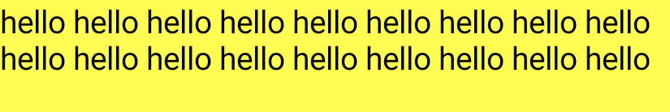

- [テキストレイアウトの設定](#テキストレイアウトの設定)
  - [表示する行数を制限する](#表示する行数を制限する)
  - [テキストのオーバーフローを示す（丸め、三点リーダー）](#テキストのオーバーフローを示す丸め三点リーダー)


# テキストレイアウトの設定

このページでは、maxLines や overflow などのパラメータを使用してテキスト レイアウトを構成する方法について説明します。


## 表示する行数を制限する

Text コンポーザブルで表示行数を制限するには、maxLines パラメータを設定します。

```kotlin
@Composable
fun LongText() {
    Text("hello ".repeat(50), maxLines = 2)
}
```




## テキストのオーバーフローを示す（丸め、三点リーダー）

長いテキストを制限する場合は、表示されるテキストが切り捨てられた場合にのみ表示される [TextOverflow](https://developer.android.com/reference/kotlin/androidx/compose/ui/text/style/TextOverflow?hl=ja&_gl=1*14em41l*_up*MQ..*_ga*NTY3MDY5MDA1LjE3MjQ2NTg1MjY.*_ga_6HH9YJMN9M*MTcyNjE5NDk2Ny4xMi4wLjE3MjYxOTQ5NjcuMC4wLjE3NzYzNzQ1MzQ.) を指定するとよいでしょう。これを行うには、textOverflow パラメータを設定します。

```kotlin
@Composable
fun OverflowedText() {
    Text("Hello Compose ".repeat(50), maxLines = 2, overflow = TextOverflow.Ellipsis)
}
```


