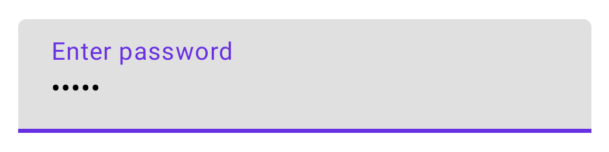

- [ユーザー入力を処理する](#ユーザー入力を処理する)
  - [TextField の実装を選択する](#textfield-の実装を選択する)
  - [TextField と BasicTextField](#textfield-と-basictextfield)
  - [Brush API によて、入力のスタイルを設定する](#brush-api-によて入力のスタイルを設定する)
    - [TextStyle を使用してカラーグラデーションを実装する](#textstyle-を使用してカラーグラデーションを実装する)
  - [キーボードオプションを設定する](#キーボードオプションを設定する)
  - [入力をフォーマットする](#入力をフォーマットする)
  - [クリーンな入力](#クリーンな入力)
  - [状態に関するベストプラクティス](#状態に関するベストプラクティス)


# ユーザー入力を処理する

[TextField](https://developer.android.com/reference/kotlin/androidx/compose/material/package-summary?_gl=1*2h1jid*_up*MQ..*_ga*MTcwMzU5OTM3OS4xNzI2MTUyNTE0*_ga_6HH9YJMN9M*MTcyNjIzNDczNy4yLjAuMTcyNjIzNDczNy4wLjAuNzkzNDQ2NTcz#TextField(androidx.compose.ui.text.input.TextFieldValue,kotlin.Function1,androidx.compose.ui.Modifier,kotlin.Boolean,kotlin.Boolean,androidx.compose.ui.text.TextStyle,kotlin.Function0,kotlin.Function0,kotlin.Function0,kotlin.Function0,kotlin.Boolean,androidx.compose.ui.text.input.VisualTransformation,androidx.compose.foundation.text.KeyboardOptions,androidx.compose.foundation.text.KeyboardActions,kotlin.Boolean,kotlin.Int,kotlin.Int,androidx.compose.foundation.interaction.MutableInteractionSource,androidx.compose.ui.graphics.Shape,androidx.compose.material.TextFieldColors)) を使用すると、ユーザーはテキストを入力および変更できます。このページでは、TextField を実装し、TextField 入力のスタイルを設定し、キーボード オプションやユーザー入力の視覚的な変換などの他の TextField オプションを構成する方法について説明します。


## TextField の実装を選択する

TextField の実装には、大きく分けて 2 種類の実装があります。

1. **TextField の実装** : マテリアル デザインのガイドラインに従っているため、この実装を選択することをお勧めします。 この実装には、以下の 2 種類のデザインがあります。

   - TextField コンポーザブルは、塗りつぶされています。 (デフォルト)
   - OutlinedTextField コンポーザブルは、アウトライン スタイル バージョンです。

2. **[BasicTextField](https://developer.android.com/reference/kotlin/androidx/compose/foundation/text/package-summary?_gl=1*1yq4xlk*_up*MQ..*_ga*MTcwMzU5OTM3OS4xNzI2MTUyNTE0*_ga_6HH9YJMN9M*MTcyNjIzNDczNy4yLjAuMTcyNjIzNDczNy4wLjAuNzkzNDQ2NTcz#BasicTextField(androidx.compose.ui.text.input.TextFieldValue,kotlin.Function1,androidx.compose.ui.Modifier,kotlin.Boolean,kotlin.Boolean,androidx.compose.ui.text.TextStyle,androidx.compose.foundation.text.KeyboardOptions,androidx.compose.foundation.text.KeyboardActions,kotlin.Boolean,kotlin.Int,kotlin.Int,androidx.compose.ui.text.input.VisualTransformation,kotlin.Function1,androidx.compose.foundation.interaction.MutableInteractionSource,androidx.compose.ui.graphics.Brush,kotlin.Function1)) の実装** : ユーザーはハードウェア キーボードまたはソフトウェア キーボードを使用してテキストを編集できますが、入力エリアの枠やヒントやプレースホルダーなどの装飾は一切提供されません。入力エリアなのかどうか見分けもつかないほど真っ白な背景です。

次に、 TextField コンポーザブルの例を示します。

```kotlin
@Composable
fun SimpleFilledTextFieldSample() {
    var text by remember { mutableStateOf("Hello") }

    TextField(
        value = text,
        onValueChange = { text = it },
        label = { Text("Label") }
    )
}
```


次に、 OutlinedTextField コンポーザブルの例を示します。使用するコンポーザブルが変わったこと以外は、 TextField の例と同じです。

```kotlin
@Composable
fun SimpleOutlinedTextFieldSample() {
    var text by remember { mutableStateOf("") }

    OutlinedTextField(
        value = text,
        onValueChange = { text = it },
        label = { Text("Label") }
    )
}
```


## TextField と BasicTextField

TextField と BasicTextField は、カスタマイズするための共通パラメータを多数保有しています。 TextField の完全なリストは [TextField ソース コード](https://cs.android.com/androidx/platform/frameworks/support/+/androidx-main:compose/material/material/src/commonMain/kotlin/androidx/compose/material/TextField.kt;l=149) で参照できます。例えば、便利なパラメータに以下のものがあります。

- singleLine
- maxLines
- textStyle

```kotlin
@Composable
fun StyledTextField() {
    var value by remember { mutableStateOf("Hello\nWorld\nInvisible") }

    TextField(
        value = value,
        onValueChange = { value = it },
        label = { Text("Enter text") },
        maxLines = 2,
        textStyle = TextStyle(color = Color.Blue, fontWeight = FontWeight.Bold),
        modifier = Modifier.padding(20.dp)
    )
}
```


デザインで Material TextField または OutlineTextField が必要な場合は、BasicTextField よりも TextField を使用することをお勧めします。ただし、Material 仕様の装飾を必要としないデザインを構築する場合は、BasicTextField を使用する必要があります。


## Brush API によて、入力のスタイルを設定する

Brush API を使用すると、TextField でより高度なスタイル設定を行うことができます。次のセクションでは、Brush を使用して TextField 入力に色付きグラデーションを追加する方法について説明します。

Brush API を使用してテキストをスタイル設定する方法の詳細については、 [Brush API で高度なスタイル設定を有効にする](./2.テキストの表示とスタイル設定/2.テキストのスタイルを設定する.md/#brush-で高度なスタイル設定を有効にする) を参照してください。

注意: TextStyle での Brush API の現在の使用は実験的です。実験的な API は将来変更される可能性があります。


### TextStyle を使用してカラーグラデーションを実装する

TextField 内で入力するときに色付きグラデーションを実装するには、選択したブラシを TextField の TextStyle として設定します。この例では、textField にテキストを入力するときに虹色のグラデーション効果を表示するために、linearGradient を含む組み込みブラシを使用します。

```kotlin
var text by remember { mutableStateOf("") }
// Brush オブジェクトを remember ラムダ式の中で実装している理由は、
// 再コンポーズ時の再計算を避けるためです。
// もし、 remember ラムダ式内で実装していない場合は、
// text の状態が変更される度に Brush も再計算されることになります。
val brush = remember {
    Brush.linearGradient(
        colors = rainbowColors
    )
}
TextField(
    value = text,
    onValueChange = { text = it },
    textStyle = TextStyle(brush = brush)
)
```

注: 新しい文字が入力されるたびに TextField の状態が変化する場合は、必ず remember 関数を使用して、再合成後もブラシを保持するようにしてください。


## キーボードオプションを設定する

TextField を使用すると、キーボード レイアウトなどのキーボード構成オプションを設定したり、キーボードでサポートされている場合は自動修正を有効にしたりできます。ソフトウェア キーボードがここで提供されるオプションに準拠していない場合、一部のオプションは保証されない場合があります。 [サポートされているキーボード オプション](https://developer.android.com/reference/kotlin/androidx/compose/foundation/text/KeyboardOptions?_gl=1*1067ap4*_up*MQ..*_ga*MTcwMzU5OTM3OS4xNzI2MTUyNTE0*_ga_6HH9YJMN9M*MTcyNjIzNDczNy4yLjAuMTcyNjIzNDczNy4wLjAuNzkzNDQ2NTcz#KeyboardOptions(androidx.compose.ui.text.input.KeyboardCapitalization,kotlin.Boolean,androidx.compose.ui.text.input.KeyboardType,androidx.compose.ui.text.input.ImeAction)) の主なものは次のとおりです。

- capitalization (大文字化)
- autoCorrect (自動修正)
- keyboardType (キーボードタイプ)
- imeAction


## 入力をフォーマットする

TextField を使用すると、パスワードの文字を * に置き換えたり、 [クレジットカード番号の 4 桁ごとにハイフンを挿入](./クレジットカード番号のハイフン区切りのサンプルコード.md) したりするなど、入力値に [VisualTransformation](https://developer.android.com/reference/kotlin/androidx/compose/ui/text/input/VisualTransformation?_gl=1*8je8dl*_up*MQ..*_ga*MTcwMzU5OTM3OS4xNzI2MTUyNTE0*_ga_6HH9YJMN9M*MTcyNjIzNDczNy4yLjAuMTcyNjIzNDczNy4wLjAuNzkzNDQ2NTcz) を設定できます。

```kotlin
@Composable
fun PasswordTextField() {
    var password by rememberSaveable { mutableStateOf("") }

    TextField(
        value = password,
        onValueChange = { password = it },
        label = { Text("Enter password") },
        visualTransformation = PasswordVisualTransformation(),
        keyboardOptions = KeyboardOptions(keyboardType = KeyboardType.Password)
    )
}
```



[VisualTransformationSamples ソース コード](https://cs.android.com/androidx/platform/frameworks/support/+/androidx-main:compose/ui/ui-text/samples/src/main/java/androidx/compose/ui/text/samples/VisualTransformationSamples.kt) には、さらに多くの例があります。


## クリーンな入力

テキストを編集する際の一般的なタスクは、先頭の文字を削除するか、または変更されるたびに入力文字列を変換することです。

モデルとして、キーボードが onValueChange ごとに任意の大きな編集を行う可能性があることを想定する必要があります。これは、たとえば、ユーザーが自動修正を使用したり、単語を絵文字に置き換えたり、その他のスマート編集機能を使用したりした場合に発生する可能性があります。これを正しく処理するには、onValueChange に渡される現在のテキストが、onValueChange に渡される前の値または次の値とは無関係であるという想定で、変換ロジックを記述します。

先頭のゼロを許可しないテキスト フィールドを実装するには、値が変更されるたびにすべての先頭のゼロを削除します。

```kotlin
@Composable
fun NoLeadingZeroes() {
    var input by rememberSaveable { mutableStateOf("") }
    TextField(
        value = input,
        onValueChange = { newText ->
            input = newText.trimStart { it == '0' }
        }
    )
}
```

テキストをクリーンアップするときにカーソルの位置を制御するには、状態の一部として TextField の [TextFieldValue](https://developer.android.com/reference/kotlin/androidx/compose/ui/text/input/TextFieldValue?_gl=1*lhhmpu*_up*MQ..*_ga*MTcwMzU5OTM3OS4xNzI2MTUyNTE0*_ga_6HH9YJMN9M*MTcyNjIzNDczNy4yLjAuMTcyNjIzNDczNy4wLjAuNzkzNDQ2NTcz) オーバーロードを使用します。


## 状態に関するベストプラクティス

以下は、アプリでの入力の問題を防ぐために TextField の状態を定義、および、更新するための一連のベスト プラクティスです。

- **MutableState を使用して TextField の状態を表す** : TextField の状態を表すために StateFlow などのリアクティブ ストリームを使用しないでください。これらの構造によって非同期遅延が発生する可能性があります。 (つまり、ユーザーがテキストを変更した直後に、 Flow などがユーザーの入力したデータを上書きする形で更新してしまう可能性がある。という意味だと思います。)

```kotlin
class SignUpViewModel : ViewModel() {

    var username by mutableStateOf("")
        private set

    /* ... */
}
```

- **遅延なく状態を更新する** : onValueChange を呼び出すときは、 TextField の状態を同期的に、すぐに更新します。

```kotlin
// SignUpViewModel.kt

class SignUpViewModel(private val userRepository: UserRepository) : ViewModel() {

    var username by mutableStateOf("")
        private set

    fun updateUsername(input: String) {
        username = input
    }
}

// SignUpScreen.kt

@Composable
fun SignUpScreen(/*...*/) {

    OutlinedTextField(
        value = viewModel.username,
        onValueChange = { username -> viewModel.updateUsername(username) }
        /*...*/
    )
}
```

- **状態を定義する場所** : **TextField の状態が入力時にビジネス ロジックの検証を必要とする場合は、状態を ViewModel にホイストするのが適切です。そうでない場合は、コンポーザブルまたは状態ホルダー クラスを真実のソースとして使用できます。** 状態をホイストする場所の詳細については、 [状態ホイストのドキュメント](../2.UIアーキテクチャ/4.状態の管理/2.状態をホイスティングする場所.md) をご覧ください。

注 : これらのベスト プラクティスの詳細については、 [Compose での TextField の効果的な状態管理に関するブログ投稿](https://medium.com/androiddevelopers/effective-state-management-for-textfield-in-compose-d6e5b070fbe5) をご覧ください。


