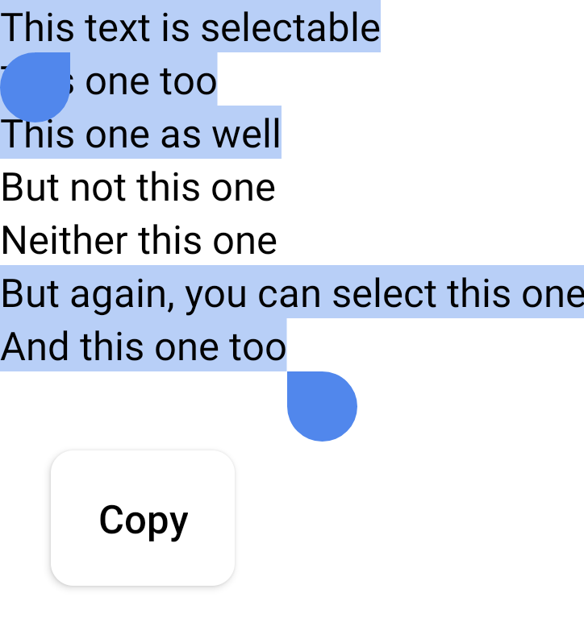
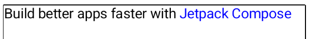

- [ユーザー操作を有効にする](#ユーザー操作を有効にする)
  - [テキストを選択](#テキストを選択)
  - [LinkAnnotation でクリック可能なテキストのセクションを作成する](#linkannotation-でクリック可能なテキストのセクションを作成する)


# ユーザー操作を有効にする

Jetpack Compose を使用すると、テキストできめ細かなインタラクションが可能になります。テキストの選択がより柔軟になり、コンポーザブル レイアウト全体で実行できるようになりました。テキストでのユーザー インタラクションは他のコンポーザブル レイアウトとは異なり、テキスト コンポーザブルの一部に Modifier を追加することはできません。このページでは、ユーザー インタラクションを可能にする API について説明します。


## テキストを選択

デフォルトでは、コンポーザブルは選択できません。つまり、ユーザーはアプリからテキストを選択してコピーすることはできません。テキストの選択を有効にするには、テキスト要素を [SelectionContainer](https://developer.android.com/reference/kotlin/androidx/compose/foundation/text/selection/package-summary?_gl=1*fark72*_up*MQ..*_ga*MTcwMzU5OTM3OS4xNzI2MTUyNTE0*_ga_6HH9YJMN9M*MTcyNjM5OTE2NS4zLjAuMTcyNjM5OTE2NS4wLjAuMTQwMjc0Nzg1MQ..#SelectionContainer(androidx.compose.ui.Modifier,kotlin.Function0)) コンポーザブルでラップします。

```kotlin
@Composable
fun SelectableText() {
    SelectionContainer {
        Text("This text is selectable")
    }
}
```


選択可能な領域の特定の部分の選択を無効にしたい場合があります。そのためには、選択できない部分を [DisableSelection](https://developer.android.com/reference/kotlin/androidx/compose/foundation/text/selection/package-summary?_gl=1*fark72*_up*MQ..*_ga*MTcwMzU5OTM3OS4xNzI2MTUyNTE0*_ga_6HH9YJMN9M*MTcyNjM5OTE2NS4zLjAuMTcyNjM5OTE2NS4wLjAuMTQwMjc0Nzg1MQ..#DisableSelection(kotlin.Function0)) コンポーザブルでラップする必要があります。

```kotlin
@Composable
fun PartiallySelectableText() {
    SelectionContainer {
        Column {
            Text("This text is selectable")
            Text("This one too")
            Text("This one as well")
            DisableSelection {
                Text("But not this one")
                Text("Neither this one")
            }
            Text("But again, you can select this one")
            Text("And this one too")
        }
    }
}
```




## LinkAnnotation でクリック可能なテキストのセクションを作成する

Text のクリックをリッスンするには、 `Modifier.clickable()` を追加します。ただし、ブラウザで開く特定の単語に URL を添付するなど、Text 値の特定の部分に追加の情報を添付したい場合があります。このような場合は、テキストのクリック可能な部分を表す注釈である [LinkAnnotation](https://developer.android.com/reference/kotlin/androidx/compose/ui/text/LinkAnnotation?_gl=1*ap3vgv*_up*MQ..*_ga*MTcwMzU5OTM3OS4xNzI2MTUyNTE0*_ga_6HH9YJMN9M*MTcyNjM5OTE2NS4zLjAuMTcyNjM5OTE2NS4wLjAuMTQwMjc0Nzg1MQ..) を使用する必要があります。

LinkAnnotation を使用すると、次のスニペットに示すように、クリックすると自動的に開く Text コンポーザブルの一部に URL を添付できます。

```kotlin
import androidx.compose.ui.text.withLink

@Composable
fun AnnotatedStringWithLinkSample() {
    Text(
        buildAnnotatedString {
            append("Build better apps faster with ")
            withLink(
                LinkAnnotation.Url(
                    "https://developer.android.com/jetpack/compose",
                    TextLinkStyles(style = SpanStyle(color = Color.Blue))
                )
            ) {
                append("Jetpack Compose")
            }
        }
    )
}
```



ユーザーが Text コンポーザブルの一部をクリックしたときの応答として、カスタム アクションを構成することもできます。次のスニペットでは、ユーザーが「Jetpack Compose」をクリックするとリンクが表示されるところまでは、一つ前の例と同じですが、その際、別途カスタムアクションを実行できます。例えば、アナリティクスデータの送信など。

```kotlin
import androidx.compose.ui.platform.LocalUriHandler

@Composable
fun AnnotatedStringWithListenerSample() {
    // Display a link in the text and log metrics whenever user clicks on it. In that case we handle
    // the link using openUri method of the LocalUriHandler
    val uriHandler = LocalUriHandler.current
    Text(
        buildAnnotatedString {
            append("Build better apps faster with ")
            val link =
                LinkAnnotation.Url(
                    "https://developer.android.com/jetpack/compose",
                    TextLinkStyles(SpanStyle(color = Color.Blue))
                ) {
                    // カスタムアクションを定義できます。
                    // do custom action.

                    // URI リンクを開きます。
                    val url = (it as LinkAnnotation.Url).url
                    uriHandler.openUri(url)
                }
            withLink(link) { append("Jetpack Compose") }
        }
    )
}
```

