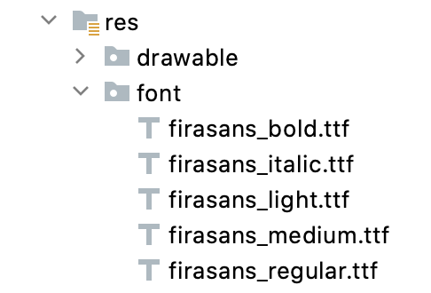
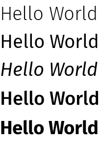
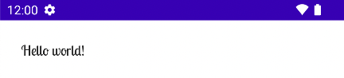
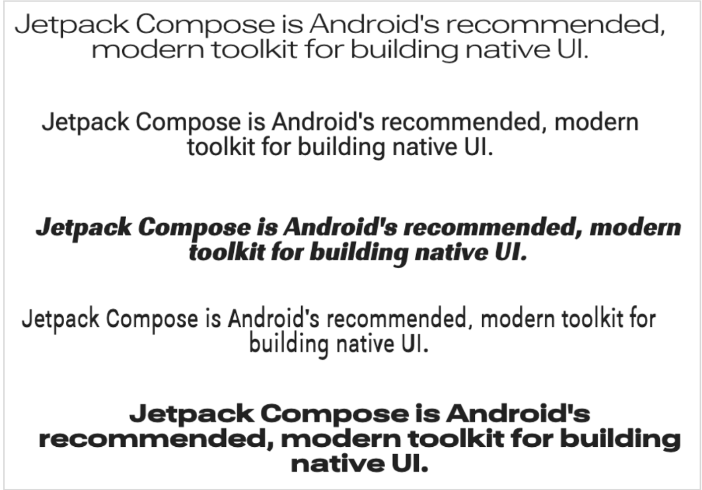

- [フォントを操作する](#フォントを操作する)
  - [フォントを設定](#フォントを設定)
  - [ダウンロード可能なフォント](#ダウンロード可能なフォント)
    - [プログラムでダウンロード可能なフォントを使用する](#プログラムでダウンロード可能なフォントを使用する)
    - [フォールバックフォントを追加する](#フォールバックフォントを追加する)
    - [正しく実装できているかデバッグして確認する](#正しく実装できているかデバッグして確認する)
    - [注意点](#注意点)
  - [可変フォントを使用する](#可変フォントを使用する)
    - [可変フォントを読み込む](#可変フォントを読み込む)
    - [カスタム軸を使用する](#カスタム軸を使用する)
    - [参考情報](#参考情報)


# フォントを操作する

このページでは、Compose アプリでフォントを設定する方法について説明します。


## フォントを設定

Text コンポーザブルには、フォントを設定するための fontFamily パラメータを指定できます。 [デフォルトでは、Serif、Sans Serif、Monospace、Cursive のフォント ファミリーが含まれています。](https://developer.android.com/reference/kotlin/androidx/compose/ui/text/font/FontFamily?_gl=1*cu0qx3*_up*MQ..*_ga*OTU2NjI5OTY2LjE3MjYzOTgxODU.*_ga_6HH9YJMN9M*MTcyNjM5ODE4NS4xLjAuMTcyNjM5ODE4NS4wLjAuMjA3MjE4NTU5Ng..#summary)

```kotlin
@Composable
fun DifferentFonts() {
    Column {
        Text("Hello World", fontFamily = FontFamily.Serif)
        Text("Hello World", fontFamily = FontFamily.SansSerif)
    }
}
```


fontFamily 属性を使用すると、カスタム フォントと書体を使用できます res/font フォルダに定義されています。



この例では、これらのフォント ファイルに基づいて [Font 関数](https://developer.android.com/reference/kotlin/androidx/compose/ui/text/font/package-summary?_gl=1*wir5zm*_up*MQ..*_ga*MTcwMzU5OTM3OS4xNzI2MTUyNTE0*_ga_6HH9YJMN9M*MTcyNjM5OTE2NS4zLjAuMTcyNjM5OTE2NS4wLjAuMTQwMjc0Nzg1MQ..#Font(kotlin.Int,androidx.compose.ui.text.font.FontWeight,androidx.compose.ui.text.font.FontStyle)) を使用して fontFamily を定義する方法を示します。フォントファミリーとは、同一書体で、太さなどの要素が異なる一式のフォントグループのことです。

```kotlin
val firaSansFamily = FontFamily(
    // Font 関数の第二引数は、そのフォントをどの太さとして定義するかを指定しているものと思われます。
    Font(R.font.firasans_light, FontWeight.Light),
    Font(R.font.firasans_regular, FontWeight.Normal),
    Font(R.font.firasans_italic, FontWeight.Normal, FontStyle.Italic),
    Font(R.font.firasans_medium, FontWeight.Medium),
    Font(R.font.firasans_bold, FontWeight.Bold)
)
```

この fontFamily を Text コンポーザブルに渡すことができます。fontFamily にはさまざまな太さを含めることができるため、fontWeight を手動で設定して、テキストに適切な太さを選択できます。

```kotlin
Column {
    Text(text = "text", fontFamily = firaSansFamily, fontWeight = FontWeight.Light)
    Text(text = "text", fontFamily = firaSansFamily, fontWeight = FontWeight.Normal)
    Text(
        text = "text",
        fontFamily = firaSansFamily,
        fontWeight = FontWeight.Normal,
        fontStyle = FontStyle.Italic
    )
    Text(text = "text", fontFamily = firaSansFamily, fontWeight = FontWeight.Medium)
    Text(text = "text", fontFamily = firaSansFamily, fontWeight = FontWeight.Bold)
}
```



アプリ全体のタイポグラフィを設定する方法については、 [Compose のカスタム デザイン システム](../5.テーマ設定/5.カスタムテーマ設定.md) や [アプリ全体にカスタムフォントファミリーを設定する方法](./アプリ全体にカスタムフォントファミリーを設定する方法.md) をご覧ください。


## ダウンロード可能なフォント

[Compose 1.2.0](https://developer.android.com/jetpack/androidx/releases/compose-ui?_gl=1*1rvv6gy*_up*MQ..*_ga*MTcwMzU5OTM3OS4xNzI2MTUyNTE0*_ga_6HH9YJMN9M*MTcyNjM5OTE2NS4zLjAuMTcyNjM5OTE2NS4wLjAuMTQwMjc0Nzg1MQ..#1.2.0) 以降では、Compose アプリのダウンロード可能なフォント API を使用して、 [Google フォント](https://fonts.google.com/) を非同期的にダウンロードし、アプリで使用できます。

カスタム プロバイダが提供するダウンロード可能なフォントは現在サポートされていません。


### プログラムでダウンロード可能なフォントを使用する

アプリ内からフォントをプログラムでダウンロードするには、次の手順に従います。

1. 依存関係の追加

```kotlin
dependencies {
    ...
    implementation("androidx.compose.ui:ui-text-google-fonts:1.7.0")
}
```

2. Google Fonts の認証情報を使用して [GoogleFont.Provider](https://developer.android.com/reference/kotlin/androidx/compose/ui/text/googlefonts/GoogleFont.Provider?_gl=1*1n1mtg0*_up*MQ..*_ga*MTcwMzU5OTM3OS4xNzI2MTUyNTE0*_ga_6HH9YJMN9M*MTcyNjM5OTE2NS4zLjAuMTcyNjM5OTE2NS4wLjAuMTQwMjc0Nzg1MQ..) を初期化します。

```kotlin
val provider = GoogleFont.Provider(
    providerAuthority = "com.google.android.gms.fonts",
    providerPackage = "com.google.android.gms",
    certificates = R.array.com_google_android_gms_fonts_certs
)
```

プロバイダーが受け取るパラメータは次のとおりです。

- Google Fonts のフォント プロバイダー権限。
- プロバイダーの ID を確認するためのフォント プロバイダー パッケージ。
- プロバイダーの ID を確認するための証明書のハッシュ セットのリスト。Google Fonts プロバイダーに必要なハッシュは、 [Jetchat サンプル アプリの font_certs.xml ファイル](https://github.com/android/compose-samples/blob/main/Jetchat/app/src/main/res/values-v23/font_certs.xml) にあります。

3. [FontFamily](https://developer.android.com/reference/kotlin/androidx/compose/ui/text/font/FontFamily?_gl=1*oxgb2y*_up*MQ..*_ga*MTcwMzU5OTM3OS4xNzI2MTUyNTE0*_ga_6HH9YJMN9M*MTcyNjM5OTE2NS4zLjAuMTcyNjM5OTE2NS4wLjAuMTQwMjc0Nzg1MQ..) を定義する

```kotlin
// ...
 import androidx.compose.ui.text.googlefonts.GoogleFont
 import androidx.compose.ui.text.font.FontFamily
 import androidx.compose.ui.text.googlefonts.Font
 // ...

val fontName = GoogleFont("Lobster Two")

val fontFamily = FontFamily(
    Font(googleFont = fontName, fontProvider = provider)
)
```

フォントの太さやスタイルなどの他のパラメータを、それぞれ [FontWeight](https://developer.android.com/reference/kotlin/androidx/compose/ui/text/font/FontWeight?_gl=1*17j03bt*_up*MQ..*_ga*MTcwMzU5OTM3OS4xNzI2MTUyNTE0*_ga_6HH9YJMN9M*MTcyNjM5OTE2NS4zLjAuMTcyNjM5OTE2NS4wLjAuMTQwMjc0Nzg1MQ..) と [FontStyle](https://developer.android.com/reference/kotlin/androidx/compose/ui/text/font/FontStyle?_gl=1*oxgb2y*_up*MQ..*_ga*MTcwMzU5OTM3OS4xNzI2MTUyNTE0*_ga_6HH9YJMN9M*MTcyNjM5OTE2NS4zLjAuMTcyNjM5OTE2NS4wLjAuMTQwMjc0Nzg1MQ..) を使用して照会できます。

```kotlin
// ...
 import androidx.compose.ui.text.googlefonts.GoogleFont
 import androidx.compose.ui.text.font.FontFamily
 import androidx.compose.ui.text.googlefonts.Font
 // ...

val fontName = GoogleFont("Lobster Two")

val fontFamily = FontFamily(
    Font(
        googleFont = fontName,
        fontProvider = provider,
        weight = FontWeight.Bold,
        style = FontStyle.Italic
    )
)
```

4. テキスト構成可能関数で使用する FontFamily を構成します。

```kotlin
Text(
    fontFamily = fontFamily, text = "Hello World!"
)
```



[Typography](https://developer.android.com/reference/kotlin/androidx/compose/material3/Typography?_gl=1*17j03bt*_up*MQ..*_ga*MTcwMzU5OTM3OS4xNzI2MTUyNTE0*_ga_6HH9YJMN9M*MTcyNjM5OTE2NS4zLjAuMTcyNjM5OTE2NS4wLjAuMTQwMjc0Nzg1MQ..) で、上記の FontFamily を使用するように設定することもできます。

```kotlin
val MyTypography = Typography(
    bodyMedium = TextStyle(
        fontFamily = fontFamily, fontWeight = FontWeight.Normal, fontSize = 12.sp/*...*/
    ),
    bodyLarge = TextStyle(
        fontFamily = fontFamily,
        fontWeight = FontWeight.Bold,
        letterSpacing = 2.sp,
        /*...*/
    ),
    headlineMedium = TextStyle(
        fontFamily = fontFamily, fontWeight = FontWeight.SemiBold/*...*/
    ),
    /*...*/
)
```

上記で定義したタイポグラフィーをテーマに設定します。

```kotlin
MyAppTheme(
    typography = MyTypography
)/*...*/
```

Compose と [Material3](https://m3.material.io/styles/typography/overview) でダウンロード可能なフォントを実装しているアプリの例については、 [Jetchat サンプル アプリ](https://github.com/android/compose-samples/tree/main/Jetchat) をご覧ください。


### フォールバックフォントを追加する

フォントが正しくダウンロードされなかった場合に備えて、フォントのフォールバック チェーンを決定できます。たとえば、ダウンロード可能なフォントを次のように定義しているとします。

```kotlin
// ...
 import androidx.compose.ui.text.googlefonts.Font
 // ...

val fontName = GoogleFont("Lobster Two")

val fontFamily = FontFamily(
    Font(googleFont = fontName, fontProvider = provider),
    Font(googleFont = fontName, fontProvider = provider, weight = FontWeight.Bold)
)
```

次のようにして、デフォルトのフォントを定義できます。 weight ごとにデフォルトのフォントを定義します。

```kotlin
// ...
 import androidx.compose.ui.text.font.Font
 import androidx.compose.ui.text.googlefonts.Font
 // ...

val fontName = GoogleFont("Lobster Two")

val fontFamily = FontFamily(
    Font(googleFont = fontName, fontProvider = provider),
    Font(resId = R.font.my_font_regular),
    Font(googleFont = fontName, fontProvider = provider, weight = FontWeight.Bold),
    Font(resId = R.font.my_font_regular_bold, weight = FontWeight.Bold)
)
```

正しい import 文を追加していることを確認してください。

このように FontFamily を定義すると、ウェイトごとに 1 つずつ、2 つのチェーンを含む FontFamily が作成されます。読み込みメカニズムは、最初にオンライン フォントを解決しようとし、次にローカルの R.font リソース フォルダーにあるフォントを解決しようとします。


### 正しく実装できているかデバッグして確認する

フォントが正しくダウンロードされているかどうかを確認するには、デバッグ コルーチン ハンドラーを定義できます。ハンドルは、フォントが非同期でロードされなかった場合に実行する動作を提供します。

まず、 [CoroutineExceptionHandler](https://kotlin.github.io/kotlinx.coroutines/kotlinx-coroutines-core/kotlinx.coroutines/-coroutine-exception-handler/index.html) を作成します。

```kotlin
// 例外発生時の処理を定義します。
val handler = CoroutineExceptionHandler { _, throwable ->
    // Throwable を処理します。
    Log.e(TAG, "There has been an issue: ", throwable)
}
```

リゾルバが上記のハンドラを使用するためには、 [createFontFamilyResolver](https://developer.android.com/reference/kotlin/androidx/compose/ui/text/font/package-summary?_gl=1*2l1qs7*_up*MQ..*_ga*MTcwMzU5OTM3OS4xNzI2MTUyNTE0*_ga_6HH9YJMN9M*MTcyNjM5OTE2NS4zLjAuMTcyNjM5OTE2NS4wLjAuMTQwMjc0Nzg1MQ..#createFontFamilyResolver(android.content.Context)) メソッドに渡します。

```kotlin
CompositionLocalProvider(
    LocalFontFamilyResolver provides createFontFamilyResolver(LocalContext.current, handler)
) {
    Column {
        Text(
            text = "Hello World!", style = MaterialTheme.typography.bodyMedium
        )
    }
}
```

プロバイダーの [isAvailableOnDevice](https://developer.android.com/reference/kotlin/androidx/compose/ui/text/googlefonts/package-summary?_gl=1*1bdyv8x*_up*MQ..*_ga*MTcwMzU5OTM3OS4xNzI2MTUyNTE0*_ga_6HH9YJMN9M*MTcyNjM5OTE2NS4zLjAuMTcyNjM5OTE2NS4wLjAuMTQwMjc0Nzg1MQ..#(androidx.compose.ui.text.googlefonts.GoogleFont.Provider).isAvailableOnDevice(android.content.Context)) API を使用して、プロバイダーが使用可能であり、証明書が正しく構成されているかどうかをテストすることもできます。これを行うには、プロバイダーが正しく構成されていない場合に false を返す isAvailableOnDevice メソッドを呼び出します。

```kotlin
val context = LocalContext.current
LaunchedEffect(Unit) {
    if (provider.isAvailableOnDevice(context)) {
        Log.d(TAG, "Success!")
    }
}
```


### 注意点

Google Fonts では、新しいフォントを Android で利用できるようになるまでに数か月かかります。 [fonts.google.com](https://fonts.google.com/) にフォントが追加されてから、ダウンロード可能なフォント API (View システムまたは Compose) を通じて利用できるようになるまでには、時間差があります。新しく追加されたフォントは、 [IllegalStateException](https://docs.oracle.com/javase/7/docs/api/java/lang/IllegalStateException.html) でアプリに読み込まれない場合があります。開発者が他の種類のフォント読み込みエラーよりもこのエラーを識別できるように、 [ここでの変更](https://android-review.googlesource.com/c/platform/frameworks/support/+/2098457/) で Compose の例外に関する説明メッセージを追加しました。問題が見つかった場合は、Issue Tracker を使用して報告してください。


## 可変フォントを使用する

可変フォントは、1 つのフォント ファイルに異なるスタイルを含めることができるフォント形式です。可変フォントを使用すると、軸 (またはパラメータ) を変更して好みのスタイルを生成できます。これらの軸は、太さ、幅、傾斜、斜体などの標準のもの、または可変フォントごとに異なるカスタムのものにすることができます。



通常のフォント ファイルの代わりに可変フォントを使用すると、複数のフォント ファイルではなく 1 つのフォント ファイルのみを使用できます。

警告: 可変フォントは Android O 以降でのみサポートされています。

可変フォントの背景について詳しくは、 [Google Fonts Knowledge](https://fonts.google.com/knowledge/topics/variable_fonts) 、 [使用可能な可変フォントの全カタログ](https://fonts.google.com/?vfonly=true) 、および [各フォントでサポートされている軸の表](https://fonts.google.com/variablefonts) をご覧ください。

このドキュメントでは、Compose アプリで可変フォントを実装する方法を説明します。


### 可変フォントを読み込む

1. 使用する可変フォント ( [Roboto Flex](https://fonts.google.com/specimen/Roboto+Flex)%7B:.external%7D) など) をダウンロードし、アプリの app/res/font フォルダに配置します。追加する .ttf ファイルがフォントの可変フォント バージョンであること、およびフォント ファイルの名前がす​​べて小文字で特殊文字が含まれていないことを確認します。

注: 可変フォントは現在、ダウンロード可能なフォントではサポートされていません。 (つまり、ダウンロード済みでないと使用できないということかな？) [このバグ](https://issuetracker.google.com/issues/223262013) の最新の更新を参照してください。

2. 可変フォントをロードするには、res/font/ ディレクトリに配置されたフォントを使用して FontFamily を定義します。

```kotlin
// In Typography.kt
@OptIn(ExperimentalTextApi::class)
val displayLargeFontFamily =
    FontFamily(
        Font(
            R.font.robotoflex_variable,
            variationSettings = FontVariation.Settings(
                FontVariation.weight(950),
                FontVariation.width(30f),
                FontVariation.slant(-6f),
            )
        )
    )
```

FontVariation API を使用すると、太さ、幅、傾斜などの標準フォント軸を設定できます。これらは、どの可変フォントでも使用できる標準軸です。フォントが使用される場所に基づいて、フォントのさまざまな設定を作成できます。

3. 可変フォントは Android バージョン O 以降でのみ使用できるため、ガードレールを追加して適切なフォールバックを設定してください。

```kotlin
// In Typography.kt
val default = FontFamily(
    /*
    * 意味のあるフォントであれば何でも構いません
    */
    Font(
        R.font.robotoflex_static_regular
    )
)
@OptIn(ExperimentalTextApi::class)
val displayLargeFontFamily = if (Build.VERSION.SDK_INT >= Build.VERSION_CODES.O) {
    FontFamily(
        Font(
            R.font.robotoflex_variable,
            variationSettings = FontVariation.Settings(
                FontVariation.weight(950),
                FontVariation.width(30f),
                FontVariation.slant(-6f),
            )
        )
    )
} else {
    default
}
```

4. 再利用を容易にするために設定を定数セットに抽出し、フォント設定を次の定数に置き換えます。

```kotlin
// VariableFontDimension.kt
object DisplayLargeVFConfig {
    const val WEIGHT = 950
    const val WIDTH = 30f
    const val SLANT = -6f
    const val ASCENDER_HEIGHT = 800f
    const val COUNTER_WIDTH = 500
}

@OptIn(ExperimentalTextApi::class)
val displayLargeFontFamily = if (Build.VERSION.SDK_INT >= Build.VERSION_CODES.O) {
    FontFamily(
        Font(
            R.font.robotoflex_variable,
            variationSettings = FontVariation.Settings(
                FontVariation.weight(DisplayLargeVFConfig.WEIGHT),
                FontVariation.width(DisplayLargeVFConfig.WIDTH),
                FontVariation.slant(DisplayLargeVFConfig.SLANT),
            )
        )
    )
} else {
    default
}
```

5. Material Design 3 の [Typography](https://developer.android.com/develop/ui/compose/designsystems/material3?_gl=1*1t6m78g*_up*MQ..*_ga*MTcwMzU5OTM3OS4xNzI2MTUyNTE0*_ga_6HH9YJMN9M*MTcyNjM5OTE2NS4zLjAuMTcyNjM5OTE2NS4wLjAuMTQwMjc0Nzg1MQ..#typography) で、定義した FontFamily を使用するように設定します。

```kotlin
// Type.kt
val Typography = Typography(
    displayLarge = TextStyle(
        fontFamily = displayLargeFontFamily,
        fontSize = 50.sp,
        lineHeight = 64.sp,
        letterSpacing = 0.sp,
        /***/
    ),
    headlineMedium = TextStyle(
        fontFamily = headlineMediumFontFamily,
        fontSize = 35.sp,
        lineHeight = 37.sp
        /***/
    ),
    bodyLarge = TextStyle(
        fontFamily = bodyLargeFontFamily,
        fontSize = 16.sp,
        fontWeight = FontWeight.Medium,
        lineHeight = 28.sp,
        letterSpacing = 0.15.sp
        /***/
    ),
)
```

このサンプルでは、​​ [displayLarge Material 3 タイポグラフィ](https://developer.android.com/develop/ui/compose/designsystems/material3?_gl=1*3bjzlb*_up*MQ..*_ga*MTcwMzU5OTM3OS4xNzI2MTUyNTE0*_ga_6HH9YJMN9M*MTcyNjM5OTE2NS4zLjAuMTcyNjM5OTE2NS4wLjAuMTQwMjc0Nzg1MQ..#typography) を使用しています。たとえば、画面上で最も大きいテキストには、短くて重要なテキストである displayLarge を使用する必要があります。

Material 3 では、TextStyle と fontFamily のデフォルト値を変更してタイポグラフィをカスタマイズできます。上記のスニペットでは、TextStyle のインスタンスを構成して、 displayLarge で使用されるフォントを定義しています。

6. タイポグラフィを定義したので、それを M3 MaterialTheme に渡します。

```kotlin
MaterialTheme(
    colorScheme = MaterialTheme.colorScheme,
    typography = Typography,
    content = content
)
```

7. 最後に、Text composable を使用して、定義済みのタイポグラフィ スタイルの 1 つである MaterialTheme.typography.displayLarge にスタイルを指定します。

```kotlin
@Composable
fun MyCustomTheme(
    content: @Composable () -> Unit,
) {
    MaterialTheme(
        colorScheme = MaterialTheme.colorScheme,
        typography = Typography,
        content = content
    )
}

@Composable
@Preview
fun CardDetails() {
    MyCustomTheme {
        Card(
            shape = RoundedCornerShape(8.dp),
            elevation = CardDefaults.cardElevation(defaultElevation = 4.dp),
            modifier = Modifier
                .fillMaxWidth()
                .padding(16.dp)
        ) {
            Column(
                modifier = Modifier.padding(16.dp)
            ) {
                Text(
                    text = "Compose",
                    style = MaterialTheme.typography.displayLarge,
                    modifier = Modifier.padding(bottom = 8.dp),
                    maxLines = 1
                )
                Text(
                    text = "Beautiful UIs on Android",
                    style = MaterialTheme.typography.headlineMedium,
                    modifier = Modifier.padding(bottom = 8.dp),
                    maxLines = 2
                )
                Text(
                    text = "Jetpack Compose is Android’s recommended modern toolkit for building native UI. It simplifies and accelerates UI development on Android. Quickly bring your app to life with less code, powerful tools, and intuitive Kotlin APIs.",
                    style = MaterialTheme.typography.bodyLarge,
                    modifier = Modifier.padding(bottom = 8.dp),
                    maxLines = 3
                )
            }
        }
    }
}
```

各 Text コンポーザブルは、Material テーマのスタイルを通じて構成され、異なる可変フォント構成が含まれています。MaterialTheme.typography を使用して、M3 MaterialTheme コンポーザブルに提供されるタイポグラフィを取得できます。


完全なソースコードは [VariableFontsSnippets.kt](https://github.com/android/snippets/blob/6ea91d123db3e094b82c3c8b6245e75114dfed60/compose/snippets/src/main/java/com/example/compose/snippets/text/VariableFontsSnippets.kt#L287-L322) を参照してください。


### カスタム軸を使用する

フォントにはカスタム軸を設定することもできます。これらはフォント ファイル自体で定義されます。たとえば、Roboto Flex フォントには、小文字のアクセント記号の高さを調整するアクセント記号の高さ（"YTAS"）軸と、各文字の幅を調整するカウンタ幅（"XTRA"）軸があります。

これらの軸の値は FontVariation 設定で変更できます。

フォントに設定できるカスタム軸について詳しくは、 各フォントのサポートされている軸の表をご覧ください。

1. カスタム軸を使用するには、 カスタム ascenderHeight 軸と counterWidth 軸の関数を定義します。

```kotlin
fun ascenderHeight(ascenderHeight: Float): FontVariation.Setting {
    // require は、引数に false が与えられた場合に
    // IllegalArgumentException を発生させる関数です。
    require(ascenderHeight in 649f..854f) { "'Ascender Height' must be in 649f..854f" }
    return FontVariation.Setting("YTAS", ascenderHeight)
}

fun counterWidth(counterWidth: Int): FontVariation.Setting {
    require(counterWidth in 323..603) { "'Counter width' must be in 323..603" }
    return FontVariation.Setting("XTRA", counterWidth.toFloat())
}
```

これらの関数は、次のことを行います。

- 受け入れ可能な値のガードレールを定義します。 [可変フォントカタログ](https://fonts.google.com/variablefonts?vfquery=roboto+flex) でわかるように、ascenderHeight (YTAS) の最小値は 649f、最大値は 854f です。

- フォント設定を返すので、構成をフォントに追加する準備が整います。FontVariation.Setting() メソッドでは、第一引数にキーとして軸名 (YTAS、XTRA) を受けとり、第二引数に値を受け取ります。

2. フォント構成で軸を使用して、読み込まれる各フォントに追加のパラメーターを渡します。

```kotlin
@OptIn(ExperimentalTextApi::class)
val displayLargeFontFamily = if (Build.VERSION.SDK_INT >= Build.VERSION_CODES.O) {
    FontFamily(
        Font(
            R.font.robotoflex_variable,
            variationSettings = FontVariation.Settings(
                FontVariation.weight(DisplayLargeVFConfig.WEIGHT),
                FontVariation.width(DisplayLargeVFConfig.WIDTH),
                FontVariation.slant(DisplayLargeVFConfig.SLANT),
                ascenderHeight(DisplayLargeVFConfig.ASCENDER_HEIGHT),
                counterWidth(DisplayLargeVFConfig.COUNTER_WIDTH)
            )
        )
    )
} else {
    default
}
```

小文字のアセンダの高さが増加し、他のテキストの幅が広くなっていることに注目してください。


### 参考情報

詳細については、可変フォントに関する次のブログ投稿をご覧ください。

- [自由自在のタイポグラフィー : Compose の可変フォント](https://medium.com/androiddevelopers/just-your-type-variable-fonts-in-compose-5bf63b357994)

