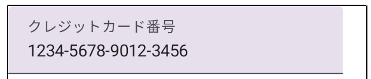

- [クレジットカード番号のハイフン区切りのサンプルコード](#クレジットカード番号のハイフン区切りのサンプルコード)
  - [カーソル移動を避ける方法](#カーソル移動を避ける方法)
  - [入力された値に対して何か編集を行いたい場合](#入力された値に対して何か編集を行いたい場合)


# クレジットカード番号のハイフン区切りのサンプルコード

```kotlin
@Composable
fun CreditCardNumberTextField() {
    // TextField に表示される文字列
    // 
    // 16 桁の数字が入力済みの状態で、その文字列の真ん中あたりに
    // カーソルを合わせて、キーボードをタップすると、
    // 入力されなくてもカーソルだけが動く現象が発生するのを
    // 避けるために、 TextFieldValue() クラスを使用しています。
    // このクラスは
    var text by remember { mutableStateOf(TextFieldValue("1234567890123456")) }

    val transformation = remember {
        object : VisualTransformation {
            override fun filter(text: AnnotatedString): TransformedText {
                val newText = buildString {
                    for ((index, char) in text.text.withIndex()) {
                        append(char)
                        // 4 桁目, 8 桁目, 12 桁目の場合はハイフンを追加
                        if (index % 4 == 3 && index < text.length - 1) {
                            append('-')
                        }
                    }
                }

                // カーソル位置の制御
                val offsetMapping = object : OffsetMapping {
                    // 「入力された文字列」から「ハイフン付きの文字列」に変更する場合
                    override fun originalToTransformed(offset: Int): Int {
                        if (offset <= 4) return offset
                        if (offset <= 8) return offset + 1
                        if (offset <= 12) return offset + 2
                        if (offset <= 16) return offset + 3
                        return 19
                    }

                    // 「ハイフン付きの文字列」から「入力された文字列」に変更する場合
                    override fun transformedToOriginal(offset: Int): Int {
                        if (offset <= 4) return offset
                        if (offset <= 9) return offset - 1
                        if (offset <= 14) return offset - 2
                        if (offset <= 19) return offset - 3
                        return 16
                    }
                }

                return TransformedText(AnnotatedString(newText), offsetMapping)
            }
        }
    }

    TextField(
        value = text,
        onValueChange = { newText ->
            // 数字のみ抽出する
            val filteredText = newText.text.filter { it.isDigit() }
            // 入力済み文字数が 16 文字以内の場合のみ入力可能にする
            if (filteredText.length <= 16) {
                // TextFieldValue には、カーソル位置に関する情報も含まれているため、
                // 元のオブジェクトをコピーして、文字のみを更新する必要がある。
                // コピーせずに、毎回、新しいオブジェクトを生成した場合、
                // 毎回、カーソル位置が初期位置にリセットされてしまう。
                text = newText.copy(text = filteredText)
            }

        },
        label = { Text("クレジットカード番号") },
        keyboardOptions = KeyboardOptions(keyboardType = KeyboardType.Number),
        visualTransformation = transformation
    )
}
```




## カーソル移動を避ける方法

Android のマテリアルコンポーネントの TextField で、入力可能な文字数上限いっぱいに文字が入力済みの状態で、文字列の途中にカーソルをあわせて、何かのキーをタップすると、文字が入力されずに、カーソルだけが移動します。このカーソル移動をやめる方法について説明します。

以下の例は、一番シンプルな例です。

```kotlin
@Composable
fun LimitedTextField(maxLength: Int = 20) {
    var textState by remember { mutableStateOf(TextFieldValue("")) }

    TextField(
        value = textState,
        onValueChange = { newValue ->
            // 入力値の長さをチェックし、上限を超えたら新しい文字を無視する
            if (newValue.text.length <= maxLength) {
                textState = newValue
            }
        },
        label = { Text("Enter text") },
        modifier = Modifier
            .fillMaxWidth()
            .padding(16.dp)
    )
}

@Preview
@Composable
fun PreviewLimitedTextField() {
    LimitedTextField(maxLength = 20)
}
```

- TextFieldValue: TextFieldにはTextFieldValueを使い、文字列とカーソル位置を管理します。

- onValueChange: ここで、新しい文字列の長さがmaxLengthを超えない場合にのみ、textStateを更新します。これにより、文字数上限に達したときに新しい文字が無視され、カーソルが不自然に移動することを防げます。

- remember: rememberを使って状態を管理し、Composeの再コンポーズ中もtextStateを保持します。


## 入力された値に対して何か編集を行いたい場合

クレジットカード番号の 4 桁ごとにハイフンを自動で追加するような場合は、データを更新する際に、そのハイフンを無視して更新する場合があります。その際は、以下のように、 TextFieldValue クラスの `copy` 関数を使用するようにしてください。

```kotlin
@Composable
fun LimitedNumericTextField(maxLength: Int = 20) {
    var textState by remember { mutableStateOf(TextFieldValue("")) }

    TextField(
        value = textState,
        onValueChange = { newValue ->
            // 数字のみフィルタリングし、文字数制限を適用
            val filteredText = newValue.text.filter { it.isDigit() }
            if (filteredText.length <= maxLength) {
                // TextFieldValue クラスの copy 関数で
                // カーソル位置の状態などを引き継ぎます。
                textState = newValue.copy(text = filteredText)
            }
        },
        label = { Text("Enter numbers") },
        modifier = Modifier
            .fillMaxWidth()
            .padding(16.dp)
    )
}

@Preview
@Composable
fun PreviewLimitedNumericTextField() {
    LimitedNumericTextField(maxLength = 20)
}
```


