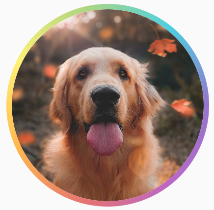
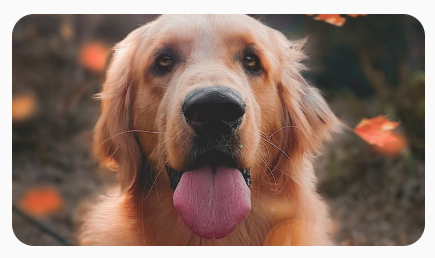
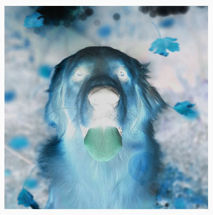
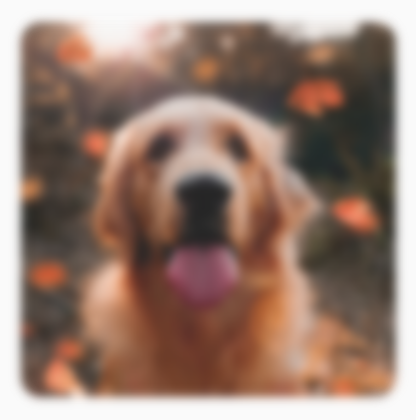

- [画像をカスタマイズする](#画像をカスタマイズする)
  - [コンテンツの調整](#コンテンツの調整)
    - [元の画像](#元の画像)
    - [ContentScale.Fit](#contentscalefit)
    - [ContentScale.Crop](#contentscalecrop)
    - [ContentScale.FillHeight](#contentscalefillheight)
    - [ContentScale.FillWidth](#contentscalefillwidth)
    - [ContentScale.FillBounds](#contentscalefillbounds)
    - [ContentScale.Inside](#contentscaleinside)
    - [ContentScale.None](#contentscalenone)
  - [Image コンポーザブルをシェイプにクリップする](#image-コンポーザブルをシェイプにクリップする)
    - [円形](#円形)
    - [角丸](#角丸)
    - [独自の形](#独自の形)
  - [Image コンポーザブルに枠線を追加する](#image-コンポーザブルに枠線を追加する)
  - [カスタムアスペクト比を設定する](#カスタムアスペクト比を設定する)
  - [カラーフィルタ - 画像のピクセルカラーを変換する](#カラーフィルタ---画像のピクセルカラーを変換する)
    - [画像の色合いを調整する](#画像の色合いを調整する)
    - [カラーマトリックスを使用して Image フィルタを適用する](#カラーマトリックスを使用して-image-フィルタを適用する)
      - [Image コンポーザブルのコントラストや明るさを調整する](#image-コンポーザブルのコントラストや明るさを調整する)
      - [Image コンポーザブルの色を反転する](#image-コンポーザブルの色を反転する)
  - [Image コンポーザブルをぼかす](#image-コンポーザブルをぼかす)


# 画像をカスタマイズする

画像は、Image コンポーザブルのプロパティ (contentScale、colorFilter) を使用してカスタマイズできます。既存の [Modifiers](https://developer.android.com/develop/ui/compose/modifiers-list?_gl=1*1pl2er*_up*MQ..*_ga*OTU2NjI5OTY2LjE3MjYzOTgxODU.*_ga_6HH9YJMN9M*MTcyNjQ2ODM2MS4yLjAuMTcyNjQ2ODM2MS4wLjAuMzU0MDU5MDk5) を適用して、画像にさまざまな効果を適用することもできます。 Modifiers は、Image コンポーザブルだけでなく、どのコンポーザブルでも使用できますが、 contentScale と colorFilter は Image コンポーザブルの明示的なパラメータです。


## コンテンツの調整

contentScale オプションを指定して、境界内で画像をトリミングまたは拡大縮小する方法を変更します。 **デフォルトでは、contentScale オプションを指定しない場合は、 ContentScale.Fit が使用されます。**

以下の例では、Image コンポーザブルは境界線付きの 150dp サイズに制限され、Image コンポーザブルの背景は黄色に設定されています。

```kotlin
val imageModifier = Modifier
    .size(150.dp)
    .border(BorderStroke(1.dp, Color.Black))
    .background(Color.Yellow)
Image(
    painter = painterResource(id = R.drawable.dog),
    contentDescription = stringResource(id = R.string.dog_content_description),
    contentScale = ContentScale.Fit,
    modifier = imageModifier
)
```

異なる ContentScale オプションを設定すると、出力も異なります。以下は、必要な正しい ContentScale モードを選択するのに役立つ表です。


### 元の画像


### ContentScale.Fit

アスペクト比を維持しながら、画像を均一に拡大・縮小します（デフォルト）。


### ContentScale.Crop

空いているスペースがなくなるように、画像を (アスペクト比を維持しながら) 拡大・縮小して、はみ出した部分は切り抜いて中央に配置します。


### ContentScale.FillHeight

境界をデスティネーションの高さに合うように、アスペクト比を維持しながら元の画像を拡大・縮小します。はみ出した部分は切り抜いて中央に配置します。


### ContentScale.FillWidth

境界をデスティネーションの幅に合うように、アスペクト比を維持しながら元の画像を拡大・縮小します。はみ出した部分は切り抜いて中央に配置します。


### ContentScale.FillBounds

デスティネーションの境界に合うように、垂直方向と水平方向にアスペクト比を無視してコンテンツを拡大・縮小します（注: 画像の比率に正確に合っていないコンテナに配置すると、画像が歪みます）。


### ContentScale.Inside

デスティネーションの境界内で、アスペクト比を維持しながら元の画像を **縮小** します **(拡大はしません)** 。

- コンテンツの縦 or 横がデスティネーションの境界より大きい場合
  - 境界内に収まるように、アスペクト比を維持しながら縮小されます。
- コンテンツの縦と横が、どちらもデスティネーションの境界よりも小さい場合
  - 拡大・縮小は適用されません。

**コンテンツがデスティネーションの境界よりも大きい場合**


**コンテンツがデスティネーションの境界よりも小さい場合**


### ContentScale.None

元の画像に対して、拡大・縮小を適用しません。デスティネーションの境界をはみ出した部分は切り取られ、中央に配置されます。

**コンテンツがデスティネーションの境界よりも大きい場合**


**コンテンツがデスティネーションの境界よりも小さい場合**


## Image コンポーザブルをシェイプにクリップする

画像を特定の形にするには、組み込みの clip 修飾子を使用します。


### 円形

画像を円形に切り抜くには、 `Modifier.clip(CircleShape)` を使用します。

```kotlin
Image(
    painter = painterResource(id = R.drawable.dog),
    contentDescription = stringResource(id = R.string.dog_content_description),
    contentScale = ContentScale.Crop,
    modifier = Modifier
        .size(200.dp)
        .clip(CircleShape)
)
```


### 角丸

角を丸くするには、 `Modifier.clip(RoundedCornerShape(16.dp)` を使います。パラメータに丸くする角のサイズを指定します。

```kotlin
Image(
    painter = painterResource(id = R.drawable.dog),
    contentDescription = stringResource(id = R.string.dog_content_description),
    contentScale = ContentScale.Crop,
    modifier = Modifier
        .size(200.dp)
        .clip(RoundedCornerShape(16.dp))
)
```


### 独自の形

Shape を拡張して Path を指定し、画像を独自の形にクリップすることもできます。

```kotlin
class SquashedOval : Shape {
    override fun createOutline(
        size: Size,
        layoutDirection: LayoutDirection,
        density: Density
    ): Outline {
        val path = Path().apply {
            // size はコンテナのサイズです。
            addOval(
                Rect(
                    left = size.width / 4f,
                    top = 0f,
                    right = size.width * 3 / 4f,
                    bottom = size.height
                )
            )
        }
        return Outline.Generic(path = path)
    }
}

Image(
    painter = painterResource(id = R.drawable.dog),
    contentDescription = stringResource(id = R.string.dog_content_description),
    contentScale = ContentScale.Crop,
    modifier = Modifier
        .size(200.dp)
        .clip(SquashedOval())
)
```


## Image コンポーザブルに枠線を追加する

通常、画像の周囲に枠線を付けるには、Modifier.border() と Modifier.clip() を併用します。

```kotlin
val borderWidth = 4.dp
Image(
    painter = painterResource(id = R.drawable.dog),
    contentDescription = stringResource(id = R.string.dog_content_description),
    contentScale = ContentScale.Crop,
    modifier = Modifier
        .size(150.dp)
        .border(
            BorderStroke(borderWidth, Color.Yellow),
            // この CircleShape はボーダーの形を指定するもの
            CircleShape
        )
        .padding(borderWidth)
        // この CircleShape は画像の形を指定するもの
        .clip(CircleShape)
)
```


グラデーションの枠を作成する場合は、Brush API を使用すれば、画像の周囲に虹色にグラデーションする枠線を描画できます。

```kotlin
val rainbowColorsBrush = remember {
    Brush.sweepGradient(
        listOf(
            Color(0xFF9575CD),
            Color(0xFFBA68C8),
            Color(0xFFE57373),
            Color(0xFFFFB74D),
            Color(0xFFFFF176),
            Color(0xFFAED581),
            Color(0xFF4DD0E1),
            Color(0xFF9575CD)
        )
    )
}
val borderWidth = 4.dp
Image(
    painter = painterResource(id = R.drawable.dog),
    contentDescription = stringResource(id = R.string.dog_content_description),
    contentScale = ContentScale.Crop,
    modifier = Modifier
        .size(150.dp)
        .border(
            BorderStroke(borderWidth, rainbowColorsBrush),
            CircleShape
        )
        .padding(borderWidth)
        .clip(CircleShape)
)
```




## カスタムアスペクト比を設定する

画像をカスタム アスペクト比に変換するには、 `Modifier.aspectRatio(widthRatio/heightRatio)` を使用して画像（または任意のコンポーザブル）にカスタム比率を指定します。

```kotlin
Image(
    painter = painterResource(id = R.drawable.dog),
    contentDescription = stringResource(id = R.string.dog_content_description),
    contentScale = ContentScale.Crop,
    modifier = Modifier
        .aspectRatio(16f / 9f)
        .clip(RoundedCornerShape(16.dp))
)
```




## カラーフィルタ - 画像のピクセルカラーを変換する

Image コンポーザブルには、画像の各ピクセルの出力を変更できる colorFilter パラメータが用意されています。


### 画像の色合いを調整する

ColorFilter.tint(color, blendMode) を使用すると、指定された色のブレンドモードが Image コンポーザブルに適用されます。ColorFilter.tint(color, blendMode) は、 [BlendMode](https://developer.android.com/reference/kotlin/androidx/compose/ui/graphics/BlendMode?_gl=1*1csg5sg*_up*MQ..*_ga*OTU2NjI5OTY2LjE3MjYzOTgxODU.*_ga_6HH9YJMN9M*MTcyNjUzODM4Mi4yLjAuMTcyNjUzODM4Mi4wLjAuOTA1MzY1MjQ.) を使用してコンテンツの色合いを調整します。

```kotlin
Image(
    painter = painterResource(id = R.drawable.baseline_directions_bus_24),
    contentDescription = stringResource(id = R.string.bus_content_description),
    // BlendMode を省略した場合は、デフォルト値の
    // SrcIn が指定されます。
    colorFilter = ColorFilter.tint(Color.Yellow)
)
```


BlendMode を変更すると、設定によって異なる効果が画像に適用されます。たとえば、BlendMode.Darken を指定して Color.Green を合成すると、次のような画像になります。

```kotlin
Image(
    painter = painterResource(id = R.drawable.dog),
    contentDescription = stringResource(id = R.string.dog_content_description),
    colorFilter = ColorFilter.tint(Color.Green, blendMode = BlendMode.Darken)
)
```


利用可能な各種 BlendMode の詳細については、 [BlendMode のリファレンスドキュメント](https://developer.android.com/reference/kotlin/androidx/compose/ui/graphics/BlendMode?hl=ja&_gl=1*1ljmrc3*_up*MQ..*_ga*OTU2NjI5OTY2LjE3MjYzOTgxODU.*_ga_6HH9YJMN9M*MTcyNjUzODM4Mi4yLjAuMTcyNjUzODM4Mi4wLjAuOTA1MzY1MjQ.) をご覧ください。


### カラーマトリックスを使用して Image フィルタを適用する

カラー マトリックス ColorFilter オプションを使用して画像を変換します。たとえば、画像にモノクロ フィルタを適用するには、 [ColorMatrix](https://developer.android.com/reference/kotlin/androidx/compose/ui/graphics/ColorMatrix?hl=ja&_gl=1*1bv485f*_up*MQ..*_ga*OTU2NjI5OTY2LjE3MjYzOTgxODU.*_ga_6HH9YJMN9M*MTcyNjUzODM4Mi4yLjAuMTcyNjUzODM4Mi4wLjAuOTA1MzY1MjQ.) を使用して、彩度を 0f に設定します。

```kotlin
Image(
    painter = painterResource(id = R.drawable.dog),
    contentDescription = stringResource(id = R.string.dog_content_description),
    colorFilter = ColorFilter.colorMatrix(ColorMatrix().apply { setToSaturation(0f) })
)
```


#### Image コンポーザブルのコントラストや明るさを調整する

画像のコントラストと明るさを変更する場合も、 [ColorMatrix](https://developer.android.com/reference/kotlin/androidx/compose/ui/graphics/ColorMatrix?hl=ja&_gl=1*uhq1b9*_up*MQ..*_ga*OTU2NjI5OTY2LjE3MjYzOTgxODU.*_ga_6HH9YJMN9M*MTcyNjUzODM4Mi4yLjAuMTcyNjUzODM4Mi4wLjAuOTA1MzY1MjQ.) を使用して値を変更します。

```kotlin
val contrast = 2f // 0f..10f (1 がデフォルト値)
val brightness = -180f // -255f..255f (0 がデフォルト値)
val colorMatrix = floatArrayOf(
    contrast, 0f, 0f, 0f, brightness,
    0f, contrast, 0f, 0f, brightness,
    0f, 0f, contrast, 0f, brightness,
    0f, 0f, 0f, 1f, 0f
)
Image(
    painter = painterResource(id = R.drawable.dog),
    contentDescription = stringResource(id = R.string.dog_content_description),
    colorFilter = ColorFilter.colorMatrix(ColorMatrix(colorMatrix))
)
```


#### Image コンポーザブルの色を反転する

画像の色を反転するにも、 [ColorMatrix](https://developer.android.com/reference/kotlin/androidx/compose/ui/graphics/ColorMatrix?hl=ja&_gl=1*nketjv*_up*MQ..*_ga*OTU2NjI5OTY2LjE3MjYzOTgxODU.*_ga_6HH9YJMN9M*MTcyNjUzODM4Mi4yLjAuMTcyNjUzODM4Mi4wLjAuOTA1MzY1MjQ.) を設定します。

```kotlin
val colorMatrix = floatArrayOf(
    -1f, 0f, 0f, 0f, 255f,
    0f, -1f, 0f, 0f, 255f,
    0f, 0f, -1f, 0f, 255f,
    0f, 0f, 0f, 1f, 0f
)
Image(
    painter = painterResource(id = R.drawable.dog),
    contentDescription = stringResource(id = R.string.dog_content_description),
    colorFilter = ColorFilter.colorMatrix(ColorMatrix(colorMatrix))
)
```




## Image コンポーザブルをぼかす

**注 : ぼかし効果は、 Android 12 以降でのみサポートされます。** 古いバージョンの Android でこの修飾子を使用すると無視されます。

画像をぼかすには、Modifier.blur() を使用します。radiusX と radiusY を指定して、ぼかす範囲の半径を水平方向と垂直方向のそれぞれで指定します。

radiusX と radiusY は、ぼかしの濃さの設定です。この半径で指定された円の範囲内で、色が入れ替えられて、写真がぼけます。つまり、円のサイズ ( radiusX と radiusY ) が大きくなるにつれて、広範囲で色が入れ替えられるため、より 「濃い」 ぼかしになります。

```kotlin
Image(
    painter = painterResource(id = R.drawable.dog),
    contentDescription = stringResource(id = R.string.dog_content_description),
    contentScale = ContentScale.Crop,
    modifier = Modifier
        .size(150.dp)
        .blur(
            radiusX = 10.dp,
            radiusY = 10.dp,
            edgeTreatment = BlurredEdgeTreatment(RoundedCornerShape(8.dp))
        )
)
```


Images をぼかす場合は、BlurredEdgeTreatment.Unbounded ではなく BlurredEdgeTreatment(Shape) を使用することをおすすめします。後者は、元のコンテンツの境界を超えてレンダリングする画像にぼかしを入れる場合に使用します。画像の場合、コンテンツの境界外にレンダリングすることは少ないかもしれませんが、角丸の長方形をぼかす際には、両者を区別して使用することが必要になる場合があります。

たとえば、上記の画像で BlurredEdgeTreatment を Unbounded に設定すると、画像の境界がはっきりせずにぼやけて表示されます。

```kotlin
Image(
    painter = painterResource(id = R.drawable.dog),
    contentDescription = stringResource(id = R.string.dog_content_description),
    contentScale = ContentScale.Crop,
    modifier = Modifier
        .size(150.dp)
        .blur(
            radiusX = 10.dp,
            radiusY = 10.dp,
            edgeTreatment = BlurredEdgeTreatment.Unbounded
        )
        .clip(RoundedCornerShape(8.dp))
)
```



