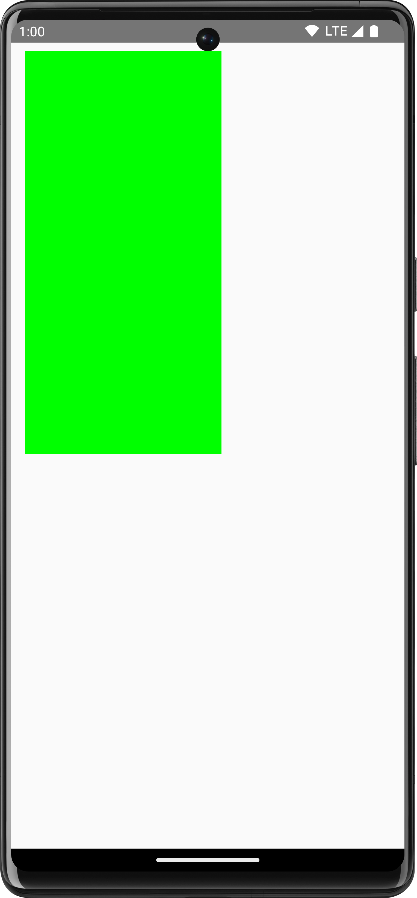
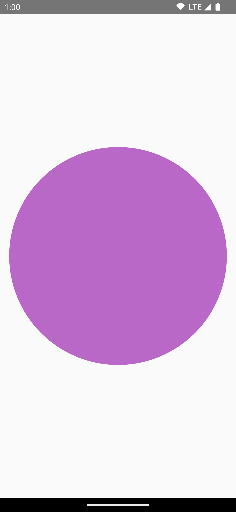
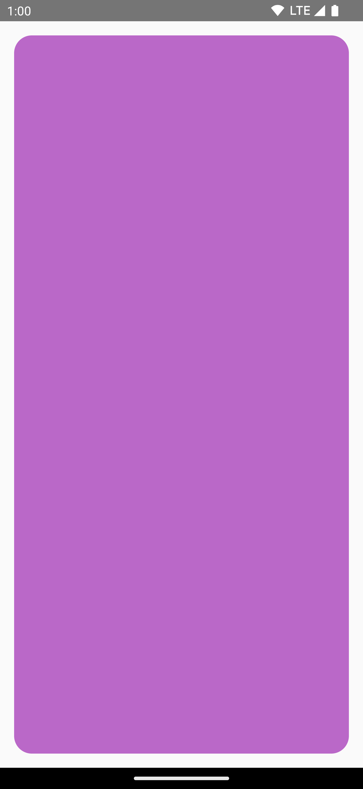
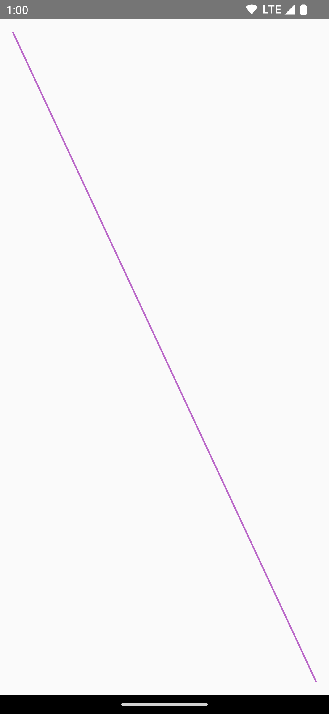
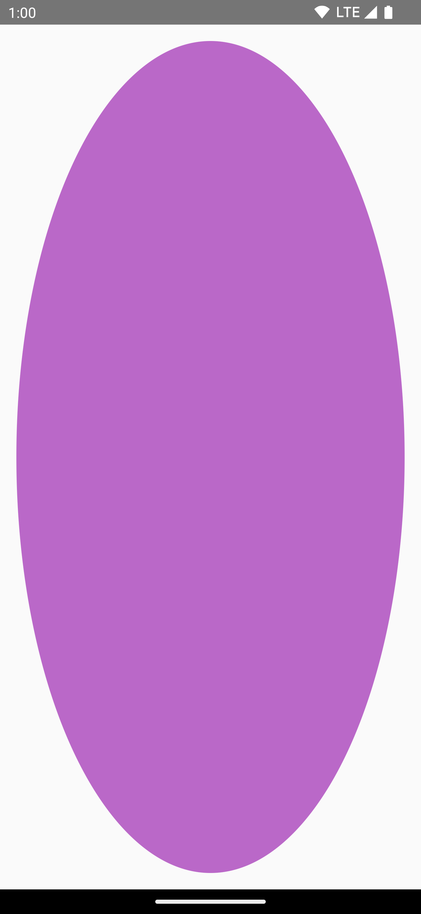
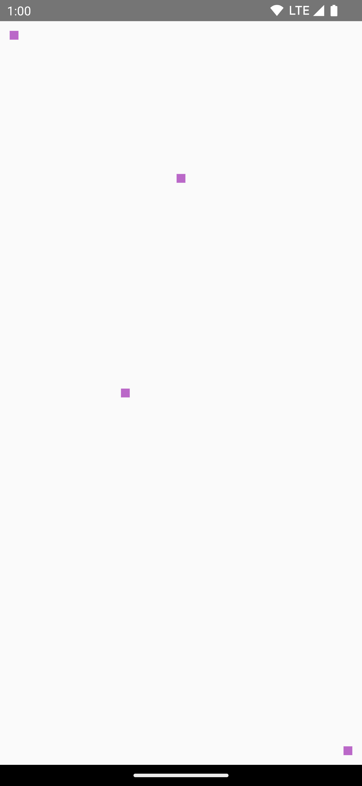

- [Compose のグラフィックス](#compose-のグラフィックス)
  - [修飾子と DrawScope を使用した基本的な描画](#修飾子と-drawscope-を使用した基本的な描画)
  - [座標系](#座標系)
  - [基本的な変形](#基本的な変形)
    - [拡縮](#拡縮)
    - [移動](#移動)
    - [回転](#回転)
    - [インセット](#インセット)
    - [複数の変形](#複数の変形)
  - [一般的な描画オペレーション](#一般的な描画オペレーション)
    - [テキストを描画する](#テキストを描画する)
      - [テキストを測定する](#テキストを測定する)
    - [画像を描画する](#画像を描画する)
    - [基本的な図形を描画する](#基本的な図形を描画する)
    - [パスを描画する](#パスを描画する)
  - [Canvas オブジェクトへのアクセス](#canvas-オブジェクトへのアクセス)
  - [詳細](#詳細)


# Compose のグラフィックス

多くのアプリでは、画面上に描画される内容を正確にコントロールする必要があります。それにはボックスや円を画面の適切な場所に配置するといった簡単なことから、グラフィック要素をさまざまなスタイルで配置するといった複雑なことまでが含まれます。

[Introduction to drawing in Compose - Youtube](https://youtu.be/1yiuxWK74vI)


## 修飾子と DrawScope を使用した基本的な描画

Compose でカスタムのものを描画する基本的な方法は、 [Modifier.drawWithContent](https://developer.android.com/reference/kotlin/androidx/compose/ui/draw/package-summary?hl=ja&_gl=1*1uiexd1*_up*MQ..*_ga*MTgxNTMzMjE1MS4xNzI2NjMwMjY0*_ga_6HH9YJMN9M*MTcyNjYzMDI2My4xLjAuMTcyNjYzMDI2My4wLjAuNTk0NTcwMzI3#(androidx.compose.ui.Modifier).drawWithContent(kotlin.Function1)) , [Modifier.drawBehind](https://developer.android.com/reference/kotlin/androidx/compose/ui/draw/package-summary?hl=ja&_gl=1*1uiexd1*_up*MQ..*_ga*MTgxNTMzMjE1MS4xNzI2NjMwMjY0*_ga_6HH9YJMN9M*MTcyNjYzMDI2My4xLjAuMTcyNjYzMDI2My4wLjAuNTk0NTcwMzI3#(androidx.compose.ui.Modifier).drawBehind(kotlin.Function1)) , [Modifier.drawWithCache](https://developer.android.com/reference/kotlin/androidx/compose/ui/draw/package-summary?hl=ja&_gl=1*1uiexd1*_up*MQ..*_ga*MTgxNTMzMjE1MS4xNzI2NjMwMjY0*_ga_6HH9YJMN9M*MTcyNjYzMDI2My4xLjAuMTcyNjYzMDI2My4wLjAuNTk0NTcwMzI3#(androidx.compose.ui.Modifier).drawWithCache(kotlin.Function1)) などの修飾子を使用する方法です。

たとえば、コンポーザブルの後ろに何かを描画するには、drawBehind 修飾子を使用して描画コマンドの実行を開始します。

```kotlin
Spacer(
    modifier = Modifier
        .fillMaxSize()
        .drawBehind {
            // this = DrawScope
        }
)
```

もし、描画するコンポーザブルだけが必要なら、 [Canvas](https://developer.android.com/reference/kotlin/androidx/compose/ui/graphics/package-summary?hl=ja&_gl=1*1sov4td*_up*MQ..*_ga*MTgxNTMzMjE1MS4xNzI2NjMwMjY0*_ga_6HH9YJMN9M*MTcyNjYzMDI2My4xLjAuMTcyNjYzMDI2My4wLjAuNTk0NTcwMzI3#Canvas(android.graphics.Canvas)) コンポーザブルを使用できます。Canvas コンポーザブルは、 [Modifier.drawBehind](https://developer.android.com/develop/ui/compose/graphics/draw/modifiers?hl=ja&_gl=1*b65f0n*_up*MQ..*_ga*MTgxNTMzMjE1MS4xNzI2NjMwMjY0*_ga_6HH9YJMN9M*MTcyNjYzMDI2My4xLjAuMTcyNjYzMDI2My4wLjAuNTk0NTcwMzI3#drawbehind) の便利なラッパーです。他の Compose UI 要素と同じように、レイアウトに Canvas を配置します。Canvas 内では、スタイルと位置を正確に制御して要素を描画できます。

注: 内部的には、Compose はビューベースの UI の [Canvas とその他の関連オブジェクト](https://developer.android.com/develop/ui/views/graphics/drawables?hl=ja&_gl=1*8nbnzw*_up*MQ..*_ga*MTgxNTMzMjE1MS4xNzI2NjMwMjY0*_ga_6HH9YJMN9M*MTcyNjYzMDI2My4xLjAuMTcyNjYzMDI2My4wLjAuNTk0NTcwMzI3) に依存しています。ただし、Compose は Canvas のわかりにくい側面の多くを簡素化しています。たとえば、ビューベースのグラフィック要素のほとんどは Paint ヘルパー オブジェクトに依存しています。Paint で設定した構成オプションと、メソッド呼び出しで設定した構成オプションを把握する必要があります。また、パフォーマンスに悪影響を与えない方法で Paint オブジェクトを作成するように注意する必要があります。Compose は、これらの詳細を自動的に処理します。

すべての描画修飾子は、独自の状態を維持するスコープ付き描画環境である [DrawScope](https://developer.android.com/reference/kotlin/androidx/compose/ui/graphics/drawscope/DrawScope?hl=ja&_gl=1*b65f0n*_up*MQ..*_ga*MTgxNTMzMjE1MS4xNzI2NjMwMjY0*_ga_6HH9YJMN9M*MTcyNjYzMDI2My4xLjAuMTcyNjYzMDI2My4wLjAuNTk0NTcwMzI3) を公開します。これにより、グラフィック要素のグループのパラメータを設定できます。 DrawScope には、DrawScope の現在の寸法を指定する Size オブジェクトである size など、いくつかの便利なフィールドが用意されています。

何かを描画するには、DrawScope の多数の描画関数の 1 つを使用できます。たとえば、次のコードは画面の左上隅に四角形を描画します。

```kotlin
import androidx.compose.foundation.Canvas

Canvas(modifier = Modifier.fillMaxSize()) {
    // size は、 Canvas のサイズ
    val canvasQuadrantSize = size / 2F
    drawRect(
        color = Color.Magenta,
        size = canvasQuadrantSize
    )
}
```


さまざまな描画修飾子の詳細については、 [グラフィック修飾子のドキュメント](./2.グラフィックス修飾子.md) をご覧ください。


## 座標系

画面に何かを描画するには、アイテムのオフセット（x、y）とサイズを把握しておく必要があります。DrawScope の多くの描画メソッドでは、位置とサイズがデフォルトのパラメータ値で示されます。デフォルトのパラメータ値では通常、キャンバスの [0, 0] ポイントにアイテムが配置され、描画領域内にデフォルトの size で表示されます。上記の例では、長方形が左上に配置されています。アイテムのサイズと位置を調整するには、Compose の座標系を理解しておく必要があります。

座標系（[0,0]）の原点は、描画領域の左上端ピクセルになります。x は右に行くほど大きくなり、y は下に行くほど大きくなります。

注: すべての描画オペレーションはピクセルサイズに基づき実行されます。さまざまなデバイス密度と画面サイズでアイテムのサイズを統一するには、 [.toPx()](https://developer.android.com/reference/kotlin/androidx/compose/ui/unit/Density?hl=ja&_gl=1*g5kp0q*_up*MQ..*_ga*MTgxNTMzMjE1MS4xNzI2NjMwMjY0*_ga_6HH9YJMN9M*MTcyNjYzMDI2My4xLjAuMTcyNjYzMDI2My4wLjAuNTk0NTcwMzI3#(androidx.compose.ui.unit.Dp).toPx()) を使用して dp から変換するか、比率でサイズを指定するようにします。


たとえば、キャンバス領域の右上隅から左下隅に斜線を描画するには、 [DrawScope.drawLine()](https://developer.android.com/reference/kotlin/androidx/compose/ui/graphics/drawscope/DrawScope?hl=ja&_gl=1*uhmrtu*_up*MQ..*_ga*MTgxNTMzMjE1MS4xNzI2NjMwMjY0*_ga_6HH9YJMN9M*MTcyNjYzMDI2My4xLjAuMTcyNjYzMDI2My4wLjAuNTk0NTcwMzI3#drawLine(androidx.compose.ui.graphics.Brush,androidx.compose.ui.geometry.Offset,androidx.compose.ui.geometry.Offset,kotlin.Float,androidx.compose.ui.graphics.StrokeCap,androidx.compose.ui.graphics.PathEffect,kotlin.Float,androidx.compose.ui.graphics.ColorFilter,androidx.compose.ui.graphics.BlendMode)) 関数を使用して、それぞれ対応する x 位置と y 位置で開始位置と終了位置のオフセットを指定します。

```kotlin
import androidx.compose.foundation.Canvas

Canvas(modifier = Modifier.fillMaxSize()) {
    val canvasWidth = size.width
    val canvasHeight = size.height
    drawLine(
        start = Offset(x = canvasWidth, y = 0f),
        end = Offset(x = 0f, y = canvasHeight),
        color = Color.Blue
    )
}
```


## 基本的な変形

DrawScope には変形の機能があり、描画コマンドを実行する位置と方法を変更できます。

注: これらの変形は、 [コンポーザブルのライフサイクルの描画フェーズ](../../2.UIアーキテクチャ/3.段階（フェーズ）.md/#描画フェーズでの読み取り) のみを実行します。 **変形オペレーションによってサイズまたは位置を変更してもレイアウトのサイズと位置は変更されません。** 要素がレイアウトのサイズと位置から外れると、他の要素の上に描画される場合があります。


### 拡縮

描画オペレーションのサイズを要素に基づき拡大するには、 [DrawScope.scale()](https://developer.android.com/reference/kotlin/androidx/compose/ui/graphics/drawscope/DrawScope?hl=ja&_gl=1*obpsi9*_up*MQ..*_ga*MTgxNTMzMjE1MS4xNzI2NjMwMjY0*_ga_6HH9YJMN9M*MTcyNjYzMDI2My4xLjAuMTcyNjYzMDI2My4wLjAuNTk0NTcwMzI3#(androidx.compose.ui.graphics.drawscope.DrawScope).scale(kotlin.Float,kotlin.Float,androidx.compose.ui.geometry.Offset,kotlin.Function1)) を使用します。 scale() のようなオペレーションは、対応するラムダ内のすべての描画オペレーションに適用されます。たとえば、次のコードは、幅を 10 倍、高さを 15 倍に拡大します。

```kotlin
import androidx.compose.foundation.Canvas
import androidx.compose.ui.graphics.drawscope.scale

Canvas(modifier = Modifier.fillMaxSize()) {
    scale(scaleX = 10f, scaleY = 15f) {
        // Canvas の中央に配置されます。
        drawCircle(Color.Blue, radius = 20.dp.toPx())
    }
}
```


### 移動

[DrawScope.translate()](https://developer.android.com/reference/kotlin/androidx/compose/ui/graphics/drawscope/DrawScope?hl=ja&_gl=1*hqgy77*_up*MQ..*_ga*MTgxNTMzMjE1MS4xNzI2NjMwMjY0*_ga_6HH9YJMN9M*MTcyNjYzMDI2My4xLjAuMTcyNjYzMDI2My4wLjAuNTk0NTcwMzI3#(androidx.compose.ui.graphics.drawscope.DrawScope).translate(kotlin.Float,kotlin.Float,kotlin.Function1)) を使用すると、描画オペレーションを上、下、左、右に移動できます。たとえば次のコードは、描画結果を右に 100 ピクセル、上に 300 ピクセル移動します。

translate() 関数には、 left と top というパラメータはありますが、 right や bottom といったパラメータはありません。

lest は X 軸上での移動を表しており、正の値の場合は右方向への移動、負の値の場合は左方向への移動となります。

同様に、 top は Y 軸上での移動を表しており、正の値の場合は下方向への移動、負の値の場合は上方向への移動となります。


```kotlin
Canvas(modifier = Modifier.fillMaxSize()) {
    translate(left = 100f, top = -300f) {
        drawCircle(Color.Blue, radius = 200.dp.toPx())
    }
}
```


もし、 translate 関数が指定されていない場合は、上記の青色の円は、画面の中央に描画されます。


### 回転

[DrawScope.rotate()](https://developer.android.com/reference/kotlin/androidx/compose/ui/graphics/drawscope/DrawScope?hl=ja&_gl=1*z99yy1*_up*MQ..*_ga*MTgxNTMzMjE1MS4xNzI2NjMwMjY0*_ga_6HH9YJMN9M*MTcyNjYzMDI2My4xLjAuMTcyNjYzMDI2My4wLjAuNTk0NTcwMzI3#(androidx.compose.ui.graphics.drawscope.DrawScope).rotate(kotlin.Float,androidx.compose.ui.geometry.Offset,kotlin.Function1)) を使用して、描画オペレーションをピボット ポイントを中心として回転させます。たとえば次のコードは、長方形を 45 度回転させます。

```kotlin
Canvas(modifier = Modifier.fillMaxSize()) {
    rotate(degrees = 45F) {
        drawRect(
            color = Color.Gray,
            topLeft = Offset(x = size.width / 3F, y = size.height / 3F),
            size = size / 3F
        )
    }
}
```


デフォルトのピボットポイントは、描画領域 ( Canvas ) の中央です。

topLeft パラメータは、図形を回転させる前の時点における、図形の左上部分の座標です。


### インセット

関数 [DrawScope.inset()](https://developer.android.com/reference/kotlin/androidx/compose/ui/graphics/drawscope/package-summary?hl=ja&_gl=1*y2wdj2*_up*MQ..*_ga*MTgxNTMzMjE1MS4xNzI2NjMwMjY0*_ga_6HH9YJMN9M*MTcyNjYzMDI2My4xLjAuMTcyNjYzMDI2My4wLjAuNTk0NTcwMzI3#(androidx.compose.ui.graphics.drawscope.DrawScope).inset(kotlin.Float,kotlin.Float,kotlin.Float,kotlin.Float,kotlin.Function1)) を使用して現在の DrawScope のデフォルト パラメータを調整し、描画境界の変更と描画結果の移動ができます。

inset という単語には、 「 (すきまに) 差し込む」 という意味があります。 「余白を差し込む」 と考えると良いでしょう。

```kotlin
Canvas(modifier = Modifier.fillMaxSize()) {
    // Quadrant は、超簡単に言うと 4 分割したうちの 1 つという意味。
    val canvasQuadrantSize = size / 2F
    inset(horizontal = 50f, vertical = 30f) {
        drawRect(color = Color.Green, size = canvasQuadrantSize)
    }
}
```

このコードによって、描画コマンドに効果的にパディングを追加できます。

この例では、描画される長方形のサイズは、 inset 設定前と同じ大きさです。 inset の right パラメータが効いてこれば、長方形の幅が短くなるのかもしれませんが、実験してみたところ、 right パラメータが効いていなかったので、よくわかりません。 ( inset のバグ？)



参考 : 頑張って調べたのですが、 DrawScope.translate() と DrawScope.inset() の違いがいまいちわかりませんでした。 translate は、描画領域を縮小せず、 inset は、描画領域自体を縮小するらしいですが、 inset の right パラメータが効いていなかったので、本当に描画領域が縮小されるのかなぞです。


### 複数の変形

複数の変形を描画結果に適用するには、DrawScope.withTransform() 関数を使用します。この関数は、すべての変更を組み合わせて単一の変形を作成し、適用します。 **withTransform() を使用すると、** ネストされた変形を Compose が一つずつ計算して保存する必要がなく、すべての変形が 1 回のオペレーションで実行されるため、 **個々の変形に対してネスト呼び出しを行うよりも効率的です。**

たとえば次のコードは、移動と回転の両方を長方形に適用します。

```kotlin
Canvas(modifier = Modifier.fillMaxSize()) {
    // translate だけを実行したもの
    withTransform({
        translate(left = size.width / 5F)
    }) {
        drawRect(
            color = Color.Gray,
            topLeft = Offset(x = size.width / 3F, y = size.height / 3F),
            size = size / 3F
        )
    }
    // translate に加えて、 rotate を実行したもの
    withTransform({
        translate(left = size.width / 5F)
        rotate(degrees = 90F)
    }) {
        drawRect(
            color = Color.Cyan,
            topLeft = Offset(x = size.width / 3F, y = size.height / 3F),
            size = size / 3F
        )
    }
}
```


この例では、コードを見ると、 translate してから、 rotate しているように見えるが、実際には rotate してから translate しているようです。


## 一般的な描画オペレーション

### テキストを描画する

Compose でテキストを描画するには、通常は Text コンポーザブルを使用します。ただし、DrawScope を使用している場合や、テキストを手動でカスタマイズして描画する場合は、 [DrawScope.drawText()](https://developer.android.com/reference/kotlin/androidx/compose/ui/graphics/drawscope/DrawScope?hl=ja&_gl=1*8wch24*_up*MQ..*_ga*MTgxNTMzMjE1MS4xNzI2NjMwMjY0*_ga_6HH9YJMN9M*MTcyNjYzMDI2My4xLjAuMTcyNjYzMDI2My4wLjAuNTk0NTcwMzI3#(androidx.compose.ui.graphics.drawscope.DrawScope).drawText(androidx.compose.ui.text.TextMeasurer,androidx.compose.ui.text.AnnotatedString,androidx.compose.ui.geometry.Offset,androidx.compose.ui.text.TextStyle,androidx.compose.ui.text.style.TextOverflow,kotlin.Boolean,kotlin.Int,kotlin.collections.List,androidx.compose.ui.unit.IntSize)) メソッドを使用します。

テキストを描画するには、 [rememberTextMeasurer](https://developer.android.com/reference/kotlin/androidx/compose/ui/text/package-summary?hl=ja&_gl=1*8wch24*_up*MQ..*_ga*MTgxNTMzMjE1MS4xNzI2NjMwMjY0*_ga_6HH9YJMN9M*MTcyNjYzMDI2My4xLjAuMTcyNjYzMDI2My4wLjAuNTk0NTcwMzI3#rememberTextMeasurer(kotlin.Int)) を使用して [TextMeasurer](https://developer.android.com/reference/kotlin/androidx/compose/ui/text/TextMeasurer?hl=ja&_gl=1*8wch24*_up*MQ..*_ga*MTgxNTMzMjE1MS4xNzI2NjMwMjY0*_ga_6HH9YJMN9M*MTcyNjYzMDI2My4xLjAuMTcyNjYzMDI2My4wLjAuNTk0NTcwMzI3) を作成し、Measurer で drawText を呼び出します。

```kotlin
val textMeasurer = rememberTextMeasurer()

Canvas(modifier = Modifier.fillMaxSize()) {
    drawText(textMeasurer, "Hello")
}
```


#### テキストを測定する

テキストの描画は、他の描画コマンドとは若干仕組みが異なります。通常は、描画コマンドでサイズ（幅と高さ）を指定して、図形や画像を描画します。テキストの場合は、レンダリングされるテキストのサイズをコントロールするパラメータがいくつかあります（フォントサイズ、フォント、合字、文字間隔など）。

Compose では [TextMeasurer](https://developer.android.com/reference/kotlin/androidx/compose/ui/text/TextMeasurer?hl=ja&_gl=1*bnnuyi*_up*MQ..*_ga*MTgxNTMzMjE1MS4xNzI2NjMwMjY0*_ga_6HH9YJMN9M*MTcyNjYzMDI2My4xLjAuMTcyNjYzMDI2My4wLjAuNTk0NTcwMzI3) を使用して、上記の要素に応じて、測定したテキストサイズにアクセスできます。テキストの後ろに背景を描画する場合は、次のように測定した情報を使用して、テキストが占める領域のサイズを取得します。

```kotlin
val textMeasurer = rememberTextMeasurer()

Spacer(
    modifier = Modifier
        .drawWithCache {
            val measuredText =
                textMeasurer.measure(
                    AnnotatedString(longTextSample),
                    constraints = Constraints.fixedWidth((size.width * 2f / 3f).toInt()),
                    style = TextStyle(fontSize = 18.sp)
                )

            onDrawBehind {
                drawRect(pinkColor, size = measuredText.size.toSize())
                drawText(measuredText)
            }
        }
        .fillMaxSize()
)
```

注: 上記の例で Modifier.drawWithCache を使用しているのは、テキストの描画は負荷の高いオペレーションであるためです。drawWithCache を使用すると、描画領域のサイズが変更されるまで、作成されたオブジェクトをキャッシュに保存できます。詳細については、 [Modifier.drawWithCache のドキュメント](./2.グラフィックス修飾子.md/#modifierdrawwithcache--描画オブジェクトの描画とキャッシュへの保存) をご覧ください。

このコード スニペットにより、テキストの背景がピンク色になります。背景の長方形は、全領域の 2/3 の幅を占めます。


制約、フォントサイズ、測定したサイズに影響するプロパティを調整すると、新しいサイズが報告されます。width と height の両方を固定サイズに設定すると、テキストは [TextOverflow](https://developer.android.com/reference/kotlin/androidx/compose/ui/text/style/TextOverflow?hl=ja&_gl=1*1fnovbk*_up*MQ..*_ga*MTgxNTMzMjE1MS4xNzI2NjMwMjY0*_ga_6HH9YJMN9M*MTcyNjYzMDI2My4xLjAuMTcyNjYzMDI2My4wLjAuNTk0NTcwMzI3) の設定に従います。たとえば次のコードは、コンポーザブル領域の高さ 1/3、幅 1/3 でテキストをレンダリングし、TextOverflow を TextOverflow.Ellipsis に設定します。

```kotlin
val textMeasurer = rememberTextMeasurer()

Spacer(
    modifier = Modifier
        .drawWithCache {
            val measuredText =
                textMeasurer.measure(
                    AnnotatedString(longTextSample),
                    constraints = Constraints.fixed(
                        width = (size.width / 3f).toInt(),
                        // 先ほどの例とは違い、今回は高さにも制約があります。
                        height = (size.height / 3f).toInt()
                    ),
                    // 文字が範囲内に収まらなかった場合の丸め処理
                    overflow = TextOverflow.Ellipsis,
                    style = TextStyle(fontSize = 18.sp)
                )

            onDrawBehind {
                drawRect(pinkColor, size = measuredText.size.toSize())
                drawText(measuredText)
            }
        }
        .fillMaxSize()
)
```

テキストは制約に沿って描画され、末尾に省略記号が表示されるようになります。


注: テキストの詳細については、 [テキストのドキュメント](../../6.テキストとタイポグラフィ) をご覧ください。


### 画像を描画する

DrawScope を使用して [ImageBitmap](https://developer.android.com/reference/kotlin/androidx/compose/ui/graphics/ImageBitmap?hl=ja&_gl=1*25tnpt*_up*MQ..*_ga*MTgxNTMzMjE1MS4xNzI2NjMwMjY0*_ga_6HH9YJMN9M*MTcyNjYzMDI2My4xLjAuMTcyNjYzMDI2My4wLjAuNTk0NTcwMzI3) を描画するには、ImageBitmap.imageResource() を使用して画像を読み込み、drawImage を呼び出します。

```kotlin
val dogImage = ImageBitmap.imageResource(id = R.drawable.dog)

// onDraw パラメータは、最後のパラメータなので、
// 丸カッコの外に出せます。
Canvas(modifier = Modifier.fillMaxSize(), onDraw = {
    drawImage(dogImage)
})
```


注: フィルタを画像に適用する方法について詳しくは、 [画像のカスタマイズに関するドキュメント](../2.画像/5.画像をカスタマイズする.md) をご覧ください。


### 基本的な図形を描画する

DrawScope には、さまざまな図形描画関数があります。図形を描画するには、定義済みの描画関数（drawCircle など）を使用します。

```kotlin
val purpleColor = Color(0xFFBA68C8)
Canvas(
    modifier = Modifier
        .fillMaxSize()
        .padding(16.dp),
    onDraw = {
        drawCircle(purpleColor)
    }
)
```

以下に、上位のコードの描画関数部分を変更した場合の実行結果を示します。

- [drawCircle()](https://developer.android.com/reference/kotlin/androidx/compose/ui/graphics/drawscope/DrawScope?hl=ja&_gl=1*1cjcfph*_up*MQ..*_ga*MTgxNTMzMjE1MS4xNzI2NjMwMjY0*_ga_6HH9YJMN9M*MTcyNjYzMDI2My4xLjAuMTcyNjYzMDI2My4wLjAuNTk0NTcwMzI3#drawCircle(androidx.compose.ui.graphics.Brush,kotlin.Float,androidx.compose.ui.geometry.Offset,kotlin.Float,androidx.compose.ui.graphics.drawscope.DrawStyle,androidx.compose.ui.graphics.ColorFilter,androidx.compose.ui.graphics.BlendMode)) の例




- [drawRect()](https://developer.android.com/reference/kotlin/androidx/compose/ui/graphics/drawscope/DrawScope?hl=ja&_gl=1*1x58x1p*_up*MQ..*_ga*MTgxNTMzMjE1MS4xNzI2NjMwMjY0*_ga_6HH9YJMN9M*MTcyNjYzMDI2My4xLjAuMTcyNjYzMDI2My4wLjAuNTk0NTcwMzI3#drawRect(androidx.compose.ui.graphics.Brush,androidx.compose.ui.geometry.Offset,androidx.compose.ui.geometry.Size,kotlin.Float,androidx.compose.ui.graphics.drawscope.DrawStyle,androidx.compose.ui.graphics.ColorFilter,androidx.compose.ui.graphics.BlendMode)) の例


- [drawRoundedRect()](https://developer.android.com/reference/kotlin/androidx/compose/ui/graphics/drawscope/DrawScope?hl=ja&_gl=1*16lj6ri*_up*MQ..*_ga*MTgxNTMzMjE1MS4xNzI2NjMwMjY0*_ga_6HH9YJMN9M*MTcyNjYzMDI2My4xLjAuMTcyNjYzMDI2My4wLjAuNTk0NTcwMzI3#drawRoundRect(androidx.compose.ui.graphics.Brush,androidx.compose.ui.geometry.Offset,androidx.compose.ui.geometry.Size,androidx.compose.ui.geometry.CornerRadius,kotlin.Float,androidx.compose.ui.graphics.drawscope.DrawStyle,androidx.compose.ui.graphics.ColorFilter,androidx.compose.ui.graphics.BlendMode)) の例




- [drawLine()](https://developer.android.com/reference/kotlin/androidx/compose/ui/graphics/drawscope/DrawScope?hl=ja&_gl=1*16lj6ri*_up*MQ..*_ga*MTgxNTMzMjE1MS4xNzI2NjMwMjY0*_ga_6HH9YJMN9M*MTcyNjYzMDI2My4xLjAuMTcyNjYzMDI2My4wLjAuNTk0NTcwMzI3#drawLine(androidx.compose.ui.graphics.Brush,androidx.compose.ui.geometry.Offset,androidx.compose.ui.geometry.Offset,kotlin.Float,androidx.compose.ui.graphics.StrokeCap,androidx.compose.ui.graphics.PathEffect,kotlin.Float,androidx.compose.ui.graphics.ColorFilter,androidx.compose.ui.graphics.BlendMode)) の例




- [drawOval()](https://developer.android.com/reference/kotlin/androidx/compose/ui/graphics/drawscope/DrawScope?hl=ja&_gl=1*16lj6ri*_up*MQ..*_ga*MTgxNTMzMjE1MS4xNzI2NjMwMjY0*_ga_6HH9YJMN9M*MTcyNjYzMDI2My4xLjAuMTcyNjYzMDI2My4wLjAuNTk0NTcwMzI3#drawOval(androidx.compose.ui.graphics.Brush,androidx.compose.ui.geometry.Offset,androidx.compose.ui.geometry.Size,kotlin.Float,androidx.compose.ui.graphics.drawscope.DrawStyle,androidx.compose.ui.graphics.ColorFilter,androidx.compose.ui.graphics.BlendMode)) の例




- [drawArc()](https://developer.android.com/reference/kotlin/androidx/compose/ui/graphics/drawscope/DrawScope?hl=ja&_gl=1*16lj6ri*_up*MQ..*_ga*MTgxNTMzMjE1MS4xNzI2NjMwMjY0*_ga_6HH9YJMN9M*MTcyNjYzMDI2My4xLjAuMTcyNjYzMDI2My4wLjAuNTk0NTcwMzI3#drawArc(androidx.compose.ui.graphics.Brush,kotlin.Float,kotlin.Float,kotlin.Boolean,androidx.compose.ui.geometry.Offset,androidx.compose.ui.geometry.Size,kotlin.Float,androidx.compose.ui.graphics.drawscope.DrawStyle,androidx.compose.ui.graphics.ColorFilter,androidx.compose.ui.graphics.BlendMode)) の例


- [drawPoints()](https://developer.android.com/reference/kotlin/androidx/compose/ui/graphics/drawscope/DrawScope?hl=ja&_gl=1*16lj6ri*_up*MQ..*_ga*MTgxNTMzMjE1MS4xNzI2NjMwMjY0*_ga_6HH9YJMN9M*MTcyNjYzMDI2My4xLjAuMTcyNjYzMDI2My4wLjAuNTk0NTcwMzI3#drawPoints(kotlin.collections.List,androidx.compose.ui.graphics.PointMode,androidx.compose.ui.graphics.Brush,kotlin.Float,androidx.compose.ui.graphics.StrokeCap,androidx.compose.ui.graphics.PathEffect,kotlin.Float,androidx.compose.ui.graphics.ColorFilter,androidx.compose.ui.graphics.BlendMode)) の例




### パスを描画する

パスは一連の数学的な指示で、実行すると描画になります。DrawScope では、DrawScope.drawPath() メソッドを使用してパスを描画できます。

たとえば、三角形を描画するとします。描画領域のサイズを使用して、lineTo() や moveTo() などの関数でパスを生成します。次に、この新しく作成したパスを使用して drawPath() を呼び出して、三角形を描画します。

```kotlin
Spacer(
    modifier = Modifier
        .drawWithCache {
            val path = Path()
            path.moveTo(0f, 0f)
            path.lineTo(size.width / 2f, size.height / 2f)
            path.lineTo(size.width, 0f)
            path.close()
            onDrawBehind {
                drawPath(path, Color.Magenta, style = Stroke(width = 10f))
            }
        }
        .fillMaxSize()
)
```


## Canvas オブジェクトへのアクセス

DrawScope では、Canvas オブジェクトに直接アクセスできません。 [DrawScope.drawIntoCanvas()](https://developer.android.com/reference/kotlin/androidx/compose/ui/graphics/drawscope/DrawScope?hl=ja&_gl=1*u7dd68*_up*MQ..*_ga*MTgxNTMzMjE1MS4xNzI2NjMwMjY0*_ga_6HH9YJMN9M*MTcyNjYzMDI2My4xLjAuMTcyNjYzMDI2My4wLjAuNTk0NTcwMzI3#(androidx.compose.ui.graphics.drawscope.DrawScope).drawIntoCanvas(kotlin.Function1)) を使用すると、関数を呼び出せる Canvas オブジェクト自体にアクセスできます。

たとえば、キャンバスに描画するカスタム Drawable がある場合は、キャンバスにアクセスし、Drawable#draw() を呼び出して Canvas オブジェクトで渡します。

```kotlin
val drawable = ShapeDrawable(OvalShape())
Spacer(
    modifier = Modifier
        .drawWithContent {
            drawIntoCanvas { canvas ->
                drawable.setBounds(0, 0, size.width.toInt(), size.height.toInt())
                drawable.draw(canvas.nativeCanvas)
            }
        }
        .fillMaxSize()
)
```


## 詳細

Compose での描画の詳細については、次のリソースをご覧ください。

- [グラフィック修飾子](./2.グラフィックス修飾子.md) - さまざまなタイプの描画修飾子について詳細を説明しています。

- [ブラシ](https://developer.android.com/develop/ui/compose/graphics/draw/brush?hl=ja&_gl=1*etcbjx*_up*MQ..*_ga*MTgxNTMzMjE1MS4xNzI2NjMwMjY0*_ga_6HH9YJMN9M*MTcyNjYzMDI2My4xLjAuMTcyNjYzMDI2My4wLjAuNTk0NTcwMzI3) - コンテンツのペイントをカスタマイズする方法を説明しています。

- [Custom layouts and graphics in Compose - Android Dev Summit 2022](https://www.youtube.com/watch?v=xcfEQO0k_gU&%3Bab_channel=AndroidDevelopers&hl=ja) - レイアウトとグラフィックを使用して Compose でカスタム UI を作成する方法を説明しています。

- [JetLagged サンプル](https://github.com/android/compose-samples/tree/main/JetLagged) - カスタムグラフを描画する方法を示した Compose のサンプルです。


