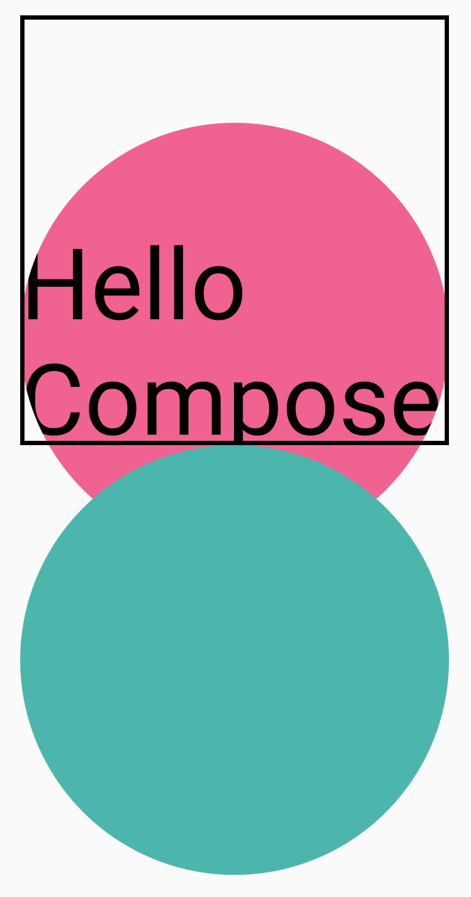

- [グラフィックス修飾子](#グラフィックス修飾子)
  - [描画修飾子](#描画修飾子)
    - [Modifier.drawWithContent : 描画順序を選択](#modifierdrawwithcontent--描画順序を選択)
    - [Modifier.drawBehind : コンポーザブルの背後の描画](#modifierdrawbehind--コンポーザブルの背後の描画)
    - [Modifier.drawWithCache : 描画オブジェクトの描画とキャッシュへの保存](#modifierdrawwithcache--描画オブジェクトの描画とキャッシュへの保存)
  - [グラフィックス修飾子](#グラフィックス修飾子-1)
    - [Modifier.graphicsLayer: コンポーザブルに変換を適用する](#modifiergraphicslayer-コンポーザブルに変換を適用する)
      - [変換](#変換)
        - [スケール - サイズを拡大](#スケール---サイズを拡大)
        - [平行移動](#平行移動)
        - [回転](#回転)
        - [原点](#原点)
      - [clip と shape](#clip-と-shape)
      - [アルファ](#アルファ)
      - [Compositing Strategy](#compositing-strategy)
        - [Auto（デフォルト）](#autoデフォルト)
        - [Offscreen（画面外）](#offscreen画面外)
        - [ModulateAlpha](#modulatealpha)
  - [コンポーザブルのコンテンツをビットマップに書き込む](#コンポーザブルのコンテンツをビットマップに書き込む)
  - [カスタム描画修飾子](#カスタム描画修飾子)
  - [参考情報](#参考情報)


# グラフィックス修飾子

Compose には、Canvas コンポーザブルの他にも、カスタム コンテンツの描画に役立つ便利なグラフィック Modifiers があります。これらの修飾子はどのコンポーザブルにも適用できます。


## 描画修飾子

Compose では、描画コマンドはすべて描画修飾子によって実行されます。Compose には、主要な描画修飾子が 3 つあります。

- [drawWithContent](https://developer.android.com/reference/kotlin/androidx/compose/ui/draw/package-summary?hl=ja&_gl=1*rve7jx*_up*MQ..*_ga*NjQ2Njk0MzM0LjE3MjY3MjU1NjI.*_ga_6HH9YJMN9M*MTcyNjcyNTU2MS4xLjAuMTcyNjcyNTU2MS4wLjAuMTg2OTg4MjUxMA..#(androidx.compose.ui.Modifier).drawWithContent(kotlin.Function1))

- [drawBehind](https://developer.android.com/reference/kotlin/androidx/compose/ui/draw/package-summary?hl=ja&_gl=1*rve7jx*_up*MQ..*_ga*NjQ2Njk0MzM0LjE3MjY3MjU1NjI.*_ga_6HH9YJMN9M*MTcyNjcyNTU2MS4xLjAuMTcyNjcyNTU2MS4wLjAuMTg2OTg4MjUxMA..#(androidx.compose.ui.Modifier).drawBehind(kotlin.Function1))

- [drawWithCache](https://developer.android.com/reference/kotlin/androidx/compose/ui/draw/package-summary?hl=ja&_gl=1*rve7jx*_up*MQ..*_ga*NjQ2Njk0MzM0LjE3MjY3MjU1NjI.*_ga_6HH9YJMN9M*MTcyNjcyNTU2MS4xLjAuMTcyNjcyNTU2MS4wLjAuMTg2OTg4MjUxMA..#(androidx.compose.ui.Modifier).drawWithCache(kotlin.Function1))

描画の基本修飾子は drawWithContent です。この場合、コンポーザブルの描画順序と、修飾子内で実行される描画コマンドを選択できます。

drawBehind は、drawWithContent の便利なラッパーで、描画順序はコンポーザブルのコンテンツより後になります。

drawWithCache は内部で onDrawBehind または onDrawWithContent を呼び出し、その中で作成されたオブジェクトをキャッシュするメカニズムを提供します。


### Modifier.drawWithContent : 描画順序を選択

Modifier.drawWithContent を使用すると、 DrawScope 内の処理を実行するタイミングを、コンポーザブルのコンテンツの前にするか、後にするかを選択できます。処理順序によって、画面のレイヤー上の上下関係が決まります。つまり、全面に表示されるものと背面に表示されるものが決まります。

具体的には、 drawContent() を呼び出すと、コンポーザブルのコンテンツが描画されます。それよりも前に描画処理を記述すれば、描画処理が画面の背面に描画され、コンポーザブルのコンテンツが画面の全面に表示されます。その逆もしかりです。

たとえば、コンテンツの上に円形グラデーションをレンダリングして UI にライト キーホール効果を作成する場合は、次のようにします。

```kotlin
var pointerOffset by remember {
    mutableStateOf(Offset(0f, 0f))
}
Column(
    modifier = Modifier
        .fillMaxSize()
        .pointerInput("dragging") {
            detectDragGestures { change, dragAmount ->
                pointerOffset += dragAmount
            }
        }
        .onSizeChanged {
            pointerOffset = Offset(it.width / 2f, it.height / 2f)
        }
        .drawWithContent {
            // drawContent よりも前に実行するか、後に実行するかで、
            // レイヤーの順序が決まります。

            // drawContent は、コンポーザブルのコンテンツを描画します。
            drawContent()

            // ポインターオフセットに小さな鍵穴のある完全に黒い領域を描画し、UI の一部を表示します。
            drawRect(
                Brush.radialGradient(
                    listOf(Color.Transparent, Color.Black),
                    center = pointerOffset,
                    radius = 100.dp.toPx(),
                )
            )
        }
) {
    // コンポーザブルのコンテンツ
}
```


### Modifier.drawBehind : コンポーザブルの背後の描画

[Modifier.drawBehind](https://developer.android.com/reference/kotlin/androidx/compose/ui/draw/package-summary?hl=ja&_gl=1*1ppg2jd*_up*MQ..*_ga*MTQ1NzI0ODE0NC4xNzI2NzI4Nzk2*_ga_6HH9YJMN9M*MTcyNjcyODc5Ni4xLjAuMTcyNjcyODc5Ni4wLjAuNzY3NTIxMjY2#(androidx.compose.ui.Modifier).drawBehind(kotlin.Function1)) を使用すると、画面に描画されるコンポーザブル コンテンツの背後で DrawScope オペレーションを実行できます。Canvas の実装を見てみると、単に Modifier.drawBehind のラッパーであることがわかります。

Text の後ろに角丸四角形を描画するには、次のようにします。

```kotlin
Text(
    "Hello Compose!",
    modifier = Modifier
        .drawBehind {
            drawRoundRect(
                Color(0xFFBBAAEE),
                cornerRadius = CornerRadius(10.dp.toPx())
            )
        }
        .padding(4.dp)
)
```

結果は次のようになります。


### Modifier.drawWithCache : 描画オブジェクトの描画とキャッシュへの保存

[Modifier.drawWithCache](https://developer.android.com/reference/kotlin/androidx/compose/ui/draw/package-summary?hl=ja&_gl=1*1ugnw3c*_up*MQ..*_ga*MTQ1NzI0ODE0NC4xNzI2NzI4Nzk2*_ga_6HH9YJMN9M*MTcyNjcyODc5Ni4xLjAuMTcyNjcyODc5Ni4wLjAuNzY3NTIxMjY2#(androidx.compose.ui.Modifier).drawWithCache(kotlin.Function1)) は、オブジェクト内で作成されたオブジェクトをキャッシュに保存します。描画領域のサイズが同じであるか、読み取られる状態オブジェクトが変更されていない場合に限り、オブジェクトはキャッシュに保存されます。この修飾子は、描画時に作成されるオブジェクト（Brush, Shader, Path など）を再割り当てする必要がないため、描画呼び出しのパフォーマンスの改善に役立ちます。

あるいは、修飾子の外部にある remember を使用してオブジェクトをキャッシュに保存することもできます。ただし、コンポジションに常にアクセスできるわけではないため、この処理ができない場合もあります。オブジェクトを描画にのみ使用する場合、drawWithCache を使用するとパフォーマンスが向上します。

注: Modifier.drawWithCache は、キャッシュに保存する必要があるオブジェクトを作成する場合にのみ使用してください。オブジェクトをキャッシュに保存する必要がない場合にこの修飾子を使用すると、不要なラムダの割り当てが発生する可能性があります。
たとえば、Text の背後にグラデーションを描画する Brush を作成する場合、drawWithCache を使用すると、描画領域のサイズが変更されるまで Brush オブジェクトがキャッシュに保存されます。

```kotlin
Text(
    "Hello Compose!",
    modifier = Modifier
        .drawWithCache {
            val brush = Brush.linearGradient(
                listOf(
                    Color(0xFF9E82F0),
                    Color(0xFF42A5F5)
                )
            )
            onDrawBehind {
                drawRoundRect(
                    brush,
                    cornerRadius = CornerRadius(10.dp.toPx())
                )
            }
        }
)
```


## グラフィックス修飾子

### Modifier.graphicsLayer: コンポーザブルに変換を適用する

[Modifier.graphicsLayer](https://developer.android.com/reference/kotlin/androidx/compose/ui/graphics/package-summary?hl=ja&_gl=1*kyok10*_up*MQ..*_ga*MTQ1NzI0ODE0NC4xNzI2NzI4Nzk2*_ga_6HH9YJMN9M*MTcyNjcyODc5Ni4xLjAuMTcyNjcyODc5Ni4wLjAuNzY3NTIxMjY2#(androidx.compose.ui.Modifier.graphicsLayer(kotlin.Float,kotlin.Float,kotlin.Float,kotlin.Float,kotlin.Float,kotlin.Float,kotlin.Float,kotlin.Float,kotlin.Float,kotlin.Float,androidx.compose.ui.graphics.TransformOrigin,androidx.compose.ui.graphics.Shape,kotlin.Boolean,androidx.compose.ui.graphics.RenderEffect,androidx.compose.ui.graphics.Color,androidx.compose.ui.graphics.Color,androidx.compose.ui.graphics.CompositingStrategy))) は、 **コンポーザブルのコンテンツを描画レイヤに描画する修飾子** です。レイヤには、次のようないくつかの機能があります。

- 描画命令の分離 ( [RenderNode](https://developer.android.com/reference/android/graphics/RenderNode?hl=ja&_gl=1*c008gn*_up*MQ..*_ga*MTQ1NzI0ODE0NC4xNzI2NzI4Nzk2*_ga_6HH9YJMN9M*MTcyNjcyODc5Ni4xLjAuMTcyNjcyODc5Ni4wLjAuNzY3NTIxMjY2) と同様) 。レイヤの一部としてキャプチャされた描画命令は、アプリケーション コードを再実行しなくても、レンダリング パイプラインによって効率的に再実行できます。

- レイヤに含まれるすべての描画命令に適用される変換。

- 合成機能のラスタライズ (※ 1 ) 。
  - 「ラスタライズ」というのは、描きたいものを画像としてまとめる処理です。この場合、「レイヤー」という部分（例えば画面上の1つの要素やパーツ）の描画の指示を実行して、それを「オフスクリーンバッファ」という場所に一時的に保存します。このバッファは画面に表示される前の一時的な保存場所です。
  - この方法の良い点は、後で同じレイヤーを使う時に、また一から描画するのではなく、すでに保存してある画像（バッファ）を使えるので、処理が速くなることです。例えば、次のフレーム（アニメーションや動画の次のコマ）を描画する時に、もう一度全部を描き直す必要がなくなります。
  - しかし、保存されたものは「ビットマップ」と呼ばれる固定された画像のように扱われるので、大きさを変えたり回転させたりすると、少し荒く見えることがあります。これは、個々の描画指示を実行しているわけではなく、すでに完成した画像をそのまま操作しているからです。」
  - これで、処理が速くなるけど、画像として扱うのでサイズ変更や回転には注意が必要だということが分かります。

(※ 1 ) ラスタライズは、コンピュータグラフィックスにおいてラスター形式以外 (ベクター形式等) の画像データをラスター形式に変換すること。 


#### 変換

Modifier.graphicsLayer では、描画の手順が分離されます。たとえば、Modifier.graphicsLayer を使用してさまざまな変換を適用できます。これらは、描画ラムダを再実行することなく、アニメーション化または変更できます。

Modifier.graphicsLayer は描画フェーズにのみ影響するため、コンポーザブルの測定サイズや配置は変更されません。そのため、コンポーザブルがレイアウト境界の外側に描画されると、他のコンポーザブルと重なることがあります。

注: アニメーションを実行する場合、または State オブジェクトを使用して graphicsLayer プロパティを更新する場合は、この修飾子のラムダ バージョンをおすすめします。
この修飾子を使用すると、次の変換を適用できます。


##### スケール - サイズを拡大

```kotlin
Image(
    painter = painterResource(id = R.drawable.dog),
    contentDescription = null,
    modifier = Modifier
        .graphicsLayer {
            this.scaleX = 1.2f
            this.scaleY = 0.8f
        }
)
```


##### 平行移動

translationX と translationY は graphicsLayer で変更できます。translationX はコンポーザブルを左右に移動します。translationY はコンポーザブルを上下に移動します。

```kotlin
Image(
    painter = painterResource(id = R.drawable.original_portrait),
    contentDescription = null,
    modifier = Modifier
        .background(Color.LightGray)
        .graphicsLayer {
            this.translationX = 50.dp.toPx()
            this.translationY = 50.dp.toPx()
        }
)
```


##### 回転

rotationX で水平方向の回転、rotationY で垂直方向の回転、rotationZ で Z 軸上での回転（標準の回転）を設定します。この値は度単位（0～360）で指定します。

```kotlin
Image(
    painter = painterResource(id = R.drawable.sunset),
    contentDescription = "Sunset",
    modifier = Modifier
        .graphicsLayer {
            this.rotationX = 90f
            this.rotationY = 275f
            this.rotationZ = 180f
        }
)
```

https://youtu.be/DJYLfphLOTg


##### 原点

transformOrigin を指定できます。その後、この点を原点として変換を実行できます。これまでの例ではすべて TransformOrigin.Center を使用していました。これは (0.5f, 0.5f) に位置します。原点を (0f, 0f) に指定すると、変換はコンポーザブルの左上の隅から開始されます。

rotationZ 変換で原点を変更すると、コンポーザブルの左上でアイテムが回転します。

```kotlin
Image(
    painter = painterResource(id = R.drawable.sunset),
    contentDescription = "Sunset",
    modifier = Modifier
        .graphicsLayer {
            this.transformOrigin = TransformOrigin(0f, 0f)
            this.rotationX = 90f
            this.rotationY = 275f
            this.rotationZ = 180f
        }
)
```

https://youtube.com/shorts/BNVof8_k71w


#### clip と shape


この例では、 2 つの異なる方法でクリップを実施します。

1. graphicsLayer クリップ変数を使用する方法。
2. 便利なラッパー Modifier.clip を使用する方法。

```kotlin
Column(modifier = Modifier.padding(16.dp)) {
    Box(
        modifier = Modifier
            .size(200.dp)
            .graphicsLayer {
                // これはラムダ式なので、 clip は引数ではなく
                // プロパティです。なので、 true の後ろにコンマは不要です。
                clip = true
                // shape パラメータには、 clip = true の場合に
                // コンテンツがクリップされる輪郭を指定します。
                shape = CircleShape
            }
            .background(Color(0xFFF06292))
    ) {
        Text(
            "Hello Compose",
            style = TextStyle(color = Color.Black, fontSize = 46.sp),
            modifier = Modifier.align(Alignment.Center)
        )
    }
    Box(
        modifier = Modifier
            .size(200.dp)
            .clip(CircleShape)
            .background(Color(0xFF4DB6AC))
    )
}
```

最初のボックス（テキスト「Hello Compose」）が円形に切り取られます。


次に、ピンク色の円を下に移動してみましょう。 graphicsLayer に translationY を指定します。ついでに、 Box の領域を示すボーダーも追加します。

```kotlin
Column(modifier = Modifier.padding(16.dp)) {
    Box(
        modifier = Modifier
            .size(200.dp)
            .border(2.dp, Color.Black)
            .graphicsLayer {
                clip = true
                shape = CircleShape
                translationY = 50.dp.toPx()
            }
            .background(Color(0xFFF06292))
    ) {
        Text(
            "Hello Compose",
            style = TextStyle(color = Color.Black, fontSize = 46.sp),
            modifier = Modifier.align(Alignment.Center)
        )
    }
    Box(
        modifier = Modifier
            .size(200.dp)
            .clip(CircleShape)
            .background(Color(0xFF4DB6AC))
    )
}
```



ピンク色の丸が、 Box の黒色のボーダー線からはみ出しています。もし、ボーダーからはみ出した部分を切り取りたい場合は、修飾子チェーンの先頭に別の `Modifier.clip(RectangleShape)` を追加します。

```kotlin
Column(modifier = Modifier.padding(16.dp)) {
    Box(
        modifier = Modifier
            .clip(RectangleShape)
            .size(200.dp)
            .border(2.dp, Color.Black)
            .graphicsLayer {
                clip = true
                shape = CircleShape
                translationY = 50.dp.toPx()
            }
            .background(Color(0xFFF06292))
    ) {
        Text(
            "Hello Compose",
            style = TextStyle(color = Color.Black, fontSize = 46.sp),
            modifier = Modifier.align(Alignment.Center)
        )
    }
    Box(
        modifier = Modifier
            .size(200.dp)
            .clip(CircleShape)
            .background(Color(0xFF4DB6AC))
    )
}
```


#### アルファ

Modifier.graphicsLayer を使用すると、レイヤ全体の alpha（不透明度）を設定できます。1.0f は完全に不透明で、0.0f は完全に透明になります。

```kotlin
Image(
    painter = painterResource(id = R.drawable.sunset),
    contentDescription = "clock",
    modifier = Modifier
        .graphicsLayer {
            this.alpha = 0.5f
        }
)
```


注: アルファが 1.0f 未満に設定された場合、レイヤのコンテンツ全体が画面外バッファに描画されます ( [CompositingStrategy](https://developer.android.com/reference/kotlin/androidx/compose/ui/graphics/CompositingStrategy?hl=ja&_gl=1*17oafa2*_up*MQ..*_ga*MTQ1NzI0ODE0NC4xNzI2NzI4Nzk2*_ga_6HH9YJMN9M*MTcyNjcyODc5Ni4xLjAuMTcyNjcyODc5Ni4wLjAuNzY3NTIxMjY2) が [ModulateAlpha](https://developer.android.com/reference/kotlin/androidx/compose/ui/graphics/CompositingStrategy?hl=ja&_gl=1*3a9cvo*_up*MQ..*_ga*MTQ1NzI0ODE0NC4xNzI2NzI4Nzk2*_ga_6HH9YJMN9M*MTcyNjcyODc5Ni4xLjAuMTcyNjcyODc5Ni4wLjAuNzY3NTIxMjY2#ModulateAlpha()) に設定されていない場合）。詳しくは、次の CompositingStrategy のセクションをご覧ください。


#### Compositing Strategy

アルファと透明度の取り扱いは、単一のアルファ値を変更する場合ほど単純ではないことがあります。アルファを変更するだけでなく、graphicsLayer に [CompositingStrategy](https://developer.android.com/reference/kotlin/androidx/compose/ui/graphics/CompositingStrategy?hl=ja&_gl=1*1lwvf57*_up*MQ..*_ga*MTQ1NzI0ODE0NC4xNzI2NzI4Nzk2*_ga_6HH9YJMN9M*MTcyNjcyODc5Ni4xLjAuMTcyNjcyODc5Ni4wLjAuNzY3NTIxMjY2) を設定することもできます。CompositingStrategy は、コンポーザブルのコンテンツを、すでに画面に描画されている他のコンテンツとどのように合成するかを決定します。

注: CompositingStrategy は Compose 1.4.0-alpha02 で導入されました。

Strategy には次のようなものがあります。


##### Auto（デフォルト）

[Auto](https://developer.android.com/reference/kotlin/androidx/compose/ui/graphics/CompositingStrategy?_gl=1*jfiked*_up*MQ..*_ga*MTQ1NzI0ODE0NC4xNzI2NzI4Nzk2*_ga_6HH9YJMN9M*MTcyNjcyODc5Ni4xLjAuMTcyNjcyODc5Ni4wLjAuNzY3NTIxMjY2#Auto()) Composition Strategy は、 graphicsLayer の残りのパラメータによって決まります。アルファが 1.0f 未満であるか、RenderEffect が設定されている場合、レイヤが画面外バッファにレンダリングされます。アルファが 1f 未満の場合は、コンテンツのレンダリングのために合成レイヤが自動的に作成され、対応するアルファを使用して目的の場所にこの画面外バッファが描画されます。 [RenderEffect](https://developer.android.com/reference/android/graphics/RenderEffect?hl=ja&_gl=1*4ygtu5*_up*MQ..*_ga*MTQ1NzI0ODE0NC4xNzI2NzI4Nzk2*_ga_6HH9YJMN9M*MTcyNjcyODc5Ni4xLjAuMTcyNjcyODc5Ni4wLjAuNzY3NTIxMjY2) またはオーバースクロールを設定すると、CompositingStrategy の設定にかかわらず、コンテンツが常に画面外バッファにレンダリングされます。


##### Offscreen（画面外）

Offscreen は、画面から離れた場所でいったん描画して、描画し終わったら画面上に重ね合わせるように描画する。というオプションだと思われます。

コンポーザブルのコンテンツは、目的の場所にレンダリングする前に、 画面外のテクスチャまたはビットマップにラスタライズされます。これは、 [BlendMode](https://developer.android.com/reference/kotlin/androidx/compose/ui/graphics/BlendMode?hl=ja&_gl=1*1sbk6q8*_up*MQ..*_ga*MTQ1NzI0ODE0NC4xNzI2NzI4Nzk2*_ga_6HH9YJMN9M*MTcyNjcyODc5Ni4xLjAuMTcyNjcyODc5Ni4wLjAuNzY3NTIxMjY2) オペレーションを適用してコンテンツをマスクし、複雑な描画手順のセットをレンダリングする場合に便利です。

[CompositingStrategy.Offscreen](https://developer.android.com/reference/kotlin/androidx/compose/ui/graphics/CompositingStrategy?hl=ja&_gl=1*1sbk6q8*_up*MQ..*_ga*MTQ1NzI0ODE0NC4xNzI2NzI4Nzk2*_ga_6HH9YJMN9M*MTcyNjcyODc5Ni4xLjAuMTcyNjcyODc5Ni4wLjAuNzY3NTIxMjY2#Offscreen()) は、たとえば、BlendModes とあわせて使用できます。以下の例では、BlendMode.Clear を使用する描画コマンドを実行して Image コンポーザブルを部分的に削除できます。compositingStrategy を CompositingStrategy.Offscreen に設定しない場合、BlendMode はその下にあるすべてのコンテンツを操作します。

```kotlin
import androidx.compose.ui.graphics.Path

Image(painter = painterResource(id = R.drawable.dog),
    contentDescription = "Dog",
    contentScale = ContentScale.Crop,
    modifier = Modifier
        .size(120.dp)
        .aspectRatio(1f)
        .background(
            Brush.linearGradient(
                listOf(
                    Color(0xFFC5E1A5),
                    Color(0xFF80DEEA)
                )
            )
        )
        .padding(8.dp)
        .graphicsLayer {
            // Offscreen を指定することにより、
            // これ以降に描画されるものが、別の場所で
            // いったん描画されてから、画面上に
            // 重ね合わせるように描画される。
            compositingStrategy = CompositingStrategy.Offscreen
        }
        .drawWithCache {
            // 写真を丸く切り抜くための円の Path
            val path = Path()
            path.addOval(
                Rect(
                    topLeft = Offset.Zero,
                    bottomRight = Offset(size.width, size.height)
                )
            )

            onDrawWithContent {
                // path に収まるように犬の写真を切り抜く。
                clipPath(path) {
                    // これは、犬の写真を描画します。
                    this@onDrawWithContent.drawContent()
                }
                // 犬の写真の右下をマスクする円の半径
                val dotSize = size.width / 8f
                // 犬の写真の右下を削除するための円
                drawCircle(
                    Color.Black,
                    radius = dotSize,
                    center = Offset(
                        x = size.width - dotSize,
                        y = size.height - dotSize
                    ),
                    // BlendMode.Clear は、重なった部分の描画を削除 (透明化) します。
                    blendMode = BlendMode.Clear
                )
                // 赤色の円
                drawCircle(
                    Color(0xFFEF5350), radius = dotSize * 0.8f,
                    center = Offset(
                        x = size.width - dotSize,
                        y = size.height - dotSize
                    )
                )
            }
        }
)
```

CompositingStrategy を Offscreen に設定すると、コマンドを実行する画面外テクスチャが作成されます（BlendMode はこのコンポーザブルのコンテンツにのみ適用されます）。その後、すでに画面にレンダリングされているコンテンツの上にレンダリングします。描画済みのコンテンツには影響しません。


CompositingStrategy.Offscreen を使用しなかった場合は、BlendMode.Clear を適用した結果、すでに設定されている内容に関係なく、目的の場所すべてのピクセルがクリアされます。このため、ウィンドウのデフォルト色 (黒色) は残ります。アルファを使用する BlendModes の多くは、画面外バッファがないと想定どおりに機能しません。赤い円形インジケーターの周りにある黒いリングに注目してください。


もう少し詳しく見てみましょう。アプリに半透明のウィンドウ背景があり、CompositingStrategy.Offscreen を使用しなかった場合は、BlendMode がアプリ全体を操作します。以下の例に示すように、すべてのピクセルがクリアされ、その下のアプリまたは壁紙が表示されます。赤いステータス サークルの周りの領域にピンクの壁紙が表示されているのがわかります。


CompositingStrategy.Offscreen を使用すると、描画領域のサイズと一致する画面外テクスチャが作成され、画面上にレンダリングされます。デフォルトでは、この戦略により実行された描画コマンドはすべてこの領域にクリップされます。次のコード スニペットは、画面外テクスチャに切り替えた場合の違いを示しています。

```kotlin
@Composable
fun CompositingStrategyExamples() {
    Column(
        modifier = Modifier
            .fillMaxSize()
            .wrapContentSize(Alignment.Center)
    ) {
        /** Does not clip content even with a graphics layer usage here. By default, graphicsLayer
        does not allocate + rasterize content into a separate layer but instead is used
        for isolation. That is draw invalidations made outside of this graphicsLayer will not
        re-record the drawing instructions in this composable as they have not changed **/
        Canvas(
            modifier = Modifier
                .graphicsLayer()
                .size(100.dp) // Note size of 100 dp here
                .border(2.dp, color = Color.Blue)
        ) {
            // ... and drawing a size of 200 dp here outside the bounds
            drawRect(color = Color.Magenta, size = Size(200.dp.toPx(), 200.dp.toPx()))
        }

        Spacer(modifier = Modifier.size(300.dp))

        /** Clips content as alpha usage here creates an offscreen buffer to rasterize content
        into first then draws to the original destination **/
        Canvas(
            modifier = Modifier
                .graphicsLayer(compositingStrategy = CompositingStrategy.Offscreen)
                .size(100.dp) // Note size of 100 dp here
                .border(2.dp, color = Color.Blue)
        ) {
            // Offscreen が設定されているため、
            // 描画される赤色の四角は 100 × 100 に切り取られます。
            drawRect(color = Color.Red, size = Size(200.dp.toPx(), 200.dp.toPx()))
        }
    }
}
```

上の図が CompositingStrategy.Auto を使用した場合で、 下の図が CompositingStrategy.Offscreen を使用した場合です。


##### ModulateAlpha

[ModulateAlpha](https://developer.android.com/reference/kotlin/androidx/compose/ui/graphics/CompositingStrategy?_gl=1*1q78jgf*_up*MQ..*_ga*MTQ1NzI0ODE0NC4xNzI2NzI4Nzk2*_ga_6HH9YJMN9M*MTcyNjcyODc5Ni4xLjAuMTcyNjcyODc5Ni4wLjAuNzY3NTIxMjY2#ModulateAlpha()) Compositiing Strategy は、graphicsLayer 内で記録された各描画命令のアルファを調節します。RenderEffect が設定されていない場合、1.0f 未満のアルファに対して画面外バッファは作成されないため、アルファ レンダリングを効率的に行うことができます。ただし、コンテンツが重なる場合は、結果が異なる可能性があります。コンテンツが重なっていないことが事前にわかっている場合は、アルファ値が 1 未満の CompositingStrategy.Auto よりもパフォーマンスが高くなることがあります。

各種の合成戦略のもう一つの例として、コンポーザブルの各部分に異なるアルファを適用し、Modulate 戦略を適用することがあげられます。

```kotlin
@Preview
@Composable
fun CompositingStratgey_ModulateAlpha() {
    Column(
        modifier = Modifier
            .fillMaxSize()
            .padding(32.dp)
    ) {
        // Base drawing, no alpha applied
        Canvas(
            modifier = Modifier.size(200.dp)
        ) {
            drawSquares()
        }

        Spacer(modifier = Modifier.size(36.dp))

        // Alpha 0.5f applied to whole composable
        Canvas(modifier = Modifier
            .size(200.dp)
            .graphicsLayer {
                alpha = 0.5f
            }) {
            drawSquares()
        }
        Spacer(modifier = Modifier.size(36.dp))

        // 0.75f alpha applied to each draw call when using ModulateAlpha
        Canvas(modifier = Modifier
            .size(200.dp)
            .graphicsLayer {
                compositingStrategy = CompositingStrategy.ModulateAlpha
                alpha = 0.75f
            }) {
            drawSquares()
        }
    }
}

private fun DrawScope.drawSquares() {

    val size = Size(100.dp.toPx(), 100.dp.toPx())
    drawRect(color = Red, size = size)
    drawRect(
        color = Purple, size = size,
        topLeft = Offset(size.width / 4f, size.height / 4f)
    )
    drawRect(
        color = Yellow, size = size,
        topLeft = Offset(size.width / 4f * 2f, size.height / 4f * 2f)
    )
}

val Purple = Color(0xFF7E57C2)
val Yellow = Color(0xFFFFCA28)
val Red = Color(0xFFEF5350)
```


## コンポーザブルのコンテンツをビットマップに書き込む

注: このスニペットで使用されている rememberGraphicsLayer() 関数は、 Compose から利用できます。 1.7.0-alpha07 以降。
一般的なユースケースは、コンポーザブルから Bitmap を作成することです。既存の コンポーザブルのコンテンツを Bitmap にするには、 rememberGraphicsLayer() コマンドを使用して GraphicsLayer を作成します。

drawWithContent() と graphicsLayer.record{} を使用して、描画コマンドを新しいレイヤーにリダイレクトします。次に、drawLayer を使用して、表示されているキャンバスにレイヤーを描画します。

```kotlin
val coroutineScope = rememberCoroutineScope()
val graphicsLayer = rememberGraphicsLayer()
Box(
    modifier = Modifier
        .drawWithContent {
            // グラフィックスレイヤーのコンテンツをキャプチャするために record 関数を呼び出します。
            graphicsLayer.record {
                // コンポーザブルのコンテンツをグラフィックスレイヤーに描画します。
                this@drawWithContent.drawContent()
            }
            // 可視化されている Canvas にグラフィックスレイヤーを描画します。
            drawLayer(graphicsLayer)
        }
        .clickable {
            coroutineScope.launch {
                val bitmap = graphicsLayer.toImageBitmap()

                // 新しく入手した bitmap を使用して何らかの処理を実施します。
            }
        }
        .background(Color.White)
) {
    Text("Hello Android", fontSize = 26.sp)
}
```

ビットマップをディスクに保存して共有できます。詳細については、 [完全なサンプルスニペット](https://github.com/android/snippets/blob/latest/compose/snippets/src/main/java/com/example/compose/snippets/graphics/AdvancedGraphicsSnippets.kt#L123) を参照してください。ディスクに保存する前に、デバイスの権限を確認してください。


## カスタム描画修飾子

独自のカスタム修飾子を作成するには、DrawModifier インターフェースを実装します。これにより、Modifier.drawWithContent() を使用するときに公開されるものと同じ ContentDrawScope にアクセスできるようになります。次に、一般的な描画操作をカスタム描画修飾子に抽出して、コードをクリーンアップし、便利なラッパーを提供できます。たとえば、Modifier.background() は便利な DrawModifier です。

たとえば、コンテンツを垂直に反転する Modifier を実装する場合は、次のように作成できます。

```kotlin
class FlippedModifier : DrawModifier {
    override fun ContentDrawScope.draw() {
        scale(1f, -1f) {
            this@draw.drawContent()
        }
    }
}

fun Modifier.flipped() = this.then(FlippedModifier())
```

次に、テキストに適用されたこの反転された修飾子を使用します。

```kotlin
Text(
    "Hello Compose!",
    modifier = Modifier
        .flipped()
)
```


## 参考情報

graphicsLayer とカスタム描画を使用するその他の例については、次のリソースをご覧ください。

- [Compose で Jellyfish を動かす](https://medium.com/androiddevelopers/making-jellyfish-move-in-compose-animating-imagevectors-and-applying-agsl-rendereffects-3666596a8888)
- [Compose での ADS 2022 のレイアウトとグラフィック](https://youtu.be/xcfEQO0k_gU)


